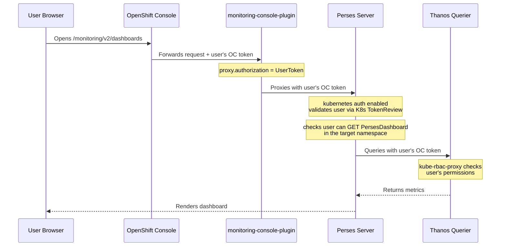
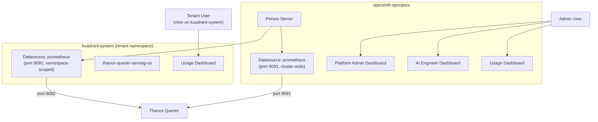

# Perses User Access and Restriction

This document explains how Perses dashboards authenticate users, query Prometheus, and how tenant-scoped dashboards restrict both visibility and data access using Kubernetes RBAC and Thanos port selection.

## Authentication Flow

When a user opens a Perses dashboard from the OpenShift console, the following chain executes:



**Key points:**

- The **user's identity** determines which dashboards they can see (Kubernetes RBAC on `PersesDashboard` resources).
- The **user's token** is forwarded by Perses to Thanos for metric queries. The Thanos port determines which RBAC check is performed.

## Thanos Querier Ports

The Thanos Querier service in `openshift-monitoring` exposes multiple ports with different security models:

| Port | Name | Upstream | Auth Check | Scope |
|------|------|----------|------------|-------|
| 9091 | `web` | `kube-rbac-proxy-web` -> thanos-query | `prometheuses/api` GET in `openshift-monitoring` (`cluster-monitoring-view` ClusterRole) | All metrics from cluster + user-workload Prometheus |
| 9092 | `tenancy` | `kube-rbac-proxy` -> `prom-label-proxy` -> thanos-query | `pods` in the requested namespace (`metrics.k8s.io`); HTTP GET→`get`, POST→`create` | Only metrics from the namespace specified in the `?namespace=` query parameter |
| 9093 | `tenancy-rules` | Same as 9092 but for recording/alerting rules | Same as 9092 | Namespace-scoped rules |
| 9094 | `metrics` | Thanos Querier internal metrics | N/A | Internal only |

### Port 9091: Admin Dashboards

The admin datasource in `openshift-operators` uses port 9091 (`web`):

```yaml
# perses-datasource.yaml
url: https://thanos-querier.openshift-monitoring.svc.cluster.local:9091
```

This provides access to all metrics cluster-wide. Admin dashboards (Platform Admin, AI Engineer, Usage) query across multiple namespaces (`kuadrant-system`, `openshift-ingress`, `llm`, `opendatahub`), which requires cluster-wide access.

### Port 9092: Tenant Dashboards

The tenant datasource uses port 9092 (`tenancy`) with the namespace embedded in the URL:

```yaml
# perses-datasource-scoped.yaml
url: https://thanos-querier.openshift-monitoring.svc.cluster.local:9092?namespace=kuadrant-system
```

Port 9092 routes through `prom-label-proxy`, which injects a `namespace` label matcher into every PromQL query server-side. Even if a dashboard query says `sum(authorized_hits{user!=""})`, what Thanos actually executes is `sum(authorized_hits{user!="", namespace="kuadrant-system"})`.

This is suitable for the Usage Dashboard because all Limitador metrics (`authorized_hits`, `authorized_calls`, `limited_calls`) reside in `kuadrant-system`.

## Dashboard Deployment Architecture



The Perses operator watches all namespaces, so dashboards and datasources in the tenant namespace are automatically synced to the Perses instance in `openshift-operators`.

## Dashboard Access Control

Dashboard visibility is controlled by **Kubernetes RBAC on `PersesDashboard` custom resources**.

### How It Works

Perses is configured with `kubernetes: true` for authorization:

```yaml
# perses-config (ConfigMap)
security:
  enable_auth: true
  authorization:
    kubernetes: true
  authentication:
    providers:
      kubernetes:
        enabled: true
```

When a user requests a dashboard, Perses performs a Kubernetes SubjectAccessReview to check whether the user can `GET` the `PersesDashboard` resource in the relevant namespace.

### CRD Aggregation Labels

The Perses operator registers aggregation labels on its CRDs, so the built-in `view`, `edit`, and `admin` ClusterRoles automatically include `get`/`list`/`watch` on `persesdashboards`, `persesdatasources`, and `perses` resources. This means granting a user the `view` role in a namespace automatically allows them to see Perses dashboards in that namespace.

### Namespace-Based Isolation

Since admin dashboards live in `openshift-operators` and the tenant Usage Dashboard lives in `kuadrant-system`:

| Dashboard | Namespace | Who Can See |
|-----------|-----------|-------------|
| Platform Admin | `openshift-operators` | Users with access to `openshift-operators` (admins) |
| AI Engineer | `openshift-operators` | Users with access to `openshift-operators` (admins) |
| Usage (admin) | `openshift-operators` | Users with access to `openshift-operators` (admins) |
| Usage (tenant) | `kuadrant-system` | Users with `view` on `kuadrant-system` |

A user with `view` on only `kuadrant-system` sees exclusively the tenant Usage Dashboard.

## Granting Tenant Access

To give a user access to the tenant Usage Dashboard, create a namespace-scoped `Role` and `RoleBinding`:

### 1. Create a viewer Role in the tenant namespace

```yaml
apiVersion: rbac.authorization.k8s.io/v1
kind: Role
metadata:
  name: kuadrant-viewer
  namespace: kuadrant-system
rules:
  - apiGroups: [""]
    resources: ["pods", "services", "configmaps", "endpoints", "persistentvolumeclaims", "events", "replicationcontrollers", "serviceaccounts"]
    verbs: ["get", "list", "watch"]
  - apiGroups: ["apps"]
    resources: ["deployments", "daemonsets", "replicasets", "statefulsets"]
    verbs: ["get", "list", "watch"]
  - apiGroups: ["batch"]
    resources: ["jobs", "cronjobs"]
    verbs: ["get", "list", "watch"]
  - apiGroups: ["perses.dev"]
    resources: ["persesdashboards", "persesdatasources", "perses"]
    verbs: ["get", "list", "watch"]
  - apiGroups: ["metrics.k8s.io"]
    resources: ["pods", "nodes"]
    verbs: ["get", "list", "watch"]
```

This is a namespace-scoped **Role** (not a ClusterRole), granting view access to core resources, Perses CRDs, and metrics within `kuadrant-system` only.

### 2. Bind the user to the Role

```yaml
apiVersion: rbac.authorization.k8s.io/v1
kind: RoleBinding
metadata:
  name: kuadrant-viewer
  namespace: kuadrant-system
roleRef:
  apiGroup: rbac.authorization.k8s.io
  kind: Role
  name: kuadrant-viewer
subjects:
  - kind: User
    name: <username>
    apiGroup: rbac.authorization.k8s.io
```

### 3. Metrics RBAC for Thanos port 9092 (handled by the install script)

Port 9092's `kube-rbac-proxy` maps HTTP methods to Kubernetes verbs when checking `metrics.k8s.io/pods`:

| HTTP Method | K8s Verb | In viewer Role? | Used by Perses? |
|-------------|----------|-----------------|-----------------|
| GET | `get` | Yes | No (Perses uses POST) |
| POST | `create` | **No** | **Yes** (all PromQL queries) |

The viewer Role includes `get`/`list`/`watch` on `metrics.k8s.io/pods`, but **not** `create`. Since Perses sends all PromQL queries as HTTP POST, the `create` verb must be granted separately.

The `install-perses-dashboards.sh` script deploys `perses-rbac-scoped.yaml` to the tenant namespace, which grants `create` on `metrics.k8s.io/pods` to all authenticated users (`system:authenticated`). No per-user RBAC is needed for metrics — the scoped RBAC covers all authenticated users automatically.

## Security Boundaries Summary

| Layer | Controls | Mechanism |
|-------|----------|-----------|
| **Dashboard visibility** | Which dashboards a user can see | Kubernetes RBAC on `PersesDashboard` CRDs (namespace isolation) |
| **Metrics access (admin)** | All cluster metrics | Port 9091, requires `cluster-monitoring-view` ClusterRole |
| **Metrics access (tenant)** | Single-namespace metrics only | Port 9092, `prom-label-proxy` enforces namespace server-side |
| **Data isolation** | Per-user filtering within dashboards | UI-level variable filters (`user=$user`); not a security boundary |

> **Note:** The `user=$user` dropdown on the Usage dashboard filters the displayed data in the UI but does not enforce server-side isolation. Any user who can view the dashboard can change the dropdown to see other users' metrics within the scoped namespace. True per-user metric isolation would require Perses to lock the user variable to the authenticated identity.

## Deployment

The `install-perses-dashboards.sh` script handles the full deployment:

```bash
# Deploy with default tenant namespace (kuadrant-system)
./scripts/observability/install-perses-dashboards.sh

# Deploy with custom tenant namespace
./scripts/observability/install-perses-dashboards.sh --tenant-namespace my-namespace
```

This deploys:
- Admin dashboards and datasource (port 9091) to `openshift-operators`
- Tenant Usage Dashboard and datasource (port 9092) to the tenant namespace
- TLS CA ConfigMap in the tenant namespace

Granting users access to the tenant dashboard (RBAC for `view` and `metrics.k8s.io`) is a separate step described in [Granting Tenant Access](#granting-tenant-access).

### Perses Guest Permissions

The Perses config grants guest (unauthenticated) access to infrastructure resources only:

```yaml
guest_permissions:
  - actions: ['*']
    scopes:
      - Folder
      - GlobalDatasource
      - GlobalSecret
      - GlobalVariable
      - Secret
      - Variable
```

`Dashboard` is **not** in the guest scopes, so unauthenticated users cannot see any dashboards.
