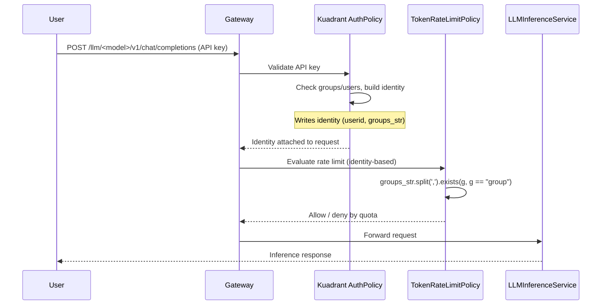

# Reconciliation Flow

This document describes how the MaaS Controller reconciles resources, handles ownership, and processes requests. For architecture overview, see [Controller Architecture](./controller-architecture.md).

---

## Tenant Resource Layout

The `Tenant` CR is namespace-scoped (lives in `models-as-a-service`). It owns resources across three scopes — same-namespace children use standard `ownerReference`, while cluster-scoped and cross-namespace children use **tracking labels** (Kubernetes rejects cross-namespace and namespaced-to-cluster ownerRefs).

```mermaid
graph TB
    subgraph "models-as-a-service namespace"
        Tenant["Tenant CR<br/>default-tenant"]
        API["maas-api Deployment"]
        CM["ConfigMaps"]
        SVC["Services"]
        SA["ServiceAccounts"]
        NP["NetworkPolicies"]
        HR["HTTPRoutes"]
        AP2["maas-api AuthPolicy"]
    end

    subgraph "openshift-ingress namespace"
        AP["gateway AuthPolicy"]
        DR["DestinationRule"]
        TP["TelemetryPolicy"]
        IT["Istio Telemetry"]
    end

    subgraph "Cluster-scoped"
        CR["ClusterRoles"]
        CRB["ClusterRoleBindings"]
    end

    Tenant -->|ownerRef| API
    Tenant -->|ownerRef| CM
    Tenant -->|ownerRef| SVC
    Tenant -->|ownerRef| SA
    Tenant -->|ownerRef| NP
    Tenant -->|ownerRef| HR
    Tenant -->|ownerRef| AP2
    Tenant -.->|tracking labels| CR
    Tenant -.->|tracking labels| CRB
    Tenant -.->|tracking labels| AP
    Tenant -.->|tracking labels| DR
    Tenant -.->|tracking labels| TP
    Tenant -.->|tracking labels| IT

    style Tenant fill:#4a90d9,color:#fff
    style AP fill:#f5a623,color:#fff
    style DR fill:#f5a623,color:#fff
    style TP fill:#f5a623,color:#fff
    style IT fill:#f5a623,color:#fff
```



**Solid arrows** = standard ownerReference (automatic GC). **Dashed arrows** = tracking labels (finalizer-based cleanup). **Orange resources** = cross-namespace children that require tracking labels.

---

## Request Flow (End-to-End)



- **AuthPolicy** authenticates (e.g. OpenShift token via Kubernetes TokenReview), authorizes (allowed groups/users), and **writes identity** (e.g. `userid`, `groups`, `groups_str`).
- **TokenRateLimitPolicy** uses that identity (in particular the comma-separated `groups_str`) to decide which subscription and limits apply.

---

## Reconciler Behavior

### MaaSModelRef Reconciler

**What it does:**
- Validates that the referenced model resource exists (e.g., LLMInferenceService)
- Validates that HTTPRoute exists for the model (or creates it for certain kinds)
- Updates status with endpoint URL and readiness phase

**Watch triggers:**
- MaaSModelRef changes
- HTTPRoute changes (fixes startup race when KServe creates route after MaaSModelRef)
- LLMInferenceService changes (for backend spec/status updates)

**Status transitions:**
- `Pending` → HTTPRoute doesn't exist yet (KServe still deploying)
- `Ready` → HTTPRoute exists and model is accessible
- `Failed` → Referenced model not found or validation failed

**Finalizer behavior:**
- Adds finalizer to MaaSModelRef
- On deletion, triggers cascade deletion of all AuthPolicies and TokenRateLimitPolicies for this model
- Removes finalizer after cleanup completes

### MaaSAuthPolicy Reconciler

**What it does:**
- Creates one Kuadrant AuthPolicy per referenced model
- Aggregates multiple MaaSAuthPolicies targeting the same model into a single AuthPolicy
- Attaches AuthPolicy to the model's HTTPRoute via `targetRef`

**Watch triggers:**
- MaaSAuthPolicy changes
- MaaSModelRef changes (re-reconcile when model created/deleted)
- HTTPRoute changes (re-reconcile when route appears)
- Generated AuthPolicy changes (overwrite manual edits unless opted out)

**Opt-out annotation:**
```yaml
apiVersion: kuadrant.io/v1beta2
kind: AuthPolicy
metadata:
  annotations:
    opendatahub.io/managed: "false"  # Controller won't overwrite or delete
```

### MaaSSubscription Reconciler

**What it does:**
- Creates one Kuadrant TokenRateLimitPolicy per referenced model
- Aggregates multiple MaaSSubscriptions targeting the same model into a single TokenRateLimitPolicy
- Sorts subscriptions by priority (token limit, highest first) and generates mutually exclusive CEL predicates

**Watch triggers:**
- MaaSSubscription changes
- MaaSModelRef changes (re-reconcile when model created/deleted)
- HTTPRoute changes (re-reconcile when route appears)
- Generated TokenRateLimitPolicy changes (overwrite manual edits unless opted out)

**Priority and exclusivity:**
When multiple subscriptions target the same model, the controller builds a cascade of predicates:

```text
premium-user (50000 tkn/min): matches "in premium-user"
free-user    (100 tkn/min):   matches "in free-user AND NOT in premium-user"
deny-unsubscribed (0):        matches "NOT in premium-user AND NOT in free-user"
```

A user matching multiple groups hits only the highest-limit rule.

**Opt-out annotation:**
```yaml
apiVersion: kuadrant.io/v1beta2
kind: TokenRateLimitPolicy
metadata:
  annotations:
    opendatahub.io/managed: "false"  # Controller won't overwrite or delete
```

---

## Lifecycle: Deletion Behavior

**MaaSModelRef deleted:**
- Controller uses finalizer to cascade-delete all AuthPolicies and TokenRateLimitPolicies for that model
- Parent MaaSAuthPolicy and MaaSSubscription CRs remain intact
- Underlying LLMInferenceService is not affected

**MaaSSubscription deleted:**
- Aggregated TokenRateLimitPolicy is deleted, then rebuilt from remaining subscriptions
- If no subscriptions remain, model falls back to gateway defaults (401/403 from auth, or 429 from TRLP safety net)

**MaaSAuthPolicy deleted:**
- Aggregated AuthPolicy is rebuilt from remaining auth policies
- If no auth policies remain, model falls back to gateway default deny (401/403)

**Orphaned policies warning:**
An opted-out policy (`opendatahub.io/managed: "false"`) can become permanently orphaned (no longer reconciled and not deleted) when:
- The last MaaSAuthPolicy/MaaSSubscription referencing a model is deleted
- A model is removed from `spec.modelRefs` (edit rather than deletion)
- A MaaSModelRef is deleted

Manually delete orphaned opted-out resources when no longer needed.

---

## Related Documentation

- [Controller Architecture](./controller-architecture.md) - Components and data model
- [Authentication Internals](./authentication-internals.md) - How identity flows through the system
