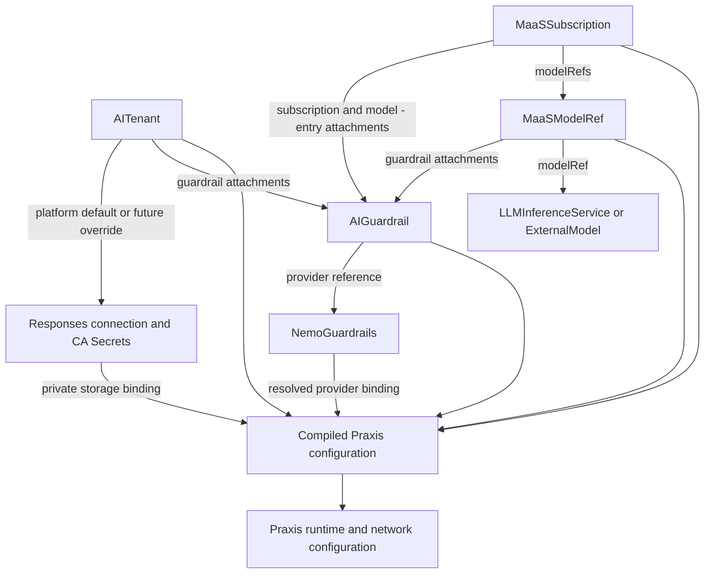
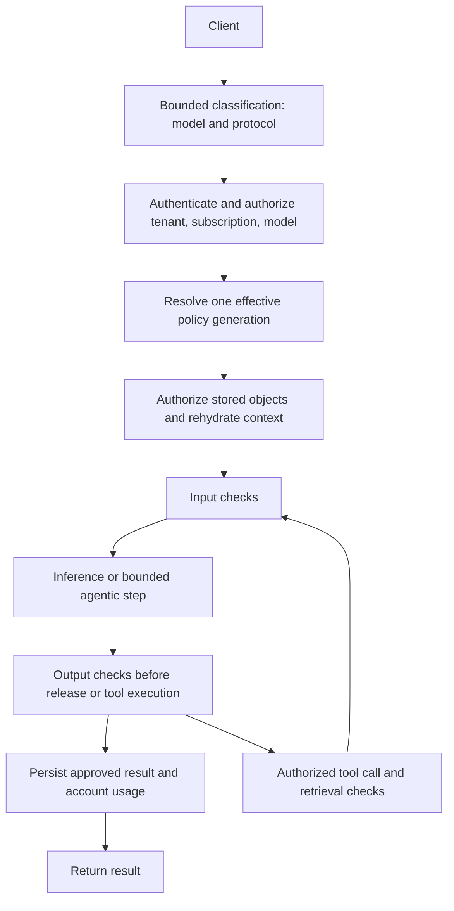

# Responses and guardrails for MaaS

|                |                                                                                                                               |
|----------------|-------------------------------------------------------------------------------------------------------------------------------|
| Date           | 2026-09-09 (revised 2026-09-10)                                                                                               |
| Scope          | AI Gateway, Models as a Service, Responses API, NeMo Guardrails                                                               |
| Status         | Proposed                                                                                                                      |
| Authors        | Pierangelo Di Pilato, Christina Xu, Marius Ion Danciu                                                                         |
| Supersedes     | N/A; extends the tenant and governance contracts without superseding their ADRs                                               |
| Superseded by: | N/A                                                                                                                           |
| Tickets        | TBD                                                                                                                           |
| Other docs:    | MS-0003 AI Gateway tenancy; MS-0004 tenancy discovery; MS-0005 MaaS flow control; source details in [References](#references) |

Read the main ADR for decisions and resource relationships, and the companion
[delivery plan](responses-and-guardrails-delivery-plan.md) for prioritization and scoped implementation work. Use the
appendices for
[API semantics](#appendix-a-resource-api-and-policy-semantics),
[storage and security](#appendix-b-storage-ownership-and-security),
[Praxis configuration](#appendix-c-praxis-compilation-and-provider-integration),
[lifecycle and acceptance](#appendix-d-lifecycle-and-acceptance),
[future discovery](#appendix-e-future-capability-discovery) and
[governance handoff alternatives](#appendix-f-alternatives-for-delivering-maas-governance-to-ai-gateway).

## What

Enable the Responses API at the AI tenant level, with tenant-owned orchestration and persistent storage. Extend Tenant,
Subscription and Model configuration with NeMo-backed content checks whose inheritance is deterministic and whose
required checks cannot be removed by another scope.

The decision is to separate infrastructure enablement from request policy, and to separate mandatory policy from
explicitly overridable defaults. MaaS resolves policy for the authenticated tenant, selected subscription and resolved
model; Praxis executes the resulting plan and owns the public Responses lifecycle. NeMo evaluates content through its
checks API rather than becoming the inference proxy.

## Why

Responses introduces state and outbound work beyond a single model invocation:
continuation IDs, stored inputs and outputs, conversations, and potentially tool loops. Enabling a route alone cannot
provide storage isolation, correct authorization for bodyless operations, or coherent state across replicas. These
responsibilities need a lifecycle owner with permission to deploy infrastructure and bind a database.

Guardrails introduce a different ownership problem. A platform administrator may require baseline safety, a model
publisher may require domain-specific checks, and a subscription administrator may need application-specific behavior.
Model and Subscription are related through a request, not through Kubernetes ownership. A single last-writer-wins
hierarchy cannot preserve all three administrative authorities unless the API distinguishes what each authority permits
others to override.

The supplied examples demonstrate useful building blocks, but not the complete contract. In particular, the Responses
example requires an outer authorization boundary; the NeMo adapter lacks config selection; Chat-only extraction does not
protect Responses; SSE bypasses output evaluation; and tenant-scoped storage does not establish principal ownership.
This ADR distinguishes those observed capabilities from the proposed additions and their release criteria.

## Goals

- Give tenant administrators and platform operators an explicit lifecycle for Responses infrastructure, external
  database binding and retained content.
- Preserve existing MaaS authentication, model access and selected-subscription semantics for each inference and
  stateful operation.
- Let Tenant, Subscription and Model define guardrails, including precise merge, override, disable and failure
  semantics.
- Target the supplied NeMo v1 checks contract with approved, reusable policies.
- Prevent an unsupported protocol, modality, streaming mode or tool path from silently bypassing an effective check.
- Make policy provenance, runtime readiness and propagation observable without disclosing private governance or prompt
  content.
- Stage implementation so every advertised capability has integration coverage.

## Non-Goals

- Implement the CRDs, controllers or runtime in this documentation change.
- Reproduce all upstream Responses features in the first release, including background execution, WebSocket, arbitrary
  tools and all multimodal inputs.
- Make MaaS a NeMo configuration authoring system or install arbitrary detector models, Colang programs and action
  servers from inference requests.
- Claim production database HA, backups or restore through a development database deployment.
- Add cross-tenant model sharing, cross-user conversation sharing, mandatory-policy waivers, audit-only checks or
  redaction in the initial API.
- Define governance for AI Gateway requests that do not use MaaS subscriptions. Tenant infrastructure is reusable by
  such integrations, but their principal and policy-selection contract requires a separate design.

## How

This is an end-to-end design, to be delivered through independently reviewed increments. The narrative below describes
the decisions and flows; the appendices define their detailed contracts. Existing Praxis filters are the implementation
baseline. Proposed MaaS/TrustyAI fields and integration requirements are not claims of current product support.

### Key decisions

| Area                 | Decision                                                                                                       | Detailed contract                                                                     |
|----------------------|----------------------------------------------------------------------------------------------------------------|---------------------------------------------------------------------------------------|
| Responses enablement | AITenant enables Responses and Conversations together                                                          | [Enablement](#responses-enablement-and-lifecycle)                                     |
| Model capability     | `capabilities.responses.mode` defaults to `ChatCompletions`; explicit `Native` or `Unsupported`                | [API placement](#ownership-and-api-placement)                                         |
| Storage              | Shared platform Responses binding, separate from API-key storage; Praxis owns schema lifecycle                 | [Database architecture](#responses-database-architecture-and-enterprise-isolation)    |
| Guardrails           | Reusable AIGuardrail policies attach at tenant, model, subscription and subscription model-entry scopes        | [Resources](#reusable-guardrail-resources-and-attachments)                            |
| Composition          | Required checks accumulate; defaults have explicit inheritance, merge, replace and disable semantics           | [Merge rules](#exact-inheritance-and-merge-semantics)                                 |
| References           | Policy lookup uses Tenant/Model scopes; NeMo owners permit consumers through Same, Selector or All             | [Reference authorization](#reference-authorization-discovery-and-model-applicability) |
| Execution            | Compile to existing Praxis filters using conditions or selected pipelines; initially ExtProc, later standalone | [Praxis mapping](#materializing-maas-configuration-in-praxis)                         |

### Resource relationships and configuration lifecycle

The proposal connects three configuration scopes: `AITenant`, `MaaSModelRef` and `MaaSSubscription`. The tenant enables
Responses and binds its storage; the model declares its Responses protocol support. All three can attach reusable
`AIGuardrail` policies, with an additional attachment on each subscription's model entry. A guardrail policy identifies
ordered checks and references the `NemoGuardrails` resource that serves them. AI Gateway reconciles that provider
binding independently and also owns AITenant reconciliation. MaaS validates model/subscription attachments and composes
them with the accepted tenant baseline.



The arrows represent configuration references and compilation inputs, not Kubernetes ownership or request-time calls.
Policy references use the constrained scopes below; NeMo references require consumer permission and tenant approval.
Referencing a database or NeMo service does not transfer its lifecycle to the consuming model, subscription or policy.

Together, these resources determine the effective checks for each authorized tenant/model/subscription combination and
the tenant's Responses capabilities. They compile into Praxis configuration; requests execute that configuration without
reading CRs or merging policies on the request path. MaaS API selects the authorized capability and effective checks
from the same accepted source resources and canonical resolution rules that the gateway compiler uses. The runtime
executes only a decision compatible with its loaded
configuration. [Compilation and request authorization](#compilation-and-request-authorization)
defines these responsibilities and the ordered resource/status handoffs.

The same resources support two deployment targets: initially Praxis runs through Envoy ExtProc; eventually standalone
Praxis can replace Envoy and also provide listeners, routing and upstream transport. Target-specific configuration
changes, while policy semantics, storage bindings and Responses ownership remain the same.

[Ownership and API placement](#ownership-and-api-placement) defines the fields and editing personas for these resources.
[Materializing MaaS configuration in Praxis](#materializing-maas-configuration-in-praxis) describes compilation;
[Reconciliation, rollout and acceptance criteria](#reconciliation-rollout-and-acceptance-criteria) covers the
controllers that implement this lifecycle and their ownership boundaries.

### Proposal through resource examples

The central idea is to configure infrastructure once at tenant level, declare each model's Responses capability, and
attach reusable guardrails wherever administrators or model owners need to enforce them. The following CRD-backed
resource fragments show one tenant, two models and one subscription using that contract. They illustrate proposed
fields, not apply-ready manifests; existing required fields are omitted. Namespace placeholders identify the resolved
tenant and model namespaces, not installation defaults.

Before creating these resources, prepare the tenant/model namespaces, the platform Responses database binding,
`pii-cm`, `application-safety-cm`, `model-safety-cm`, and the NeMo client credential/CA Secrets. The examples assume the
tenant-to-namespace relationship and existing Gateway configuration are established. Resource creation is separate from
readiness: each binding becomes usable only after its dependencies are validated.

**Provide the NeMo service and its configuration.** TrustyAI deploys `tenant-nemo` and loads the `pii` configuration
from `pii-cm`, `application-safety` from `application-safety-cm`, and `model-safety` from `model-safety-cm`, in the
tenant namespace. These configurations must make `approved-check-model` resolvable by NeMo. The policies below reference
this server and select their configurations.

```yaml
kind: NemoGuardrails
metadata:
  name: tenant-nemo
  namespace: <tenant-namespace>
spec:
  nemoConfigs:
    - name: pii
      configMaps: [ pii-cm ]
    - name: application-safety
      configMaps: [ application-safety-cm ]
    - name: model-safety
      configMaps: [ model-safety-cm ]
  allowedConsumers: # Proposed addition; nemoConfigs already exists.
    namespaces:
      from: Same
```

`Same` is shown explicitly for clarity and is the proposed default when `allowedConsumers` is omitted. The server's
endpoint, authentication and successful configuration loading must satisfy the
[TrustyAI integration contract](#trustyai-integration-and-deployment-topology) before the policy becomes ready.

**Define the reusable check separately.** The policy names the NeMo configuration and evaluation model; it does not
contain the server's configuration files. This example places NeMo in the tenant namespace, so the default `Same`
consumer permission suffices. A central server can instead use the
[NeMo consumer-permission contract](#nemo-owned-consumer-permission).

```yaml
apiVersion: aigateway.opendatahub.io/v1alpha1
kind: AIGuardrail
metadata:
  name: privacy-v1
  namespace: <tenant-namespace>
spec:
  provider:
    nemo:
      ref:
        name: tenant-nemo
      credentialsSecretRef:
        name: nemo-client-credentials
        key: token
      caBundleRef:
        name: nemo-client-ca
        key: ca.crt
    timeout: 5s
  checks:
    - name: sensitive-data
      configId: pii
      model: approved-check-model
      phases: [ Input, Output ]
```

Create the application policy used by the subscription as well. It selects the NeMo `application-safety`
configuration loaded above; its evaluation model must also be resolvable by that configuration.

```yaml
apiVersion: aigateway.opendatahub.io/v1alpha1
kind: AIGuardrail
metadata:
  name: application-safety-v1
  namespace: <tenant-namespace>
spec:
  provider:
    nemo:
      ref:
        name: tenant-nemo
      credentialsSecretRef:
        name: nemo-client-credentials
        key: token
      caBundleRef:
        name: nemo-client-ca
        key: ca.crt
    timeout: 5s
  checks:
    - name: application-check
      configId: application-safety
      model: approved-check-model
      phases: [ Input ]
```

Create the model policy against the same NeMo server's third configuration, `model-safety`. Qwen will attach this policy
independently of the subscription's application policy.

```yaml
apiVersion: aigateway.opendatahub.io/v1alpha1
kind: AIGuardrail
metadata:
  name: model-safety-v1
  namespace: <tenant-namespace>
spec:
  provider:
    nemo:
      ref:
        name: tenant-nemo
      credentialsSecretRef:
        name: nemo-client-credentials
        key: token
      caBundleRef:
        name: nemo-client-ca
        key: ca.crt
    timeout: 5s
  checks:
    - name: model-check
      configId: model-safety
      model: approved-check-model
      phases: [ Input ]
```

**Enable Responses and require a tenant baseline.** Responses includes Conversations and uses the platform's separate
Responses database binding. The `privacy-v1` attachment resolves in the tenant namespace and applies across its models
and subscriptions; lower scopes cannot remove it.

```yaml
kind: AITenant
spec:
  payloadProcessing:
    type: praxis
  responses:
    enabled: true
    storage:
      mode: PlatformDefault
      deletionPolicy: Retain
    retention:
      maxAge: 168h
  guardrails:
    required:
      - name: baseline
        ref:
          name: privacy-v1
```

**Register the model and declare how it handles Responses.** Create the referenced `LLMInferenceService` first.
`ChatCompletions` is the default adapter mode; `Native` is explicit opt-in, and embedding-only or reranker-only models
can declare `Unsupported`. The model already inherits the tenant's required baseline and need not repeat that
attachment.

```yaml
kind: MaaSModelRef
metadata:
  name: granite-7b
  namespace: <model-namespace>
spec:
  modelRef:
    kind: LLMInferenceService
    name: granite-7b-instruct
  capabilities:
    responses:
      mode: ChatCompletions
```

**Attach a requirement directly to another model.** Create `qwen3-instruct` as an `LLMInferenceService`, then register
this second model. Its publisher requires `model-safety-v1` for every authorized subscription using this model. Explicit
`scope: Tenant` resolves the policy already created in the tenant namespace; omission would resolve in the model
namespace. The tenant's `privacy-v1` baseline still applies automatically.

```yaml
kind: MaaSModelRef
metadata:
  name: qwen3
  namespace: <model-namespace>
spec:
  modelRef:
    kind: LLMInferenceService
    name: qwen3-instruct
  capabilities:
    responses:
      mode: ChatCompletions
  guardrails:
    required:
      - name: model-safety
        ref:
          name: model-safety-v1
          scope: Tenant
```

**Add a subscription-specific requirement for that model.** `application-safety-v1` is the second AIGuardrail created
above in the tenant namespace. This binding adds its checks to `privacy-v1` for Granite. Qwen is included without
repeating its model-level attachment.

```yaml
kind: MaaSSubscription
metadata:
  name: application-subscription
  namespace: <tenant-namespace>
spec:
  modelRefs:
    - name: granite-7b
      namespace: <model-namespace>
      guardrails:
        required:
          - name: application
            ref:
              name: application-safety-v1
    - name: qwen3
      namespace: <model-namespace>
```

For requests authorized through this subscription:

| Model        | Effective requirements                     | Source of additional policy                                    |
|--------------|--------------------------------------------|----------------------------------------------------------------|
| `granite-7b` | `privacy-v1`, then `application-safety-v1` | This subscription's Granite entry                              |
| `qwen3`      | `privacy-v1`, then `model-safety-v1`       | The model itself, across all subscriptions that authorize Qwen |

AI Gateway validates AIGuardrail provider bindings; MaaS validates attachments and composes policy; AI Gateway compiles
the accepted combination for Praxis. These examples express the desired API contract: NeMo selector support,
Responses-aware checks and safe output release remain
[integration prerequisites](#compilation-alternatives-existing-configuration-first), not capabilities established by
accepting the CRs. Exact defaults, additional attachment scopes and override rules are in
[Appendix A](#appendix-a-resource-api-and-policy-semantics).

### End-to-end flows

**Responses enablement and use**

1. An administrator enables Responses on AITenant; AI Gateway reconciles the tenant capability and approved database
   binding. Database service/role provisioning remains with its platform owner.
2. Model capability declarations select translation, native forwarding or rejection. Praxis initializes its store;
   activation waits for the Responses and Conversations ownership, storage and routing contracts to be ready.
3. MaaS API selects the authenticated request's authorized subscription/model, Responses permission and guardrails from
   accepted configuration. Praxis verifies compatibility with its loaded generation and executes the generated filters,
   including authorized history retrieval, applicable checks, inference and persistence of approved content.
4. Retrieval, continuation and deletion use the same ownership contract. Disabling Responses withdraws both API surfaces
   and retains data according to the lifecycle policy.

**Guardrail publication and execution**

1. A policy administrator publishes an AIGuardrail referencing a NeMo service and ordered checks; resource editors
   attach the policy at the required scopes.
2. AI Gateway reconciles AIGuardrail, validates its NeMo reference/consumer permission and publishes its binding status.
   AI Gateway validates tenant baseline references; MaaS validates model/subscription attachments and composes them with
   that accepted tenant baseline.
3. AI Gateway discovers MaaS subscriptions/model references from AITenant, resolves supported combinations with the
   shared MaaS resolver, and compiles them with its accepted guardrail bindings into Praxis configuration. Unsupported
   provider mappings remain unavailable rather than dropping checks. MaaS API selects the authorized combination from
   accepted governance configuration; Praxis checks its loaded revision and executes the selected filters.
4. Policy, permission or provider changes reconcile the affected bindings and configurations. Activation and revocation
   follow the generation contract, including draining requests already admitted.

The operation-by-operation rules live in [request ownership](#request-processing-and-responses-ownership),
[persistence transactions](#stateful-operations-and-persistence-transactions) and
[rollout](#reconciliation-rollout-and-acceptance-criteria). They are the canonical definitions for these flows.

### Architectural scope versus candidate release scope

This ADR defines the full architectural contract; each release must implement a tested subset without weakening its
invariants or silently accepting deferred features. Prioritization, cross-team prerequisites and scoped deliverables are
maintained in the companion [proposed delivery plan](responses-and-guardrails-delivery-plan.md). Architectural
acceptance does not establish staffing, release dates or approval to activate every described capability.

## Security and Privacy Considerations

The design protects three boundaries: who may configure a policy or data destination, which tenant/principal may access
stored content, and when inference content may reach a client or tool. Missing authorization or required checks must not
produce an unprotected fallback. Shared database credentials remain a shared trust boundary even with separate tenant
runtimes.

Canonical requirements are defined
in [reference authorization](#reference-authorization-discovery-and-model-applicability),
[database security](#security-controls-and-enterprise-responsibilities),
[request ownership](#request-processing-and-responses-ownership) and
[request-path security](#request-path-security-and-privacy-contract). These include content-free telemetry, approved
NeMo/tool destinations, deletion/restore behavior and the limits of asynchronous revocation.

## Appendix A: resource API and policy semantics

### Ownership and API placement

“Tenant” is a logical scope, not a recommendation to extend the legacy `Tenant`
resource. The current code separates `AITenant` (Gateway, OIDC, payload-processing selection) from `MaasTenantConfig`
(MaaS-specific settings). Follow that separation:

| Resource                                       | Proposed responsibility                                         | Editor                          |
|------------------------------------------------|-----------------------------------------------------------------|---------------------------------|
| `AITenant.spec.responses`                      | Enable Responses and provision its runtime/storage dependencies | Platform administrator          |
| `AITenant.spec.guardrails`                     | Tenant required/default policy attachments                      | Platform administrator          |
| `AIGuardrail.spec`                             | Reusable ordered checks and a typed NeMo server reference       | Authorized policy administrator |
| `MaaSSubscription.spec.modelRefs[].guardrails` | Per-model refinement within a subscription                      | Tenant administrator            |
| `MaaSSubscription.spec.guardrails`             | Checks and default overrides for the selected subscription      | Tenant administrator            |
| `MaaSModelRef.spec.guardrails`                 | Model owner's checks and defaults                               | Model publisher                 |
| `MaaSModelRef.spec.capabilities.responses`     | Declare supported backend protocol and adapter mode             | Model publisher                 |

The target architecture moves `AITenant` reconciliation and status ownership to AI Gateway controller alongside
`AIGuardrail`. This is a planned ownership transfer, not a claim about the current MaaS implementation. AI Gateway owns
tenant namespace/Gateway identity resolution, accepted tenant configuration, tenant-level guardrail reference
validation, Responses infrastructure/storage binding and capability readiness. MaaS consumes that published tenant
identity and baseline, validates its own model/subscription attachments, and applies the canonical MaaS composition
rules. MaaS must not patch AITenant status or independently reconcile its infrastructure. Moving controller ownership
does not by itself require changing AITenant's API group; that API migration is a separate compatibility decision.

Responses infrastructure and the platform's tenant baseline belong to `AITenant`. Policy authors can manage
`AIGuardrail` independently through Kubernetes RBAC without write access to the whole `AITenant`, `MaaSSubscription`
or `MaaSModelRef`. The existing legacy `Tenant` remains outside the new API contract.

Use the resolved tenant identity and existing model/Gateway validation. A model belongs to one tenant in the initial
design, as in tenancy ADR MS-0003. Both local
`LLMInferenceService` and `ExternalModel` backends receive their MaaS guardrails through `MaaSModelRef`; do not
duplicate policy on the backend resources.

### Responses enablement and lifecycle

The [tenant example](#proposal-through-resource-examples) shows the initial enablement fields and platform storage mode.

Omission means Responses is disabled. Enabling it requires Praxis; reject an IPP combination rather than implicitly
transferring payload-processing ownership. Subscription and Model cannot enable a disabled tenant capability. Model
capability is a further restriction, not another infrastructure switch. Initially, access to Responses follows existing
model/subscription authorization. A separate subscription entitlement can be added if product requirements demand one.

Initially, tenants use a platform-provisioned Responses database binding in the shared infrastructure namespace,
following the existing MaaS operational pattern: per-tenant runtime deployments consume a shared database connection
Secret. `PlatformDefault` selects that binding; it does not reuse the API-key database or its credentials. Enabling
Responses requires the platform binding to exist and pass validation; no database is provisioned implicitly.

`storage.mode` leaves room for later alternatives:

| Mode               | Initial or future contract                                                                                                                                     |
|--------------------|----------------------------------------------------------------------------------------------------------------------------------------------------------------|
| `PlatformDefault`  | Initial mode and default when storage mode is omitted: use the shared infrastructure Responses connection and CA binding                                       |
| `ExternalPostgres` | Future per-`AITenant` override: explicitly select a separately provisioned connection Secret and CA; database operations remain external                       |
| `ManagedPostgres`  | Future development option: explicitly provision database/credentials/PVC; not part of the initial implementation or an implicit database-operator installation |

The proposed platform convention is a separate `responses-db-config` Secret with key `DB_CONNECTION_URL`, plus
`responses-db-ca` with key `ca.crt`, in the configured infrastructure namespace. These names are new proposed
conventions, not existing MaaS resources. The platform administrator provisions them; tenant/model/subscription editors
cannot replace this platform binding. The compiler projects the connection privately into each enabled tenant's Praxis
runtime and compiles verified TLS. The database can be on the same PostgreSQL instance as MaaS, but must be a separate
logical Responses database with separate credentials. SQLite remains suitable for local examples, not shared production
state.

```yaml
kind: AITenant
spec:
  responses:
    enabled: true
    storage:
      mode: ExternalPostgres
      externalPostgres:
        connectionSecretRef:
          name: responses-database
          key: DB_CONNECTION_URL
        caBundleRef:
          name: responses-database-ca
          key: ca.crt
      deletionPolicy: Retain
```

Override references resolve in the `AITenant` namespace and require platform authorization and restricted projection
into the runtime. Once supported, an explicit override takes precedence over the platform default; an invalid override
fails closed and never falls back to shared storage. Rotation activates a new runtime generation without disclosing
credentials. Changing a database target is an explicit migration, including when switching between default and override.

The controller reports `ResponsesReady` only after storage connectivity, schema migration, ownership enforcement and
route activation are ready. Prepare new resources before switching routes. Disabling Responses stops all its public
operations, including retrieval, but retains data; reject continuations rather than falling through to a backend's
independent response store. Tenant deletion honors
`Retain` by default; externally managed databases are never deleted. Retained data is bound to the old tenant UID and
cannot be inherited by a recreated tenant with the same name. Storage mode/connection changes with existing data require
an explicit migration; ordinary reconciliation must not silently move the store.

Retention applies to responses, conversation items and derived continuation state. A cleanup job and deletion semantics
must implement `maxAge`; it is not an existing Praxis retention guarantee. Expired/deleted objects return not-found.
Concurrent conversation append/delete and continuation operations need version checks or transactions. Define deletion
tombstones so a late in-flight write cannot recreate a deleted response.

The [model example](#proposal-through-resource-examples) shows the capability declaration.

`ChatCompletions` is the default for every backend kind, including `LLMInferenceService` and `ExternalModel`, when
`spec.capabilities`, `capabilities.responses` or its `mode` is omitted. Praxis translates the supported Responses subset
to Chat Completions. `Native` is an explicit opt-in declaring that the selected backend accepts native Responses
requests.

Defaulting selects the adapter; it does not enable Responses on a disabled tenant or establish backend compatibility.
Validate the effective mode against the selected provider and report mismatches. Never silently discard unsupported
parameters, multimodal input or tool types, or automatically switch to `Native` after a translation failure. Both modes
retain the tenant's single public Responses lifecycle, including persistence and continuation; backend IDs must not
bypass it. The native compilation examples below assume an explicit `mode: Native` declaration.

`Unsupported` explicitly disables Responses for this model even when the tenant enables it. Embedding-only and
reranker-only models should declare this mode. Reject all Responses inference and continuation attempts using an
unsupported model before model execution; ownership-authorized deletion of existing records remains available under the
lifecycle rules. This mode does not disable the model's embedding/reranking endpoints or bypass their independent
authorization/policies. Omission still defaults to `ChatCompletions`; it is not automatic task detection.

```yaml
kind: MaaSModelRef
spec:
  capabilities:
    responses:
      mode: Unsupported
```

!!! note "What Responses enablement includes"

    `responses.enabled: true` enables core Responses and Conversations together, sharing database binding, ownership
    enforcement and retention. There is no separate `features` field or Conversations toggle. File search and MCP are
    optional tools, are not required for Responses, and will be discussed separatelly.

Core Responses includes create, retrieve, delete, input-items and continuation. `ResponsesReady` requires both Responses
and Conversations persistence/authorization contracts to be ready; disabling Responses withdraws both API surfaces while
retaining data. Reject requests selecting deferred tools before inference or outbound discovery/calls, and reject
unknown feature fields rather than silently accepting them.

Files, document extraction, vector stores, web search and MCP remain future capabilities requiring separate API and
binding designs, trusted authentication, egress policy, size/time limits and advertised protocol coverage. The agentic
material below preserves future architectural context and existing Praxis building blocks, not initial feature
availability.

### Reusable guardrail resources and attachments

Separate three responsibilities: TrustyAI's `NemoGuardrails` deploys a server and loads named configurations; a new
namespaced `AIGuardrail` defines an executable policy using that server; attachments on Tenant, Model and Subscription
determine where that policy runs. A reference to the server alone does not select its configs. A policy is not directly
coupled to users/groups: the selected subscription and existing MaaS authorization determine the request's consuming
scope.

`AIGuardrail` is proposed in `aigateway.opendatahub.io/v1alpha1`. AI Gateway owns its CRD integration, reconciliation
and status. The resource defines reusable provider checks independently of MaaS subscriptions. MaaS attachment fields
retain their existing shape and scoped lookup rules, but now refer to `AIGuardrail` without changing the public
attachment syntax. MaaS owns whether a tenant/model/subscription may attach a policy and how attachments compose. AI
Gateway owns whether the policy may use its provider and whether that provider binding is resolved. This split lets
other gateway consumers reuse AIGuardrail without implementing MaaS governance.

The [policy example](#proposal-through-resource-examples) shows the proposed AIGuardrail resource. Its provider and
check contract is defined below.

`spec.provider.nemo.ref` is a typed reference to TrustyAI's namespaced
`NemoGuardrails`. The NeMo adapter uses the supported checks wire contract; no user-facing API-version selector is
required. An incompatible server fails provider readiness with an actionable reason. The server reference identifies
infrastructure, not a URL supplied by an inference caller. Credentials and CA references resolve only in the
`AIGuardrail` namespace. They are approved service-client credentials, not MaaS API keys. Initial policy creation
requires an authorized policy administrator; sharing a policy does not grant its consumers access to these Secrets.

Each `checks[]` entry names one NeMo `configId`, a resolvable evaluation `model`, and its nonempty phase set. `checks`
is an ordered sequence of independent evaluations; all must pass. The resource is a reusable bundle, not an instruction
to invoke NeMo's undocumented multi-config merge semantics. Internally composed NeMo flows remain one config selected by
one entry. Do not allow attachment-level phase overrides to weaken the policy definition.

Allow authorized updates to `AIGuardrail.spec` in place. Kubernetes increments `metadata.generation`; AI Gateway must
revalidate changed checks, phases, provider references and applicability, then publish conditions for that generation
and a new accepted binding revision. Old conditions do not accept the new spec. Indexed watches trigger dependent MaaS
attachment revalidation, request-selection refresh and Praxis recompilation. A newly required protection must not leave
affected requests on an older, weaker configuration: fence admissions until a matching accepted generation is active.
Invalid updates leave affected combinations unavailable rather than silently dropping checks or reverting to old policy.
Already admitted requests follow the generation/drain contract, including cancellation where required for revocation.

This avoids mandatory reference changes across every model/subscription when policy evolves. Administrators may still
publish a separately named policy, such as `privacy-v2`, and migrate selected attachments for gradual adoption; this is
an optional rollout strategy, not an API immutability requirement. The version-like names in the examples are
illustrative.

Secret contents and discovered service endpoints can rotate independently of spec generation; include their validated
connectivity revisions in the binding contract. NeMo ConfigMaps are independently mutable: require versioned remote
configs and track observed revisions where available. Neither a local policy generation nor its digest alone proves
which configuration NeMo has loaded. Deleting/recreating a policy or provider with the same name still invalidates its
old UID references; it is not an in-place policy update or credential rotation.

All attachment locations use the same required/default structure. The
[resource examples](#proposal-through-resource-examples) show tenant-required and subscription model-entry bindings.
`MaaSModelRef.spec.guardrails` and `MaaSSubscription.spec.guardrails` use the same shape. Default attachments and their
inheritance behavior are defined in [the merge rules](#exact-inheritance-and-merge-semantics) and illustrated in
[the four-scope example](#four-scope-policy-resolution-four-scopes-two-nemo-servers-and-subscription-specific-overrides).

The singular `ref` identifies one policy in an already typed list; `guardrails` is plural because several policies can
apply. Binding `name` is a local stable identifier for diagnostics and ordering; it does not identify or override an
ancestor's binding. Attachments mean automatic execution, not merely an entitlement to optionally select checks. API
keys retain their stored subscription binding. Subscription-selection priority remains unrelated to guardrail ordering.

### Reference authorization, discovery and model applicability

These are separate contracts and must not be represented by one config-ID subset:

| Contract             | Meaning                                                                                         |
|----------------------|-------------------------------------------------------------------------------------------------|
| Reference permission | This source namespace/resource kind may attach the target policy or use the target NeMo service |
| Applicability        | The policy can evaluate this model, protocol, modality and phase                                |
| Enforcement          | The selected request must execute the effective required/default bindings                       |

#### Scoped policy references

Policy attachments use `ref.name` and a constrained scope, not an arbitrary namespace:

| Attachment location                                                  | Resolution                                                                                                                 |
|----------------------------------------------------------------------|----------------------------------------------------------------------------------------------------------------------------|
| `AITenant.spec.guardrails`                                           | Resolved tenant namespace, even when the AITenant object lives in a registry namespace                                     |
| `MaaSSubscription.spec.guardrails` and `spec.modelRefs[].guardrails` | Resolved tenant namespace; the model entry does not change this lookup scope                                               |
| `MaaSModelRef.spec.guardrails`                                       | `ref.scope: Model` by default resolves in the model resource namespace; explicit `Tenant` resolves in its tenant namespace |

At tenant/subscription locations, omit `scope` or use `Tenant`; reject `Model`. At model locations, accept only `Model`
and `Tenant`. Reject `ref.namespace` on policy attachments. Never search both namespaces or fall back if a policy is
missing. Resolve tenant membership through the existing authoritative tenant relationship; an ambiguous or missing
relationship is an error. Policy publication in these scopes is delegated through RBAC/admission, not arbitrary
cross-namespace policy grants.

```yaml
kind: MaaSModelRef
spec:
  guardrails:
    required:
      - name: baseline
        ref:
          name: privacy-v1
          scope: Tenant
```

A tenant-scoped policy is available for attachment by authorized resource editors in that tenant; it does not require an
additional ReferenceGrant. This is an explicit tenant policy-sharing contract, not public access to all cluster
policies. A model-scoped policy remains local to that model namespace. Resource-editor RBAC does not distinguish people
who can edit the same resource kind in one namespace; finer delegation requires admission rules or separate boundaries.
Neither attachment scope grants access to policy credentials.

#### NeMo-owned consumer permission

`AIGuardrail.spec.provider.nemo.ref` retains `name` and optional `namespace` because NeMo can live in a separate
infrastructure namespace. Omission resolves in the AIGuardrail namespace. The referenced NeMo resource authorizes
attachments through a proposed `spec.allowedConsumers`, analogous to Gateway API's target-owned `allowedRoutes`. This
replaces a ReferenceGrant for the policy-to-NeMo edge; the two mechanisms are not cumulative requirements.

Proposed TrustyAI resource fragment (new field, not currently implemented):

```yaml
kind: NemoGuardrails
spec:
  allowedConsumers:
    namespaces:
      from: Selector
      selector:
        matchLabels:
          kubernetes.io/metadata.name: team-a
```

The consumer is specifically an `aigateway.opendatahub.io/AIGuardrail`. No configurable kind list is introduced
initially. Evaluate the namespace of that policy resource, not the tenant object, model, subscription, runtime Pod or
inference caller. If a model attaches a tenant policy, NeMo evaluates the tenant policy's namespace. The policy's
authorized reuse within its tenant is governed by the scoped attachment contract above.

| `namespaces.from` | Exact permission semantics                                                                                                                                         |
|-------------------|--------------------------------------------------------------------------------------------------------------------------------------------------------------------|
| `Same`            | Only AIGuardrail resources in the NemoGuardrails resource's namespace may reference it. Default when `allowedConsumers`, `namespaces` or `from` is omitted         |
| `Selector`        | Only AIGuardrail resources whose Namespace object's labels match the specified Kubernetes LabelSelector may reference it; same-namespace consumers must also match |
| `All`             | Any namespace, including the NeMo namespace, satisfies this attachment check. Explicit opt-in; no selector is accepted                                             |

`Selector` requires a nonempty selector with at least one `matchLabels` entry or `matchExpressions` requirement. Reject
an absent or empty selector rather than interpreting it as allow-all; users must choose `All` explicitly. This is a
stricter validation choice than the general empty Kubernetes LabelSelector semantics. `selector` is forbidden with
`Same` or `All`, including when `from` defaults to `Same`; invalid combinations are rejected, not silently ignored.
Unknown modes and invalid selector operators/values are validation errors.

Use standard Kubernetes LabelSelector matching: all `matchLabels` equalities and all `matchExpressions` requirements are
ANDed. `In` requires the label to exist with one listed value; `NotIn` matches absent labels or values outside the list;
`Exists` requires presence; `DoesNotExist` requires absence. `In`/`NotIn` require nonempty values; `Exists` and
`DoesNotExist` require no values. There is no OR between separate requirements. A missing Namespace object or failed
lookup never matches. Selectors match namespace labels, not labels on the AIGuardrail.

For an exact namespace, use the `kubernetes.io/metadata.name` label as above. For a set of namespaces:

```yaml
kind: NemoGuardrails
spec:
  allowedConsumers:
    namespaces:
      from: Selector
      selector:
        matchExpressions:
          - key: kubernetes.io/metadata.name
            operator: In
            values: [ team-a, team-b ]
```

To deliberately allow attachments from all namespaces:

```yaml
kind: NemoGuardrails
spec:
  allowedConsumers:
    namespaces:
      from: All
```

`All` relaxes only this server-owned attachment check. It does not approve the endpoint for every tenant, expose
Secrets, authorize model execution, select permissible NeMo configs or bypass service authentication. With the initial
contract, it permits every eligible policy in an allowed namespace to reference that server; per-config delegation would
need a separate future contract. Tenant/platform admission must still approve the exact provider namespace/name and
selected configurations. Shared-server cross-tenant config isolation is not supplied by this field.

NeMo owners control `allowedConsumers`; only trusted platform administrators may control labels used for authorization.
If policy authors can label their own namespaces to satisfy a selector, that selector is not an independent
authorization boundary. Namespace-name selectors avoid granting access through arbitrary self-assigned labels.

TrustyAI defines the API field and validates its shape. AI Gateway evaluates `allowedConsumers`, provider-reference
validity and gateway/platform provider restrictions when reconciling `AIGuardrail`, and publishes its accepted binding.
MaaS consumes that status, enforces its scoped attachment and tenant-approval rules, and composes effective policy. MaaS
does not re-evaluate NeMo consumer permission or resolve provider credentials. AI Gateway then compiles the
MaaS-accepted combination using the matching binding revision. The
[resource/status gates](#resource-events-and-status-gates-between-components) define when compilation and activation are
permitted. Until that contract is implemented, cross-namespace NeMo binding remains unavailable; an unknown or ignored
field is not permission. AI Gateway records provider/policy/Namespace UIDs and evaluated permission revisions in its
binding publication. It watches NeMo permissions, provider namespace labels/identity and provider/policy recreation;
MaaS watches tenant membership and attachment scope changes. Denial sets
`ResolvedRefs=False` with an actionable reason and blocks affected plans through the existing propagation fence; never
replace the check with an empty policy. `All` does not require namespace-label watches for matching, but namespace
identity, tenant membership and provider approval still require validation. Tightening permission fences new admissions;
already admitted requests follow the documented generation/drain contract, not a claim of instantaneous cancellation.

Publish an authorized policy catalog containing reference identity, description, phase/protocol coverage, applicability
and readiness. Model publishers need these names and capabilities, not the NeMo URL or private ConfigMap contents.
Exposing
`MaaSModelRef.status.guardrailsUrl` is unnecessary for policy attachment and does not solve reference permission. Policy
status can report sanitized `Accepted`,
`ResolvedRefs`, `ProviderReady` and `Compatible` conditions; do not expose credentials or private subscription
provenance through model status.

A config's `models[].type: main` is not universally the served MaaS model. In checks mode it can be a detector/judge or
a model used for self-checking. The required
`checks[].model` is a NeMo-resolvable evaluation model, not an inferred public alias. For model-dependent policies,
optionally declare `spec.applicability.modelRefs[]`
with explicit namespace/name references to eligible `MaaSModelRef` resources. The resolver records their UIDs and
validates membership for the actual request. Omission means no model allowlist, not proof of universal compatibility:
phase, protocol, modality and actual provider checks must still pass. These applicability references are constraints,
not data-fetching or model-access grants.

Do not parse arbitrary NeMo ConfigMaps and compare main-model names with MaaS aliases as the authorization mechanism.
NeMo owns config parsing and internal model semantics; MaaS owns declared applicability and supported adapter
validation. Any rail requiring the actual serving model must explicitly bind its approved evaluation model and be
verified against that deployment. NeMo guarded-inference endpoints would transfer model routing ownership and need a
separate integration contract.

### Exact inheritance and merge semantics

Separate **required checks** from **overridable defaults**. “Default” means a real enforcing check unless an authorized
editor explicitly replaces/disables it; it does not mean audit-only. Required checks can be changed by their resource
owner, but another scope cannot remove or weaken them.

For an authenticated `(tenant UID, subscription UID, model UID)` tuple:

1. Collect required bindings from Tenant, Model, selected Subscription and its matching `modelRefs[]` entry.
2. Start with tenant defaults; apply Model defaults, Subscription defaults, then the matching subscription model-entry
   defaults. The consuming application's most specific scope wins for optional defaults. Model safety requirements
   belong in `required`.
3. Append resolved default bindings after required bindings, then expand each referenced policy into its ordered checks.
   Run every check matching the phase; all must pass. A block stops the operation, and an error fails closed. There is
   no “later pass overrides earlier block.”

| Defaults field                                    | Effect on inherited defaults                          |
|---------------------------------------------------|-------------------------------------------------------|
| Absent, or `mode: Inherit`                        | Preserve inherited list; local checks must be absent  |
| `mode: Merge` (default when `checks` is supplied) | Append local checks; do not replace inherited entries |
| `mode: Replace`                                   | Replace the whole optional list with the local list   |
| `mode: Disable`                                   | Empty the optional list; local checks must be absent  |
| `checks: []` with `Merge`                         | No change                                             |
| `checks: []` with `Replace`                       | Explicitly empty the optional list                    |

At Tenant scope defaults simply seed the list; its policy does not need a mode. Explicit `null` is invalid for these
lists. Duplicate binding names within a local list are invalid. Binding identity is
`(resource UID, attachment path, required/defaults, name)`; the path for a subscription model entry includes its
namespace/name model key:
reusing an ancestor's name cannot overwrite it. This is ordered list composition, not a recursive JSON/YAML merge. Keep
declarations in order and preserve origin metadata. Initially execute duplicate policy bindings separately; optimizing
them requires proof that phase, context and any state are identical and side-effect-free.

Example: Tenant requires `safety`, defaults to `topic`; Model requires `medical`, merges `pii`; Subscription requires
`finance` and replaces defaults with `support`. The effective order is `safety, medical, finance, support`. With
Subscription
`Merge`, it is `safety, medical, finance, topic, pii, support`. With Subscription
`Disable`, it is `safety, medical, finance`. No override removes `medical`. A matching subscription model entry with
required
`audit` and defaults `Replace: [specialist]` produces `safety, medical, finance, audit,
specialist`. Its `Disable` produces `safety, medical, finance, audit`. Other model entries do not participate. Validate
uniqueness of subscription model namespace/name keys so a request cannot match ambiguous entries.

The initial API exposes only enforcing, fail-closed checks. It does not expose fail-open, audit-only or redaction as if
they were equivalent to enforcement. A future exception should be an explicit, scoped, expiring waiver authorized by the
owner of the required policy. Do not add a global `guardrails.enabled: false`
that removes inherited requirements. Likewise, do not try to rank arbitrary NeMo configs by “strictness”: different
configs are not generally comparable.

### API validation and compatibility contract

The field sketches use the current `maas.opendatahub.io/v1alpha1` resource model; adding them still requires generated
CRDs, defaulting/validation and controller support. Do not use an opaque Praxis YAML field as the user-facing policy
API. Unknown policy fields must produce actionable validation errors rather than being silently interpreted as an
unguarded request.

| Field or combination                                                        | Proposed validation/default                                                                                              |
|-----------------------------------------------------------------------------|--------------------------------------------------------------------------------------------------------------------------|
| `responses` absent or `enabled` omitted                                     | Disabled; `enabled` defaults to false                                                                                    |
| Enabled Responses with no storage                                           | Invalid; no implicit ephemeral storage                                                                                   |
| `PlatformDefault` with override/managed fields, or mixed storage modes      | Invalid discriminated union; future modes rejected until supported                                                       |
| `responses.enabled: false` with retained configuration                      | Valid staged configuration; no Responses endpoints become available                                                      |
| `retention.maxAge`                                                          | Required positive duration when enabled; no undocumented unlimited-retention default                                     |
| `storage.deletionPolicy`                                                    | Initially only `Retain`; destructive deletion needs a later explicit contract                                            |
| `responses.enabled: true`                                                   | Enables Responses and Conversations together; readiness requires both API surfaces                                       |
| Model `spec.capabilities.responses` or its enclosing fields/`mode` omitted  | Effective mode is `ChatCompletions` for every backend kind; tenant enablement and compatibility checks still apply       |
| Model `spec.capabilities.responses.mode: Unsupported`                       | Responses unavailable for this model regardless of tenant enablement; preserve unrelated model APIs                      |
| Model `spec.capabilities.responses.mode: Native`                            | Explicit native backend declaration; validate compatibility before activation                                            |
| Guardrails configured with IPP selected                                     | Invalid until that backend implements the same enforcement contract                                                      |
| `AIGuardrail.spec.checks`                                                   | Nonempty ordered list; local check names unique                                                                          |
| `AIGuardrail.spec` update                                                   | Mutable with authorization/revalidation, current observedGeneration and a new binding revision; fence unsafe transitions |
| Check `configId` and `model`                                                | Required nonempty strings; config loaded and evaluation model resolvable by the selected NeMo server                     |
| Check `phases`                                                              | Nonempty set containing only `Input` and/or `Output` initially                                                           |
| Attachment-level phase/config override                                      | Invalid; settings belong to the referenced policy                                                                        |
| Reference namespace omitted                                                 | Referencing object's namespace                                                                                           |
| Policy ref with arbitrary namespace, or NeMo ref denied by allowedConsumers | Invalid/unresolved; no namespace fallback                                                                                |
| Provider outside tenant/platform approval                                   | Unresolved/invalid even when allowedConsumers permits attachment                                                         |
| Duplicate subscription model namespace/name key                             | Invalid; one matching entry per model                                                                                    |
| `defaults: {}`                                                              | Inherit                                                                                                                  |
| `Merge` or `Replace` without `checks`                                       | Invalid; use an explicit list, including `[]`                                                                            |
| `Inherit` or `Disable` with `checks`, including `[]`                        | Invalid; contradictory intent                                                                                            |
| Tenant defaults with `mode`                                                 | Invalid; tenant supplies the initial list                                                                                |
| A missing policy/provider                                                   | Reject affected requests; never remove the unresolved check                                                              |

Guardrails can operate on Chat Completions while Responses is disabled. Enabling Responses is not a prerequisite for
guardrails. Conversely, enabling Responses does not invent a default NeMo provider: an empty effective policy means no
content checks, with that fact visible to authorized administrators.

Kubernetes patch semantics must preserve the algorithm's order. Policy `checks` and attachment required/default lists
are atomic ordered lists, with CEL validating local name uniqueness. Do not rely on server-side apply list-map merge
order. Phase lists are sets. Two field managers editing one ordered list receive a field ownership conflict rather than
implicit reordering. `null` cannot erase an ancestor requirement.

Policy spec updates increment generation; provider credentials and discovered connectivity can rotate without a spec
update. Track policy identity/content and connectivity revisions separately in the accepted binding. A changed data
destination still requires authorization, capability validation and acknowledgment; changing credentials must not alter
which checks run.

Do not add placeholder production defaults for timeout, retention, request bytes or loop count merely by copying example
values. Before generating CRDs, choose bounded platform defaults and maxima through load testing. Tenant settings may
reduce limits; raising platform maxima requires platform authority. The concrete `5s` and `168h`
values in this document are examples of explicit settings.

### Resolution algorithm and worked edge cases

The resolver operates on admitted resources from one consistent published snapshot. Resource names are for
configuration; UIDs identify the authorized objects and prevent name reuse from inheriting old authorization. Resolve
MaaS attachment scopes and validate tenant approval and model applicability. Require current AI Gateway-accepted
AIGuardrail binding revisions for the provider edge; MaaS does not resolve NeMo namespaces or evaluate allowedConsumers
itself. Provider readiness gates activation separately from this composition.

```text
resolve(tenant, model, selectedSubscription, snapshot):
    assert model resolves to tenant
    assert selectedSubscription is authorized for this model and principal
    entry = unique selectedSubscription.modelRefs entry matching model
    assert all AIGuardrail refs resolve within permitted MaaS scopes and tenant approval
    assert each policy has a current AI Gateway-accepted provider binding revision in snapshot

    required = tenant.required + model.required + selectedSubscription.required + entry.required
    defaults = tenant.defaults.checks
    defaults = apply(defaults, model.defaults)
    defaults = apply(defaults, selectedSubscription.defaults)
    defaults = apply(defaults, entry.defaults)

    bindings = required + defaults
    plan = expand each policy in binding order, preserving policy.checks order
    validate every effective check against model applicability, protocol, modality and capabilities
    return immutable plan with resource UIDs, revisions and origin for each binding

apply(inherited, local):
    Inherit or absent: return inherited
    Merge:            return inherited + local.checks
    Replace:          return local.checks
    Disable:          return []
```

This pseudocode assumes defaulting has normalized `checks` without a mode to `Merge`. It does not grant access:
authentication and subscription selection happen first. Resolution must reject missing/deleted objects rather than
substituting a same-name replacement or falling back to a different subscription with weaker checks.

| Scenario                                                                             | Result                                                                                                                          |
|--------------------------------------------------------------------------------------|---------------------------------------------------------------------------------------------------------------------------------|
| Tenant required Input check; Model replaces defaults                                 | Tenant Input check remains                                                                                                      |
| Tenant default Input+Output check; Subscription replaces it with Input-only          | Allowed delegation for defaults; Output is no longer effective unless another binding requires it                               |
| Tenant required Input+Output check; Subscription adds Input-only under the same name | Original Input+Output binding remains; the new binding is separate                                                              |
| Model requires a check; Subscription disables defaults                               | Model requirement remains                                                                                                       |
| Subscription A replaces defaults; caller is authorized under Subscription B          | A has no effect on the request                                                                                                  |
| Model default is incompatible but Subscription replaces it                           | Validate the final effective plan for runtime compatibility; local declarations must still be structurally valid and resolvable |
| Effective default is unsupported or its provider is unavailable                      | Reject; an overridable default still enforces until explicitly overridden                                                       |
| Model is deleted and recreated with the same name                                    | Existing stored model UID and old generated configuration do not authorize the new object                                       |
| Policy is removed before its bindings are migrated                                   | Affected bindings become unresolved; no unguarded fallback                                                                      |

Each Input+Output check expands to one evaluation at each applicable boundary. Required bindings execute in Tenant,
Model, Subscription, matching model-entry order; remaining defaults follow in their composed order. Output uses the same
logical order, even though Praxis filters may traverse in reverse. The compiler must arrange phase-specific execution so
implementation traversal does not accidentally invert the declared plan.

Sequential fail-fast evaluation is the initial contract. The first block produces a content rejection; the first
evaluation error produces a service failure. No later checks run after either outcome. This prioritizes deterministic
execution and bounded callout cost. Running checks concurrently would need a separate decision about result precedence,
cancellation and potentially stateful NeMo actions.

With `R` phase-matching checks expanded from required bindings and `D` from resolved default bindings, one boundary
performs at most `R + D` evaluations. One binding can expand into several checks; bound both binding count and total
expanded checks. An agentic loop multiplies this by its evaluated boundaries; policies with their own detector calls can
add more work. Enforce both per-provider concurrency and a request-wide deadline. Each call gets the smaller of its
configured timeout and the remaining request deadline. Queue exhaustion is an evaluation failure, not permission to
bypass a check. Do not automatically retry NeMo calls until their action-side-effect/idempotency contract is
established.

## Appendix B: storage, ownership and security

### Responses database architecture and enterprise isolation

#### Decision and workload boundaries

The initial baseline is **a shared Responses database and connection binding for enabled tenants**, separate from the
MaaS API-key database and credentials. Each tenant retains its own Praxis runtime, but runtime separation is not a
database isolation boundary when credentials are shared. Every store operation must enforce the trusted tenant UID and
principal ownership, including reads, updates, deletion, continuation, conversation append and cleanup. Tenant-specific
TTL and deletion must never remove another tenant's records; coordinate shared schema migrations across all runtime
generations. This is a release requirement; the current store must not be assumed to supply tenant isolation merely from
a URL or table name. Shared activation remains blocked until the selected implementation proves that contract.

A shared credential also means compromise of one runtime can expose other tenants' Responses data. This initial mode is
suitable only where that shared trust boundary is acceptable. Customers requiring database-enforced tenant separation
must wait for or prioritize the per-`AITenant` override, with separate databases/roles and potentially separate
instances. Keep that path in the architecture without presenting it as initially implemented. Do not silently use the
API-key connection as a fallback under either mode.

The existing API-key schema stores hashes rather than plaintext keys, but also usernames, groups, descriptions and usage
timestamps. It is security-sensitive identity data and can contain PII; it must not be classified as harmless metadata.
Responses adds arbitrary customer content, potentially including credentials accidentally pasted into prompts, regulated
data, confidential documents, model outputs, conversation history and tool results. Guardrail execution does not certify
that this content is safe to persist. See the existing
[API-key schema](../../../maas-api/db/schema/0001_create_api_keys.up.sql).

| Requirement         | MaaS API-key store                                                                               | Responses store                                                                                                                           |
|---------------------|--------------------------------------------------------------------------------------------------|-------------------------------------------------------------------------------------------------------------------------------------------|
| Primary operations  | Key validation, revocation, listing and usage updates                                            | Response writes, history reads, conversation append, continuation and expiry/deletion                                                     |
| Data volume         | Relatively compact identity/key records; authentication traffic still requires capacity planning | Variable and potentially large payloads; tool loops and retained histories amplify writes and storage                                     |
| Availability impact | Failure can prevent authorization for inference across protocols                                 | Failure prevents stateful Responses operations; independent Chat Completions should remain available where other dependencies are healthy |
| Data lifecycle      | Key validity, revocation and identity/audit lifecycle                                            | Explicit content TTL, user deletion, derived-state cleanup and backup expiry                                                              |
| Access model        | Authentication service and tightly controlled identity administrators                            | Tenant/principal ownership checks plus separately authorized content operations                                                           |
| Recovery risk       | Restoring old state can revive revoked credentials unless revocations are reconciled             | Restoring old state can resurrect deleted content or conversation items unless deletions are reconciled                                   |
| Capacity pressures  | Validation latency, indexes and update contention                                                | Payload bytes, write throughput, WAL growth, history reads, cleanup/vacuum and connection fanout                                          |

These stores have no cross-database transaction dependency. Praxis consumes trusted MaaS authorization context; it does
not query API-key tables or receive their database credentials. Responses state and its durable usage outbox remain in
one Responses transaction boundary; downstream metering consumes records idempotently. Do not introduce a distributed
transaction with the key database on the inference path.

#### Supported deployment choices

Here, an instance means a PostgreSQL service/cluster with a common administrative and physical recovery boundary, not
merely a Kubernetes Pod. Database separation and workload isolation are different properties.

| Topology                                                        | Proposed support                                            | Boundary and tradeoff                                                                                                         |
|-----------------------------------------------------------------|-------------------------------------------------------------|-------------------------------------------------------------------------------------------------------------------------------|
| API-key and Responses tables in the same database/schema        | Not an initial supported production topology                | Table names alone provide no credential, capacity or recovery isolation; reject known reuse of the MaaS database binding      |
| Separate schemas in the MaaS database                           | Not an initial supported production topology                | Grants can separate access, but migration/search-path mistakes and common database operations create avoidable coupling       |
| Shared Responses database, separate from API keys               | Initial platform-default mode                               | Shared credentials and failure domain; verified tenant/owner enforcement required                                             |
| Separate Responses database per tenant on a shared instance     | Future per-tenant override                                  | Separate roles and grants; shared CPU, memory, I/O, connection ceiling, administrators, maintenance and physical backups      |
| Separate Responses PostgreSQL instance from the API-key service | Recommended for stronger workload and operational isolation | Independent capacity, maintenance and recovery; increases cost and operational responsibility                                 |
| Dedicated Responses instance per tenant/security domain         | Future per-tenant external binding                          | Stronger administrative and failure separation when networking, credentials, backups and runtime placement are also separated |

Do not infer physical isolation from different hostnames or Secret names: aliases, proxies and managed services may map
them to the same instance. Admission can reject a known reused database identity and enforce platform-approved bindings;
the database/platform owner must attest the actual topology. A shared instance is an explicit operational choice, not an
automatic fallback when a dedicated service is unavailable. PostgreSQL schemas require carefully controlled grants and
`search_path`; a schema is not equivalent to a separate database. See
[PostgreSQL schema security](https://www.postgresql.org/docs/current/ddl-schemas.html).

The same API supports small and large deployments. Size alone does not select a security tier: a small tenant handling
sensitive content may require a dedicated service, while a large trusted environment may accept shared infrastructure
with measured capacity limits. No topology by itself establishes compliance with every customer's requirements.

#### External database binding and Praxis compilation

The initial compiler resolves the shared infrastructure `responses-db-config` and `responses-db-ca` binding. The future
`storage.externalPostgres.connectionSecretRef` override changes only binding resolution: it identifies another approved
host/database/identity. Both lower to the same Praxis store configuration. Missing bindings fail readiness; there is no
`reuseMaaSDatabase` fallback and no model/subscription storage override.

| Tenant storage input or deployment requirement | Materialization and owner                                                                                                                                                     |
|------------------------------------------------|-------------------------------------------------------------------------------------------------------------------------------------------------------------------------------|
| External connection Secret                     | AI Gateway controller produces a Secret-backed private runtime configuration for Praxis `openai_response_store.database_url`; no credential in the public ConfigMap or status |
| CA binding and verified server identity        | Mount CA and compile `ssl_mode: verify-full` plus `ssl_root_cert` for the selected PostgreSQL endpoint                                                                        |
| Resolved Responses database                    | Initially shared tables require trusted tenant and owner scoping on every operation; future dedicated databases retain ownership checks                                       |
| Responses enablement                           | Compile the existing Responses, Conversations and rehydration filters, with one coherent tenant store shared by applicable plans                                              |
| Schema version and migration authority         | Praxis store initializes tables at startup; future versioned migrations remain Praxis-owned and coordinated before readiness                                                  |
| Content TTL and deletion lifecycle             | Retention worker against the same database and ownership/tombstone model; not an extra inference-time MaaS service                                                            |
| Connection and byte/concurrency budget         | Validated runtime pool settings and admission limits; budget all store instances and replicas, including rollout overlap                                                      |
| External HA, backup and encryption policy      | Provision and verify through the database/platform owner; these are not Praxis filter settings                                                                                |

The inference path still executes compiled Praxis configuration, initially hosted by Praxis ExtProc and eventually by
standalone Praxis. Provisioning, migrations and retention are control-plane or maintenance work; a filter chain cannot
provision HA or prove backup policy. Do not invent Praxis YAML fields for those operations. The compiler must reject a
requested capability that the selected runtime cannot enforce, rather than mark the tenant ready based on successful
YAML rendering.

#### Database provisioning, initialization and migration ownership

Follow the existing MaaS API pattern of application-owned schema lifecycle, using Praxis's existing store initialization
for Responses. Keep database provisioning separate from table initialization:

| Responsibility                                                       | Component and contract                                                                                                                                     |
|----------------------------------------------------------------------|------------------------------------------------------------------------------------------------------------------------------------------------------------|
| PostgreSQL service, logical database, role and connection/CA Secrets | Platform/database administrator provisions them before enablement; initial external storage does not create a database server or execute `CREATE DATABASE` |
| Responses and Conversations tables and schema-version metadata       | Praxis `PostgresResponseStore` initializes them while constructing the configured stores, in either execution host                                         |
| Schema changes across Praxis releases                                | Praxis owns the schema definitions and must supply the migration path; neither MaaS API nor the AI Gateway controller authors Responses SQL                |
| Deployment sequencing and readiness                                  | AI Gateway integration supplies the binding, coordinates initialization/upgrade and activates traffic only after successful schema checks                  |

MaaS API's `NewPostgresStoreFromURL` connects to an existing database and runs embedded versioned migrations with
`golang-migrate` before returning a usable store. See
[the existing startup migration implementation](../../../maas-api/internal/api_keys/db_driver.go). Praxis already
follows the startup-initialization part of this pattern: `PostgresResponseStore::new` executes generated DDL, validates
table columns and stamps/checks the schema version. The configured Responses and Conversations filters use this store
implementation. A version mismatch currently returns a migration-required error; this is **not** an existing incremental
migration runner. No new MaaS schema-initializer component is needed for first-use table creation.

Initially, allow Praxis startup to initialize its dedicated Responses schema using narrowly scoped DDL permissions. That
credential can create/own Responses tables and therefore is more privileged than a DML-only serving credential; it must
have no access to the API-key database. Coordinate and test first-start initialization across filters and tenant
replicas sharing the database; idempotent DDL alone does not establish concurrent initialization safety. Initialization
failure leaves Responses unavailable, without falling back to another database.

Before a release changes the stored schema, Praxis must provide versioned migration steps, compatibility checks and a
single-writer coordination mechanism per database/schema. It can extend startup initialization, as MaaS API does, or
provide a migration command executed as a pre-activation job. The AI Gateway integration orchestrates that command but
does not duplicate its SQL. Do not imply that a migration CLI/job exists today, or start independently competing
migrators for each tenant against the shared database.

For deployments requiring DML-only serving credentials, retain a future separated migration job/credential option.
Praxis needs a validation-only startup path after that job, since its current constructor executes DDL and can stamp
schema metadata. This separation is not required by the initial configuration API, but is a prerequisite for deployments
whose security policy disallows runtime DDL. The migration credential must then remain outside serving Pods.

#### Security controls and enterprise responsibilities

- **Database identities:** distinct roles for MaaS API keys, the shared Responses runtime binding, migrations and
  maintenance. Future tenant overrides use dedicated runtime roles. The initial runtime credential needs the limited
  Responses-schema DDL/ownership permissions described above; a future separated migrator permits DML-only serving.
  Neither runtime credential may read the key database, create roles, install extensions or act as superuser. Explicitly
  restrict database connection and schema/table privileges; a different database name alone does not enforce access
  denial. Retention workers receive only the privileges required for their cleanup protocol.
- **Application ownership:** the initial shared database requires tenant/principal ownership enforcement on every
  operation. Future database-per-tenant bindings reduce tenant blast radius but do not replace these checks. Row-level
  security can add defense in depth if introduced and tested, including pooled-connection identity reset and transaction
  scoping. It is not currently promised by the Praxis store. Table owners and privileged roles can bypass ordinary RLS,
  and a compromised runtime holding the initial shared credential can expose all tenants in that Responses database.
  See [PostgreSQL row security](https://www.postgresql.org/docs/current/ddl-rowsecurity.html).
- **Network and credential boundaries:** permit database access only from the tenant runtime and approved maintenance
  workloads; use verified TLS, restricted egress and short-lived credentials where supported by the connection/rotation
  implementation. Project only the Responses credential into the tenant Praxis runtime. Secret update must
  drain/reconnect pools or roll the generation before the old credential is revoked. Infrastructure administrators with
  Secret/workload access remain inside the trust boundary; dedicated DBs do not remove that access.
- **Encryption and key custody:** require encryption of primary storage, replicas, snapshots and backups through the
  selected platform. Customers may require distinct customer-managed keys and separate backup administrators.
  Application envelope encryption could further restrict database-operator plaintext access, but requires a separate
  design for key service access, rotation, queries and recovery; it is not provided by a PostgreSQL connection setting.
  Praxis and approved model/guardrail services still process plaintext during inference.
- **Residency and support access:** approve the database region, replicas, backup/archive destinations and operational
  access locations together. Audit privileged content access and database-binding changes without recording content or
  credentials. Query logging, slow-query diagnostics, traces, crash dumps and support bundles must follow the same
  content policy; parameterized SQL alone does not guarantee that monitoring never captures values.
- **Persistence policy:** `store: false` prevents durable Responses content storage under the lifecycle contract; it
  does not promise that model providers, detectors or tools retain nothing. A platform that must prohibit content
  persistence regardless of caller choice needs an enforceable tenant storage policy and protocol behavior for
  continuation and Conversations before it can advertise that mode. TTL is not a substitute for such a policy.

For each production deployment, record the responsible database operator, approved isolation topology, content
classification, maximum retention, permitted locations, key ownership, privileged access procedure, availability target,
RPO/RTO and tested recovery procedure. These are deployment acceptance inputs, not a claim that a CR reconciler can
verify a customer's complete security policy.

#### Retention, recovery, capacity and failure behavior

`retention.maxAge` limits live content availability; it is not a guarantee that bytes vanish from backups at that
instant. Define the expiry clock for each object and whether conversation activity affects it, bound cleanup delay, and
cover conversation items, derived state and outbox payloads. Keep usage events free of prompt/response bodies and define
their separate retention. Do not retain blocked raw output for diagnostics by default. Erasure applies to derived
content and any separately enabled file/vector storage under their own contracts.

Backups and WAL archives need explicit retention, encryption and access policies. Restore into a quarantined target,
reapply deletion/expiry records from a source that survives the rollback, validate tenant identity and authorization,
then activate it. Tombstones stored only inside the restored backup cannot prevent resurrection of later deletions.
Document the delay until erased content ages out of backups; immediate erasure requirements need an independently
validated design. Any legal-hold workflow must be explicit, authorized and reflected in the advertised deletion
behavior.

Separate logical databases on one instance do not provide independent physical point-in-time recovery. PostgreSQL's
physical backup/WAL recovery operates on the cluster; tenant recovery may require restoring an isolated cluster and
extracting/reconciling one logical database. Do not rewind the live shared instance to recover Responses and thereby
roll back key revocations or other tenants. See
[PostgreSQL continuous archiving and recovery](https://www.postgresql.org/docs/current/continuous-archiving.html).

Size the Responses service using retained bytes and write amplification, including indexes, history copies, tools, WAL,
replicas and backups. Bound request bytes, conversation growth, tool iterations, concurrent operations and retained
bytes per tenant; define admission and cleanup behavior at each limit. Sum connection pools across filters, replicas,
rollout surge and maintenance jobs, leaving database headroom. A separate database on the same instance does not provide
hard CPU/I/O isolation, so load-test authentication latency during Responses saturation before accepting shared hosting.
No unlimited-scale guarantee follows from PostgreSQL or tenant separation.

Database outages fail stateful Responses operations closed with bounded timeouts and actionable readiness, never by
switching to the key database, SQLite, a backend's private store or silently discarding persistence. Draining, uncertain
commit outcomes, idempotent retries and durable usage follow the transaction lifecycle below. Test recovery against a
reachable writable primary; a TCP connection or a lagging replica does not establish readiness for continuation.

Moving an existing tenant to a dedicated service is a data migration, not ordinary credential rotation: provision and
migrate the target, fence admissions and drain writers (or use a separately designed online migration protocol), copy
and validate data/tombstones/ownership, switch one generation, and retain the old target under its deletion policy.
Never allow old and new generations to diverge as independent writable stores. Define rollback before cutover; once new
writes exist, switching back requires reconciliation, not simply restoring the old Secret.

Production acceptance must exercise denied cross-store/cross-tenant access, initialization with insufficient DDL
privileges (and DML-only startup when supported), credential/CA rotation, backup access controls, deletion followed by
restore, capacity exhaustion, key-validation latency under shared-instance load, primary failover, and interrupted
migration/cutover. Deployment-specific security requirements that exceed these controls remain explicit release blockers
for that deployment rather than implied capabilities.

### Request processing and Responses ownership



Only bounded parsing needed to identify the request runs before authentication. Database access, NeMo, file resolution,
MCP discovery and tool calls run after the outer authorization boundary. The supplied agentic example explicitly warns
that StreamBuffer callouts can precede listener header filters: putting an auth filter first in a YAML list does not
establish this boundary.

Responses handlers and agentic execution compile into Praxis filters for the selected host, as specified
in [Materializing MaaS configuration in Praxis](#materializing-maas-configuration-in-praxis). In the initial ExtProc
target, Envoy owns ordinary model forwarding. Local stored-object operations and iterative subrequests need explicit
adapter support so a terminal local result is delivered without a duplicate Envoy upstream request. Unsupported
compositions remain unavailable; do not introduce a parallel tenant HTTP proxy as an implicit fallback. Explicit
standalone Praxis deployment is a supported architectural direction, subject to the target capability and migration
contract above. The AI Gateway controller owns the generated target-specific Praxis configuration and network
integration; MaaS owns the authentication and selected-subscription contract consumed by it.

Carry trusted tenant, principal, subscription and model UIDs plus policy generation through internal metadata. Strip
spoofable incoming routing/policy headers; do not expose credentials or internal identity metadata to model providers. A
trusted principal is the authenticated issuer/subject pair (or equivalent stable identity), not a client `user` field or
an API-key string.

The [AuthPolicy-to-Praxis identity handoff](#relationship-to-maasauthpolicy-and-the-generated-gateway-authpolicy)
defines how authentication supplies this ownership context to the generated filter configuration.

Praxis must extend its record schema and store interfaces to persist and enforce the ownership tuple below on every
operation, including local responses that bypass later filters. The store obtains ownership from trusted request
context; it must not load content by tenant and object ID and rely on a later filter to reject another user's access.

Store object ownership as `(tenant UID, principal issuer, principal subject)` together with model UID, policy revision
and timestamps. Reads, deletes, input-item pagination, conversation operations and `previous_response_id` all verify
this stable owner. Key rotation and changing subscriptions preserve access for the same authenticated principal within
the tenant. Default to no cross-user or cross-tenant sharing. Missing/unauthorized objects have indistinguishable
not-found responses. Revalidate model access under MaaSAuthPolicy on continuation and reads of stored model content.
Ownership-authorized deletion is the exception defined in
[Stateful operations and persistence transactions](#stateful-operations-and-persistence-transactions).

**Why subscription is excluded from ownership.** A conversation can outlive the subscription used to create it.
Including subscription UID in the owner key would make that content inaccessible after a subscription switch, deletion
or recreation, even though the same principal still owns it and retains model access. It would also couple future
automatic subscription selection for limits/QoS to storage identity, requiring content migration or ownership aliases
for an ordinary request-policy change. Conversely, two users sharing a subscription must not gain access to each other's
content. Tenant plus stable principal is the durable boundary; subscription remains a separately evaluated policy and
attribution dimension. Preserving ownership does not preserve old privileges: every operation still applies current
model authorization and applicable policy. Subscription deletion must not cascade-delete owned conversation data or
prevent ownership-authorized erasure.

Subscription governs the current request's limits, QoS and subscription-scoped guardrails; it is not part of durable
ownership and does not grant model access. Select and validate the current subscription separately for operations that
need these policies. Retain the creation subscription and each subsequent operation's selected subscription as audit and
usage attribution, never as an owner lookup predicate. A continuation under another eligible subscription keeps the same
conversation owner and uses the newly selected subscription's limits, QoS and effective guardrails. Recheck stored
context when the effective policy changes, even if both subscriptions' resources are otherwise unchanged. This permits
future automatic subscription selection without implementing switching rules here. Freeze the selected subscription for
an admitted request/agentic loop; switching between requests must not reset usage accounting or bypass quota policy.

Bodyless GET/DELETE routes cannot use body-based model selection. Authenticate first, look up only an ownership-scoped
record, then apply the operation-specific authorization from the table below: reads revalidate model access and apply
current request policy, while deletes require ownership independently of subscription availability. Apply the same
distinction to local conversation operations. The existing Praxis `(tenant_id, id)` store isolation is necessary but
insufficient for this ownership contract; this is a required implementation change, not a current guarantee.

Input checks inspect the canonical context actually sent to inference, including rehydrated history and resolved text.
Preserve roles and tool-call associations. Unsupported image/audio/file representations must fail when a required policy
cannot evaluate them; do not silently reduce a multimodal request to its text part. Initially support text and reject
unsupported protected modalities. Output checks must run before persistence, client release, or execution of a proposed
tool call. Retrieved/tool-produced content is untrusted and must be checked before reinference; actual NeMo
retrieval/dialog rails require explicit adapters and context contracts, not just toggling `options.rails.retrieval` on
arbitrary chat messages.

Agentic support must evaluate every model iteration and tool boundary. Bound total iterations, elapsed time, body/state
size, concurrency and callout fanout. The limit from the example is an example, not a tenant default. Reauthorize any
change of model. Freeze the policy generation per request/loop for determinism; emergency revocation requires
cancellation. Continuations resolve the current policy and recheck their context. Stored results remain attributable to
their original policy; for retrieval under a newer output policy, recheck before release or reject until such rechecking
is supported. Do not describe historical content as checked against a policy it never passed.

### Stateful operations and persistence transactions

The public contract distinguishes authentication, object ownership, model access and content evaluation. Sharing an
object ID never establishes any of these grants. The table describes proposed MaaS behavior for core operations; it does
not assert that the current Praxis handlers enforce it.

| Operation                            | Authorization and execution                                                                                                                      |
|--------------------------------------|--------------------------------------------------------------------------------------------------------------------------------------------------|
| `POST /v1/responses`                 | Authenticate, authorize model access via MaaSAuthPolicy, select subscription for limits/QoS/guardrails, then process content                     |
| POST with `previous_response_id`     | Additionally verify the prior object's ownership and retained model authorization before loading its content                                     |
| `GET /v1/responses/{id}`             | Ownership-scoped lookup, current MaaSAuthPolicy model authorization, then applicable current-request output policy check                         |
| `GET /v1/responses/{id}/input_items` | Same ownership/model checks; re-evaluate returned input context under current Input policy when its stored revision differs                      |
| `DELETE /v1/responses/{id}`          | Authenticate and verify ownership; no NeMo call is needed to erase an owned object, even if model access or subscription eligibility was revoked |
| Create an empty conversation         | Authenticate, verify tenant Responses permission and establish tenant/principal owner; apply operation limits/policy separately                  |
| Read/append conversation items       | Verify owner and referenced model access; apply current subscription policy where applicable and check newly appended input                      |
| Delete a conversation                | Ownership-authorized deletion without requiring a healthy guardrail service                                                                      |
| Files/vector-store/tool operations   | Unavailable unless separately enabled with their own ownership and authorization contract                                                        |

The deletion exception above prevents a policy or model revocation from trapping user content. It does not let an
expired/revoked credential authenticate. An authorized administrative data-erasure path is an operational responsibility
for owners who can no longer authenticate. For mixed-model conversations, authorize every model whose content will be
exposed or sent to a new model; checking only the latest model is insufficient. The first implementation may restrict a
conversation to one model UID and reject a model switch until multi-model authorization is implemented.

A `previous_response_id` continuation creates a new response; it does not mutate the previous response. Requests
referring to expired, deleted or inaccessible ancestors fail before inference. Pagination cursors bind owner, object and
ordering, so a cursor from another object cannot widen access. Pagination must not return raw stored input that a new
policy would reject simply because the endpoint lacks a `model` body.

A finite successful operation has these logical stages:

1. Resolve ownership and reserve quota; generate operation/response identity.
2. Load authorized history and evaluate input; do not persist rejected raw input.
3. Perform inference and evaluate output before committing client headers or body.
4. Atomically persist the approved response and any conversation append, guarded by the conversation version and
   deletion tombstones. Persist provenance and expiry.
5. Record usage through a durable, idempotent accounting path and return the response.

Steps 4 and 5 need a transactionally written accounting intent/outbox or an equivalent recovery mechanism; a best-effort
log is not a durable charge record. A retry must not charge the same completed operation twice. A database failure after
model execution still consumes upstream tokens: fail the storage-dependent operation, record/recover usage, and do not
claim the result is retrievable. Do not automatically replay model inference to hide that failure. An explicit client
retry is a new billable attempt unless an idempotency contract proves otherwise.

For `store: false`, keep state only for the current request and return no retrievable record. Initially reject
`store: false` combined with conversation mutation rather than ambiguously retaining its input/output as conversation
history. An authorized previous response can still supply read-only context for an unstored new response. Store checks,
quota accounting and minimal operational failure records must not retain raw prompt/output content through a side
channel.

Conversation updates use optimistic concurrency or serialization per conversation. A conflict discovered after inference
must not overwrite another turn; return a conflict and account for consumed work. Cleanup atomically expires items and
blocks new continuations from them. Parent conversation retention does not extend the TTL of expired content. Backup
retention and restore procedures must honor erasure requirements; deleting live rows alone does not establish deletion
from backups.

### Streaming and usage

The initial enforcement contract uses non-streaming responses when Output checks apply. Reject `stream: true` and
WebSocket requests before inference in that case; never silently skip Output checks or convert the protocol. Input-only
guardrails can permit streaming on a pipeline proven to support it. A future buffered-stream mode must withhold every
content/tool event until its verdict and define latency, SSE error framing and persistence behavior explicitly.

The inspected standalone Praxis AI guardrail filter skips SSE and its finite-response error path can preserve HTTP 200
or truncate the replacement body. ExtProc adds its own body buffering and length-mutation behavior; verify the combined
adapter/filter path rather than assuming it has the standalone transport semantics. Before releasing Output guardrails,
verify and extend the selected target's pre-commit response gate (ExtProc/Praxis initially, standalone Praxis later)
so it can set status and correct framing. Reordering filters alone does not establish that gate. Check reverse
response-filter traversal so blocked output cannot be saved as a completed response or appended to conversation history.
Persist only approved content and minimal failure metadata;
`store: false`
must not cause hidden response/history persistence.

The existing [quota documentation](../configuration-and-management/quota-and-access-configuration.md)
excludes Responses from token rate limiting. Responses enablement must therefore include a tested usage adapter and
enforcement path, or explicitly remain a limited preview rather than promising existing subscription quotas. Meter each
inference iteration, including work whose output is later blocked; reject-before-inference uses no generation tokens.
Guardrail detector calls get separate operational usage. Avoid double counting a final aggregate and its subcalls.
Budget enforcement must cover iterative amplification and missing usage, with bounded reservations and reconciliation;
do not interpret missing usage as zero. Request admission quotas also cover storage operations and failed checks.

### Request-path security and privacy contract

The critical authority boundaries are between platform administrators, tenant administrators, model publishers and
inference callers. Kubernetes write permission to a resource permits changes to that resource's own requirements; it
does not imply a right to remove another resource's requirements. Protect policy provider references as sensitive
data-destination configuration, even though they contain only Secret refs. Anyone who can replace a provider endpoint
can redirect future prompt content.

Database isolation, content classification, credentials, backup/erasure and operational acceptance are defined in
[Responses database architecture and enterprise isolation](#responses-database-architecture-and-enterprise-isolation).

The request and object rules are defined
in [Request processing and Responses ownership](#request-processing-and-responses-ownership)
and [Stateful operations and persistence transactions](#stateful-operations-and-persistence-transactions). Threat
coverage must include spoofed internal headers, direct access to the Praxis Service, cross-tenant resource references,
same-name resource recreation, bodyless endpoints, revoked subscriptions and alternate native-backend routes. Private
in-cluster connectivity is not itself an authentication guarantee.

Default telemetry contains request/operation IDs, opaque plan digest, latency, phase, verdict category and aggregate
usage. Avoid raw prompts, output, NeMo
`context`/`state`, credentials, detector logs and arbitrary rail error details. Privileged diagnostics can expose
provenance only to administrators who can view its source objects. Metrics use bounded labels such as
phase/provider/verdict, not principal IDs, response IDs or unconstrained config names. Audit publication of policy and
data-destination changes separately from inference content.

NeMo sees the content sent to its checks, and its configs can call additional models or action servers. Approval of a
provider/policy must therefore include its downstream data destinations and retention behavior. Encrypt stored content
through the platform's storage controls and use verified TLS in transit. Credential rotation, backup access, erasure,
restore and incident response require explicit operational ownership.

Policy propagation is eventually consistent. A CR update alone cannot synchronously change every running request. After
the coordinator observes a change, it fences new admissions to affected plans until a complete replacement is
acknowledged. Requests already admitted use their pinned plan unless explicitly cancelled. A platform that requires
instantaneous emergency revocation needs a separate admission/cancellation mechanism; this ADR must not advertise zero
propagation delay.

Existing authentication caching also applies; see the canonical
[Authorino caching behavior](../configuration-and-management/authorino-caching.md). The new plan cache must not prolong
an already expired authorization decision. Publish the maximum observed policy propagation interval and test partial
rollout, coordinator failure and partition behavior. Required policy changes are treated as potentially safety-relevant;
do not attempt semantic comparison of arbitrary NeMo configs to decide whether stale policy is safe.

## Appendix C: Praxis compilation and provider integration

### Model identity and conditional execution

Guardrail execution must follow the authorized model and selected subscription. Multiple models can share the same
`/v1/chat/completions` or `/v1/responses` endpoint, with the model identifier supplied in the request body, so path
conditions alone cannot select the correct policy.

Users attach policies to model/subscription resources; the compiler translates the resolved policy into conditional
Praxis execution. Model extraction, authorization and routing must agree on the identity used to select that execution.
Do not expose arbitrary payload predicates as a second policy-selection API.

The same canonical identity must connect classification, authorization, policy and routing:

1. Parse the supported request format with bounded size/depth and extract the model identifier before any
   content-dependent outbound work. Treat all client-supplied routing/model headers as untrusted. Malformed or ambiguous
   identifiers fail rather than selecting a default model.
2. Resolve the identifier to one tenant-scoped `MaaSModelRef` and its UID. If both the route/path and body identify a
   model, require them to resolve to the same object; reject a mismatch before NeMo or inference. Routes that merely
   identify an API operation do not themselves supply a competing model identity.
3. Authenticate and authorize that canonical model with the selected subscription. Select its unique subscription model
   entry and resolve the effective guardrails.
4. Carry the authorized model UID, subscription UID and plan generation through protected internal metadata. Praxis
   dispatch uses this context, not a second independent comparison of the raw client model string.
5. Permit serialization to replace a public alias with the resolved backend model name, provided it preserves the
   authorized logical model and approved backend mapping. Translation, retry or routing that changes the logical model
   requires fresh authorization and policy resolution before the new call. If the runtime cannot do so, reject the
   change rather than reusing the previous model's plan.

Distinct aliases may identify the same logical model, but collisions resolving to multiple model UIDs are invalid.
Backend replicas of the same approved model do not require different policies merely because a load balancer picks
another pod. A provider/model failover that changes the policy-relevant backend contract requires compatibility
validation; it cannot use an unchecked fallback pool.

This applies on every agentic iteration. A tool or model output cannot overwrite the protected model identity. Bodyless
stored-object operations follow the ownership and stored-model lookup rules below; they must not infer a model from an
absent payload.

Concrete acceptance scenarios:

| Scenario                                                           | Required result                                                                              |
|--------------------------------------------------------------------|----------------------------------------------------------------------------------------------|
| Same endpoint path, payload model A versus model B                 | Each request executes the plan for its authorized model; neither receives the other's checks |
| Same model, selected subscription A versus B                       | Subscription-specific requirements and model-entry defaults follow the selected subscription |
| Model has no guardrail attachments; subscription requires a policy | The subscription policy still executes automatically; publisher opt-in is unnecessary        |
| Route identifies model A; body identifies model B                  | Reject before NeMo and inference                                                             |
| Caller forges a model or plan header                               | Trusted classification/authorization overwrites it; it cannot select a weaker plan           |
| Translator maps a public alias to its approved provider model name | Preserve canonical UID and policy; do not treat the wire-name change as a new authorization  |
| Retry/tool step changes to another logical model                   | Reauthorize and resolve that model's policy, or reject before calling it                     |
| Unknown or colliding model alias                                   | Reject without falling through to a default backend                                          |

### Mapping to the NeMo API

Use `POST /v1/guardrail/checks` as an independent evaluation callout. Keep inference routing, credentials, token
accounting and Responses persistence in the gateway. NeMo's `/v1/guardrail/chat/completions` and `/completions` also
generate completions; using them would transfer inference ownership and is a separate integration mode.

The supplied schema requires `model` and `messages`. Construct the check's model from the approved policy check, not
blindly from the public MaaS model alias. It must be resolvable by that NeMo deployment, including when a rail uses it
for self-checks. Provider-side detector model usage is a separate cost from inference usage.

For an Input phase binding, generate a payload such as:

```json
{
  "model": "approved-check-model",
  "messages": [
    {
      "role": "user",
      "content": "Hello"
    }
  ],
  "guardrails": {
    "config_id": "safety-v1",
    "options": {
      "rails": {
        "input": true,
        "output": false,
        "retrieval": false,
        "dialog": false
      }
    }
  }
}
```

For Output, enable only output rails and include the evaluated input context plus assistant output. Validate that the
selected config actually implements the requested phase: a successful call to a config with no applicable rails is not
evidence of protection. Declared check phases require integration verification; attachment alone does not prove
coverage.

The schema also allows inline `guardrails.config`, combined `config_ids`, rail-name lists under `options.rails`, and
`context`/`state`. Initially select only `config_id`; reject conflicting selectors and strip/reject caller-supplied
guardrail controls. The schema says `config_ids` are combined but does not define collision/ordering semantics.
Therefore, do not implement MaaS inheritance by concatenating `config_ids`. Expand the effective policies and evaluate
their checks separately, combining their verdicts. If a rail needs a complex internal flow, author it as one NeMo config
and reference that policy. Inline Colang, model definitions and action-server URLs remain NeMo administrator
responsibilities.

`GuardrailCheckResponse` requires `status` and `rails_status`. Its `StatusEnum` is
`success | blocked | unknown`; the current Praxis adapter additionally recognizes
`error`. Accept only a structurally valid, consistent successful verdict. Treat
`blocked` as a content rejection; treat `unknown`, `error`, malformed/inconsistent verdicts, non-2xx, timeouts and
missing configs as evaluation failures. Fail closed with a sanitized 503; use a sanitized 403 for a block before headers
are committed. Never return NeMo internal errors, config paths or prompt content to the caller.

No standard replacement-message field is established by this check response schema.
`guardrails_data.output_data` is an arbitrary map, not a redaction contract. The current Praxis NeMo mapper produces
pass/block/error, and its generic Redact branch forwards unchanged. Redaction therefore requires a separately specified
and tested adapter, including checks after transformation; it is outside the initial API.

Use dedicated service credentials and verified TLS for callouts. Do not forward MaaS API keys to NeMo. Allow approved
internal service addresses explicitly without turning off egress protection globally. Disallow a NeMo self-check model
route that recursively invokes the same gateway guardrails.

NVIDIA's [versioned checks example](https://docs.nvidia.com/nemo/microservices/25.12.0/guardrails/checks.html)
uses the same v1 endpoint and config selector. Its
[newer checks documentation](https://docs.nvidia.com/nemo-platform/documentation/guardrail-models/core-concepts/running-checks)
uses a different, workspace-scoped API path. Pin and test the supplied v1 contract; do not infer compatibility from the
product name alone.

### Materializing MaaS configuration in Praxis

The capability and configuration baseline for this design is the inspected local `praxis` and `praxis-ai` implementation
and examples, referenced below. The versions currently pinned by `praxis-extproc` do not constrain the architectural
proposal; dependency alignment belongs to scoped implementation deliverables. Distinguish existing Praxis features, MaaS
integration work and optional Praxis extensions rather than treating a dependency mismatch as a missing feature.

Conversations, file-search callouts, MCP discovery/dispatch and iterative execution already have Praxis implementations.
Their service bindings, authorization, limits and composition still need to be expressed by the tenant configuration.
Existing configuration examples are the starting point; fields proposed by this ADR remain explicitly labeled.

#### Compilation and request authorization

Separate policy acceptance, runtime preparation and request authorization. MaaS API decides which configured behavior an
authorized request may use; the gateway compiler prepares that behavior ahead of time. Neither controller calls the
other to make a request-time decision, and MaaS API does not ask a controller to reconcile while a request waits.

| Component                               | Responsibility                                                                                                                                                                                  | Output / consumer                                                                                                                  |
|-----------------------------------------|-------------------------------------------------------------------------------------------------------------------------------------------------------------------------------------------------|------------------------------------------------------------------------------------------------------------------------------------|
| MaaS controller                         | Validate model/subscription attachments against accepted tenant/provider revisions; own canonical composition semantics                                                                         | Accepted MaaS resource status and shared resolver contract for compiler and MaaS API                                               |
| AI Gateway controller                   | Reconcile AITenant/AIGuardrail; discover MaaSSubscription/MaaSModelRef attachments and compile with the shared resolver                                                                         | Accepted tenant/provider revisions, capability readiness and runtime generations; no MaaS model/subscription merge decisions       |
| MaaS API                                | Authenticate as applicable to the selected credential flow, authorize the principal and select subscription/model, Responses permission and effective guardrails from an accepted configuration | Verified per-request authorization decision consumed by gateway/Praxis integration                                                 |
| AuthPolicy integration (ExtProc target) | Run credential validation and MaaS authorization; expose only successful decision fields to the post-auth pipeline                                                                              | Protected identity/selection headers and generation context                                                                        |
| Praxis                                  | Check decision/configuration compatibility, resolve state ownership, and execute the selected preconfigured filters                                                                             | Content checks, Responses lifecycle, inference and persistence; standalone Praxis also owns the authentication/authorization stage |

**Initial compilation input: direct Kubernetes resource discovery.** AI Gateway's AITenant reconciler reads the tenant's
`MaaSSubscription` and `MaaSModelRef` resources and their accepted attachment status to discover the full guardrail set.
These are reads through the Kubernetes API/cache, not a new MaaS HTTP configuration endpoint. AITenant status reports
observed/compiled revisions and readiness; it need not duplicate the entire subscription graph. No generated
`AIGatewayPolicy` resource is required initially.

For each tenant reconciliation:

1. Resolve AITenant's accepted tenant namespace/identity, Responses configuration and tenant baseline guardrail refs.
2. List subscriptions in that tenant namespace. `spec.owner` identifies eligible users/groups, not tenant membership;
   the subscription's namespace determines the tenant. Collect both subscription-level and `modelRefs[]` guardrail refs.
3. Follow each subscription's model references and discover other registered MaaSModelRefs associated with that tenant
   through the existing tenant/model relationship. Collect their guardrail refs and Responses capabilities. A referenced
   model namespace does not change the subscription's tenant. Mere discovery never grants model access.
4. Resolve each candidate AIGuardrail through the existing scoped-reference rules and require its current accepted
   provider-binding revision. Require current MaaS acceptance for model/subscription attachments. Missing or denied refs
   make affected combinations unavailable; they do not yield an empty check list.
5. Use the canonical MaaS resolver for each eligible tenant/model/subscription combination to determine required/default
   composition and ordered checks. Collecting a union of refs only discovers candidates; it does not mean every request
   executes every guardrail. Compile the effective checks into the existing filters and verified decision-header
   conditions. Deduplicate only when check identity, settings and execution order remain equivalent.
6. Stage and activate a complete, versioned runtime generation under the existing readiness and revocation gates.

AI Gateway must watch AITenant, MaaSSubscription, MaaSModelRef and AIGuardrail changes, including deletion and
attachment status invalidation, and index model/policy references back to affected tenants. Register indexed watches for
namespace membership and referenced provider/Secret changes with the responsible reconciler. Subscription/model creation
must trigger discovery even before its first accepted status; activation still waits for acceptance. These reads expand
AI Gateway's MaaS API/RBAC dependencies, an explicit tradeoff of the initial approach.

MaaS owns the attachment/composition semantics. Share the resolver and decision-identifier/revision contract between AI
Gateway compilation and MaaS API's background configuration refresh; do not maintain independent merge algorithms. The
API selects requests from its locally resolved accepted view, without traversing CRs or calling controllers on the
request path. Both derive the same governance revision from a canonical snapshot of source UIDs, generations, relevant
policy fields, accepted tenant/binding revisions and attachment acceptance. Exclude runtime acknowledgments and volatile
status timestamps from that digest to avoid feedback loops. Because separate Kubernetes watches are not an atomic
multi-resource snapshot, detect dependency changes while resolving, retry unstable views and fence mismatched
API/runtime revisions. The implementation must prove convergence under reordered events. Private Secret contents and
compiled transport details stay with AI Gateway, outside the request decision.

The alternatives and unresolved coupling/scaling tradeoffs are in
[Appendix F](#appendix-f-alternatives-for-delivering-maas-governance-to-ai-gateway).

**Request decision.** Include the verified ownership identity, selected resource UIDs, whether this operation may use
Responses, the applicable ordered guardrail bindings and the accepted configuration revision. Authentication precedes
selection; the AuthPolicy-injected headers are outputs of that decision, not trusted inputs from the caller. The worked
YAML uses verified guardrail-binding decision headers to activate preconfigured filters; tenant/subscription/model
conditions remain for backend routing. It does not interpret a caller-controlled list of guardrails. A separate runtime
policy interpreter or per-user filter generation is unnecessary.

**Responses infrastructure versus permission.** Tenant configuration determines whether the compiler installs Responses
and Conversations filters and prepares their storage. If disabled, omit that filter set and reject the corresponding API
routes. When installed, MaaS API can still deny an individual operation based on current authorization, ownership
context or model compatibility. A positive decision cannot provision a database or enable filters missing from the
runtime. This authorization gate is required integration around the worked filter configuration, not a new boolean
header that independently grants access.

**Version compatibility and failure.** The authorization result and loaded configuration must agree on the selected
resource identities, capability and complete ordered checks. Carry the accepted revision through trusted request context
and compare it with the compiler's recorded revision before protected hooks. Initially require an exact revision match;
a future compatibility scheme needs explicit evidence. Reject missing/unknown selections, disabled capabilities and
revision mismatches before any callout, state access or inference. Skipping a nonmatching filter is not rejection.
Decision propagation and generation checking remain required host integration; the existing YAML conditions alone do not
enforce them. Pin the verified selection for the request, and reauthorize continuations against current policy.

The dependency order is provider/tenant configuration acceptance, MaaS attachment acceptance, then AITenant runtime
compilation. The first two stages do not wait for the final deployment's readiness. AI Gateway discovers accepted MaaS
resources directly; MaaS API independently refreshes its accepted view using the shared resolver. Neither calls the
other controller synchronously. During rollouts, incompatible requests fail closed until a matching runtime is
available; urgent revocation stops authorization and invalidates cached decisions without waiting for compilation.
Detailed activation and draining rules remain in [generation rollout](#generation-activation-and-runtime-rollout).

#### Relationship to MaaSAuthPolicy and the generated gateway AuthPolicy

`MaaSAuthPolicy` remains the public model-access policy. In the initial ExtProc deployment, MaaS generates the Kuadrant
`AuthPolicy` evaluated by the gateway's authentication/authorization integration, including MaaS API selection from the
accepted configuration. Praxis consumes the successful result before processing Responses and guardrails.

In standalone deployments, authentication and authorization move into Praxis, which evaluates credentials and enforces
the MaaS access/subscription contract before invoking protected filters. Compilation must supply that authentication and
authorization configuration as well as the Responses/guardrail filters; the Kuadrant AuthPolicy below is specific to the
ExtProc deployment. Both targets produce the same verified ownership header for the stateful filters. Matching that
header in a downstream filter selects behavior; credential verification and access decisions belong to the preceding
authentication/authorization stage. No new user-facing `MaaSAuthPolicy` identity field is proposed.

The existing generator in `maas-controller/pkg/controller/maas/maasauthpolicy_controller.go` already emits
`rules.response.success.filters.identity`, including `userid`, selected subscription and subscription information, and
success headers such as `X-MaaS-Username`. However, `identity.userid` uses `celUsername`, which can select an OIDC
`preferred_username` or a Kubernetes username. Separately, `apiKeyValidation.userId` is currently the API-key record
UUID (`maas-api/internal/api_keys/service.go`), not a stable owner identifier. Neither field alone satisfies this
design's ownership contract. Preserve their existing consumers and add dedicated ownership fields.

| Authentication mechanism | Proposed stable ownership identity                                                                                                                                          |
|--------------------------|-----------------------------------------------------------------------------------------------------------------------------------------------------------------------------|
| OIDC                     | Verified token `iss` and `sub`; do not substitute `preferred_username`                                                                                                      |
| Kubernetes TokenReview   | Configured cluster identity domain and verified `user.uid`; reject absent stable identity for stateful operations                                                           |
| MaaS API key             | Persist the authenticated owner's identity domain and stable subject when issuing the key, and return them from validation; rotation preserves this owner, not the key UUID |

The API-key ownership fields and validation response are proposed additions. Do not infer equivalence between OIDC and
Kubernetes identities from matching usernames. Legacy keys need a verified ownership migration or reissuance before
stateful access; never silently assign ownership from their existing `userId`.

Extend the generated AuthPolicy's metadata evaluation with a normalized `responsesIdentity.ownerID` result and inject it
as a single internal header only after successful authorization. The evaluator uses verified authentication results and
server-resolved resource UIDs; client subscription names and model aliases are selection inputs, not ownership
identifiers. The header represents the stable owner, not just a username. Subscription UID, model UID and policy
revision are excluded so changing request policy or subscription cannot invalidate stored ownership.

Proposed encoding: `v1.` followed by unpadded base64url of a compact UTF-8 JSON array containing exactly
`[tenantUID, principalIssuer, principalSubject]`. Each element is a nonempty string; preserve identity values exactly,
without case folding or Unicode normalization. Use a standard JSON serializer and base64url encoder, not delimiter
concatenation or manually escaped CEL strings. Consumers decode the tuple and compare its values, not alternative
serialized spellings. Encoding avoids delimiter collisions and unsafe header characters; it is neither encryption nor
proof of authentication. The header must not be logged or forwarded to inference providers.

Extend relevant cache keys and invalidation to include the stable identity domain/subject and resolved resource identity
so results cannot be reused across owners or recreated resources. The following is a **generated AuthPolicy fragment**:
success-header mapping is existing syntax, while `responsesIdentity.ownerID` is proposed evaluator output.

```yaml
apiVersion: kuadrant.io/v1
kind: AuthPolicy
spec:
  defaults:
    rules:
      response:
        success:
          headers:
            X-MaaS-Responses-Owner:
              plain:
                selector: auth.metadata.responsesIdentity.ownerID
              metrics: false
            X-MaaS-Guardrail-Privacy:
              plain:
                expression: 'auth.metadata.maasDecision.privacySelected ? "true" : "false"'
              metrics: false
            X-MaaS-Guardrail-Application:
              plain:
                expression: 'auth.metadata.maasDecision.applicationSelected ? "true" : "false"'
              metrics: false
            X-MaaS-Guardrail-ModelSafety:
              plain:
                expression: 'auth.metadata.maasDecision.modelSafetySelected ? "true" : "false"'
              metrics: false
            X-MaaS-Policy-Revision:
              plain:
                selector: auth.metadata.maasDecision.revision
              metrics: false
```

This fragment omits the existing authentication/authorization rules and the proposed evaluator definition; it is not an
apply-ready policy. Model UID and policy revision are additionally resolved for operations that need them, using the
request or an ownership-scoped stored-object lookup. Extend route coverage and authorization rules for Responses and
Conversations, including bodyless operations; do not require a request-body model merely to authenticate an owner or
perform ownership-authorized deletion.

In the ExtProc deployment, authorization must precede protected Praxis hooks. Reject caller-supplied ownership,
guardrail-selection and revision headers case-insensitively, including every reserved
`X-MaaS-Guardrail-` name. Inject exactly one value per generated header from successful authorization; never append to
client values. Prevent routes that bypass authorization from reaching this pipeline. Header encoding does not establish
trust. The `x-maas-tenant`, `x-maas-subscription` and `x-maas-model` projection remains for routing and consistency
checks, not guardrail selection. Consume and validate the client's subscription selection before replacing that internal
projection with its resolved UID.

The guardrail header suffixes above are readable example identifiers. Production generation must assign collision-free,
header-safe identifiers to accepted binding/check identities and revisions, and use the same mapping in MaaS decision
projection, AuthPolicy and Praxis configuration. These identifiers are not user-selected policy names. Generate one
boolean selection per compiled check, reusing it for its configured phases; unselected checks receive `"false"`. Reject
decisions containing unknown bindings or unsupported ordering rather than emitting arbitrary dynamic headers. Bound the
generated header count/size to the target's supported limits and reject configurations exceeding them.

AITenant enablement controls whether the compiler installs Responses/Conversations filters and configures their routes.
AuthPolicy does not inject a Responses-enabled boolean. When Responses is enabled, it still supplies the verified owner
header and authorizes each stateful operation; a denied operation terminates before protected filters. When disabled,
omit the Responses-owner injection as well as the lifecycle filters and reject those API routes. Guardrail-selection
headers remain applicable to other protected APIs such as Chat Completions.

The revision and complete selected-check set must be verified against the loaded generation before filters run. The
compatibility gate also rejects missing, duplicate or malformed decision fields; guardrail boolean conditions alone
would merely skip a filter. The precise evaluator and host-gate implementations remain proposed work, not functionality
supplied by this AuthPolicy fragment.

**Proposed identity handoff to Praxis.** Each stateful Responses filter receives an `identity.header` configuration
naming the injected owner header. Shared filter code decodes and validates its tuple before the filter's first state
access and captures immutable ownership context for subsequent hooks. This works with both ExtProc and standalone
Praxis; no ExtProc-specific server identity block is required. Standalone Praxis performs authentication/authorization
and injects the same verified header under the same trust rules. Never accept ownership from request-body `user` or a
raw API key.

Current Responses, rehydration and Conversations handlers read `responses.tenant_id` from Praxis metadata and fall back
to `"default"` when it is absent. Their store operations scope by tenant, without a separate principal ownership check.
Header `conditions` neither populate that metadata nor establish user identity. The proposed integration must populate
`responses.tenant_id` with the authenticated tenant UID, add verified principal ownership context, and reject missing
identity before these handlers can use the fallback. The proposed internal header binding and receiving-side behavior
are specified in the
[worked Praxis configuration](#worked-compilation-of-the-introductory-resources); they are not tenant CRD fields or
currently implemented Praxis options.

#### Worked compilation of the introductory resources

This example compiles the resources in [Proposal through resource examples](#proposal-through-resource-examples), not a
separate policy fixture. One tenant and `application-subscription` expose Granite and Qwen through a single post-auth
Praxis ExtProc configuration. Both models use the default Chat Completions adapter; Responses includes Conversations.
The default database binding supplies the connection and CA paths. The three AIGuardrail resources point to the same
NeMo server and select different loaded configurations.

| Source                                                           | Compiled effect                                                                                                         |
|------------------------------------------------------------------|-------------------------------------------------------------------------------------------------------------------------|
| Tenant `responses.enabled` and `PlatformDefault` storage         | Conversations, format/validation, PostgreSQL store, rehydration and translation filters                                 |
| Tenant baseline `privacy-v1`                                     | `pii` Input and Output checks for both authorized models                                                                |
| Granite subscription model-entry `application-safety-v1`         | Additional `application-safety` Input check for Granite in this subscription                                            |
| Qwen model `model-safety-v1`                                     | Additional `model-safety` Input check for Qwen; other authorized subscriptions would receive their own compiled binding |
| Model `capabilities.responses.mode: ChatCompletions`             | `responses_to_chat_completions` and conditional Responses path rewriting                                                |
| NeMo reference, consumer permission and credential/CA references | Validated common server endpoint and private credential/CA mounts; permissions are resolved before generation           |
| Resolved model backends                                          | Conditional routing-header mutations consumed by Envoy's matching upstream routes                                       |

AI Gateway's AITenant reconciler determines Responses filter presence at compilation time. If disabled, omit all
Responses/Conversations lifecycle filters, translation/path rewriting and their storage bindings, and reject the API
routes. If enabled, install the filter set shown below without an enablement-header condition. The single-tenant runtime
has already authorized its tenant before this pipeline; the filters handle their applicable API operations internally.
The path-rewrite condition remains because only Responses inference requests need translation to Chat Completions.
Authentication, state ownership and current model access still apply before protected work; filter installation does not
authorize a request. Tenant-specific selection in a future shared runtime is a separate deployment concern.

Guardrail conditions consume the verified per-binding decisions below. MaaS API selects `privacy` plus `application`
for Granite, or `privacy` plus `model-safety` for Qwen, from the same accepted revision used for compilation. Praxis
runs the selected filters in their compiled order; it does not repeat inheritance or policy selection. Backend routing
still matches authorized tenant/subscription/model UIDs. Required checks cannot be deselected by a caller or by an
incomplete authorization result: the preceding decision/configuration gate rejects such a result before protected work.

The [AuthPolicy identity handoff](#relationship-to-maasauthpolicy-and-the-generated-gateway-authpolicy) also injects the
owner header. Each `identity.header` binding captures ownership before state access, independently of
guardrail-selection flags. Bodyless local operations still enforce tenant/principal ownership without requiring a model
in the body. Conditions do not authorize storage access. Retain decision context and conditional hook selection after
internal headers are removed. The initial guarded composition rejects streaming, background execution and deferred tools
before protected work.

**Existing syntax plus proposed identity binding and NeMo adapter additions.** Every filter type and all condition,
storage and header-mutation fields below already exist. The marked per-filter `identity.header` and provider fields are
proposed schema additions. The full generation also requires Responses-aware checking and output-release integration
described after the YAML; it is not safe to activate this example on an unchanged implementation. Values starting
`RENDER_` are placeholders resolved by the compiler, not runtime environment interpolation. Connection strings and
credentials belong in a private generated configuration/mount, never a public ConfigMap. YAML anchors only compress
repeated static settings.

```yaml
# One post-auth Praxis ExtProc configuration (not a Kubernetes resource).
server:
  grpc_address: "0.0.0.0:9004"
  tls:
    mode: provided
    cert_path: RENDER_EXT_PROC_CERT_PATH
    key_path: RENDER_EXT_PROC_KEY_PATH
filter_chains:
  - name: tenant-openai
    filters:
      - filter: request_id
      - filter: openai_conversations
        identity: # PROPOSED: verified ownership tuple.
          header: x-maas-responses-owner
        backend: postgres
        database_url: RENDER_RESPONSES_DATABASE_URL
        ssl_mode: verify-full
        ssl_root_cert: RENDER_RESPONSES_CA_PATH
        conversations_table: openai_conversations
        items_table: openai_conversation_items
      - filter: openai_responses_format
        on_invalid: reject
      - filter: openai_responses_validate
      - filter: openai_tool_parse
      - filter: openai_response_store
        identity: # PROPOSED: verified ownership tuple.
          header: x-maas-responses-owner
        backend: postgres
        database_url: RENDER_RESPONSES_DATABASE_URL
        ssl_mode: verify-full
        ssl_root_cert: RENDER_RESPONSES_CA_PATH
        responses_table: openai_responses
        conversations_table: openai_conversations
      - filter: openai_stream_events
      - filter: openai_responses_rehydrate
        identity: # PROPOSED: verified ownership tuple.
          header: x-maas-responses-owner

      # Shared by POST /v1/responses and POST /v1/chat/completions.
      # Responses Input is canonical and rehydrated here, before translation.
      # Responses Output is checked after reverse translation, before storage/release.
      # Tenant baseline: one Input check and one Output check for either model.
      - filter: ai_guardrails
        conditions:
          - when:
              headers:
                x-maas-guardrail-privacy: "true"
        provider: &tenant_nemo
          type: nemo
          endpoint: RENDER_TENANT_NEMO_CHECKS_URL
          model: approved-check-model
          timeout_ms: 5000
          config_id: pii # PROPOSED: selects guardrails.config_id on the wire.
          authentication: # PROPOSED: dedicated callout identity.
            bearer_token_file: RENDER_NEMO_TOKEN_PATH
          tls: # PROPOSED: provider-specific trust bundle.
            ca_file: RENDER_NEMO_CA_PATH
        phase: { request: true, response: true }

      # Granite: additional requirement from this subscription's model entry.
      - filter: ai_guardrails
        conditions:
          - when:
              headers:
                x-maas-guardrail-application: "true"
        provider:
          <<: *tenant_nemo
          config_id: application-safety # PROPOSED selector.
        phase: { request: true, response: false }

      # Qwen: additional model requirement, independent of subscription defaults.
      - filter: ai_guardrails
        conditions:
          - when:
              headers:
                x-maas-guardrail-modelsafety: "true"
        provider:
          <<: *tenant_nemo
          config_id: model-safety # PROPOSED selector.
        phase: { request: true, response: false }

      # Existing translator self-skips requests outside the Responses format.
      - filter: responses_to_chat_completions
      - filter: path_rewrite
        conditions:
          - when:
              path_prefix: /v1/responses
        replace:
          pattern: "^/v1/responses/?$"
          replacement: /v1/chat/completions

      # Envoy routes these approved aliases; no Praxis upstream router in ExtProc.
      - filter: headers
        conditions:
          - when:
              headers:
                x-maas-tenant: RENDER_TENANT_UID
                x-maas-subscription: RENDER_SUBSCRIPTION_UID
                x-maas-model: RENDER_GRANITE_MODEL_UID
        request_set:
          - name: X-Gateway-Model-Name
            value: RENDER_GRANITE_ROUTING_ALIAS
      - filter: headers
        conditions:
          - when:
              headers:
                x-maas-tenant: RENDER_TENANT_UID
                x-maas-subscription: RENDER_SUBSCRIPTION_UID
                x-maas-model: RENDER_QWEN_MODEL_UID
        request_set:
          - name: X-Gateway-Model-Name
            value: RENDER_QWEN_ROUTING_ALIAS
      - filter: headers
        request_remove:
          - x-maas-tenant
          - x-maas-subscription
          - x-maas-model
          - x-maas-responses-owner
          - x-maas-guardrail-privacy
          - x-maas-guardrail-application
          - x-maas-guardrail-modelsafety
          - x-maas-policy-revision
```

**How the AuthPolicy result reaches the filters.** The same generated header name appears in the AuthPolicy success
response and each stateful filter's `identity.header`. `openai_conversations`, `openai_response_store` and
`openai_responses_rehydrate` use a shared resolver to decode the ownership tuple before their first read or write,
including early local responses and body pre-read paths. Format validation and translation do not access owned state and
need no identity setting. This field is a proposed Praxis AI filter option, not currently accepted configuration.

With `identity.header` configured, missing, duplicate, malformed or unsupported-version values reject the operation;
there is no `"default"` or client-body fallback and no optional fail-open setting. Validate all three tuple elements,
apply bounded header/decoded-value sizes, and reject inconsistencies with the separately trusted tenant projection.
Subscription selection is validated separately and cannot change the owner. Filters sharing state must use the same
identity binding; validate that at configuration load. Once captured, all stateful filters share immutable request
ownership context, and later hooks reuse it after the final
`headers`
filter removes the owner header before upstream forwarding. An attempted change to the captured identity rejects the
operation. MaaS generation must always configure this binding when enabling Responses.

The decoded tenant UID populates the existing `responses.tenant_id` context; issuer and subject populate the proposed
ownership context used by the store. The selected subscription remains separate request policy and audit context. The
composite header is not substituted for a tenant UID. Ownership-aware storage still requires the schema and interface
changes described above: specifying a header alone does not make existing tenant-only queries safe. Model authorization
remains separate, since not every stored-object operation has a model. The same per-filter configuration works in
ExtProc and standalone Praxis; only authentication and transport integration differ.

This is one runtime YAML; deployment resources, Secret projection, pre-auth classification, trusted authorization
context and Envoy routing remain outside it. Standalone lowering replaces the ExtProc `server` envelope with Praxis
listeners and supplies authorized `router`/`load_balancer` transport. It does not change the resolved policy. No new
scope field, context filter, or branch-chain execution model is proposed. Existing `conditions` express selection;
body-processing filters remain in the main chain. Header-only branches are unnecessary for these two fixed mappings.

**Guardrails cover `/v1/responses` as well as `/v1/chat/completions`.** The guardrail conditions deliberately have no
Chat-only path restriction: both APIs consume MaaS API's selected binding flags. These flags do not depend on an
enablement header. For a Responses continuation, resolve and authorize the stored model identity before selecting its
checks; rehydration then supplies the complete input to those checks. Do not derive policy only from a possibly absent
request-body model.

| Request path                                    | Required execution order                                                                                                                                                                                                                          |
|-------------------------------------------------|---------------------------------------------------------------------------------------------------------------------------------------------------------------------------------------------------------------------------------------------------|
| `POST /v1/chat/completions`                     | Authorize identities → Input checks → inference → Output checks → release                                                                                                                                                                         |
| `POST /v1/responses` (including continuation)   | Authorize identities and referenced state → validate and rehydrate → Input checks on canonical Responses content → translate to Chat Completions → inference → translate back to Responses → Output checks → persist approved content and release |
| Stored Responses/Conversations reads and writes | Authorize ownership and resolve applicable stored model context → enforce the operation's applicable checks in the local handler → return approved content or mutate state                                                                        |

These are required execution semantics, not a claim that the current hooks already enforce this ordering. Stored-object
handlers can finish before the later guardrail filters run; their integration must enforce the same policy without
forwarding a local operation to inference. Ownership-only operations such as deletion do not manufacture an inference
model or run content checks. The Responses-aware extraction and output commitment work below is required before
advertising guarded Responses as available.

On Granite's Input path, Praxis executes `pii`, then `application-safety`; on Qwen's, `pii`, then `model-safety`. Both
execute `pii` on Output. Reverse traversal reaches translation before the Output check, then approved persistence. For
more than one Output check, compile separate Input/Output entries with reversed Output-entry order so execution
preserves the resolved policy order. This example has one Output check and does not require that expansion.

#### Minimal additions and remaining integration boundaries

| Requirement                                | Existing foundation                                                      | Smallest proposed change or integration obligation                                                                                                                                                                              |
|--------------------------------------------|--------------------------------------------------------------------------|---------------------------------------------------------------------------------------------------------------------------------------------------------------------------------------------------------------------------------|
| Select each NeMo configuration             | Existing `ai_guardrails` NeMo provider and model/endpoint/timeout fields | Add optional `provider.config_id` and serialize it as `guardrails.config_id`; keep the same server endpoint                                                                                                                     |
| Dedicated NeMo authentication              | Existing provider HTTP callout                                           | Add `provider.authentication.bearer_token_file`, read from a private mount and send only to the approved endpoint; define rotation and redirect handling                                                                        |
| Provider-specific CA trust                 | Existing TLS-capable HTTP transport                                      | Add `provider.tls.ca_file` for this provider's trust configuration; retain verified server identity                                                                                                                             |
| Enforce the configured phase               | Existing `phase.request/response`                                        | Honor the phase in the NeMo request's rail options; no additional public field                                                                                                                                                  |
| Check Chat and canonical Responses content | Existing format/state, rehydration, translator and guardrail filters     | Extend `ai_guardrails` extraction to recognize canonical Responses input/output state, including history; fail rather than treating unsupported content as empty                                                                |
| Prevent unsafe release/persistence         | Existing body lifecycle and local-response plumbing                      | Integrate a finite-output commitment gate with the host, translator and store; no claim that list order alone solves this                                                                                                       |
| User identity and store ownership          | Existing `responses.tenant_id` metadata and tenant-scoped store queries  | Add per-filter `identity.header` with a shared tuple resolver, verified principal ownership context and ownership-aware schema/store operations; reject missing identity before any handler, including the tenant fallback path |
| Local stored-object operations             | Existing Conversations and response-store handlers                       | Enforce ownership and applicable checks inside the local-operation path before returning content or modifying state; early local handling must not bypass them                                                                  |
| Trusted model/subscription dispatch        | Existing conditional filtering and MaaS authorization                    | Establish protected context before all protected hooks, reject missing context and preserve conditional decisions across response/body execution                                                                                |

The NeMo adapter fields and stateful filters' `identity.header` option add YAML schema. The remaining changes are
behavioral integration work, some substantial, not additional configuration toggles. In particular, the current provider
ignores its phase argument, current extraction is Chat-oriented, and output blocking/translation must be proven as a
composed flow. An approved deployment must not infer that accepting these new fields makes the remaining requirements
complete.

The example preserves the initial shared-database ownership contract: the same URL in both store filters does not itself
isolate tenants or principals. Provider private-address access and database destination approval must use the supported
runtime's specific controls for the rendered endpoints; do not add broad development egress overrides. Until every
required boundary above is implemented, mark the affected capability unavailable instead of dropping selectors,
credentials or checks from the generated configuration.

#### Compilation target and existing limits

The final artifact is **Praxis YAML for the selected deployment target**, together with its Kubernetes/network
resources. Initially this means `praxis-extproc` configuration and Envoy attachments; standalone compilation instead
includes Praxis listeners, routing and upstream transport, with no Envoy attachment. Compile-time plan tables may aid
validation and diagnostics, but every request-time match, check, transformation, store operation and loop transition
must be represented by registered Praxis filters and their configuration. Do not substitute an external MaaS policy
interpreter.

The compiler must account for three execution constraints that directly affect this addition:

- ExtProc chains form one pipeline; chain names do not select a model. The selected compilation approach must gate all
  request, response and body hooks for the authorized plan.
- Guardrails and Responses body filters belong in the main pipeline or a supported iterative subpipeline, not
  header-only branch chains. Agentic iteration limits must terminate safely rather than fall through to unchecked
  execution.
- ExtProc forwarding uses Envoy routing; standalone Praxis owns its transport. Internal agentic subrequests require
  transport and terminal-result support for the selected host.

Validate generated configuration against the deployed runtime, using the source references below for existing parser and
branch syntax. A standalone example does not establish ExtProc compatibility.

#### Deployment targets and standalone evolution

Keep policy resolution independent of the execution host. Tenant enablement, database binding, required/default
guardrail composition, reference permissions, authorized model/subscription selection, Responses ownership, retention
and usage semantics are shared. The compiler lowers that resolved contract through a target-specific backend; an ExtProc
wire protocol or Envoy resource must not become part of the public guardrail/storage API. Target selection belongs to
platform runtime configuration with an explicit capability profile, not to an inference caller. This ADR does not yet
introduce a public field for selecting the host.

| Concern                           | Initial Envoy + Praxis ExtProc target                                                           | Future standalone Praxis target                                                                                                                                         |
|-----------------------------------|-------------------------------------------------------------------------------------------------|-------------------------------------------------------------------------------------------------------------------------------------------------------------------------|
| Entry point and forwarding        | Envoy listeners/routes/clusters; ExtProc mutations influence Envoy forwarding                   | Praxis listeners and authorized router/upstream transport configuration replace Envoy                                                                                   |
| Authentication and quotas         | Gateway auth/quota integration establishes trusted context before protected ExtProc work        | Praxis integrates with the same MaaS identity/subscription and quota contracts before protected work; Envoy-specific policy resources need an equivalent implementation |
| Request identity                  | Provenance-checked ExtProc metadata translated into immutable Praxis request scope              | Authenticated in-process request scope or equivalent trusted adapter; no dependency on ExtProc metadata                                                                 |
| Policy and state                  | Compiled checks, ownership, store and iterative execution in Praxis                             | Same semantic contract and database binding, lowered for the standalone lifecycle                                                                                       |
| Local responses and output gating | ExtProc adapter supplies immediate/local results, suppresses Envoy forwarding and gates release | Praxis terminates stored-object/tool operations directly and gates its own HTTP/SSE output                                                                              |
| Rollout and ingress               | Activate matching processors and Envoy routes; drain gRPC/request streams                       | Activate Praxis listener/routing generation and ingress cutover; drain HTTP/SSE streams                                                                                 |
| Validation                        | ExtProc parser plus Envoy/ExtProc protocol tests                                                | Standalone parser plus real listener/upstream tests                                                                                                                     |

The consolidated example uses the initial ExtProc target. They are not universal configuration files that can be handed
unchanged to a standalone binary. Standalone lowering supplies its own listener/transport envelope and validates hook
ordering, branching, scoped body filters and terminal-result behavior against that runtime. Existing standalone agentic
examples demonstrate building blocks, not a completed MaaS gateway replacement. In particular, authentication must
precede body pre-read/callouts, not merely appear first in a header-filter list.

Replacing Envoy requires evidence for TLS/client authentication as applicable, route/model binding, authentication and
quota enforcement, timeouts/cancellation, retries without duplicate inference or charging, body limits, streaming
backpressure and output commitment, observability and graceful draining. Reuse existing Praxis capabilities where
verified; track missing integration explicitly. ExtProc adapter gaps do not automatically block a proven standalone
implementation, and standalone support does not establish ExtProc support. Reject unsupported compositions for the
selected target; never switch hosts automatically to work around an unsupported feature.

Migration is an explicit platform rollout: compile and test the standalone generation against the same policies and
storage/ownership schema, prepare its network and auth/quota integration, cut over new admissions once, and drain the
old Envoy/ExtProc path. Fence incompatible generations and prevent duplicate execution or an unprotected alternate
route. Retain response IDs and ownership across the transition; changing the host alone must not relocate the database
or reset retention. State schema compatibility and rollback remain prerequisites even if both targets use Praxis.

#### Compiler inputs and outputs

| Input                                               | Final materialization                                                                                            |
|-----------------------------------------------------|------------------------------------------------------------------------------------------------------------------|
| Tenant backend/Gateway selection                    | Target runtime deployment and mounts; initially pre/post ExtProc and EnvoyFilter, later standalone listeners     |
| Model/provider resolution                           | Bounded model extraction and authorized routing/credentials; Envoy mutations/routes or standalone Praxis routing |
| Selected-subscription contract                      | Trusted-context Praxis filter settings for allowed tenant/model/subscription tuples                              |
| Four attachment locations and reference permissions | Resolve precedence, expand policy checks, compile per-tuple execution scopes and ordered filters                 |
| `AIGuardrail.spec.provider.nemo.ref`                | Discovered checks endpoint, dedicated credentials/CA mounts and resolved provider identity                       |
| Policy check `configId`, `model`, `phases`          | NeMo filter parameters and phase-specific execution                                                              |
| Responses enablement/storage                        | Store, validation, rehydration and protocol filters; DB Secret/CA mounts, migration/retention lifecycle          |
| Optional agentic capability                         | Supported Praxis iterative subpipeline, per-boundary checks and explicit subrequest bindings/limits              |
| Resource/config/permission revisions                | Generation encoded in runtime configuration and deployment status; stale-generation rejection                    |

Connection URLs and credentials are rendered through a Secret/private volume, never public ConfigMaps or configuration
dumps. `RENDER_*` values below are compiler placeholders. Examples omit existing listener/TLS setup and deployment
boilerplate to show the added request flows.

Required pre-auth classification must fail closed, or authorization must reject missing/untrusted model identity. A
classifier outage must never select a default model or bypass its guardrails.

#### Compilation alternatives: existing configuration first

Compile MaaS policy into **existing Praxis configuration**, using conditional filters or separately selected pipelines.
The public MaaS APIs and required/default merge semantics are independent of this deployment choice.

| Approach                         | Compilation strategy                                                                                                                        | Tradeoff and acceptance condition                                                                                                                               |
|----------------------------------|---------------------------------------------------------------------------------------------------------------------------------------------|-----------------------------------------------------------------------------------------------------------------------------------------------------------------|
| A: existing conditional filters  | Resolve ordered checks in the controller; emit main-pipeline filters with existing `conditions` matching verified binding-selection headers | Reuses current syntax; prove context provenance, missing-context rejection and condition behavior across all hooks in the selected runtime                      |
| B: separately selected pipelines | Route an authorized plan to a dedicated configured runtime, or an explicitly selected standalone listener/chain                             | Avoids shared-pipeline scope fields; increases resources/configuration and needs trusted dispatch. ExtProc top-level chain names alone do not select a pipeline |

Start with A where its lifecycle is sufficient; consider B for isolation or limitations of a shared pipeline. Neither
choice removes provider-specific gaps: the current NeMo adapter lacks the proposed configuration-ID selection and
per-provider credential fields, and Responses-aware checks, ownership enforcement and guarded output still require
separate evidence.

The inspected Praxis lifecycle documentation states that filters skipped by request `conditions` are also skipped on
response and body hooks. `response_conditions` add response-specific predicates; they are not a replacement for the
original request decision. Stream-buffer pre-read is a special lifecycle and must be checked separately. Validate these
properties against the selected execution host before relying on them; do not infer a need for a new scope field merely
because request and response conditions have different names.

The [worked compilation](#worked-compilation-of-the-introductory-resources) is the canonical consolidated YAML for the
introductory CRs. It uses existing conditions and filters, with explicitly proposed identity and NeMo adapter additions.
The [remaining integration boundaries](#minimal-additions-and-remaining-integration-boundaries) describe what
configuration alone cannot establish. Unsupported combinations fail activation; do not route them around required
policy.

#### Four-scope policy resolution: four scopes, two NeMo servers and subscription-specific overrides

Input fragments use the shared attachment shape defined earlier. Every policy ref resolves in its permitted scope; each
NeMo binding satisfies allowedConsumers and tenant approval. The fragments below show tenant, model and subscription
resources, with the fourth scope under the matching
`MaaSSubscription.spec.modelRefs[]` entry. They omit unrelated and required resource fields and are not apply-ready
manifests.

```yaml
kind: AITenant
spec:
  guardrails:
    required: [ { name: baseline, ref: { name: safety-v1 } } ]
    defaults:
      checks: [ { name: topic, ref: { name: topic-v1 } } ]
---
kind: MaaSModelRef
metadata:
  name: granite-7b
  namespace: <model-namespace>
spec:
  guardrails:
    required: [ { name: privacy, ref: { name: privacy-v1 } } ]
    defaults:
      mode: Merge
      checks: [ { name: tone, ref: { name: tone-v1 } } ]
---
kind: MaaSSubscription
spec:
  guardrails:
    required: [ { name: audit, ref: { name: audit-v1 } } ]
    defaults:
      mode: Replace
      checks: [ { name: support, ref: { name: support-v1 } } ]
  modelRefs:
    - name: granite-7b
      namespace: <model-namespace>
      guardrails:
        defaults:
          mode: Replace
          checks: [ { name: specialist, ref: { name: specialist-v1 } } ]
```

Resolved definitions: `safety-v1` has Input check `safety` on server A; `privacy-v1`
has Input checks `pii`, then `regex` on server A; `audit-v1` has Input check `audit`
on server B; `specialist-v1` has Input check `specialist` on server B. This request's compiled order is
`safety, pii, regex, audit, specialist`. Tenant `topic`, model `tone`
and subscription `support` defaults emit no filters for this plan. Another subscription can have a different plan while
sharing the same logical model.

The resolved order remains a compiler result. For each check, emit an existing `ai_guardrails` entry with the same
verified binding-selection `conditions` used above, preserving order. However, the current NeMo provider cannot express
these distinct config IDs on one server. This specific fixture therefore has no complete supported NeMo lowering yet:
report the unsupported selector requirement until the minimal provider addition above is implemented; do not drop checks
or assume separate endpoints select configurations. The resolution example specifies MaaS semantics independently of
adapter coverage.

#### Responses and Conversations using existing filters

The [consolidated example](#worked-compilation-of-the-introductory-resources) shows the tenant's Conversations,
PostgreSQL store, rehydration and default Chat Completions translation in the same chain as the resolved guardrails.
Explicit `Native` mode replaces translation/path rewriting with `openai_responses_proxy`; `Unsupported` rejects model
execution before this path. Bodyless operations still use the local ownership/authorization contract.

#### Deferred agentic flows

The supplied `full-flow-agentic.yaml` and `agentic-loop.yaml` remain references for existing file-search and MCP
execution using `iterative_request_router` and the corresponding callout/dispatch filters. File search and MCP are
outside the initial tenant API; their bindings, authorization and guarded iteration require separate deliverables. This
design does not introduce additional filter types or speculative configuration fields for them.

#### Validation, publication and runtime evidence

Validate generated configuration against the existing Praxis/Praxis AI schemas and the selected host's configuration
envelope. For ExtProc, this includes `pre-extproc.yaml` and `extproc.yaml`; standalone uses its listener/transport
configuration. Validate existing fields against their schemas and reject the explicitly proposed provider fields until
implemented. Parser, rendering and runtime tests establish different properties; none may silently omit unsupported
checks or treat an accepted configuration as proof of isolation.

Compiler tests need input CR fixtures, resolved ordered checks and generated Praxis YAML for supported cases and
explicit rejection for unresolved provider requirements, including expected failure for unsupported agentic/output
compositions. Runtime tests must additionally use real Envoy ExtProc messages for that deployment target: verify phase
order, model and subscription scoping, local responses, branch/rejoin execution, body limits, failure modes, response
commitment and no duplicate inference forwarding. Confirm NeMo receives the chosen config/model/phase and that no
check/store/tool call occurs pre-auth.

Scope gating and branch placement require special verification. ExtProc builds its own lifecycle around Praxis, whereas
standalone examples may perform body pre-read before header hooks. Do not assume either execution schedule applies to
the other. Likewise, the ExtProc adapter already has body-length mutation and buffering logic; prove output
blocking/framing against that code rather than treating the standalone Praxis truncation behavior as the complete
ExtProc behavior. Pin the generation to each stream, publish sanitized acknowledgment, and activate only after the
compiler and transport-level tests establish the intended contract.

### TrustyAI integration and deployment topology

Multiple controllers may observe a CR; the ownership rule is one writer per managed resource/field. TrustyAI remains the
sole owner of NeMo Deployments, Services and `NemoGuardrails.status`. AI Gateway reads NeMo discovery and permission,
resolves provider references, and owns `AIGuardrail.status`, including binding acceptance and provider readiness. MaaS
watches AIGuardrail status and owns attachment validation, tenant approval and effective policy composition on its own
resources. AI Gateway's compiler consumes the resulting governance configuration and its own accepted provider bindings.
Neither controller patches TrustyAI workloads; MaaS does not write AIGuardrail status. Index dependencies so provider
changes reconcile AIGuardrail first and its status changes reconcile affected MaaS attachments and compiled
configurations.

One NeMo server per tenant is a supported deployment pattern, not a singleton API constraint. Several policies can share
one server; a tenant can reference multiple approved servers for capacity, isolation or rolling upgrades. Model-specific
servers are also possible when ownership, consumer-permission and tenant approval rules are met. Referencing a server
does not authorize creating it, deleting it or sharing its resources across tenants.

The supplied TrustyAI schema has no workload-namespace override or direct endpoint status field. Do not assume the CR
can live in a tenant namespace while its server runs in the shared infrastructure namespace. Initially place the CR and
its config resources where the supported operator deployment contract requires them, then use an explicitly permitted
cross-namespace NeMo reference. Moving only the workloads requires a TrustyAI enhancement, not a MaaS controller
workaround.

Before release, agree on a supported discovery contract: ideally TrustyAI publishes service identity, endpoint/protocol
and readiness; otherwise an integration adapter uses a documented owned-Service/Route lookup for the pinned operator
version. Do not guess resource names or reconstruct an external route from naming conventions. Prefer authenticated
internal service connectivity when supported; an externally exposed Route is not an intrinsic prerequisite. Missing
endpoint discovery reports
`ProviderReady=False` and prevents activation. The NeMo API shape, TLS/authentication, config load readiness and
config-ID-to-`nemoConfigs[].name` mapping must be verified against the actual deployment rather than inferred from CR
presence.

Configuration discovery distinguishes desired IDs in `spec.nemoConfigs` from configs successfully loaded by the running
server. A generation fence needs observed runtime readiness; a present ConfigMap alone is insufficient. Updating a
referenced ConfigMap can change effective safety while all MaaS CR generations stay constant. Observe supported
TrustyAI/config revision signals and invalidate dependent plans; where no reliable signal exists, enforce immutable
versioned config resources operationally and document that limitation. Do not claim that a local policy digest detects
every remote change.

## Appendix D: lifecycle and acceptance

### Tenant capability state transitions

| Transition                             | Required behavior                                                                                                    |
|----------------------------------------|----------------------------------------------------------------------------------------------------------------------|
| Disabled → Enabling                    | Validate references and backend capabilities; provision runtime/storage; keep managed Responses routes unavailable   |
| Enabling → Ready                       | Complete schema/identity checks, stage config, receive runtime readiness and activate the authenticated route        |
| Ready → storage unavailable            | Fail state-dependent operations; retain Chat availability where its dependencies remain healthy                      |
| Ready → guardrail unavailable          | Fail affected protected operations; unrelated tenants/policies remain usable                                         |
| Ready → Disabling                      | Stop new admissions; allow bounded in-flight work to finish under its pinned plan, then withdraw routes              |
| Disabling → Disabled                   | Retain configured storage and data; stop Responses handlers without forwarding to backend-owned endpoints            |
| Tenant deletion                        | Withdraw admission, drain/cancel work, detach retained storage safely, and remove controller-owned runtime resources |
| Re-enable same tenant UID              | Validate existing schema/data and resume with current authorization and policy; do not skip migration checks         |
| Recreate same tenant name with new UID | New logical tenant; do not attach retained objects as the new tenant's data                                          |

For retained managed storage, finalization must remove deletion ownership that would otherwise garbage-collect the
database/PVC, and record enough non-secret identity for an administrator to recover it. Kubernetes cross-namespace owner
references are not a valid cleanup mechanism: track managed resources explicitly using tenant UID and controller-owned
inventory. A shared runtime namespace also needs uniquely named credentials and workloads derived by the existing
platform naming mechanism.

Future schema upgrades use a single coordinated Praxis-owned migration path per database/schema, with compatible
versions declared by the runtime;
see [initialization and migration ownership](#database-provisioning-initialization-and-migration-ownership). Rolling
upgrade requires an expand/contract migration that keeps the old and new runtime safe concurrently. Reject an
unsupported schema instead of starting with partially usable handlers. Restoring backups and changing storage locations
require a maintenance procedure and explicit validation; a Secret change can rotate credentials, but must not silently
select a different database containing unrelated state.

### Reconciliation, rollout and acceptance criteria

#### Controller integration and ownership handoff

| Component                                 | Owns                                                                                                                                                                                                                              | Must not own                                                                                                                       |
|-------------------------------------------|-----------------------------------------------------------------------------------------------------------------------------------------------------------------------------------------------------------------------------------|------------------------------------------------------------------------------------------------------------------------------------|
| ODH/RHOAI and AI Gateway operators        | Install compatible controller/runtime versions and parent RBAC                                                                                                                                                                    | Per-request guardrail decisions                                                                                                    |
| `maas-controller`                         | MaaS API/governance integration, auth/quota policies, model/subscription attachment validation/status and canonical composition rules                                                                                             | Writes to AITenant/AIGuardrail status, tenant infrastructure, generated Praxis configuration or TrustyAI workloads                 |
| `maas-api`                                | Request authorization and capability/guardrail selection from accepted configuration                                                                                                                                              | A parallel guardrail/Responses execution engine                                                                                    |
| `ai-gateway-controller`                   | Reconcile AITenant bootstrap/capabilities/baseline and AIGuardrail status; watch MaaS subscriptions/models; compile Praxis YAML using the shared resolver; deploy the runtime and network integration; report applied generations | Independent MaaS attachment authorization or merge semantics, NeMo configuration authoring or writes to MaaS-owned status/policies |
| `praxis-extproc`                          | Execute compiled Praxis filters, translate mutations/rejections/local results to ExtProc, hold request state                                                                                                                      | Kubernetes policy discovery or CR merging at request time                                                                          |
| Standalone Praxis (future target)         | Execute the same compiled policy and Responses contract; own listeners, upstream transport and auth/quota integration                                                                                                             | Kubernetes policy discovery or CR merging at request time                                                                          |
| TrustyAI operator                         | NeMo runtime, config loading and supported discovery/readiness contract                                                                                                                                                           | MaaS inheritance and subscription selection                                                                                        |
| Envoy/Gateway controller (initial target) | Network routing and transport; call pre/post ExtProc in the correct order                                                                                                                                                         | Reinterpret MaaS guardrail precedence                                                                                              |

Extend AI Gateway with AITenant and AIGuardrail reconcilers and a separate runtime compiler. Provider and tenant
configuration acceptance must not wait for MaaS attachment or runtime readiness. MaaS validates its attachments and
publishes their status. AITenant reconciliation watches and traverses these MaaS resources, then uses the shared
resolver to render effective checks. MaaS API refreshes its request-selection view from the same sources. The
[direct discovery contract](#compilation-and-request-authorization) specifies inputs, watches and revision consistency.
`ai-gateway-controller` is the sole writer of generated Praxis resources. During tenant migration, MaaS must relinquish
AITenant reconciliation/status, tenant bootstrap resources and Praxis resources before the new writer takes ownership.
The migration must explicitly assign MaaS-specific service/policy integration rather than leave two controllers
reconciling the same tenant children. Preserve tenant UIDs and storage ownership; never run competing post-auth
processors for the same tenant.

Consumer-permission, policy, model, Secret and provider changes trigger dependency-indexed reconciliation and
recompilation; they must propagate through the new reconciliation flow. The compiler must not infer authorized
subscription selection from client input. The generated Praxis filters select their immutable compiled execution scope
without Kubernetes or NeMo config-management API calls on the hot path. Reuse per-scope fragments to avoid deploying a
filter chain per possible user.

#### Resource events and status gates between components

AI Gateway reconciles the user-authored `AIGuardrail` and generates its executable Praxis filters/provider
configuration; TrustyAI still reconciles `NemoGuardrails`. MaaS references AIGuardrail and controls its use through MaaS
attachments. Kubernetes status conditions below are distinct from the request-time `conditions` in Praxis YAML.

| Resource/event                                                     | Responsible reconciler and result                                                                                                                                        | Downstream reaction                                                                                                               |
|--------------------------------------------------------------------|--------------------------------------------------------------------------------------------------------------------------------------------------------------------------|-----------------------------------------------------------------------------------------------------------------------------------|
| `NemoGuardrails` creation/update or discovery/permission change    | TrustyAI manages its runtime/status; AI Gateway revalidates dependent AIGuardrail provider bindings                                                                      | AI Gateway publishes a new binding revision or invalidation; MaaS does not independently evaluate NeMo permission                 |
| `AIGuardrail` creation/spec update                                 | AI Gateway validates policy shape, provider/config references and `allowedConsumers`; publishes binding conditions/revision                                              | MaaS revalidates dependent attachments; the gateway compiler can prepare accepted provider fragments                              |
| Namespace labels/UID or provider credential references change      | AI Gateway invalidates/revalidates the affected provider bindings; MaaS independently watches tenant-membership changes affecting attachment scopes                      | New binding status propagates to MaaS governance and compiled configuration                                                       |
| `AITenant` creation or capability/baseline update                  | AI Gateway reconciles tenant identity/infrastructure, validates tenant baseline references and publishes accepted tenant configuration separately from runtime readiness | MaaS revalidates affected attachments; AITenant compilation and MaaS API refresh resolve from the updated tenant/source revisions |
| `MaaSModelRef` or `MaaSSubscription` attachment/capability changes | MaaS validates scoped references and publishes attachment acceptance; both API refresh and AITenant compilation use shared composition rules                             | Indexed watches enqueue affected AITenants; AI Gateway reads these resources directly                                             |
| MaaS attachment status becomes accepted or invalidated             | AITenant reconciliation refreshes the source snapshot and resolved effective checks                                                                                      | AI Gateway stages a matching generation or fences affected combinations; MaaS API independently refreshes its view                |
| Provider/runtime failure                                           | AI Gateway updates provider/deployment readiness; neither binding acceptance nor MaaS composition waits on the deployment it enables                                     | Affected requests fail closed without changing ownership of acceptance status                                                     |

**Provider binding gate.** AI Gateway owns `AIGuardrail.status.Accepted` and `ResolvedRefs`. Require both `True`, with
`observedGeneration == AIGuardrail.metadata.generation`, and a published binding revision covering policy/provider UIDs
and validated dependencies. `ResolvedRefs` includes permission to use NeMo, not merely object existence. Missing, false
or unknown conditions and UID replacements do not authorize the binding. AI Gateway can resolve and prepare provider
fragments without any MaaS attachment; this alone must never expose an inference route.

**Tenant configuration gate.** AI Gateway owns AITenant acceptance and reference-resolution status. Publish a tenant
configuration revision covering the tenant UID/generation, resolved namespace/Gateway identity, requested Responses
configuration and accepted tenant baseline binding revisions. MaaS consumes current accepted tenant configuration and
never writes that status. Changes to tenant baseline dependencies invalidate the publication even without an AITenant
spec change. Acceptance validates desired configuration; `ResponsesReady`/runtime activation is reported separately and
must not be a prerequisite for MaaS to compose the governance needed to deploy it.

**MaaS attachment gate.** MaaS accepts an attachment only against a current accepted AIGuardrail binding revision and
its own model/subscription scope and applicability rules under the published tenant configuration. Its attachment status
records referenced guardrail UIDs/binding revisions and source generations; the shared resolver computes the ordered
effective checks from these accepted sources. To compile a serving combination, AI Gateway requires that MaaS acceptance
as well as its own current provider acceptance. It must reject a source snapshot referring to an invalidated binding
rather than substitute the newest policy or silently drop the check. Other future AIGuardrail consumers need their own
attachment contract; MaaS remains authoritative for MaaS traffic.

`observedGeneration` alone is insufficient: changing a NeMo permission or namespace label does not increment the
AIGuardrail generation. AI Gateway publishes an opaque `bindingRevision` covering the validated dependency snapshot,
invalidates it on relevant changes, and triggers MaaS attachment revalidation through its status update. The status
fragment below is proposed; condition timestamps and resolved binding details are omitted.

```yaml
apiVersion: aigateway.opendatahub.io/v1alpha1
kind: AIGuardrail
metadata:
  name: privacy-v1
  generation: 7
status:
  bindingRevision: RENDER_ACCEPTED_BINDING_REVISION
  conditions:
    - type: Accepted
      status: "True"
      observedGeneration: 7
      reason: PolicyAccepted
    - type: ResolvedRefs
      status: "True"
      observedGeneration: 7
      reason: ReferencesAuthorized
    - type: ProviderReady
      status: "True"
      observedGeneration: 7
      reason: ProviderAvailable
```

**Activation gate.** Neither provider acceptance nor MaaS attachment acceptance implies serving readiness. Accepted
configuration can be staged while a provider is temporarily unavailable, but activation requires current provider
readiness, supported composition, storage readiness and runtime acknowledgment of the compiled generation. AI Gateway
owns provider readiness on AIGuardrail and deployment readiness on its generated runtime resources. MaaS must not wait
for runtime `GuardrailsReady` before accepting its attachments; AIGuardrail acceptance must not wait for those
attachments.

**Invalidation and recovery.** TrustyAI owns NeMo status; AI Gateway owns AIGuardrail binding status and generated
runtime status; AI Gateway also owns AITenant acceptance/capability status; MaaS owns model/subscription attachment
acceptance. Shared resolution derives governance revisions. When a provider binding is revoked, AI Gateway fences its
affected runtime combinations and publishes invalidation so MaaS stops authorizing them. MaaS revocations similarly stop
authorization and update attachment status so the indexed AITenant watch invalidates affected compilation. Neither
direction may leave an invalid check selectable while waiting for the other controller to respond. Watches/cache updates
have propagation delay: define bounded invalidation and expiry and apply the existing drain/cancellation rules to
admitted requests. Revalidation publishes new matching revisions; unrelated accepted combinations remain eligible to
serve. These are asynchronous resource/status handoffs, not synchronous controller calls.

#### Generation activation and runtime rollout

Tenant activation follows: bootstrap tenant/Gateway context; resolve model/provider, policy and reference permissions;
compile a bounded complete generation; validate the configuration for the selected target; render workloads, private
config and mounts; start new replicas; verify their generation and dependencies; activate matching ingress/routing
configuration (Envoy attachments for ExtProc, Praxis listeners/routes for standalone); then drain the old generation.

Publish immutable configuration generations and activate matching runtime/routing configuration together. The initial
ExtProc target requires deployment rollout; a ConfigMap update alone does not activate a generation. Fence mismatched
generations and drain in-flight streams. Readiness must acknowledge the active policy generation, not merely a healthy
Pod. Standalone activation follows the same contract through its own runtime integration.

Disabling/deleting a tenant withdraws admission and drains its streams before removing owned Praxis runtime and
target-specific attachment resources. Retain Responses data according to its storage contract; never delete a referenced
NeMo server merely because an attachment is removed.

#### Admission, status and propagation

Validate local shape with structural schema/CEL: discriminated storage modes, nonempty policy checks/phases, unique
check and binding names, defaults-mode rules and bounded lists/timeouts. Validate cross-resource ownership, policy refs,
supported protocol and dependencies during admission/reconciliation. Missing required resources never mean “no checks.”
Removing a referenced provider/policy is rejected, or makes affected operations unavailable until corrected.

Report tenant acceptance/reference resolution/capability readiness on AI Gateway-owned AITenant status and provider
`Accepted`/`ResolvedRefs`/`ProviderReady` on AIGuardrail status; report MaaS model/subscription attachment acceptance
separately on MaaS resources, with `GuardrailsReady`, `ResponsesReady` and current `observedGeneration`
on the appropriate capability/deployment status, with per-model subscription details where resolution differs. Publish
the effective plan digest and provenance to authorized tenant administrators; preserve the existing model-status rule
against revealing subscription/auth-policy identities to model publishers. Discovery should advertise only ready
protocols and streaming/tool restrictions, without disclosing private policy/config names.

Compile, validate and stage a complete generation before activating it. Track runtime acknowledgment separately from
Kubernetes acceptance. A newly tightened mandatory policy must not leave affected requests indefinitely on an older
permissive plan:
block their admission until the new generation is active. Additions/updates/deletions, credential rotation and runtime
restarts need explicit propagation tests. Previously accepted generations may remain usable only where policy safety is
unchanged.

### Acceptance matrix

| Test layer              | Required evidence                                                                                                                                                                                                                    |
|-------------------------|--------------------------------------------------------------------------------------------------------------------------------------------------------------------------------------------------------------------------------------|
| API/defaulting          | Every defaults mode, omission/empty/null behavior, union conflicts, mutable policy revalidation/stale-generation rejection and ordered-list patch conflicts                                                                          |
| Resolver                | Subscription requirements execute with no model guardrail configuration; all four mandatory attachment locations, effective-default precedence, no unselected subscription contribution, UID reuse and incompatible effective phases |
| Compiler                | Golden CR → permitted refs → expanded checks → Praxis mappings, per-model overrides, multi-server bindings, old-runtime rejection, phase order and secret redaction                                                                  |
| Reference authorization | Tenant/Model policy scopes, no fallback, Same/Selector/All matching, empty/invalid selectors, namespace-label changes, permission revocation, provider-name approval and UID recreation                                              |
| TrustyAI discovery      | Server readiness, supported Service/Route lookup, config load vs desired config, provider/config changes, API/auth compatibility and unavailable discovery                                                                           |
| NeMo contract           | Actual required fields, config selection, phase options, no-op config rejection, unknown/error/malformed verdicts and dedicated auth                                                                                                 |
| Persistence             | Ownership on every operation, concurrent append/delete, `store: false`, expiry, recovery and multiple replicas                                                                                                                       |
| Model identity          | Same-path different-model dispatch, path/body mismatch rejection, forged headers, canonical alias translation and reauthorization on logical-model changes                                                                           |
| Runtime safety          | No content release/store/tool action before verdict, no pre-auth callouts, no SSE or alternate-path bypass                                                                                                                           |
| Usage                   | Per-iteration attribution, blocked output, missing usage, admission denial, retry/idempotency and recovery after DB failure                                                                                                          |
| Lifecycle               | Enable/disable/drain, tenant deletion/recreation, credential rotation, schema migration and retained storage                                                                                                                         |
| Integration             | Local and external models, native and translated Responses, supported auth modes and parent-operator upgrades                                                                                                                        |

## Appendix E: future capability discovery

### Future KServe capability discovery for MaaS

This is a separate, proposed KServe integration deliverable. It is not required to introduce explicit MaaS capability
configuration, and none of the status fields below exist in the inspected KServe API. Keep the initial three modes
`ChatCompletions`, `Native` and `Unsupported`; discovery supplies compatibility evidence, not another enablement switch.

The inspected KServe `LLMInferenceService` v1alpha2 status already exposes addresses, router/workload observations and
applied configuration references. These provide places to associate observations with a deployed service, but do not
establish which model APIs are supported. This integration is scoped exclusively to `LLMInferenceService`; Do not assume
an LLMInferenceService uses a particular engine or the mere presence of a `/v1/responses` route establishes Responses
feature coverage.

#### Concrete automatic discovery path for LLMInferenceService

Automatic discovery is feasible without asking model publishers to duplicate the task declaration. The strongest signal
comes from the loaded engine itself. For example, vLLM's server obtains `engine_client.get_supported_tasks()` and uses
the result when constructing its API application. This is an existing internal engine interface, not a universal HTTP
metadata endpoint.
See [vLLM server initialization](https://docs.vllm.ai/en/stable/api/vllm/entrypoints/openai/api_server/).

For a supported vLLM image/version, propose the following integration:

1. A small in-process reporting extension reads the initialized engine's supported tasks, resolved model identity and
   enabled API handlers. It also checks API prerequisites such as an available chat template and enabled tool parser.
   Report after model loading, and refresh on reload. A sidecar can relay a protected report but cannot inspect another
   process's Python state; it needs an explicit engine endpoint or shared report file.
2. KServe associates the report with the actual ready workloads behind the `LLMInferenceService`, using its workload
   references and resolved model/base configuration. It verifies workload identity and revision, then publishes the
   normalized capability observation in the service's proposed status. Engine pods need not receive Kubernetes status
   write credentials; KServe remains the status writer.
3. MaaS watches that status and computes effective Responses availability from the configured mode, observed backend
   capability and Praxis adapter support. Unsupported generation makes Responses unavailable automatically, without
   asking the user to change a defaulted mode or rewriting their spec. Explicit `Unsupported` always remains
   restrictive.

| Engine evidence                                                                | Normalized result                                                                                                    |
|--------------------------------------------------------------------------------|----------------------------------------------------------------------------------------------------------------------|
| Loaded engine supports generation and usable Chat Completions handler/template | Chat Completions supported; eligible for Praxis translation, subject to feature compatibility                        |
| Authoritative loaded-engine task set excludes generation                       | Chat Completions/Responses generation unsupported; embedding or reranking remains independently discoverable         |
| Embedding task and enabled embedding handler                                   | Embeddings supported; do not infer the absence of other tasks                                                        |
| Scoring/classification task                                                    | Reranking is only a candidate until the adapter confirms the rerank API and required model behavior                  |
| Native Responses handler and confirmed feature support                         | Native Responses generation supported for that subset; does not select `Native` automatically or certify persistence |
| Unknown engine, incomplete report, or stale workload/model revision            | Unknown; no inferred negative capability and no claim of verified support                                            |

An earlier implementation can inspect resolved container arguments and configuration for known runtime versions, or
perform bounded conformance probes, without modifying the engine. Explicit settings can establish some facts; automatic
runner selection, custom entrypoints, missing chat templates and runtime model conversion make generic argument parsing
incomplete. Architecture names in model metadata are hints, not the final answer. Avoid scraping startup logs as the
stable discovery contract. The engine report is the preferred automatic path; configuration/probe adapters are fallback
sources with explicit provenance and confidence, as detailed below.

#### Discovery and publication

KServe could publish normalized capability observations in `LLMInferenceService.status.capabilities`, using an engine
adapter and the resolved service configuration:

1. Resolve the effective runtime configuration after `baseRefs` merging, including the loaded model identity, task and
   serving options. A versioned, approved runtime profile can declare candidate APIs and their limitations; model
   architecture metadata or command-line heuristics alone remain hints.
2. Prefer a runtime-provided, model-specific capability report through a documented, authenticated metadata interface.
   Where none exists, a trusted adapter can interpret known engine configuration for a pinned version. Do not invent a
   universal discovery endpoint or execute model repository code to inspect capabilities.
3. Optionally confirm advertised APIs with explicitly authorized, bounded synthetic conformance probes. Probes can
   consume inference capacity and must not use customer content, create retained conversations, invoke tools or become
   normal readiness traffic. A timeout or inaccessible endpoint is `Unknown`, not `Unsupported`.
4. Publish per-capability `Supported`, `Unsupported` or `Unknown`, plus evidence source, observation time and the
   service, workload/runtime and model revisions to which it applies. Aggregate across every replica/backend eligible
   for the route; incompatible rolling revisions must not produce an optimistic service-wide capability claim.

Illustrative **proposed status** for an embedding-only service, not an apply-ready resource or existing KServe schema:

```yaml
kind: LLMInferenceService
status:
  capabilities:
    observedGeneration: 12
    runtimeRevision: RENDER_RUNTIME_REVISION
    modelRevision: RENDER_MODEL_REVISION
    source: RuntimeReport
    apis:
      chatCompletions:
        support: Unsupported
      responses:
        support: Unsupported
      embeddings:
        support: Supported
      rerank:
        support: Unknown
```

A native Responses report should distinguish request-generation support from individual features such as streaming,
modalities and tools. Backend-native persistence is not a prerequisite for Praxis-managed persistence and is not a
substitute for it. KServe reports backend facts; it must not publish MaaS adapter modes, guardrail policy or tenant
entitlements as runtime capabilities. Final field names and versioning require a KServe API review.

#### MaaS consumption and precedence

MaaS reads observations through its resolved `modelRef`, checks resource UID and observed runtime/model revision, then
combines them with the configured mode and the selected Praxis adapter's capabilities. It records the effective result
and provenance in model status and recompiles affected plans on changes. It does not rewrite `spec` or probe the backend
on the inference path.

| Model setting and observation                                         | Proposed behavior                                                                                                                       |
|-----------------------------------------------------------------------|-----------------------------------------------------------------------------------------------------------------------------------------|
| Explicit `Unsupported`                                                | Always keep Responses unavailable, even if KServe reports generation support                                                            |
| Explicit or defaulted `ChatCompletions`; chat generation supported    | Admit only the Responses subset supported by Praxis translation and the loaded model                                                    |
| Explicit or defaulted `ChatCompletions`; chat generation unsupported  | Reject activation for Responses and surface incompatibility; keep unrelated model APIs available                                        |
| Explicit `Native`; native generation supported                        | Validate the requested feature subset; retain Praxis ownership/storage and policy enforcement                                           |
| Explicit `Native`; native generation unsupported                      | Reject activation; do not silently change adapter mode                                                                                  |
| Discovery not integrated/available                                    | Retain the initial declaration/default and existing compatibility-validation contract; do not claim automatic verification              |
| Discovery required for this deployment, but observation unknown/stale | Keep affected Responses plans unavailable pending fresh evidence; do not turn a probe failure into a supported or unsupported assertion |

A reported embedding/reranking capability alone does not prove generation is unsupported: a service can support multiple
tasks. Require a reliable negative chat-generation observation to invalidate `ChatCompletions` on that basis. Do not
silently upgrade the default to `Native` when KServe reports native support. If a future API wants discovery to select
the mode automatically, define that opt-in separately rather than changing this default's meaning.

Invalidation must cover model reloads, mutable configuration updates, serving arguments, image/runtime revisions,
replica rollouts and endpoint changes, not only changes to the top-level resource generation. KServe remains the writer
of its observations; MaaS applies its own access and feature policy. ExternalModel providers need a separate discovery
adapter or explicit declarations; this KServe proposal does not imply automatic external-provider discovery.

Acceptance should cover generation-only, embedding-only, reranker-only and multi-task services; native versus translated
feature coverage; unknown/timeouts; spoofed or stale observations; mixed replicas; mode conflicts; and model UID
recreation. Ship this independently from initial manual capability declarations.

## Appendix F: alternatives for delivering MaaS governance to AI Gateway

The initial choice is [direct discovery during AITenant reconciliation](#compilation-and-request-authorization). It
avoids defining a new publication resource while the boundary is being developed. It does require AI Gateway to
understand MaaS resource shapes, watch their changes and use the shared MaaS composition resolver. These alternatives
remain discussion options, not additional requirements for the initial implementation.

| Option                                           | What AI Gateway consumes                                                                              | Benefit                                                                                  | Challenge                                                                                                                                              |
|--------------------------------------------------|-------------------------------------------------------------------------------------------------------|------------------------------------------------------------------------------------------|--------------------------------------------------------------------------------------------------------------------------------------------------------|
| Direct MaaS resource discovery (initial)         | MaaSSubscription/MaaSModelRef specs and accepted status, with AI Gateway-owned tenant/provider inputs | Reuses existing resource relationships; no new delivery API                              | More watches/RBAC, shared resolver dependency and consistency across caches; tenant-wide recomputation can grow                                        |
| Resolved status on individual MaaS resources     | Accepted effective policy fragments                                                                   | MaaS publishes more of the resolution result                                             | Gateway still joins several objects; defining complete combinations and atomic revisions remains necessary                                             |
| Full resolved configuration in AITenant status   | A materialized tenant view                                                                            | One convenient place to inspect                                                          | Large/high-churn status; if AI Gateway computes it, this does not remove discovery dependencies; MaaS writing it would split AITenant status ownership |
| Generated AIGatewayPolicy or equivalent resource | MaaS-authored, versioned effective governance; AI Gateway owns compilation status                     | Explicit gateway-facing API, narrow watches and no gateway traversal of MaaS attachments | New schema, producer authorization, discovery/deletion lifecycle, size limits and possible per-tenant sharding                                         |
| ConfigMap carrying a resolved snapshot           | Serialized governance plus revision                                                                   | Avoids another CRD                                                                       | Weaker schema validation, explicit reader/writer authorization and the same publication consistency problem                                            |
| MaaS HTTP configuration API                      | Complete tenant snapshot fetched by AI Gateway                                                        | Hides Kubernetes resource shapes from the compiler                                       | Adds API availability, authentication, refresh/watch and bootstrap dependencies; not the selected approach                                             |

A future publication format should describe complete effective selections and stable guardrail/binding identities,
without copying provider credentials or tenant storage settings already owned by AI Gateway. A missing, incomplete or
revoked publication must never mean “serve without guardrails.” One object per tenant is simple but may require bounded
size and incremental updates at scale. A generated policy must distinguish controller-produced desired configuration
from user-authored policy, with one writer for spec and one for compilation status. Moving to such a handoff should
preserve the same decision-header and revision contract used by Praxis.

Before expanding the initial approach, measure reconciliation cost, generated filter/header count, change-propagation
latency and cross-cache convergence. Decide whether shared resolver/API coupling is acceptable or whether a versioned
publication contract is worth the extra lifecycle. No AIGatewayGuardrailPolicy CRD is proposed for implementation in
this initial design.

## Open Questions

These questions have recommended initial answers. They should be resolved by the named stakeholder groups before the
relevant implementation phase is accepted; they are not permission for a runtime to silently choose weaker behavior.

| Question                                                                 | Initial decision in this proposal                                                                                             | Decision owner                         |
|--------------------------------------------------------------------------|-------------------------------------------------------------------------------------------------------------------------------|----------------------------------------|
| Who can publish policies in each namespace?                              | Policy administrators receive separate `AIGuardrail` RBAC; NeMo owners manage allowedConsumers                                | AI Gateway and tenant administration   |
| Is a managed production DB required?                                     | Platform-provisioned shared PostgreSQL first; per-tenant overrides and managed storage later                                  | Platform operations and product        |
| Can users share conversations?                                           | No cross-user sharing; the same tenant/principal retains ownership across subscription changes                                | MaaS API and product                   |
| Do subscriptions restrict Responses independently?                       | Existing model authorization initially; explicit entitlement later if needed                                                  | MaaS and product                       |
| What TrustyAI discovery API can be relied on?                            | Require a supported endpoint/readiness/config-load contract; no guessed resource names or workload-namespace override         | TrustyAI and AI Gateway                |
| Which host and capabilities are implemented for the target build?        | Pin the selected host and prove trusted scope, local Responses/output gating and IRR transport before admitting compiled YAML | Praxis and AI Gateway                  |
| Which NeMo release/deployment is supported?                              | Pin the supplied v1 wire contract and verify against the selected deployment                                                  | NeMo integration owners                |
| Which protocol/tool combinations ship together?                          | Core finite Responses and text checks first; matrix-gate later combinations                                                   | Praxis and AI Gateway                  |
| Which capabilities and attachment locations ship in the initial release? | Prioritize guardrails and opinionated core Responses; approve a tested subset separately from the full architecture           | Product and implementation owners, TBD |
| What bounds and propagation SLO ship?                                    | Require measured defaults and a tested maximum stale-policy interval                                                          | Runtime, security and operations       |
| How do non-MaaS gateway consumers use this infrastructure?               | Reuse tenant infrastructure; define their authorization/ownership contract separately                                         | AI Gateway                             |

## Alternatives

For Praxis lowering, use existing conditions and pipeline selection where they satisfy the contract. See
[Compilation alternatives](#compilation-alternatives-existing-configuration-first) for the comparison, existing-syntax
example and remaining provider/runtime gaps. This choice does not change the MaaS APIs proposed here.

| Alternative                                       | Benefits                                    | Costs and reason for the recommendation                                                                                                  |
|---------------------------------------------------|---------------------------------------------|------------------------------------------------------------------------------------------------------------------------------------------|
| Put Responses on each Model                       | Model-local opt-in and deployment lifecycle | Duplicates stores and breaks coherent cross-request routing; infrastructure belongs to Tenant                                            |
| Put all fields on `MaasTenantConfig`              | Familiar tenant-admin object                | Couples general gateway infrastructure to MaaS-specific configuration and grants inappropriate infrastructure control                    |
| Raw Praxis YAML in the CR                         | Exposes new runtime features quickly        | Leaks implementation details, makes safe validation difficult and permits arbitrary routing/callouts; use typed contracts                |
| Last-writer-wins Tenant → Subscription → Model    | Simple precedence                           | Can remove another authority's required checks and makes publisher defaults dominate application intent                                  |
| Union every check with no overrides               | Straightforward additive enforcement        | Cannot express tenant-provided defaults that applications legitimately replace; retain required plus defaults                            |
| Merge by binding name                             | Targeted patching                           | Names become a way to alter ancestor behavior, phase coverage or config; use scope-qualified identity and atomic replacement of defaults |
| Send all selected config IDs as NeMo `config_ids` | Fewer HTTP calls                            | Remote combination does not specify collision semantics; independent evaluation preserves MaaS's authority model                         |
| Use NeMo guarded inference endpoints              | NeMo owns generation and rails together     | Moves inference routing and accounting into another component; evaluate separately through checks initially                              |
| Reuse one SQLite file per Praxis pod              | Small development footprint                 | Replicas cannot consistently retrieve each other's responses; use PostgreSQL for the production contract                                 |
| Put guardrails only before/after an agentic loop  | Fewer evaluations                           | Intermediate retrieval or tool actions escape enforcement; evaluate each boundary                                                        |
| Stream output before its final verdict            | Better time to first token                  | Cannot retract leaked content; reject Output-protected streaming until a gated protocol is implemented                                   |
| Embedded tenant policy catalog                    | Fewer CRDs                                  | Couples policy authoring to tenant infrastructure rights and limits namespace delegation; choose reusable `AIGuardrail`                  |
| Exactly one NeMo CR per tenant                    | Simple initial deployment                   | Prevents isolation, capacity and upgrade choices unnecessarily; allow multiple approved server refs                                      |
| Direct NeMo refs at every scope                   | Avoids an intermediate CR                   | Identifies a server but not the selected checks or their semantics; retain a reusable policy layer                                       |

The reusable policy representation permits more compact generated Praxis match tables and filters without changing the
user-facing attachments or introducing a second runtime engine. Those changes must preserve required/default semantics
and the authenticated selection contract. Redaction and audit-only modes would need distinct semantics; they cannot be
implemented by treating a block as pass.

## Risks

**Implementation risk rating: 5/5.** This changes authorization-sensitive request processing, persists user content, and
couples MaaS to Praxis, NeMo and parent operators. Optional tool/guardrail paths are not established by the ordinary
smoke orchestrator. The current change is documentation only and has no runtime impact.

| Risk                                             | Impact                                                         | Mitigation and release evidence                                                                 |
|--------------------------------------------------|----------------------------------------------------------------|-------------------------------------------------------------------------------------------------|
| Incorrect filter lifecycle/body-mode composition | Checks skipped, unsafe content persisted or released           | Runtime tests at every boundary, translated/native protocols and committed-header cases         |
| Incorrect ownership on local endpoints           | Cross-user or cross-tenant content exposure                    | Negative tests for every CRUD/continuation/pagination endpoint, including replica changes       |
| Stale or partial policy publication              | Requests use weaker or inconsistent checks                     | Generation fencing, runtime acknowledgment, bounded propagation measurement and partition tests |
| NeMo schema or config drift                      | A check succeeds without intended rails or rejects all traffic | Pinned contract, immutable config discipline and real-deployment phase tests                    |
| Callout/agentic amplification                    | Exhausted DB pools, detector capacity or quota                 | Bounded fanout/concurrency, shared clients, request-wide deadlines and per-step metering        |
| Database migration or erasure error              | Lost, resurrected or wrongly retained user content             | Versioned schema, tombstones, restore drills and explicit retained-storage lifecycle            |
| Partial rollout across controllers/operators     | Accepted fields cannot be enforced by deployed runtime         | Capability negotiation, generated-config validation and compatible release ordering             |
| Excessively broad fail-closed blast radius       | One policy outage disables unrelated traffic                   | Scope readiness/admission to affected plans and tenants                                         |

Add explicit integration fixtures and CI coverage for NeMo selection, PostgreSQL ownership, guarded agentic execution
and operator rollout. Existing inference smoke coverage alone does not establish these new contracts.

## Stakeholder Impacts

| Group                                  | Key Contacts | Date | Impacted?                                                                                                              |
|----------------------------------------|--------------|------|------------------------------------------------------------------------------------------------------------------------|
| MaaS API/controller                    | TBD          | TBD  | Yes — attachment APIs/composition, selected-subscription decisions, ownership integration, quotas and MaaS status      |
| AI Gateway controller/operator         | TBD          | TBD  | Yes — AITenant ownership transfer, AIGuardrail reconciliation, provider permissions, tenant lifecycle and compilation  |
| Praxis ExtProc adapter                 | TBD          | TBD  | Yes — configuration scope, trusted context, local-result delivery, output gating, IRR transport and generation rollout |
| Praxis/Praxis AI                       | TBD          | TBD  | Yes — NeMo adapter, canonical checks, pre-commit output gate, trusted plan dispatch and store transactions             |
| NeMo integration/service owners        | TBD          | TBD  | Yes — config/phase compatibility, credentials, capacity and supported API version                                      |
| TrustyAI operator                      | TBD          | TBD  | Yes — stable endpoint/config-load discovery contract; sole ownership of NeMo runtime resources                         |
| ODH/RHOAI parent operator              | TBD          | TBD  | Yes — release coordination and mirrored RBAC when permissions change                                                   |
| Dashboard and client tooling           | TBD          | TBD  | Yes — capability/readiness display and required/default override explanation                                           |
| Platform operations/security           | TBD          | TBD  | Yes — database retention/restore, egress approval, audit and revocation procedures                                     |
| Model publishers/tenant administrators | TBD          | TBD  | Yes — scoped policy editing, policy selection and observable enforcement failures                                      |

## References

- [Gateway API attachment model](https://gateway-api.sigs.k8s.io/docs/concepts/api-overview/):
  inspiration for NeMo-owned allowedConsumers; the proposed custom-resource contract requires explicit implementation.
-

`architecture-context/architecture/rhoai-3.5-ea.2/contracts/schemas/trustyai-service-operator/nemoguardrails.v1alpha1.json`:
inspected schema for NeMo config IDs, deployment options and existing status fields; it establishes neither a
workload-namespace override nor a direct endpoint status field.

- `architecture-decision-records/architecture-decision-records/ODH-ADR-0000-template.md`:
  document metadata and section structure; approval remains pending.
- `architecture-decision-records/architecture-decision-records/model-serving/`:
  MS-0003 tenancy, MS-0004 discovery and MS-0005 flow control. These establish tenant isolation, discovery and trusted
  subscription metadata; they do not implement Responses/guardrail policy inheritance.
- `architecture-context/architecture/rhoai.next/models-as-a-service.md` and
  `ai-gateway-payload-processing.md`: current auth/ext_proc split and NeMo integration context. The payload-processing
  inventory describes IPP, not proof of Praxis parity.
- `praxis-ai/examples/configs/openai/responses/full-flow-agentic.yaml`,
  `openai-compatible-guardrails.yaml`, `examples/configs/nemo-guardrails.yaml`,
  `examples/configs/nemo-guardrails-response.yaml`, and `webhook-guardrails.yaml`. The webhook example's response TODO
  is stale relative to the finite-response implementation; its mock verdict is not a full NeMo contract test.
- `praxis-ai/filters/src/guardrails/{filter.rs,config.rs,providers/nemo.rs}`:
  Chat extraction, SSE skip, response framing, absent config selectors and phase forwarding. The provider currently
  ignores its phase argument.
- `praxis-ai/docs/architecture/response-store.md` and
  `apis/src/openai/responses/store/filter.rs`: PostgreSQL/SQLite persistence and tenant-only lookup scope.
- `praxis-ai/docs/filters/responses_to_chat_completions.md` and
  `openai_responses_proxy.md`: native/translated lowering and chain-wide body-mode constraints.
- `praxis-ai/apis/src/openai/responses/store/config.rs` and
  `apis/src/openai/conversations/config.rs`: concrete PostgreSQL and TLS filter fields.
- `praxis/docs/operating/configuration.md`: configuration loading and validation.
- `ai-gateway-controller/DESIGN.md`, `pkg/render/installer.go`, `apply.go` and
  `config/manifests/praxis-extproc/`: lifecycle ownership, current static installation, force-ownership apply and
  vendored runtime resources.
- `praxis-extproc/src/config.rs`, `src/bin/praxis_extproc.rs`, `src/server.rs`,
  `src/adapter.rs` and `Cargo.toml`: accepted configuration, registry/dependency pins, startup-only pipeline loading,
  ExtProc execution and local-result adaptation.
- `praxis-extproc/deploy/base/config/configmap.yaml` and
  `deploy/overlays/odh/envoy-filter.yaml`: pre/post-auth configuration and processing modes.
- `praxis/docs/filters/branch-chains.md` and `docs/architecture/pipeline-concepts.md`:
  branch/body-hook restrictions, conditions, names and filter-result lifetime. The older ExtProc branch documentation
  must be checked against its actual dependency parser.
- `praxis/docs/filters/http/traffic_management/iterative_request_router.md`:
  iteration and streaming framework behavior. Framework streaming support does not imply streaming support in the
  supplied file-search composition.
- KServe capability discovery was additionally checked against local KServe HEAD `08656667b`:
  `pkg/apis/serving/v1alpha2/llm_inference_service_types.go`,
  `pkg/controller/v1alpha2/llmisvc/workload_status.go`. The proposed capability status is a new contract, not an
  existing field.

## Reviews

| Reviewed by | Date | Notes                          |
|-------------|------|--------------------------------|
| TBD         | TBD  | Proposed; no approval recorded |
