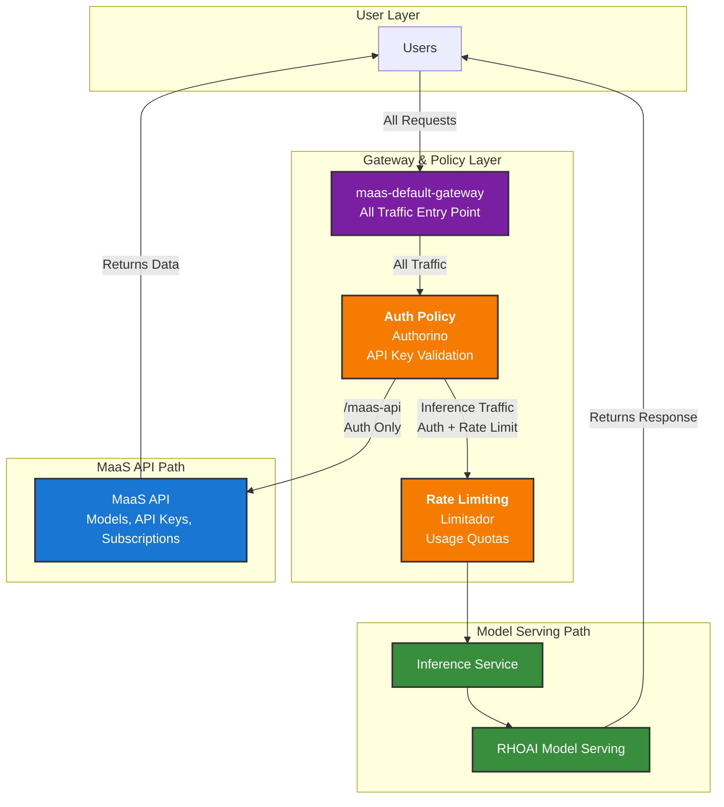
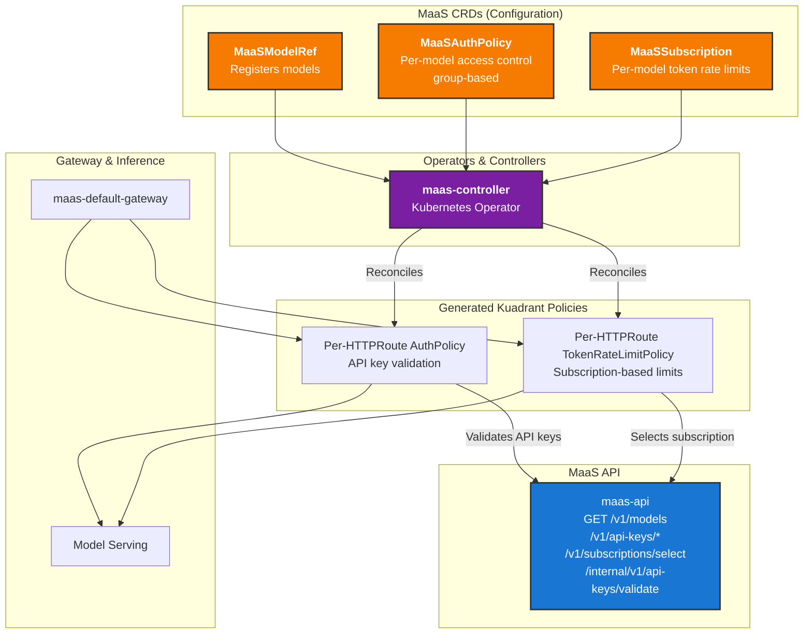
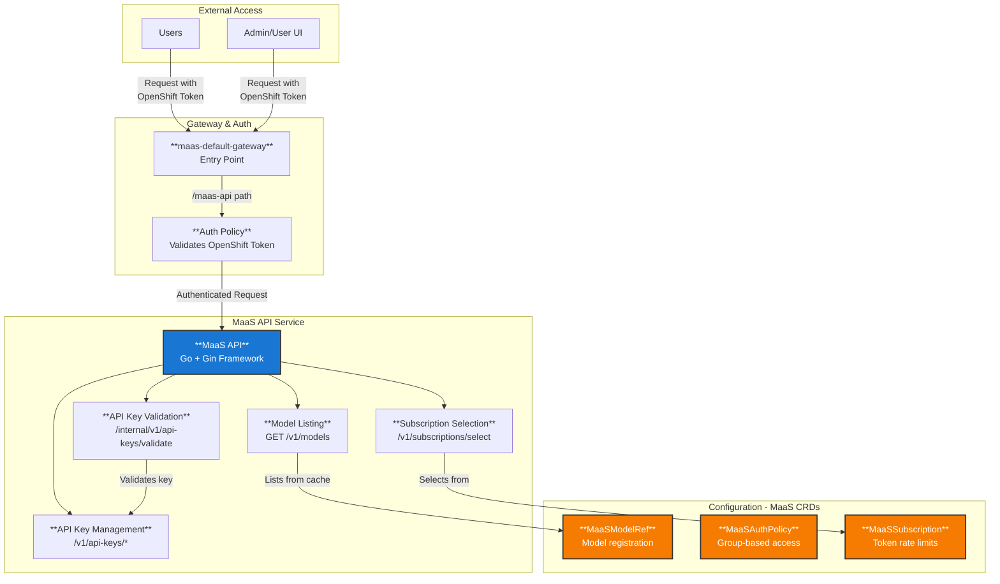
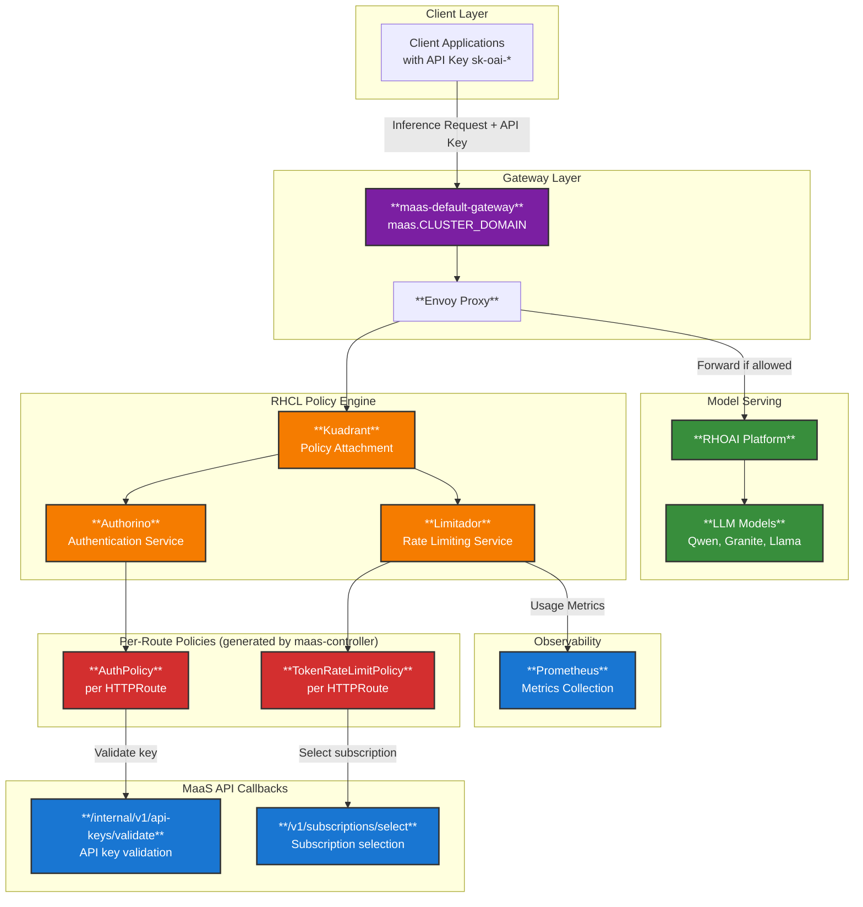
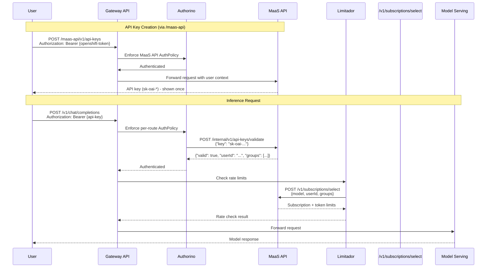
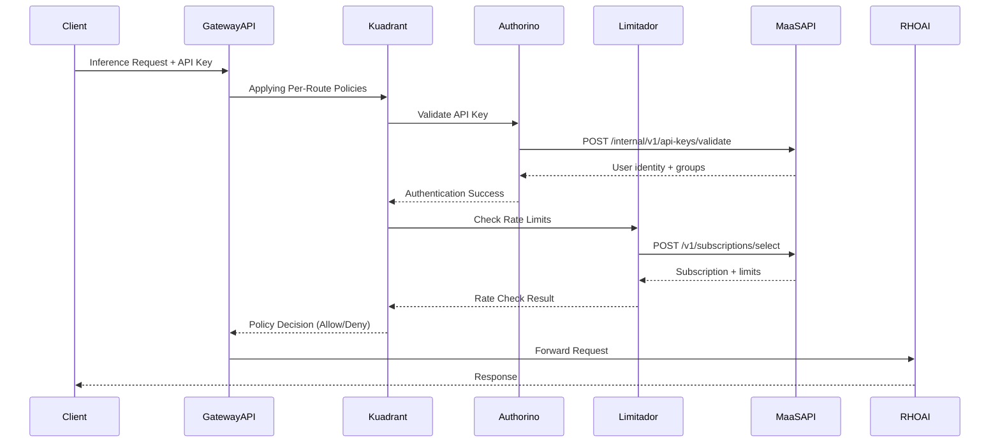

# MaaS Platform Architecture

## Overview

The MaaS Platform is designed as a cloud-native, Kubernetes-based solution that provides policy-based access control, rate limiting, and subscription-based model access for AI model serving. The architecture follows microservices principles and leverages OpenShift/Kubernetes native components for scalability and reliability.

## Architecture

### 🏗️ High-Level Architecture

The MaaS Platform is an end-to-end solution that leverages Kuadrant (Red Hat Connectivity Link) and Open Data Hub (Red Hat OpenShift AI)'s Model Serving capabilities to provide a fully managed, scalable, and secure self-service platform for AI model serving.

**All requests flow through the maas-default-gateway and RHCL components**, which then route requests based on the path:

- `/maas-api/*` and `/v1/models` requests → MaaS API (API key management, model listing, subscription selection)
- Inference requests (`/{namespace}/{model}/v1/chat/completions`) → Model Serving (validates API key via RHCL callback to maas-api)

### Overall Architecture with maas-controller and CRD Flow

The maas-controller (Kubernetes operator) reconciles MaaS CRDs and generates per-route Kuadrant policies. Configuration is fully declarative and CRD-based:

### Architecture Details

The MaaS Platform architecture is designed to be modular and scalable. It is composed of the following components:

- **maas-default-gateway**: The single entry point for all traffic (both API requests and inference requests).
- **RHCL (Red Hat Connectivity Link)**: The policy engine that handles authentication and authorization for all requests. Routes requests to appropriate backend based on path:
  - `/maas-api/*` → MaaS API (validates OpenShift tokens for API key management)
  - Inference paths (`/v1/models`, `/v1/chat/completions`) → Model Serving (validates API keys via maas-api callback)
- **maas-controller**: Kubernetes operator that reconciles MaaSModelRef, MaaSAuthPolicy, and MaaSSubscription CRDs. Generates per-HTTPRoute AuthPolicy and TokenRateLimitPolicy resources.
- **MaaS API**: The central component for model listing, API key management, and subscription selection. Serves GET /v1/models, /v1/api-keys/*, /v1/subscriptions/select, and /internal/v1/api-keys/validate (Authorino callback).
- **Open Data Hub (Red Hat OpenShift AI)**: The model serving platform that handles inference requests.

### Detailed Component Architecture

#### MaaS API Component Details

The MaaS API provides a self-service platform for users to manage API keys, list models, and select subscriptions. All requests to the MaaS API pass through the `maas-default-gateway` where authentication is performed against the user's OpenShift token. API keys (sk-oai-* format) are used for inference requests and validated via the Authorino callback to `/internal/v1/api-keys/validate`.

**Key Features:**

- **Subscription-Based Access Control via MaaSAuthPolicy and MaaSSubscription CRDs**: Access and rate limits are configured declaratively via MaaSAuthPolicy (group-based access) and MaaSSubscription (per-model token limits). The maas-controller generates per-HTTPRoute AuthPolicy and TokenRateLimitPolicy resources.
- **CRD-Based Configuration**: MaaSModelRef, MaaSAuthPolicy, and MaaSSubscription CRDs provide schema-validated, GitOps-friendly configuration. No ConfigMaps or gateway-level tier mapping.
- **API Keys (sk-oai-*)**: Users create API keys via POST /v1/api-keys. Keys are validated by Authorino via callback to maas-api /internal/v1/api-keys/validate.
- **Model Listing**: GET /v1/models returns models from MaaSModelRef CRs (cached via informer).
- **Usage Metrics**: Limitador sends usage data to Prometheus for observability dashboards.

#### Inference Service Component Details

Once a user has obtained their API key through the MaaS API, they can use it to make inference requests to the Gateway API. RHCL's per-route policies validate the API key (via maas-api callback) and enforce subscription-based rate limits:

**Policy Engine Flow:**

1. **User Request**: A user makes an inference request to the Gateway API with an API key (sk-oai-*).
2. **API Key Authentication**: Authorino validates the API key via per-route AuthPolicy, which calls maas-api `/internal/v1/api-keys/validate`. The response includes user identity and groups.
3. **Rate Limiting**: Limitador enforces usage quotas per model and subscription using per-route TokenRateLimitPolicy. Subscription selection is done via maas-api `/v1/subscriptions/select` based on user groups.
4. **Request Forwarding**: Only requests with valid API keys and within rate limits are forwarded to RHOAI.
5. **Metrics Collection**: Limitador sends usage data to Prometheus for observability dashboards.

## 🔄 Component Flows

### 1. API Key Creation and Inference Flow

Users create API keys via the MaaS API, then use them for inference requests:

### 2. Model Inference Flow

The inference flow routes validated requests to RHOAI models. The Gateway API and RHCL components validate API keys and enforce per-route policies:

