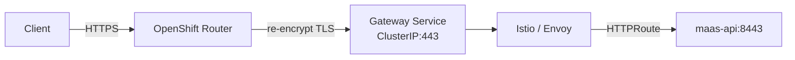

# Gateway Patterns

This page provides curated Gateway API deployment patterns for MaaS on OpenShift.
Each pattern includes copy-pasteable YAML manifests, prerequisites, verification steps,
and troubleshooting guidance for common failure modes.

**Related topics:**

- Default MaaS Gateway setup: [Install MaaS Components — Create Gateway](../install/maas-setup.md#create-gateway)
- Attaching models to the Gateway: [Model Gateway and Serving](model-gateway-and-serving.md)
- End-to-end TLS: [TLS Configuration](tls-configuration.md)

## Pattern index

| Pattern | Environment | One-line purpose |
|---------|-------------|-----------------|
| [ClusterIP + Route re-encrypt](#clusterip-gateway-with-openshift-route-re-encrypt) | Dev / Lab / Production | ClusterIP Gateway Service fronted by an OpenShift Route with re-encrypt TLS; no external LoadBalancer required |

## Environment matrix

Use this table to decide which pattern fits your deployment:

| Environment | Recommended pattern | Who terminates client TLS? | Internal TLS | Namespace expectations |
|-------------|--------------------|-----------------------------|-------------|----------------------|
| **Development / Lab** | ClusterIP + Route re-encrypt | OpenShift Router (wildcard or self-signed cert) | service-ca auto-provisioned cert (re-encrypt to Gateway) | `openshift-ingress` for Gateway and Route; application namespace for HTTPRoute |
| **Production** | ClusterIP + Route re-encrypt | OpenShift Router (CA-signed certificate) | service-ca auto-provisioned cert (re-encrypt to Gateway) | `openshift-ingress` for Gateway and Route; application namespace for HTTPRoute |

**TLS responsibilities summary:**

- **Client-facing TLS**: Managed by the OpenShift Router. In production, replace the default wildcard certificate with a CA-signed certificate on the IngressController.
- **Gateway Service TLS**: Auto-provisioned by the OpenShift `service-ca-operator` via the `service.beta.openshift.io/serving-cert-secret-name` annotation. The Secret name in the ConfigMap annotation **must** match the Gateway listener `certificateRefs`.
- **Authorino and maas-api TLS**: Configured separately. See [TLS Configuration](tls-configuration.md).

## ClusterIP Gateway with OpenShift Route (re-encrypt)

This pattern deploys a Gateway API Gateway as a **ClusterIP** service (no external
LoadBalancer) and uses an **OpenShift Route** with **re-encrypt** TLS termination
to expose the Gateway externally.

### Traffic flow



1. The client connects over HTTPS to the OpenShift Router.
2. The Router terminates the client TLS session and opens a new TLS connection
   (re-encrypt) to the Gateway Service using the service-ca certificate.
3. The Gateway (Istio/Envoy) terminates that connection and routes traffic via
   HTTPRoute to backend services such as `maas-api`.

### Why ClusterIP + Route?

- **No LoadBalancer required.** Works on bare-metal, restricted cloud accounts,
  and environments where LoadBalancer provisioning is slow or unavailable.
- **OpenShift-native ingress.** Leverages the platform Router for TLS termination,
  hostname routing, and integration with existing wildcard certificates.
- **Re-encrypt for defense in depth.** Traffic is encrypted between the Router and
  the Gateway Service, not just at the edge.

### Prerequisites

- OpenShift cluster with Gateway API support (see [Prerequisites](../install/prerequisites.md))
- GatewayClass `openshift-default` accepted (see [Install Gateway API Controller](../install/platform-setup.md#install-gateway-api-controller))
- Kuadrant or RHCL operator installed (see [Install Gateway API Controller](../install/platform-setup.md#install-gateway-api-controller))
- Access to the `openshift-ingress` namespace

### Manifests

All manifests are in
[`docs/samples/gateway-patterns/clusterip-route-reencrypt/`](https://github.com/opendatahub-io/models-as-a-service/tree/main/docs/samples/gateway-patterns/clusterip-route-reencrypt).

#### 1. GatewayClass

```yaml
apiVersion: gateway.networking.k8s.io/v1
kind: GatewayClass
metadata:
  name: openshift-default
spec:
  controllerName: "openshift.io/gateway-controller/v1"
```

If `openshift-default` already exists on your cluster, skip this step.

#### 2. Gateway options ConfigMap

The ConfigMap configures the Gateway Service as **ClusterIP** and requests a
service-ca TLS certificate:

```yaml
apiVersion: v1
kind: ConfigMap
metadata:
  name: gw-options
  namespace: openshift-ingress
data:
  service: |
    metadata:
      annotations:
        service.beta.openshift.io/serving-cert-secret-name: "maas-gw-service-tls"
    spec:
      type: ClusterIP
```

| Field | Purpose |
|-------|---------|
| `serving-cert-secret-name` | The `service-ca-operator` provisions a TLS certificate into this Secret. Must match the Gateway `certificateRefs`. |
| `type: ClusterIP` | No external LoadBalancer; the OpenShift Route handles external ingress. |

#### 3. Gateway

```yaml
apiVersion: gateway.networking.k8s.io/v1
kind: Gateway
metadata:
  name: maas-default-gateway
  namespace: openshift-ingress
  labels:
    kuadrant.io/gateway: "true"
    app.kubernetes.io/name: maas-gateway
  annotations:
    opendatahub.io/managed: "false"
    security.opendatahub.io/authorino-tls-bootstrap: "true"
spec:
  gatewayClassName: openshift-default
  infrastructure:
    parametersRef:
      group: ""
      kind: ConfigMap
      name: gw-options
  listeners:
    - name: https
      port: 443
      protocol: HTTPS
      allowedRoutes:
        namespaces:
          from: All
      tls:
        certificateRefs:
          - group: ""
            kind: Secret
            name: maas-gw-service-tls
        mode: Terminate
```

| Label / Annotation | Purpose |
|--------------------|---------|
| `kuadrant.io/gateway: "true"` | Enables Kuadrant/RHCL policy attachment (AuthPolicy, RateLimitPolicy) |
| `opendatahub.io/managed: "false"` | Lets maas-controller manage AuthPolicies; prevents ODH Model Controller from overwriting them |
| `security.opendatahub.io/authorino-tls-bootstrap: "true"` | Creates the EnvoyFilter for Gateway → Authorino TLS communication |
| `infrastructure.parametersRef` | References the `gw-options` ConfigMap for ClusterIP and service-ca configuration |

#### 4. OpenShift Route

The Route exposes the Gateway Service externally with re-encrypt TLS:

```yaml
apiVersion: route.openshift.io/v1
kind: Route
metadata:
  name: maas-gateway-route
  namespace: openshift-ingress
  annotations:
    router.openshift.io/service-ca-certificate: "true"
spec:
  host: maas.<cluster-domain>   # Replace with your cluster domain
  to:
    kind: Service
    name: maas-default-gateway-openshift-default  # Verify with kubectl get svc -n openshift-ingress
    weight: 100
  port:
    targetPort: 443
  tls:
    termination: reencrypt
    insecureEdgeTerminationPolicy: Redirect
```

!!! warning "Service name"
    The Gateway controller generates a Service name from the Gateway name and
    GatewayClass name. Verify the actual name:

    ```bash
    kubectl get svc -n openshift-ingress \
      -l gateway.networking.k8s.io/gateway-name=maas-default-gateway
    ```

!!! warning "Hostname placeholder"
    Replace `maas.<cluster-domain>` with your actual hostname. Retrieve the
    cluster domain with:

    ```bash
    kubectl get ingresses.config.openshift.io cluster -o jsonpath='{.spec.domain}'
    ```

#### 5. HTTPRoute

Attach workloads to the Gateway. This example routes all traffic to `maas-api`:

```yaml
apiVersion: gateway.networking.k8s.io/v1
kind: HTTPRoute
metadata:
  name: maas-api
  namespace: <application-namespace>
spec:
  parentRefs:
    - name: maas-default-gateway
      namespace: openshift-ingress
  rules:
    - matches:
        - path:
            type: PathPrefix
            value: /
      backendRefs:
        - name: maas-api
          port: 8443
```

Replace `<application-namespace>` with your ODH/RHOAI application namespace
(`opendatahub` or `redhat-ods-applications`).

!!! note
    The HTTPRoute for maas-api is created automatically by maas-controller
    by default. You only need to create it manually if you are not using
    maas-controller.

### Apply

```bash
# Apply GatewayClass, ConfigMap, and Gateway
kustomize build docs/samples/gateway-patterns/clusterip-route-reencrypt | kubectl apply -f -

# Wait for the Gateway to be programmed
kubectl wait --for=condition=Programmed gateway/maas-default-gateway \
  -n openshift-ingress --timeout=60s

# Determine your cluster domain and the Gateway Service name
CLUSTER_DOMAIN=$(kubectl get ingresses.config.openshift.io cluster -o jsonpath='{.spec.domain}')
GW_SVC=$(kubectl get svc -n openshift-ingress \
  -l gateway.networking.k8s.io/gateway-name=maas-default-gateway \
  -o jsonpath='{.items[0].metadata.name}')

# Create the Route (update host and service name in openshift-route.yaml, or apply inline)
kubectl apply -f - <<EOF
apiVersion: route.openshift.io/v1
kind: Route
metadata:
  name: maas-gateway-route
  namespace: openshift-ingress
  annotations:
    router.openshift.io/service-ca-certificate: "true"
spec:
  host: maas.${CLUSTER_DOMAIN}
  to:
    kind: Service
    name: ${GW_SVC}
    weight: 100
  port:
    targetPort: 443
  tls:
    termination: reencrypt
    insecureEdgeTerminationPolicy: Redirect
EOF
```

### Verify

```bash
# Gateway should show Programmed=True
kubectl get gateway maas-default-gateway -n openshift-ingress

# Service should be ClusterIP
kubectl get svc -n openshift-ingress \
  -l gateway.networking.k8s.io/gateway-name=maas-default-gateway

# Route should be Admitted
kubectl get route maas-gateway-route -n openshift-ingress

# TLS certificate Secret should exist
kubectl get secret maas-gw-service-tls -n openshift-ingress
```

### Troubleshooting

| Symptom | Likely cause | Fix |
|---------|-------------|-----|
| Gateway stays `NotProgrammed` | GatewayClass not accepted, or `gw-options` ConfigMap missing | Check `kubectl get gatewayclass`; verify ConfigMap in `openshift-ingress` |
| Route shows `HostAlreadyClaimed` | Another Route uses the same hostname | Change `spec.host` to a unique FQDN |
| `503` from the Route | Gateway Service not ready or certificate not yet provisioned | Wait for `service-ca-operator` to provision `maas-gw-service-tls`; check `kubectl get secret -n openshift-ingress` |
| TLS handshake failure (re-encrypt) | Service CA cert not trusted by the Router | Ensure `router.openshift.io/service-ca-certificate: "true"` annotation on the Route |
| `certificateRefs` name mismatch | Secret name in Gateway does not match ConfigMap annotation | Verify both reference the same Secret name (`maas-gw-service-tls`) |

## MaaS integration

After deploying a gateway pattern, complete the MaaS-specific steps:

1. **Attach models to the Gateway.** Set `spec.router.gateway.refs` on your
   LLMInferenceService to point at the deployed Gateway.
   See [Model Gateway and Serving](model-gateway-and-serving.md).

2. **Configure end-to-end TLS.** Set up Authorino listener TLS and maas-api
   backend TLS. See [TLS Configuration](tls-configuration.md).

3. **Complete MaaS installation.** If you have not already, follow the full
   installation flow: database, DataScienceCluster, and validation.
   See [Install MaaS Components](../install/maas-setup.md).

4. **Deploy sample models.** Use the bundled model samples to verify the
   gateway is working end-to-end.
   See [Model Setup](../install/model-setup.md).
