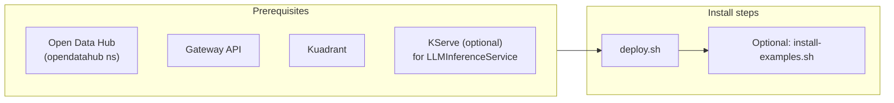

# MaaS Controller Overview

This document provides operational guidance for deploying and managing the MaaS Controller. For technical deep-dives into controller internals, see the [Architecture & Internals](../architecture-internals/controller-architecture.md) section.

---

## What Is the MaaS Controller?

The **MaaS Controller** is a Kubernetes controller that manages the Models-as-a-Service platform. It has two main responsibilities:

1. **Platform management** — deploys and manages the MaaS API, gateway policies, and telemetry via a `Tenant` custom resource
2. **Access control** — lets platform operators define which models are exposed, who can access them, and what rate limits apply via `MaaSModelRef`, `MaaSAuthPolicy`, and `MaaSSubscription` custom resources

The controller translates your high-level MaaS configuration into Gateway API and Kuadrant resources (HTTPRoutes, AuthPolicies, TokenRateLimitPolicies) that enforce routing, authentication, and rate limiting at the gateway.

!!! info "Technical Deep-Dives"
    For detailed information about controller architecture, reconciliation flow, and authentication internals, see:
    
    - [Controller Architecture](../architecture-internals/controller-architecture.md)
    - [Reconciliation Flow](../architecture-internals/reconciliation-flow.md)
    - [Authentication Internals](../architecture-internals/authentication-internals.md)

---

## Deployment and Prerequisites



### Namespaces

- **Controller deployment**: `opendatahub` namespace (default, configurable)
- **Tenant CR and subscriptions**: `models-as-a-service` namespace (default, configurable)
- **MaaSModelRef**: Same namespace as the model it references (e.g., `llm`)
- **Generated policies**: Same namespace as the model's HTTPRoute

### Self-Bootstrap

On startup, the controller automatically creates a `default-tenant` CR in the `models-as-a-service` namespace if one does not exist. The Tenant reconciler then deploys the MaaS API and gateway policies.

### Installation

<!-- markdownlint-disable MD046 -->
```bash
# Deploy complete MaaS stack (from repository root)
./scripts/deploy.sh --operator-type odh     # Deploy with ODH operator
./scripts/deploy.sh --operator-type rhoai   # Deploy with RHOAI operator
./scripts/deploy.sh --deployment-mode kustomize  # Deploy via Kustomize

# Validate deployment
./scripts/validate-deployment.sh

# Optional: Install example MaaS CRs
./scripts/install-examples.sh
```
<!-- markdownlint-enable MD046 -->

See the [Installation Guide](../install/maas-setup.md) and [Validation](../install/validation.md) for detailed deployment instructions.

---

## Authentication (Current Behavior)

### For Model Discovery (GET /v1/models)

The MaaS API forwards your **Authorization** header as-is to each model endpoint to validate access. You can use:

- **OpenShift token** — obtained via `oc whoami -t`
- **API key** — created via `POST /v1/api-keys`

With a user token, you may send `X-MaaS-Subscription` to filter models by subscription when you have access to multiple subscriptions.

### For Model Inference

Use **API keys only** for inference requests (e.g., `/llm/<model>/v1/chat/completions`). Each API key is bound to one MaaSSubscription at creation time.

**Creating an API key:**

<!-- markdownlint-disable MD046 -->
```bash
# Get your OpenShift token
TOKEN=$(oc whoami -t)
HOST="maas.$(kubectl get ingresses.config.openshift.io cluster -o jsonpath='{.spec.domain}')"

# Create API key
curl -H "Authorization: Bearer $TOKEN" \
  -H "Content-Type: application/json" \
  -X POST \
  -d '{"name":"my-key","description":"test key","expiresIn":"90d"}' \
  "${HOST}/maas-api/v1/api-keys"
```
<!-- markdownlint-enable MD046 -->

The response includes the API key (shown only once). Save it securely.

### Authentication Flow

1. **Kuadrant AuthPolicy** validates tokens via:
   - **OpenShift tokens** — Kubernetes TokenReview API
   - **API keys** — MaaS API validation endpoint (`/api/v1/api-keys/validate`)

2. **AuthPolicy** derives user identity (username, groups) and checks authorization (allowed groups/users per MaaSAuthPolicy)

3. **TokenRateLimitPolicy** uses the identity to enforce per-subscription rate limits (defined in MaaSSubscription)

For technical details on identity headers and the "string trick" for passing groups between policies, see [Authentication Internals](../architecture-internals/authentication-internals.md).

---

## Configuration

### Quota and Access

Configure model access and rate limits using MaaS custom resources:

- **MaaSModelRef** — declares which models are available
- **MaaSAuthPolicy** — defines who can access which models (by groups/users)
- **MaaSSubscription** — sets per-user/per-group token rate limits per model

See [Quota and Access Configuration](./quota-and-access-configuration.md) for detailed configuration examples.

### CRD Annotations

The controller supports annotations for opt-out management and other behaviors. See [CRD Annotations](./crd-annotations.md) for the full reference.

### RBAC and Permissions

See [Namespace User Permissions (RBAC)](./namespace-rbac.md) for guidance on setting up user permissions to create and manage MaaS resources.

---

## Monitoring and Troubleshooting

### Check Controller Logs

<!-- markdownlint-disable MD046 -->
```bash
kubectl logs deployment/maas-controller -n opendatahub --tail=50
```
<!-- markdownlint-enable MD046 -->

### Check MaaS Resources

<!-- markdownlint-disable MD046 -->
```bash
# Check MaaS CRs
kubectl get maasmodelref -n llm
kubectl get maasauthpolicy,maassubscription -n models-as-a-service

# Check generated Kuadrant policies
kubectl get authpolicy,tokenratelimitpolicy -n llm
```
<!-- markdownlint-enable MD046 -->

### Understanding Status Phases

MaaSSubscription, MaaSAuthPolicy, and MaaSModelRef use these phases:

| Phase | Meaning |
| ----- | ------- |
| **Ready/Active** | All model references valid, all operands healthy |
| **Pending** | Resource created but waiting for dependencies (e.g., HTTPRoute doesn't exist yet) |
| **Degraded** | Partial functionality — some models valid, others missing/invalid |
| **Failed** | No functionality — all model references invalid or missing |

Check per-item status to identify specific issues:

<!-- markdownlint-disable MD046 -->
```bash
# Find MaaSSubscriptions with issues
kubectl get maassubscription -n models-as-a-service \
  -o jsonpath='{range .items[?(@.status.phase!="Active")]}{.metadata.name}{"\t"}{.status.phase}{"\n"}{end}'

# Check which model refs are failing
kubectl get maassubscription my-subscription -n models-as-a-service \
  -o jsonpath='{.status.modelRefStatuses}' | jq .
```
<!-- markdownlint-enable MD046 -->

See [Troubleshooting](../install/troubleshooting.md) for common issues and solutions.

---

## Advanced Topics

### Observability

Configure metrics, telemetry, and monitoring for the MaaS platform. See [Observability](../advanced-administration/observability.md).

### Limitador Persistence

Enable persistent rate limit counters across Limitador restarts. See [Limitador Persistence](../advanced-administration/limitador-persistence.md).

### Authorino Caching

Configure caching for external authorization calls. See [Authorino Caching](./authorino-caching.md).

---

## Summary

| Topic | Summary |
|-------|---------|
| **What** | MaaS Controller manages platform workloads and translates MaaS CRs into Gateway API/Kuadrant resources |
| **Where** | Controller in `opendatahub`; Tenant/subscriptions in `models-as-a-service`; MaaSModelRef in model's namespace |
| **How** | Four reconcilers: Tenant (platform), MaaSModelRef (routes), MaaSAuthPolicy (auth), MaaSSubscription (rate limits) |
| **Deploy** | Run `./scripts/deploy.sh`; controller auto-creates default-tenant |
| **Configure** | Use MaaSModelRef, MaaSAuthPolicy, MaaSSubscription CRs |

For technical deep-dives into reconciliation loops and authentication internals, see the [Architecture & Internals](../architecture-internals/controller-architecture.md) section.
