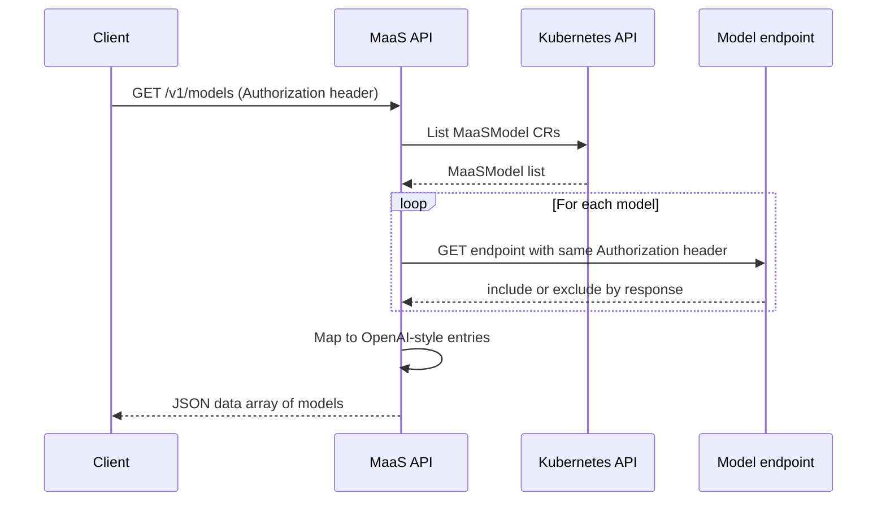

# Model listing flow

This document describes how the **GET /v1/models** endpoint discovers and returns the list of available models.

The list is **based on MaaSModel** custom resources: the API returns models that are registered as MaaSModels in its configured namespace.

## Overview

When a client calls **GET /v1/models** with an **Authorization** header, the MaaS API returns an OpenAI-compatible list of models.

Each entry includes an `id`, **`url`** (the model’s endpoint), a `ready` flag, and related metadata. The list is built from **MaaSModel** CRs. The API then validates access by probing each model’s endpoint with the same Authorization header; only models the client can access are included in the response.

!!! note "Model endpoints and routing"
    The returned value includes a **URL** per model; clients use that URL to call the model (e.g. for chat or completions).

    Currently each model is served on a **different endpoint**. **Body Based Routing** is being evaluated to provide a more unified OpenAI API feel (single endpoint with model selection in the request body).

## MaaSModel flow

When the [MaaS controller](https://github.com/opendatahub-io/models-as-a-service/tree/main/maas-controller) is installed and the API is configured with a MaaSModel lister and namespace, the flow is:

1. The MaaS API lists all **MaaSModel** custom resources in its configured namespace (e.g. `opendatahub`). It reads them from an **in-memory cache** in the maas-api component (maintained by a Kubernetes informer), so it does not call the Kubernetes API on every request.

2. For each MaaSModel, it reads **id** (`metadata.name`), **url** (`status.endpoint`), **ready** (`status.phase == "Ready"`), and related metadata. The controller has populated `status.endpoint` and `status.phase` from the underlying LLMInferenceService (for llmisvc) or HTTPRoute/Gateway.

3. **Access validation**: The API probes each model’s `/v1/models` endpoint with the **exact Authorization header** the client sent (passed through as-is). Only models that return **2xx**, **3xx** or **405** are included in the response. This ensures the list only shows models the client is authorized to use.

4. The filtered list is returned to the client.



### Benefits

- **List is based on MaaSModels**: Only models registered as a MaaSModel appear. The controller reconciles each MaaSModel and sets its endpoint and phase; access and quotas are controlled by MaaSAuthPolicy and MaaSSubscription.

- **Access-filtered**: The API probes each model with the client’s Authorization header (passed through as-is), so the returned list only includes models the client can actually use.

- **Consistent with gateway**: The same model names and routes are used for inference; the list matches what the gateway will accept for that client.

If the API is not configured with a MaaSModel lister and namespace, or if listing fails (e.g. CRD not installed, no RBAC, or server error), the API returns an empty list or an error.

For how to add new MaaSModel **kinds** (backend types) in the future, see [MaaSModel kinds (future)](maas-model-kinds.md).

## Registering models

To have models appear via the **MaaSModel** flow:

1. Install the **MaaS controller** (CRDs, controller deployment, and optionally the default-deny policy). See [maas-controller README](https://github.com/opendatahub-io/models-as-a-service/tree/main/maas-controller).

2. Ensure the underlying **LLMInferenceService** exists and (if applicable) has an HTTPRoute created by KServe.

3. Create a **MaaSModel** for each model you want to expose, referencing the LLMIS:

   ```yaml
   apiVersion: maas.opendatahub.io/v1alpha1
   kind: MaaSModel
   metadata:
     name: my-model-name   # This becomes the model "id" in GET /v1/models
     namespace: opendatahub
   spec:
     modelRef:
       kind: llmisvc
       name: my-llm-isvc-name
       namespace: llm
   ```

4. The controller reconciles the MaaSModel and sets `status.endpoint` and `status.phase`. The MaaS API (in the same namespace) will then include this model in GET /v1/models when it lists MaaSModel CRs.

You can use the [maas-controller examples](https://github.com/opendatahub-io/models-as-a-service/tree/main/maas-controller/examples) as a template; the install script deploys both the simulator LLMInferenceServices and the example MaaSModel (and policy/subscription) CRs.

---

## Related documentation

- [MaaS Controller README](../../../maas-controller/README.md) — install and MaaSModel/MaaSAuthPolicy/MaaSSubscription
- [Model setup](./model-setup.md) — configuring LLMInferenceServices (gateway reference, tier annotation) as backends for MaaSModel
- [Architecture](../architecture.md) — overall MaaS architecture
