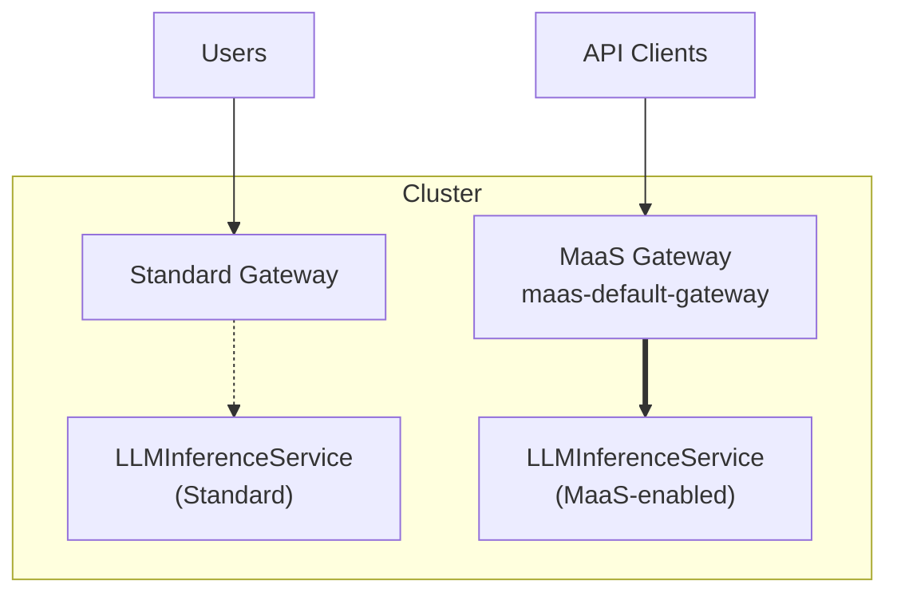

# Model Setup Guide

This guide explains how to configure models for the MaaS platform. MaaS supports two model kinds:

- **On-cluster models** (`LLMInferenceService`) - vLLM/KServe models running in your cluster
- **External models** (`ExternalModel`) - Hosted providers like OpenAI, Anthropic, Azure OpenAI **(Tech Preview)**

!!! warning "Legacy tier annotations removed"
    The `alpha.maas.opendatahub.io/tiers` annotation for tier-based access control is **deprecated** and no longer documented here. Model access and rate limits are now managed exclusively through **MaaSAuthPolicy** and **MaaSSubscription** CRDs. If you are still using tier annotations, see the [Migration Guide: Tier-Based to Subscription Model](../migration/tier-to-subscription.md) for instructions on migrating to the subscription model.

---

## On-Cluster Models

On-cluster models use **LLMInferenceService** (vLLM via KServe) and route through the **MaaS gateway** for authentication and rate limiting.

### Gateway Architecture

MaaS uses a **segregated gateway** approach. Models route through either:

- **Standard gateway** (ODH/KServe default) - No MaaS policies
- **MaaS gateway** (`maas-default-gateway`) - Full MaaS policy enforcement

| | Standard gateway | MaaS gateway |
|--|------------------|--------------|
| **Authentication** | ODH/KServe auth | Token-based (API keys, OpenShift tokens) |
| **Rate limits** | None | Subscription-based (Limitador) |
| **Token tracking** | No | Yes |
| **Access control** | Platform-level | Per-model (MaaSAuthPolicy, MaaSSubscription) |

Only models routing through `maas-default-gateway` appear in the MaaS catalog and have policies applied.



!!! note
    The `maas-default-gateway` is created during MaaS installation.

### Configuration Requirements

To enable MaaS policies for an LLMInferenceService:

1. **Set gateway reference** - Add `spec.router.gateway.refs` pointing to `maas-default-gateway`
2. **Create MaaSModelRef** - Register the model in the MaaS catalog
3. **Add display metadata** (optional) - Annotations for `/maas-api/v1/models` API response

Without the gateway reference, the model uses the standard gateway and MaaS policies do not apply.

---

## External Models

External models route traffic to providers outside the cluster (OpenAI, Anthropic, Azure OpenAI, etc.). MaaS handles authentication, rate limiting, and request proxying.

### How It Works

1. **Define ExternalModel CR** - Specify provider, endpoint, credentials, and target model
2. **Register with MaaSModelRef** - Reference the ExternalModel by name
3. **Controller creates routing** - Service, ServiceEntry, DestinationRule, HTTPRoute (owned by ExternalModel CR)
4. **Apply policies** - MaaSAuthPolicy and MaaSSubscription work the same as on-cluster models
5. **Traffic flows** - Requests route through the gateway → Inference Payload Processor (IPP) injects provider API key → external provider

The **Inference Payload Processor** (ext-proc) handles provider-specific authentication and request/response translation.

### Setup

For complete setup including IPP deployment, provider credentials, and examples, see [External Model Setup (Tech Preview)](../install/external-model-setup.md).

---

## Examples

### Example 1: On-Cluster Model

**LLMInferenceService with MaaS gateway:**

```yaml
apiVersion: serving.kserve.io/v1alpha1
kind: LLMInferenceService
metadata:
  name: qwen3-model
  namespace: llm
spec:
  model:
    uri: hf://Qwen/Qwen3-0.6B
    name: Qwen/Qwen3-0.6B
  replicas: 1
  router:
    route: { }
    gateway:
      refs:
        - name: maas-default-gateway
          namespace: openshift-ingress
  template:
    containers:
      - name: main
        image: "vllm/vllm-openai:latest"
        resources:
          limits:
            nvidia.com/gpu: "1"
            memory: 12Gi
          requests:
            nvidia.com/gpu: "1"
            memory: 8Gi
```

**MaaSModelRef with display metadata:**

```yaml
apiVersion: maas.opendatahub.io/v1alpha1
kind: MaaSModelRef
metadata:
  name: qwen3-model
  namespace: llm
  annotations:
    openshift.io/display-name: "Qwen 3 0.6B"
    openshift.io/description: "Qwen 3 model for chat workloads"
    opendatahub.io/genai-use-case: "chat"
    opendatahub.io/context-window: "8192"
spec:
  modelRef:
    kind: LLMInferenceService
    name: qwen3-model
```

### Example 2: External Model

See [External Model Setup (Tech Preview)](../install/external-model-setup.md) for complete examples including:

- ExternalModel CR configuration
- Provider-specific settings (OpenAI, Anthropic, Azure, Vertex AI, Bedrock)
- Credential management
- MaaSModelRef registration

---

## Verification

After configuring your model, verify it's accessible.

!!! note "Access Control Required"
    Both model kinds require **MaaSModelRef** for registration, **MaaSAuthPolicy** for access control, and **MaaSSubscription** for rate limits. See [Quota and Access Configuration](quota-and-access-configuration.md) for complete policy setup.

!!! note "API Key Required"
    These verification steps require an API key. See [API Key Management](../user-guide/api-key-management.md#creating-api-keys) for how to create one.

**1. Check the model appears in the catalog:**

```bash
# Set HOST to your MaaS gateway URL (e.g., https://maas.your-cluster-domain.com)
curl -sSk ${HOST}/maas-api/v1/models \
    -H "Authorization: Bearer $API_KEY" | jq .
```

**2. Verify the model status:**

```bash
# Check the backend resource
kubectl get llminferenceservice <llmisvc-name> -n <namespace>  # On-cluster
kubectl get externalmodel <external-name> -n <namespace>       # External

# Check MaaSModelRef (both kinds)
kubectl get maasmodelref <modelref-name> -n <namespace>
```

**3. Test inference request:**

```bash
# Get MODEL_URL from step 1 above (data[].url field)
curl -sSk -H "Authorization: Bearer $API_KEY" \
  -H "Content-Type: application/json" \
  -d '{"model": "my-model", "messages": [{"role": "user", "content": "Hello"}]}' \
  "${MODEL_URL}/v1/chat/completions"
```

---

## Troubleshooting

### Model Not Appearing in /maas-api/v1/models

- Verify gateway reference: `name: maas-default-gateway`, `namespace: openshift-ingress`
- Check model status shows ready
- Ensure MaaSModelRef is created in the same namespace as the model

### 401 Unauthorized

- Verify API key or token is valid
- Check MaaSAuthPolicy grants your group access to the model
- Ensure MaaSSubscription exists for your identity

### 403 Forbidden

- Verify MaaSAuthPolicy includes the model in `modelRefs`
- Check MaaSSubscription ownership matches your identity
- Verify maas-controller has reconciled the policies

---

## References

- [Quota and Access Configuration](quota-and-access-configuration.md) - Configure MaaSAuthPolicy and MaaSSubscription
- [Model Listing Flow](model-listing-flow.md) - How models appear in the catalog
- [External Model Setup](../install/external-model-setup.md) - Complete guide for external models
- [MaaSModelRef CRD](../reference/crds/maas-model-ref.md) - CRD reference and field details
