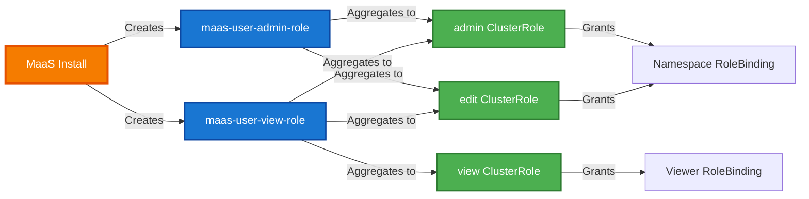

# Namespace User Permissions (RBAC)

This guide explains the built-in RBAC (Role-Based Access Control) permissions that namespace users have for working with MaaS custom resources.

## Overview

MaaS provides **aggregated ClusterRoles** that automatically extend the standard Kubernetes/OpenShift roles (`admin`, `edit`, `view`) with permissions for MaaS custom resources. This means:

✅ **Namespace admins and contributors can create and manage models in their projects without cluster admin intervention**  
✅ **No custom ClusterRoleBindings or elevated permissions required**  
✅ **Follows Kubernetes best practices for CRD RBAC aggregation**

## Permission Matrix

| User Role | Resources | Permissions | Use Case |
|-----------|-----------|-------------|----------|
| **Admin** | `MaaSModelRef`, `ExternalModel` | `create`, `delete`, `get`, `list`, `patch`, `update`, `watch` | Full model lifecycle management in namespace |
| **Edit / Contributor** | `MaaSModelRef`, `ExternalModel` | `create`, `delete`, `get`, `list`, `patch`, `update`, `watch` | Full model lifecycle management in namespace |
| **View** | `MaaSModelRef`, `ExternalModel` | `get`, `list`, `watch` | Read-only access to models in namespace |

### Resources Included

**✅ Namespace-scoped user workloads:**
- **MaaSModelRef** - References to model backends (LLMInferenceService, ExternalModel)
- **ExternalModel** - External LLM provider definitions (OpenAI, Anthropic, etc.)

**❌ Platform-managed resources (excluded):**
- **MaaSSubscription** - Managed in the `models-as-a-service` namespace by platform admins
- **MaaSAuthPolicy** - Managed in the `models-as-a-service` namespace by platform admins

!!! info "Why are subscriptions excluded?"
    `MaaSSubscription` and `MaaSAuthPolicy` are platform-level resources that define access control and rate limits across the entire cluster. These are managed by platform administrators in a dedicated namespace and are not required in end-user project namespaces.

## How RBAC Aggregation Works

Kubernetes/OpenShift provides built-in roles:
- `admin` - Full namespace control
- `edit` - Create and modify resources
- `view` - Read-only access

MaaS extends these roles using **ClusterRole aggregation labels** (`rbac.authorization.k8s.io/aggregate-to-*`). When MaaS is installed, the platform automatically merges MaaS resource permissions into these built-in roles.

**Result**: Users with existing namespace roles immediately gain appropriate permissions for MaaS resources.



## Usage Examples

### Admin / Edit Users: Creating a MaaSModelRef

If you have the `admin` or `edit` role in your namespace, you can create a `MaaSModelRef` to reference a deployed model:

```bash
# Assume you have admin/edit in namespace 'my-models'
kubectl create -f - <<EOF
apiVersion: maas.opendatahub.io/v1alpha1
kind: MaaSModelRef
metadata:
  name: my-llm-model
  namespace: my-models
  annotations:
    openshift.io/display-name: "My LLM Model"
    openshift.io/description: "A fine-tuned model for my team"
spec:
  backendName: llama-3-8b-instruct
  backendKind: LLMInferenceService
  backendNamespace: my-models
EOF
```

**What happens:**
1. The API server checks your permissions
2. Your namespace `admin` or `edit` role includes MaaS permissions via aggregation
3. The `MaaSModelRef` is created successfully
4. The MaaS controller reconciles it and sets the status

### Admin / Edit Users: Creating an ExternalModel

Create an external model reference (e.g., OpenAI, Anthropic):

```bash
kubectl create -f - <<EOF
apiVersion: maas.opendatahub.io/v1alpha1
kind: ExternalModel
metadata:
  name: openai-gpt-4
  namespace: my-models
  annotations:
    openshift.io/display-name: "OpenAI GPT-4"
spec:
  provider: openai
  endpoint: https://api.openai.com/v1
  targetModel: gpt-4
  authSecretName: openai-credentials
EOF
```

### View Users: Read-Only Access

If you have the `view` role, you can list and inspect models but not create or modify them:

```bash
# List all MaaSModelRefs in the namespace
kubectl get maasmodelref -n my-models

# Get details of a specific model
kubectl describe maasmodelref my-llm-model -n my-models

# View the YAML
kubectl get maasmodelref my-llm-model -n my-models -o yaml
```

**Attempting to create or modify will fail:**

```bash
# This will fail with "Forbidden"
kubectl delete maasmodelref my-llm-model -n my-models
# Error from server (Forbidden): maasmodelrefs.maas.opendatahub.io "my-llm-model" 
# is forbidden: User "viewer" cannot delete resource "maasmodelrefs" 
# in API group "maas.opendatahub.io" in the namespace "my-models"
```

## Verification

### Check Your Permissions

To verify you have the necessary permissions:

```bash
# Check if you can create a MaaSModelRef
kubectl auth can-i create maasmodelref -n my-models
# Output: yes (if you have admin/edit) or no (if you only have view)

# Check if you can list MaaSModelRefs
kubectl auth can-i list maasmodelref -n my-models
# Output: yes (for admin/edit/view)

# Check if you can delete a MaaSModelRef
kubectl auth can-i delete maasmodelref -n my-models
# Output: yes (if you have admin/edit) or no (if you only have view)
```

### Verify Aggregation is Working

Platform administrators can verify the aggregation is correctly configured:

```bash
# Check that the built-in admin role now includes MaaS permissions
kubectl get clusterrole admin -o yaml | grep -A 10 "maas.opendatahub.io"

# Expected output should include rules for maasmodelrefs and externalmodels
```

## Troubleshooting

### "Forbidden" Error When Creating MaaSModelRef

**Problem:**
```
Error from server (Forbidden): maasmodelrefs.maas.opendatahub.io is forbidden: 
User "user@example.com" cannot create resource "maasmodelrefs" in API group 
"maas.opendatahub.io" in the namespace "my-models"
```

**Possible causes:**

1. **Missing namespace role** - You don't have `admin` or `edit` role in the namespace
   ```bash
   # Check your roles
   kubectl auth can-i create maasmodelref -n my-models
   
   # Ask your platform admin to grant you admin or edit role
   kubectl create rolebinding my-models-admin \
     --clusterrole=admin \
     --user=user@example.com \
     -n my-models
   ```

2. **MaaS not fully deployed** - The aggregated ClusterRoles haven't been created yet
   ```bash
   # Verify the aggregated ClusterRoles exist
   kubectl get clusterrole maas-user-admin-role maas-user-view-role
   
   # If they don't exist, check MaaS controller deployment
   kubectl get deployment maas-controller -n opendatahub
   ```

3. **Wrong namespace** - You have permissions in a different namespace
   ```bash
   # Check which namespaces you have access to
   kubectl get namespaces --as=user@example.com
   
   # Create the resource in the correct namespace
   ```

### Permissions Work for Some Resources but Not Others

**Problem:** You can create `MaaSModelRef` but not `MaaSSubscription`

**Solution:** This is **by design**. `MaaSSubscription` and `MaaSAuthPolicy` are platform-managed resources and are **intentionally excluded** from namespace user aggregation. These should only be created by platform administrators in the `models-as-a-service` namespace.

If you need to request access to specific models or change rate limits, contact your platform administrator.

### View Role Has More Permissions Than Expected

**Problem:** Users with `view` role can see MaaSModelRef resources

**Solution:** This is **correct behavior**. The `view` role includes read-only permissions (`get`, `list`, `watch`) for MaaS resources. This allows viewers to discover which models are deployed in a namespace without being able to modify them.

If you need to completely hide resources from certain users, use Kubernetes NetworkPolicies or namespace isolation.

## Best Practices

### For Namespace Users

1. **Use meaningful names** - Name your `MaaSModelRef` resources clearly (e.g., `team-a-llama-8b`, not `model-1`)
2. **Add annotations** - Include display names and descriptions for better discoverability
3. **Verify status** - After creating a MaaSModelRef, check its status to ensure reconciliation succeeded
   ```bash
   kubectl get maasmodelref my-model -n my-models -o jsonpath='{.status.phase}'
   # Expected: Ready
   ```
4. **Clean up unused models** - Delete `MaaSModelRef` resources when they're no longer needed

### For Platform Administrators

1. **Grant minimal permissions** - Only grant `admin` or `edit` to users who need to create models
2. **Use `view` for read-only access** - Most users only need to see what models are deployed
3. **Document subscription process** - Clearly document how users request access to models (via MaaSSubscription)
4. **Monitor RBAC changes** - Audit ClusterRole aggregation labels to ensure they're not modified

## Related Documentation

- [Model Setup Guide](model-setup.md) - How to configure models for MaaS
- [Quota and Access Configuration](quota-and-access-configuration.md) - Platform admin guide for MaaSSubscription and MaaSAuthPolicy
- [Self-Service Model Access](../user-guide/self-service-model-access.md) - End user guide for using models via API
- [Kubernetes RBAC Documentation](https://kubernetes.io/docs/reference/access-authn-authz/rbac/) - Official Kubernetes RBAC guide
