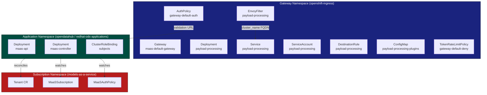

# Payload Processing Namespace Configuration

This reference documents every namespace-related field, default, and constraint for the Inference Payload Processor (IPP) component deployed from the [`ai-gateway-payload-processing`](https://github.com/opendatahub-io/ai-gateway-payload-processing) chart. Use this when wiring IPP into an ODH or RHOAI operator overlay or when customizing the gateway namespace.

!!! note "Scope"
    This document covers namespace configuration for the **payload-processing** (IPP / ext_proc) component and its interactions with the MaaS platform namespaces.
    For maas-api and maas-controller general setup, see [Controller Overview](maas-controller-overview.md).
    For namespace RBAC, see [Namespace User Permissions](namespace-rbac.md).

## Namespace architecture overview

MaaS resources span three namespaces. Cross-namespace references (DNS-based service discovery, kustomize replacements, and controller flags) tie them together.



## Namespace categories

| Category | Default | Purpose | Key constraint |
|----------|---------|---------|----------------|
| **Gateway** | `openshift-ingress` | Runs IPP, EnvoyFilter, DestinationRule, and gateway-scoped policies (AuthPolicy, TokenRateLimitPolicy) | IPP **must** run in the same namespace as the Gateway -- EnvoyFilter `targetRefs` only resolves services in its own namespace |
| **Application** | `opendatahub` (ODH) / `redhat-ods-applications` (RHOAI) | Runs maas-api, maas-controller, and supporting resources | AuthPolicy validation URL uses `maas-api.<app-ns>.svc.cluster.local`; ClusterRoleBinding `subjects[].namespace` must match |
| **Subscription** | `models-as-a-service` | Holds MaaSSubscription, MaaSAuthPolicy, and Tenant CRs | Controller flag `--maas-subscription-namespace` and maas-api env var `MAAS_SUBSCRIPTION_NAMESPACE` must point here |

## Base manifest defaults

All payload-processing base manifests in `deployment/base/payload-processing/` hardcode `openshift-ingress`. The ODH overlay and Tenant reconciler remap these at build time.

### Resource namespaces

| Manifest | Resource Kind | Resource Name | Hardcoded Namespace |
|----------|--------------|---------------|---------------------|
| `manager/deployment.yaml` | Deployment | `payload-processing` | `openshift-ingress` |
| `manager/service.yaml` | Service | `payload-processing` | `openshift-ingress` |
| `rbac/serviceaccount.yaml` | ServiceAccount | `payload-processing` | `openshift-ingress` |
| `rbac/clusterrolebinding.yaml` | ClusterRoleBinding | `payload-processing-reader` | `openshift-ingress` (in `subjects[0].namespace`) |
| `manager/envoy-filter.yaml` | EnvoyFilter | `payload-processing` | `openshift-ingress` |
| `manager/destination-rule.yaml` | DestinationRule | `payload-processing` | `openshift-ingress` |
| `manager/plugins-configmap.yaml` | ConfigMap | `payload-processing-plugins` | `openshift-ingress` |

### Embedded FQDN references

Two resources contain the gateway namespace inside field values (not just `metadata.namespace`). These must be updated when the gateway namespace changes.

| Resource | Field path | Default value | Namespace position |
|----------|-----------|---------------|-------------------|
| EnvoyFilter | `spec.configPatches[0].patch.value.typed_config.grpc_service.envoy_grpc.cluster_name` | `outbound\|9004\|\|payload-processing.openshift-ingress.svc.cluster.local` | After first `.` (index 1) |
| DestinationRule | `spec.host` | `payload-processing.openshift-ingress.svc.cluster.local` | After first `.` (index 1) |

## ODH vs RHOAI defaults

The gateway and subscription namespaces are the same on both platforms. Only the application namespace differs.

=== "ODH"

    | Parameter | Value |
    |-----------|-------|
    | Application namespace | `opendatahub` |
    | Gateway namespace | `openshift-ingress` |
    | Gateway name | `maas-default-gateway` |
    | Subscription namespace | `models-as-a-service` |

    The application namespace is set by `DSCInitialization.spec.applicationsNamespace` and defaults to `opendatahub`. It can be overridden when deploying via kustomize with `deploy.sh --namespace <custom>`.

=== "RHOAI"

    | Parameter | Value |
    |-----------|-------|
    | Application namespace | `redhat-ods-applications` |
    | Gateway namespace | `openshift-ingress` |
    | Gateway name | `maas-default-gateway` |
    | Subscription namespace | `models-as-a-service` |

    The application namespace is fixed by the RHOAI operator to `redhat-ods-applications` via `DSCInitialization`. It cannot be overridden.

    !!! warning
        The namespace is `redhat-ods-applications` (plural), not `redhat-ods-application`. The operator runtime namespace (`redhat-ods-operator`) is separate.

## Configuration methods

### Kustomize overlay (ODH operator path)

The ODH overlay (`deployment/overlays/odh/kustomization.yaml`) uses kustomize replacements sourced from a ConfigMap generated from `params.env`:

```
gateway-namespace=openshift-ingress
gateway-name=maas-default-gateway
app-namespace=opendatahub
```

!!! warning
    The `app-namespace` value in `params.env` **must** match the top-level `namespace:` directive in the overlay's `kustomization.yaml`. A mismatch causes AuthPolicy URL resolution failures and DestinationRule host errors.

The overlay replaces the following targets using the `gateway-namespace` parameter:

| Target Kind | Target Name | Target Field | Source param |
|-------------|-------------|--------------|-------------|
| Deployment | `payload-processing` | `metadata.namespace` | `gateway-namespace` |
| Service | `payload-processing` | `metadata.namespace` | `gateway-namespace` |
| ServiceAccount | `payload-processing` | `metadata.namespace` | `gateway-namespace` |
| EnvoyFilter | `payload-processing` | `metadata.namespace` | `gateway-namespace` |
| DestinationRule | `payload-processing` | `metadata.namespace` | `gateway-namespace` |
| ConfigMap | `payload-processing-plugins` | `metadata.namespace` | `gateway-namespace` |
| ClusterRoleBinding | `payload-processing-reader` | `subjects[0].namespace` | `gateway-namespace` |
| DestinationRule | `payload-processing` | `spec.host` (delimiter `.`, index 1) | `gateway-namespace` |
| EnvoyFilter | `payload-processing` | `...cluster_name` (delimiter `.`, index 1) | `gateway-namespace` |
| EnvoyFilter | `payload-processing` | `spec.targetRefs[0].name` | `gateway-name` |

### Tenant CR (operator reconciler path)

When deployed via the Tenant CR (standard operator path), the controller handles namespace remapping at runtime:

1. `Tenant.spec.gatewayRef.namespace` (default: `openshift-ingress`) and `.name` (default: `maas-default-gateway`) control the gateway namespace.
2. `RenderKustomize()` runs kustomize build, then `postBuildTransform()` remaps any resource whose namespace equals the overlay default (`opendatahub`) to the actual application namespace from the Tenant CR.
3. `PostRender()` moves AuthPolicy, TokenRateLimitPolicy, and DestinationRule to the gateway namespace and updates their `targetRef` to point at the correct Gateway.

!!! tip
    Resources already placed in the gateway namespace by kustomize replacements (all seven payload-processing resources) are **not** touched by `postBuildTransform()` -- they retain the gateway namespace set by kustomize. Only resources with the overlay default namespace (`opendatahub`) are remapped.

### deploy.sh (development path)

The deploy script auto-detects the application namespace based on operator type:

- **RHOAI**: `redhat-ods-applications` (fixed)
- **ODH**: `opendatahub` (default, overridable with `--namespace`)

For kustomize deployments, the script calls `kustomize edit set namespace` to dynamically update the overlay before building. The subscription namespace defaults to `models-as-a-service` and can be overridden with the `MAAS_SUBSCRIPTION_NAMESPACE` environment variable.

## Controller namespace flags

### maas-controller

| Flag | Default | Env var | Source in manifests | Purpose |
|------|---------|---------|---------------------|---------|
| `--gateway-namespace` | `openshift-ingress` | `GATEWAY_NAMESPACE` | `maas-parameters` ConfigMap | Namespace where the Gateway, EnvoyFilter, payload-processing, and gateway-scoped policies live |
| `--maas-api-namespace` | `opendatahub` | `MAAS_API_NAMESPACE` | Downward API (`metadata.namespace`) | Namespace where maas-api runs; used for DNS resolution and AuthPolicy validation URL |
| `--maas-subscription-namespace` | `models-as-a-service` | `MAAS_SUBSCRIPTION_NAMESPACE` | Hardcoded in base manifest | Namespace watched for MaaSSubscription, MaaSAuthPolicy, and Tenant CRs |

### maas-api

| Env var | Default | Source in manifests | Purpose |
|---------|---------|---------------------|---------|
| `GATEWAY_NAMESPACE` | `openshift-ingress` | `maas-parameters` ConfigMap | Gateway namespace for model endpoint resolution |
| `GATEWAY_NAME` | `maas-default-gateway` | `maas-parameters` ConfigMap | Gateway name for model endpoint resolution |
| `MAAS_SUBSCRIPTION_NAMESPACE` | `models-as-a-service` | Hardcoded in base manifest | Namespace to read MaaSSubscription CRs from |
| `NAMESPACE` | (pod's own namespace) | Downward API (`metadata.namespace`) | Application namespace for self-referencing DNS |

## IPP co-location constraint

!!! warning "IPP must run in the gateway namespace"
    The payload-processing (IPP) component **must** be deployed in the same namespace as the Gateway. This is a hard Istio requirement, not a MaaS convention.

    The EnvoyFilter uses `targetRefs` to reference the Gateway by name. Istio requires the EnvoyFilter to be in the same namespace as the targeted Gateway for the reference to resolve.

    The EnvoyFilter's `cluster_name` uses a fully qualified service name:

    ```
    outbound|9004||payload-processing.<gateway-namespace>.svc.cluster.local
    ```

    If the payload-processing Service is in a different namespace than what the `cluster_name` specifies, Envoy cannot resolve the cluster and ext_proc calls fail silently (requests pass through without payload processing).

    Similarly, the DestinationRule `spec.host` must match the actual Service FQDN:

    ```yaml
    spec:
      host: payload-processing.<gateway-namespace>.svc.cluster.local
    ```

    If you change the gateway namespace, all seven payload-processing resources and both embedded FQDN references must be updated. The kustomize overlay and Tenant reconciler handle this automatically via the `gateway-namespace` parameter.

## Custom namespace configuration

### Changing the gateway namespace

=== "Kustomize overlay"

    1. Edit `deployment/overlays/odh/params.env`:

        ```
        gateway-namespace=<your-namespace>
        gateway-name=<your-gateway-name>
        ```

    2. Verify the Gateway resource exists in `<your-namespace>`.
    3. Build and apply:

        ```bash
        kustomize build deployment/overlays/odh | kubectl apply -f -
        ```

=== "Tenant CR"

    Set `spec.gatewayRef` on the Tenant CR:

    ```yaml
    apiVersion: maas.opendatahub.io/v1alpha1
    kind: Tenant
    metadata:
      name: default-tenant
      namespace: models-as-a-service
    spec:
      gatewayRef:
        namespace: <your-namespace>
        name: <your-gateway-name>
    ```

    The controller handles all remapping automatically.

### Changing the application namespace

=== "Kustomize overlay"

    1. Edit `deployment/overlays/odh/params.env`:

        ```
        app-namespace=<your-namespace>
        ```

    2. Update the top-level `namespace:` directive in `deployment/overlays/odh/kustomization.yaml` to match.
    3. Rebuild.

=== "Operator"

    The application namespace is determined by `DSCInitialization.spec.applicationsNamespace`:

    - **ODH**: defaults to `opendatahub`, can be customized in the DSCInitialization CR
    - **RHOAI**: fixed to `redhat-ods-applications`

### Changing the subscription namespace

The subscription namespace requires coordinated updates to both maas-controller and maas-api:

1. Set the `MAAS_SUBSCRIPTION_NAMESPACE` environment variable on both the maas-controller and maas-api Deployments.
2. The controller flag `--maas-subscription-namespace` must match.
3. The Tenant CR is created in this namespace by the controller's self-bootstrap logic.

!!! warning
    The namespace must be a valid DNS-1123 label: 1-63 characters, lowercase alphanumeric or hyphens, starting and ending with an alphanumeric character. Changing the subscription namespace is rarely needed. The default `models-as-a-service` is strongly recommended.

## Namespace field matrix

| Field / Config | Location | Default (ODH) | Default (RHOAI) | Override mechanism | Affects |
|----------------|----------|---------------|------------------|--------------------|---------|
| `gateway-namespace` | `params.env` | `openshift-ingress` | `openshift-ingress` | Edit `params.env` or `Tenant.spec.gatewayRef.namespace` | All 7 payload-processing resources, EnvoyFilter `cluster_name`, DestinationRule `host`, gateway-scoped policies |
| `app-namespace` | `params.env` | `opendatahub` | `redhat-ods-applications` | Edit `params.env` + overlay `namespace:`; RHOAI is fixed | maas-api, maas-controller, ClusterRoleBinding subjects, AuthPolicy validation URL |
| `gateway-name` | `params.env` | `maas-default-gateway` | `maas-default-gateway` | Edit `params.env` or `Tenant.spec.gatewayRef.name` | EnvoyFilter `targetRefs`, HTTPRoute `parentRefs` |
| `Tenant.spec.gatewayRef.namespace` | Tenant CR | `openshift-ingress` | `openshift-ingress` | Tenant CR spec | Gateway namespace for all reconciled resources |
| `Tenant.spec.gatewayRef.name` | Tenant CR | `maas-default-gateway` | `maas-default-gateway` | Tenant CR spec | Gateway name for all reconciled resources |
| `--gateway-namespace` | maas-controller flag | `openshift-ingress` | `openshift-ingress` | `GATEWAY_NAMESPACE` env var | Controller runtime gateway namespace |
| `--maas-api-namespace` | maas-controller flag | `opendatahub` | `redhat-ods-applications` | Downward API (pod namespace) | AuthPolicy URL, maas-api service DNS |
| `--maas-subscription-namespace` | maas-controller flag | `models-as-a-service` | `models-as-a-service` | `MAAS_SUBSCRIPTION_NAMESPACE` env var | Namespace watched for MaaS CRs |
| `MAAS_SUBSCRIPTION_NAMESPACE` | maas-api env var | `models-as-a-service` | `models-as-a-service` | Deployment env var | Namespace for reading MaaSSubscription CRs |
| Base manifest `metadata.namespace` | `deployment/base/payload-processing/` | `openshift-ingress` | `openshift-ingress` | Kustomize replacements (overlay) | Deploy target for raw `kubectl apply` |

## Troubleshooting

| Symptom | Likely cause | Fix |
|---------|-------------|-----|
| `payload-processing` pod in `CrashLoopBackOff` or not starting | Deployed in wrong namespace; ServiceAccount not found | Verify all 7 payload-processing resources are in the gateway namespace |
| EnvoyFilter has no effect; ext_proc not invoked on requests | EnvoyFilter namespace does not match Gateway namespace | Move EnvoyFilter to the gateway namespace; check `targetRefs[0].name` matches the Gateway |
| `503` on external model inference | DestinationRule `spec.host` FQDN does not match the actual payload-processing Service location | Verify `cluster_name` and `spec.host` contain the correct gateway namespace |
| AuthPolicy API key validation returns DNS errors | `app-namespace` mismatch: AuthPolicy validation URL points to the wrong namespace for maas-api | Verify `app-namespace` in `params.env` matches the namespace where maas-api runs |
| MaaSSubscription and MaaSAuthPolicy CRs are ignored | `MAAS_SUBSCRIPTION_NAMESPACE` mismatch between controller and the namespace where CRs are created | Verify the controller flag `--maas-subscription-namespace` and the maas-api env var match the CR namespace |

## Related documentation

- [Controller Overview](maas-controller-overview.md)
- [Namespace User Permissions (RBAC)](namespace-rbac.md)
- [TLS Configuration](tls-configuration.md)
- [External Model Setup (Tech Preview)](../install/external-model-setup.md)
- [Architecture](../concepts/architecture.md)
