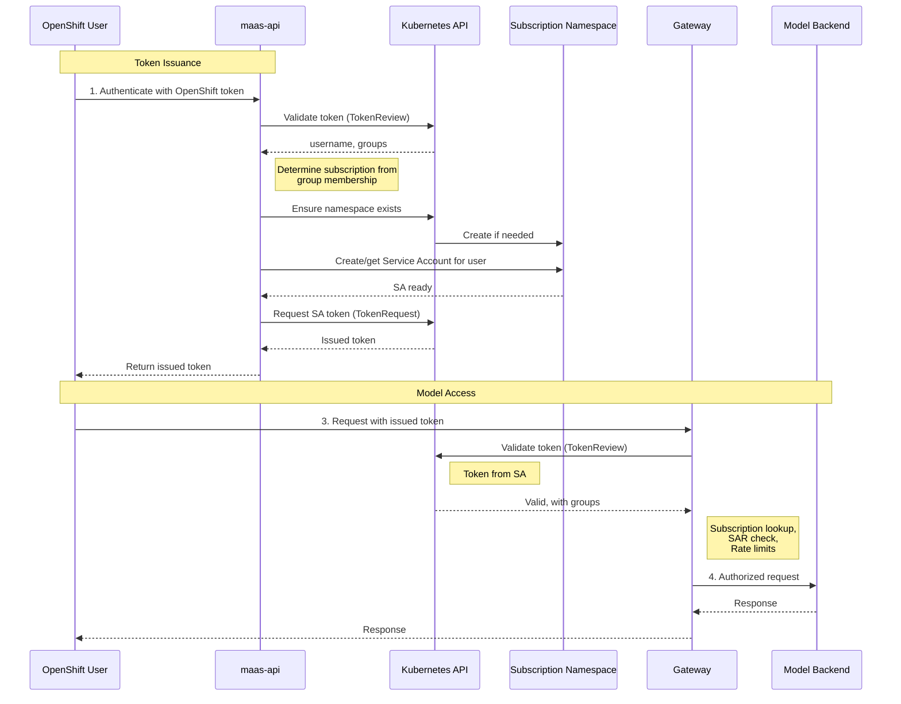
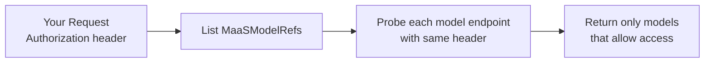

# Understanding Token Management

This guide explains the authentication and credential management used to access models in the MaaS Platform.

!!! tip "Subscription model (current)"
    The **subscription-based** architecture uses **API keys** (`sk-oai-*`) for programmatic access. Create keys via `POST /v1/api-keys` and use them with the `Authorization: Bearer` header. When users have multiple subscriptions, include the `X-MaaS-Subscription` header. See [Subscription Configuration](subscription-configuration.md).

!!! note "Prerequisites"
    This document assumes you have configured subscriptions (MaaSAuthPolicy, MaaSSubscription).
    See [Subscription Configuration](subscription-configuration.md) for setup.

---

## Table of Contents

1. [Overview](#overview)
1. [How Token Issuance Works](#how-token-issuance-works)
1. [Model Discovery](#model-discovery)
1. [Practical Usage](#practical-usage)
1. [Token Lifecycle Management](#token-lifecycle-management)
1. [Frequently Asked Questions (FAQ)](#frequently-asked-questions-faq)
1. [Related Documentation](#related-documentation)

---

## Overview

The platform uses a secure, token-based authentication system. Instead of using your primary OpenShift credentials to 
access models directly, you first exchange them for a temporary, specialized access token. This approach provides several key benefits:

- **Enhanced Security**: Tokens are short-lived, reducing the risk of compromised credentials. They are also narrowly scoped for model access only.
- **Subscription-Based Access Control**: The token you receive is associated with your subscription(s), ensuring you get the correct permissions and rate limits.
- **Auditability**: Every request made with a token is tied to a specific identity and can be audited.
- **Kubernetes-Native Integration**: The system leverages standard, Kubernetes authentication and authorization mechanisms.

The process is simple:

```text
You authenticate with OpenShift → Request a token from the API → Use that token to call models
```

---

## How Token Issuance Works

When you request a token, you are essentially trading your long-term OpenShift identity for a short-term, 
purpose-built identity in the form of a Kubernetes Service Account.

### Key Concepts

- **Subscription**: Your access is determined by MaaSAuthPolicy and MaaSSubscription, which map groups to models and rate limits.
- **Service Account (SA)**: For OpenShift token exchange, the system may create a Service Account that represents you. This SA inherits permissions from your subscription.
- **Access Token**: The token you receive is a standard JSON Web Token (JWT). When you present this token to the gateway, the system knows your identity and what permissions you have.
- **Token Audience**: The intended recipient of your token. This is validated during authentication and must match the gateway's configuration.
- **Token Expiration**: The time after which the token expires. Tokens are short-lived to reduce the risk of compromised credentials.

### Token Issuance Flow

This diagram illustrates the process of obtaining a token.



---

## Model Discovery

The `/v1/models` endpoint allows you to discover which models you're authorized to access. This endpoint works with any valid authentication token — you don't need to create an API key first.

### How It Works

When you call **GET /v1/models** with an **Authorization** header, the API passes that header **as-is** to each model's `/v1/models` endpoint to validate access. Only models that return 2xx or 405 are included in the list. No token exchange or modification is performed; the same header you send is used for the probe.



This means you can:

1. **Authenticate with OpenShift or OIDC** — use your existing identity and the same token you would use for inference.
2. **Call `/v1/models` immediately** — see only the models you can access, without creating an API key first.

!!! info "Future: Token minting"
    Once MaaS API token minting is in place, the implementation may be revisited (e.g. minting a short-lived token for gateway auth when the client's token has a different audience). For now, the Authorization header is always passed through as-is.

---

## Practical Usage

For step-by-step instructions on obtaining and using tokens to access models, including practical examples and troubleshooting, see the [Self-Service Model Access Guide](../user-guide/self-service-model-access.md).

That guide provides:

- Complete walkthrough for getting your OpenShift token
- How to request an access token from the API
- Examples of making inference requests with your token
- Troubleshooting common authentication issues

---

## Token Lifecycle Management

Access tokens are ephemeral and must be managed accordingly.

### Token Expiration

Tokens have a finite lifetime for security purposes:

- **Default lifetime**: 4 hours (configurable when requesting)
- **Maximum lifetime**: Determined by your Kubernetes cluster configuration

When a token expires, any API request using it will fail with an `HTTP 401 Unauthorized error`. 
To continue, you must request a new token using the process described above.

**Tips:**

- For interactive use, request tokens with a lifetime that covers your session (e.g., 4h).
- For automated scripts or applications, implement logic to refresh the token proactively before it expires.

### Token Revocation

You can invalidate all active tokens associated with your user account. This is a key security feature if you believe a token has been exposed.

To revoke all your tokens, send a `DELETE` request to the `/v1/tokens` endpoint.

```shell
curl -sSk -X DELETE "${MAAS_API_URL}/v1/tokens" \
  -H "Authorization: Bearer $(oc whoami -t)"
```
This action immediately deletes your underlying Service Account, which invalidates all tokens that have ever been issued for it. 
The Service Account will be automatically recreated the next time you request a token.

!!! warning "Important"
    **For Platform Administrators**: Admins can manually revoke a user's tokens by finding and deleting their Service Account 
    in the appropriate namespace. This is an effective way to immediately cut 
    off access for a specific user in response to a security event.

---

## Frequently Asked Questions (FAQ)

**Q: My subscription access is wrong. How do I fix it?**

A: Your access is determined by your group membership in OpenShift and how those groups are mapped in MaaSAuthPolicy and MaaSSubscription. Contact your platform administrator to ensure you are in the correct user group and that it is mapped in [Subscription Configuration](subscription-configuration.md).

---

**Q: How long should my tokens be valid for?**

A: It's a balance of security and convenience. For interactive command-line use, 1-8 hours is common. For applications, request shorter-lived tokens (e.g., 15-60 minutes) and refresh them automatically.

---

**Q: Can I have multiple active tokens at once?**

A: Yes. Each call to the `/v1/tokens` endpoint issues a new, independent token. All of them will be valid until they expire or are revoked.

---

**Q: What happens if the `maas-api` service is down?**

A: You will not be able to issue *new* tokens. However, any existing, non-expired tokens will continue to work for calling models, as the gateway validates them directly with the Kubernetes API.

---

**Q: Can I use one token to access multiple different models?**

A: Yes. Your token grants you access based on your subscription permissions. If your subscription is authorized to use multiple models, a single token will work for all of them.

---

**Q: What's the difference between my OpenShift token and an API key?**

A: Your **OpenShift token** is your identity token from authentication (e.g. OpenShift or OIDC). An **API key** (issued via `/v1/tokens`) is a service account token with the correct audience and permissions for accessing models. For **GET /v1/models**, the API passes your Authorization header as-is to each model endpoint to determine which models to include; you can use your OpenShift token or an API key. For inference, use a token that your gateway accepts (e.g. OpenShift token or API key as configured).

---

**Q: Do I need an API key to list available models?**

A: No. Call **GET /v1/models** with your OpenShift/OIDC token (or any token your gateway accepts) in the Authorization header. The API uses that same header to probe each model endpoint and returns only models you can access.

---

**Q: What is "token audience" and why does it matter?**

A: Token audience identifies the intended recipient of a token. Some gateways expect tokens with a specific audience. For **GET /v1/models**, the API does not modify or exchange your token; it forwards your Authorization header as-is. Once token minting is in place, audience handling may be revisited.

---

## Related Documentation

- **[Subscription Configuration](subscription-configuration.md)**: For operators - subscription setup, access control, and rate limiting

---
