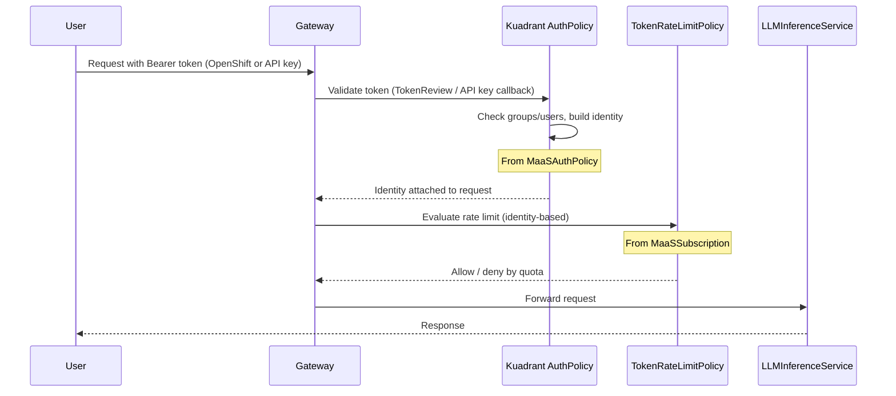
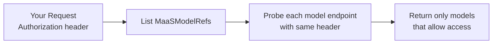

# Understanding Token Management

This guide explains the token-based authentication system used to access models in the MaaS platform. It covers how authentication works, the subscription-based access control model, and token lifecycle management.

!!! note
    **Prerequisites**: This document assumes you have configured MaaSAuthPolicy and MaaSSubscription CRDs for access control and rate limits. See [MaaS Controller Overview](maas-controller-overview.md) and [Model Setup](model-setup.md) for setup instructions.

---

## Table of Contents

1. [Overview](#overview)
1. [Key Concepts](#key-concepts)
1. [Authentication Flow](#authentication-flow)
1. [Model Discovery](#model-discovery)
1. [Practical Usage](#practical-usage)
1. [Token Lifecycle Management](#token-lifecycle-management)
1. [Frequently Asked Questions (FAQ)](#frequently-asked-questions-faq)
1. [Related Documentation](#related-documentation)

---

## Overview

The platform uses a secure, token-based authentication system. You authenticate using either your **OpenShift token** or an **API key** (sk-oai-* format). Access and rate limits are controlled **per-model** via MaaS CRDs, which the maas-controller reconciles into Kuadrant policies at the gateway.

Key benefits:

- **Enhanced Security**: API keys can be short-lived or permanent; OpenShift tokens are validated via Kubernetes TokenReview.
- **Per-Model Access Control**: Access is granted per-model via **MaaSAuthPolicy** (group-based). Your group membership determines which models you can use.
- **Per-Model Rate Limits**: Token limits are defined per-model via **MaaSSubscription**. The maas-controller generates Kuadrant TokenRateLimitPolicy resources automatically.
- **Auditability**: Every request is tied to a specific identity and can be audited.

The process is simple:

```text
You authenticate (OpenShift token or API key) → Gateway validates via Kuadrant AuthPolicy → Request is authorized and rate-limited per model
```

---

## Key Concepts

- **OpenShift Token**: Your identity token from OpenShift or OIDC. The gateway validates it via Kubernetes TokenReview and derives your user and group membership for authorization.
- **API Key (sk-oai-*)**: An OpenAI-compatible API key issued via the MaaS API (`POST /v1/api-keys`). Supports permanent keys or expiring keys. The plaintext key is shown only once at creation.
- **MaaSAuthPolicy**: A CRD that defines **who** (groups/users) can access **which models**. The maas-controller reconciles each MaaSAuthPolicy into Kuadrant AuthPolicy resources attached to the model's HTTPRoute.
- **MaaSSubscription**: A CRD that defines **per-model token rate limits** for owner groups. The maas-controller reconciles each MaaSSubscription into Kuadrant TokenRateLimitPolicy resources.
- **maas-controller**: A Kubernetes operator that watches MaaSAuthPolicy and MaaSSubscription CRDs and generates the corresponding Kuadrant AuthPolicy and TokenRateLimitPolicy resources. No manual gateway policy configuration is required.

---

## Authentication Flow

When you send a request to a model endpoint, the gateway validates your token and enforces access and rate limits.



- **AuthPolicy** (generated from MaaSAuthPolicy) authenticates your token and authorizes based on allowed groups/users.
- **TokenRateLimitPolicy** (generated from MaaSSubscription) enforces per-model token limits based on your group membership.

---

## Model Discovery

The `/v1/models` endpoint allows you to discover which models you're authorized to access. This endpoint works with any valid authentication token — you don't need to create an API key first.

### How It Works

When you call **GET /v1/models** with an **Authorization** header, the API passes that header **as-is** to each model's `/v1/models` endpoint to validate access. Only models that return 2xx or 405 are included in the list. No token exchange or modification is performed; the same header you send is used for the probe.



This means you can:

1. **Authenticate with OpenShift or OIDC** — use your existing identity and the same token you would use for inference.
2. **Call `/v1/models` immediately** — see only the models you can access, without creating an API key first.

!!! info "Future: Token minting"
    Once MaaS API token minting is in place, the implementation may be revisited (e.g. minting a short-lived token for gateway auth when the client's token has a different audience). For now, the Authorization header is always passed through as-is.

---

## Practical Usage

For step-by-step instructions on obtaining and using tokens to access models, including practical examples and troubleshooting, see the [Self-Service Model Access Guide](../user-guide/self-service-model-access.md).

That guide provides:

- Complete walkthrough for getting your OpenShift token
- How to create and use API keys (sk-oai-* format)
- Examples of making inference requests with your token
- Troubleshooting common authentication issues

---

## Token Lifecycle Management

Access tokens and API keys must be managed according to their type.

### OpenShift Token Expiration

OpenShift tokens have a finite lifetime:

- **Typical lifetime**: Varies by cluster configuration
- **Refresh**: Use `oc whoami -t` to obtain a fresh token when needed

When a token expires, any API request using it will fail with `HTTP 401 Unauthorized`. Obtain a new token and retry.

### API Key Lifecycle

API keys created via `POST /v1/api-keys` support:

- **Permanent keys**: Omit `expiresIn` when creating; the key never expires until revoked.
- **Expiring keys**: Specify `expiresIn` (e.g., `"30d"`, `"90d"`, `"1h"`) for time-limited access.

**Tips:**

- For interactive use, OpenShift tokens or short-lived API keys work well.
- For automated scripts or applications, use API keys with appropriate expiration and implement refresh logic before expiry.

### Revocation

- **API keys**: Revoke or delete keys via the API keys endpoints. Revoked keys are immediately invalid.
- **OpenShift tokens**: Cannot be revoked individually; they expire naturally. For immediate access revocation, contact your platform administrator.

!!! warning "Important"
    **For Platform Administrators**: Access can be revoked by updating or removing MaaSAuthPolicy CRDs that grant the user's groups access to models. Rate limits can be adjusted via MaaSSubscription CRDs.

---

## Frequently Asked Questions (FAQ)

**Q: My group doesn't have access to a model. How do I get access?**

A: Access is controlled by MaaSAuthPolicy CRDs, which map groups to models. Contact your platform administrator to ensure your group is included in the MaaSAuthPolicy that covers the model you need.

---

**Q: How long should my API keys be valid for?**

A: It's a balance of security and convenience. For interactive command-line use, permanent or long-lived keys (e.g., 90 days) are common. For applications, use shorter-lived keys (e.g., 30 days) and rotate them regularly.

---

**Q: Can I have multiple API keys at once?**

A: Yes. You can create multiple API keys via `POST /v1/api-keys`. Each key is independent and can be revoked separately.

---

**Q: What happens if the maas-api service is down?**

A: You will not be able to create *new* API keys or validate API keys via the callback. OpenShift tokens may still work if the gateway validates them directly with the Kubernetes API. Existing, non-expired API keys may continue to work depending on gateway configuration.

---

**Q: Can I use one token to access multiple different models?**

A: Yes. Your token (OpenShift or API key) is validated once; your group membership determines which models you can access. If your groups are authorized for multiple models via MaaSAuthPolicy, a single token works for all of them (subject to per-model rate limits from MaaSSubscription).

---

**Q: What's the difference between my OpenShift token and an API key?**

A: Your **OpenShift token** is your identity token from authentication (e.g. OpenShift or OIDC). An **API key** (sk-oai-*) is created via the MaaS API and is validated by the gateway via an HTTP callback. For **GET /v1/models**, the API passes your Authorization header as-is to each model endpoint; you can use either. For inference, use whichever token type your gateway accepts.

---

**Q: Do I need an API key to list available models?**

A: No. Call **GET /v1/models** with your OpenShift/OIDC token (or any token your gateway accepts) in the Authorization header. The API uses that same header to probe each model endpoint and returns only models you can access.

---

**Q: What is "token audience" and why does it matter?**

A: Token audience identifies the intended recipient of a token. Some gateways expect tokens with a specific audience. For **GET /v1/models**, the API does not modify or exchange your token; it forwards your Authorization header as-is. Once token minting is in place, audience handling may be revisited.

---

## Related Documentation

- **[MaaS Controller Overview](maas-controller-overview.md)**: How maas-controller reconciles MaaSAuthPolicy and MaaSSubscription into Kuadrant policies
- **[Model Setup](model-setup.md)**: Registering models and configuring MaaSAuthPolicy and MaaSSubscription
- **[Model Listing Flow](model-listing-flow.md)**: How the `/v1/models` endpoint works
