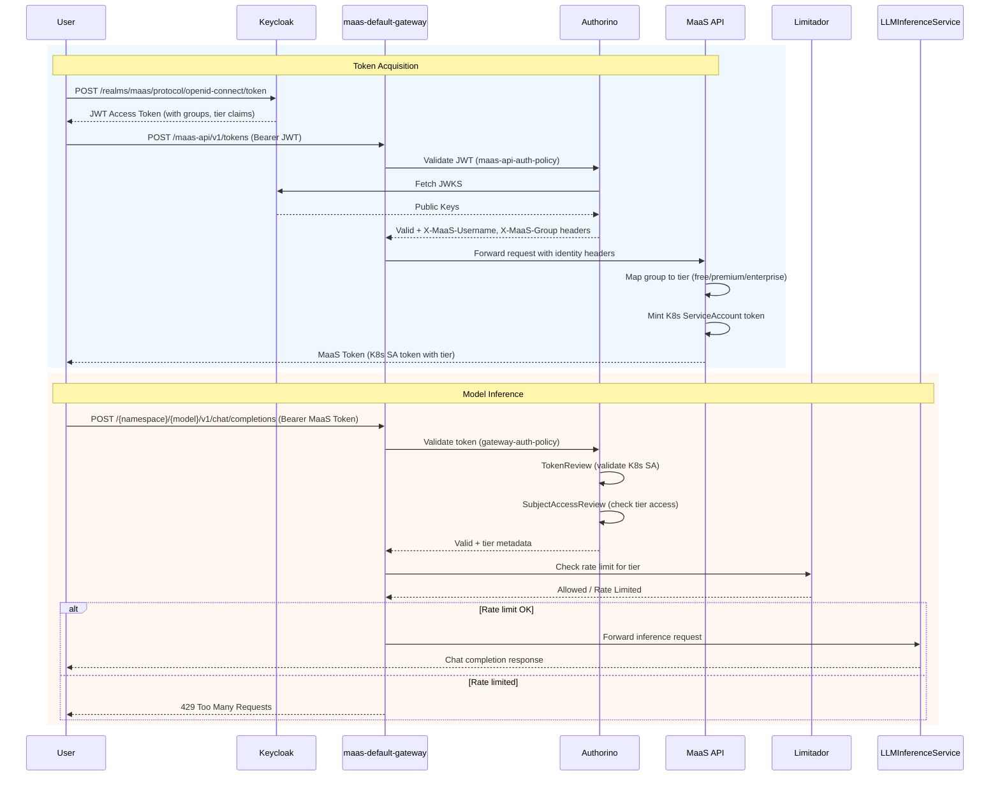

# Quickstart: Keycloak IDP (MaaS)

This quickstart deploys MaaS with Keycloak as the IDP and validates the token issuance + inference flow.

OAuth lets external users (no K8s credentials) authenticate via Keycloak and receive a Kubernetes-native token scoped to their tier. OAuth bridges external identity -> Kubernetes identity. Inference uses native K8s auth.

For IDP-specific deployment details and file layout, see `install/idp-deployment.md`.


## Prerequisites

- OpenShift cluster (4.19.9+)
- `kubectl` or `oc`
- `kustomize`
- `jq`

This quickstart uses the Keycloak IDP feature flag. Set `ENABLE_KEYCLOAK_IDP=true` before running the deploy script. If you want the vanilla deployment path, omit the flag.

## 1) Deploy MaaS + Keycloak

From the repo root:

```bash
export MAAS_REF="main"
export ENABLE_KEYCLOAK_IDP="true"
./scripts/deploy-rhoai-stable.sh

# Deploy a model
kubectl create namespace llm
kustomize build 'https://github.com/opendatahub-io/models-as-a-service.git/docs/samples/models/simulator?ref=main' | kubectl apply -f -
```

Follow the validation instructions after the script runs. Here is the quick paste:

```bash
CLUSTER_DOMAIN=$(kubectl get ingresses.config.openshift.io cluster -o jsonpath='{.spec.domain}')
HOST="maas.${CLUSTER_DOMAIN}"

# Core namespaces and gateway
kubectl get ns | grep -E "maas-api|opendatahub|kuadrant-system|kserve|redhat-ods-applications"
kubectl get gateway -n openshift-ingress maas-default-gateway
kubectl get httproute -n opendatahub maas-api-route

# AuthPolicy in place
kubectl get authpolicy -n opendatahub maas-api-auth-policy

# Keycloak token -> MaaS token
KEYCLOAK_URL="https://keycloak.${CLUSTER_DOMAIN}"
KEYCLOAK_REALM="maas"
KEYCLOAK_CLIENT_ID="maas-cli"
KEYCLOAK_CLIENT_SECRET="maas-cli-secret"
KEYCLOAK_USERNAME="freeuser1"
KEYCLOAK_PASSWORD="password123"
KEYCLOAK_ACCESS_TOKEN=$(curl -sSk \
  -H "Content-Type: application/x-www-form-urlencoded" \
  -d "grant_type=password" \
  -d "client_id=${KEYCLOAK_CLIENT_ID}" \
  -d "client_secret=${KEYCLOAK_CLIENT_SECRET}" \
  -d "username=${KEYCLOAK_USERNAME}" \
  -d "password=${KEYCLOAK_PASSWORD}" \
  "${KEYCLOAK_URL}/realms/${KEYCLOAK_REALM}/protocol/openid-connect/token" | jq -r .access_token)

TOKEN=$(curl -sSk \
  -H "Authorization: Bearer ${KEYCLOAK_ACCESS_TOKEN}" \
  -H "Content-Type: application/json" \
  -X POST \
  -d '{"expiration": "24h"}' \
  "https://${HOST}/maas-api/v1/tokens" | jq -r .token)

# Models list + simple inference
MODELS=$(curl -sSk "https://${HOST}/maas-api/v1/models" \
  -H "Content-Type: application/json" \
  -H "Authorization: Bearer ${KEYCLOAK_ACCESS_TOKEN}")
MODEL_NAME=$(echo $MODELS | jq -r '.data[0].id')
MODEL_URL=$(echo $MODELS | jq -r '.data[0].url')

curl -sSk \
  -H "Authorization: Bearer ${TOKEN}" \
  -H "Content-Type: application/json" \
  -d "{\"model\": \"${MODEL_NAME}\", \"messages\": [{\"role\": \"user\", \"content\": \"Hello\"}], \"max_tokens\": 50}" \
  "${MODEL_URL}/v1/chat/completions"
```

With `ENABLE_KEYCLOAK_IDP=true`, the script deploys:
- RHOAI prerequisites
- MaaS API + policies
- Keycloak (Deployment/Service/Route) and the `maas` realm bootstrap
- Keycloak AuthPolicy and tier-to-group mappings

## 2) Keycloak realm bootstrap (automatic)

The deploy script imports a `maas` realm and a `maas-cli` client automatically via a Keycloak admin job.
You can override defaults with env vars before running the script:

```bash
export KEYCLOAK_REALM="maas"
export KEYCLOAK_CLIENT_ID="maas-cli"
export KEYCLOAK_CLIENT_SECRET="maas-cli-secret"
export MAAS_API_IMAGE="quay.io/opendatahub/maas-api:latest"
```

The imported realm includes:
- `groups` claim in access tokens
- Sample users (`freeuser1`, `premiumuser1`, password: `password123`).

If you override the realm or client values, use the same values in the steps below.

## 3) Get a Keycloak access token

```bash
CLUSTER_DOMAIN=$(kubectl get ingresses.config.openshift.io cluster -o jsonpath='{.spec.domain}')
KEYCLOAK_URL="https://keycloak.${CLUSTER_DOMAIN}"
KEYCLOAK_REALM="maas"
KEYCLOAK_CLIENT_ID="maas-cli"
KEYCLOAK_CLIENT_SECRET="maas-cli-secret"
KEYCLOAK_USERNAME="freeuser1"
KEYCLOAK_PASSWORD="password123"

KEYCLOAK_RESPONSE=$(curl -sSk \
  -H "Content-Type: application/x-www-form-urlencoded" \
  -d "grant_type=password" \
  -d "client_id=${KEYCLOAK_CLIENT_ID}" \
  -d "client_secret=${KEYCLOAK_CLIENT_SECRET}" \
  -d "username=${KEYCLOAK_USERNAME}" \
  -d "password=${KEYCLOAK_PASSWORD}" \
  "${KEYCLOAK_URL}/realms/${KEYCLOAK_REALM}/protocol/openid-connect/token")

KEYCLOAK_ACCESS_TOKEN=$(echo $KEYCLOAK_RESPONSE | jq -r .access_token)
```

## 4) Mint a MaaS token

```bash
HOST="maas.${CLUSTER_DOMAIN}"

TOKEN_RESPONSE=$(curl -sSk \
  -H "Authorization: Bearer ${KEYCLOAK_ACCESS_TOKEN}" \
  -H "Content-Type: application/json" \
  -X POST \
  -d '{"expiration": "24h"}' \
  "https://${HOST}/maas-api/v1/tokens")

TOKEN=$(echo $TOKEN_RESPONSE | jq -r .token)
```

## 5) List models (Keycloak token) and call inference (MaaS token)

```bash
MODELS=$(curl -sSk "https://${HOST}/maas-api/v1/models" \
  -H "Content-Type: application/json" \
  -H "Authorization: Bearer ${KEYCLOAK_ACCESS_TOKEN}")

MODEL_NAME=$(echo $MODELS | jq -r '.data[0].id')
MODEL_URL=$(echo $MODELS | jq -r '.data[0].url')

curl -sSk \
  -H "Authorization: Bearer ${TOKEN}" \
  -H "Content-Type: application/json" \
  -d "{\"model\": \"${MODEL_NAME}\", \"messages\": [{\"role\": \"user\", \"content\": \"Hello\"}], \"max_tokens\": 50}" \
  "${MODEL_URL}/v1/chat/completions"
```

## Architecture (OAuth/Keycloak Flow)

The MaaS Platform uses Keycloak OAuth for MaaS API access and MaaS ServiceAccount tokens for inference. Requests flow through `maas-default-gateway` and RHCL (Red Hat Connectivity Link) policies.

### Request Paths

- **`/maas-api/*`** → MaaS API (validates Keycloak OIDC token via `maas-api-auth-policy`)
- **Inference requests** (`/<namespace>/<model>/v1/*`) → Model Serving (validates MaaS ServiceAccount tokens via `gateway-auth-policy`)

### Authentication and Inference Flow

**Token generation flow:**

  1. User authenticates to Keycloak with credentials → receives JWT with groups/tier claims
  2. User sends JWT to /maas-api/v1/tokens via maas-default-gateway
  3. maas-api-auth-policy validates JWT via JWKS, injects X-MaaS-Username/Group headers
  4. MaaS API maps group to tier using tier-to-group-mapping ConfigMap
  5. MaaS API mints K8s ServiceAccount token with tier annotations → returns MaaS token

**Inference flow**

1. User sends MaaS token (K8s SA) to inference endpoint
2. gateway-auth-policy validates via TokenReview/SubjectAccessReview
3. Limitador enforces tier-based rate limits
4. Request forwarded to model

The point: OAuth (steps 1-5) bridges external identity -> Kubernetes identity. Inference uses native K8s auth.

### User Mapping to OpenShift Objects

- Each Keycloak user is mapped to a Kubernetes ServiceAccount created by MaaS API.
- The ServiceAccount lives in the tier namespace (for example, `maas-default-gateway-tier-free`), and the minted MaaS token is a ServiceAccount token.
- Gateway/AuthPolicy uses Kubernetes TokenReview/SubjectAccessReview to authorize inference with the tier-based ServiceAccount identity.



### Tier-to-Group Mapping

The `tier-to-group-mapping` ConfigMap defines which Keycloak groups map to which tiers:


```yaml
tiers:
  - name: free
    level: 0
    groups: [free-users, system:authenticated]
  - name: premium
    level: 1
    groups: [premium-users, premium-group]
  - name: enterprise
    level: 2
    groups: [enterprise-users, admins]
```

### Keycloak Realm Configuration

The `maas` realm includes:

| Entity | Details |
|--------|---------|
| **Client** | `maas-cli` with client credentials and device authorization grant |
| **Groups** | `free-users`, `premium-users`, `enterprise-users`, `admins` |
| **Users** | `freeuser1`, `freeuser2`, `premiumuser1`, `premiumuser2`, `enterpriseuser1`, `alice` (admin), `bob` |
| **Protocol Mappers** | `groups` (group membership → `groups` claim), `tier` (user attribute → `tier` claim) |

### AuthPolicy Configuration

The `maas-api-auth-policy` in `opendatahub` namespace:

```yaml
spec:
  targetRef:
    kind: HTTPRoute
    name: maas-api-route
  rules:
    authentication:
      keycloak-oidc:
        jwt:
          jwksUrl: http://keycloak.keycloak-system.svc.cluster.local:8080/realms/maas/protocol/openid-connect/certs
        credentials:
          authorizationHeader:
            prefix: Bearer
    response:
      success:
        headers:
          X-MaaS-Username:
            plain:
              selector: auth.identity.preferred_username
          X-MaaS-Group:
            plain:
              selector: auth.identity.groups.@tostr
```

The `gateway-auth-policy` in `openshift-ingress` namespace uses a `when` predicate to exclude `/maas-api` paths:

```yaml
spec:
  when:
  - predicate: '!request.path.startsWith("/maas-api")'
```
