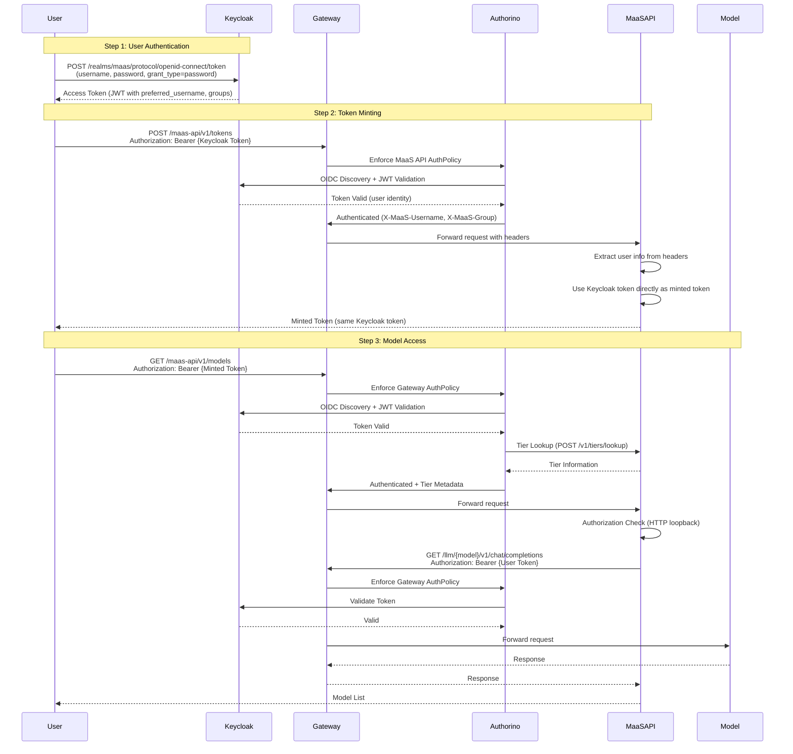
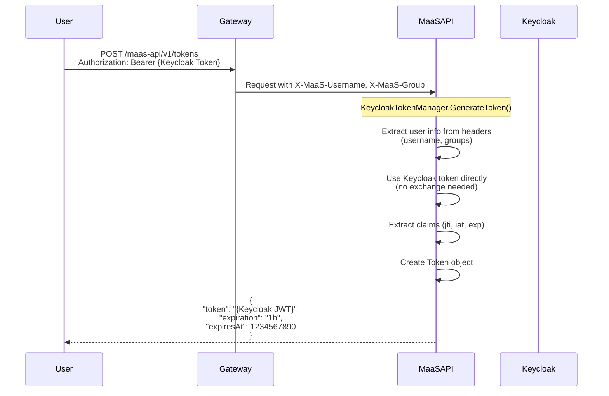
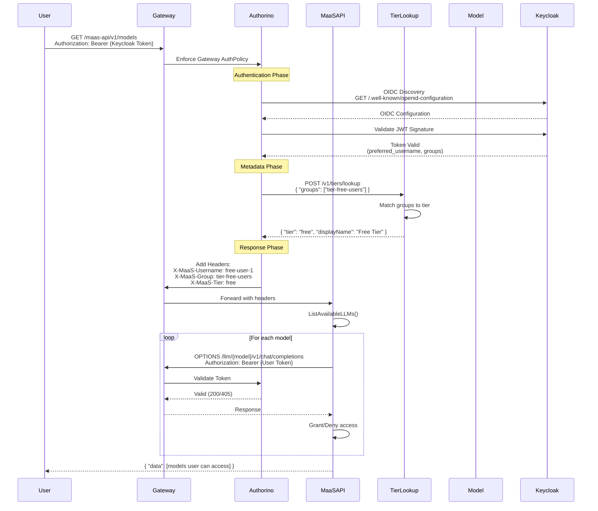

# Keycloak Architecture Deep Dive

Comprehensive documentation of the Keycloak-based authentication and authorization flow for MaaS.

## Overview

The Keycloak PoC replaces Kubernetes Service Account token minting with Keycloak OAuth 2.0 token exchange, enabling external Identity Provider (IDP) integration while maintaining tier-based access control.

## Architecture Components

### 1. Keycloak Server

**Deployment**: `keycloak` namespace
**Purpose**: OAuth 2.0 / OIDC Identity Provider

**Configuration**:
- **Realm**: `maas`
- **Clients**:
  - `maas-api`: Service account client for token exchange
  - `maas-model-access`: Public client (audience for model tokens)
- **Groups**: `tier-free-users`, `tier-premium-users`, `tier-enterprise-users`
- **Users**: Test users assigned to tier groups

### 2. Gateway AuthPolicy

**Target**: `maas-default-gateway` (Gateway)
**Authentication**: Keycloak JWT via OIDC discovery
**Metadata**: Tier lookup via `/v1/tiers/lookup` endpoint
**Response Headers**: `X-MaaS-Username`, `X-MaaS-Group`

### 3. MaaS API AuthPolicy

**Target**: `maas-api-route` (HTTPRoute)
**Authentication**: Keycloak JWT
**Purpose**: Validates Keycloak tokens for token minting requests

### 4. MaaS API Service

**Token Manager**: KeycloakTokenManager
- Accepts user's Keycloak token
- Uses token directly (no exchange needed for PoC)
- Extracts user identity from token claims

## Authentication Flow



## Token Minting Flow



## Model Authorization Flow



## Keycloak Token Structure

```json
{
  "iss": "https://keycloak.example.com/realms/maas",
  "aud": "maas-model-access",
  "sub": "user-uuid",
  "preferred_username": "free-user-1",
  "groups": ["tier-free-users"],
  "exp": 1234567890,
  "iat": 1234564290,
  "jti": "token-id"
}
```

## Tier Mapping

Tiers are determined by user group membership:

| Group | Tier | Level |
|-------|------|-------|
| `tier-free-users` | `free` | 1 |
| `tier-premium-users` | `premium` | 2 |
| `tier-enterprise-users` | `enterprise` | 3 |

The tier lookup endpoint (`/v1/tiers/lookup`) matches user groups against the `tier-to-group-mapping` ConfigMap to determine the user's tier.

## Authorization Check Mechanism

The MaaS API performs authorization checks using an HTTP loopback approach:

1. **Request**: MaaS API makes an internal HTTP request to the model endpoint
2. **Gateway**: Request goes through Gateway with user's Keycloak token
3. **AuthPolicy**: Gateway AuthPolicy validates the token
4. **Response**: 
   - `200/405`: Auth succeeded → Grant access
   - `401/403`: Auth failed → Deny access
   - `404`: For Keycloak tokens, treat as granted (token already validated by Gateway)

## Configuration Files

### Gateway AuthPolicy

**Location**: `deployment/overlays/keycloak/policies/gateway-auth-policy-keycloak.yaml.template`

**Key Settings**:
- `authentication.keycloak.jwt.issuerUrl`: Keycloak realm URL (auto-substituted)
- `metadata.matchedTier.http.url`: Tier lookup endpoint
- `response.success.headers`: Identity headers injected

### MaaS API AuthPolicy

**Location**: `deployment/overlays/keycloak/policies/maas-api-auth-policy.yaml.template`

**Key Settings**:
- `authentication.keycloak.jwt.issuerUrl`: Keycloak realm URL
- `response.success.headers`: User identity headers

### MaaS API Deployment

**Location**: `deployment/overlays/keycloak/maas-api-env-patch.yaml.template`

**Environment Variables**:
- `KEYCLOAK_ENABLED=true`
- `KEYCLOAK_BASE_URL`: Keycloak base URL
- `KEYCLOAK_REALM=maas`
- `KEYCLOAK_CLIENT_ID=maas-api`
- `KEYCLOAK_CLIENT_SECRET=maas-api-secret`
- `KEYCLOAK_AUDIENCE=maas-model-access`

## Security Considerations

### Token Validation

- **Gateway Level**: All tokens validated via OIDC discovery
- **MaaS API Level**: Tokens validated by Gateway AuthPolicy before reaching API
- **Model Level**: Tokens validated again by Gateway AuthPolicy for model endpoints

### Token Exchange

For the PoC, we use the user's Keycloak token directly. In production, consider:
- Token exchange for audience-specific tokens
- Token refresh mechanisms
- Token revocation

### Authorization

Currently, authorization is permissive (all authenticated users can access models). For production:
- Implement OPA Rego policies
- Use Kubernetes SubjectAccessReview
- Integrate Keycloak Authorization Services

## Troubleshooting

### Token Validation Failures

**Symptom**: `401 Unauthorized` when accessing models

**Check**:
```bash
# Verify Keycloak issuer URL
kubectl get authpolicy gateway-auth-policy -n openshift-ingress -o jsonpath='{.spec.rules.authentication.keycloak.jwt.issuerUrl}'

# Check Authorino logs
kubectl logs -n kuadrant-system deployment/authorino | grep -i oidc
```

### Tier Lookup Failures

**Symptom**: Models not appearing in list

**Check**:
```bash
# Verify tier mapping ConfigMap
kubectl get configmap tier-to-group-mapping -n opendatahub -o yaml

# Check tier lookup endpoint
kubectl logs -n opendatahub deployment/maas-api | grep -i tier
```

### Model Authorization Failures

**Symptom**: `404 Not Found` during authorization check

**Check**:
```bash
# Verify HTTPRoute exists
kubectl get httproute -A | grep {model-name}

# Check Gateway routing
kubectl get gateway maas-default-gateway -n openshift-ingress -o jsonpath='{.status.listeners[*].attachedRoutes}'
```

## Production Recommendations

1. **Persistent Keycloak Storage**: Use PostgreSQL instead of ephemeral database
2. **High Availability**: Deploy Keycloak with multiple replicas
3. **TLS**: Enable TLS for all Keycloak communications
4. **Token Exchange**: Implement proper token exchange for audience-specific tokens
5. **Authorization**: Add OPA Rego policies or Keycloak Authorization Services
6. **Monitoring**: Add Prometheus metrics for Keycloak operations
7. **Backup**: Implement Keycloak realm backup/restore procedures
