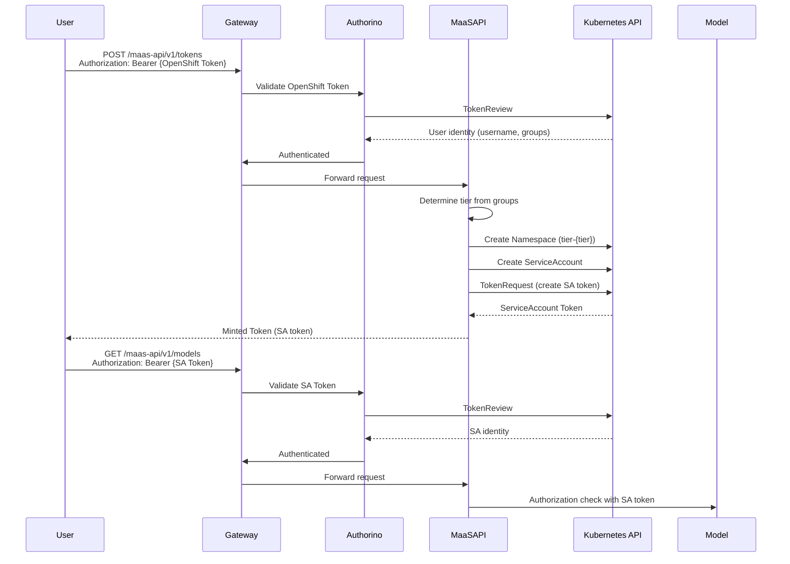
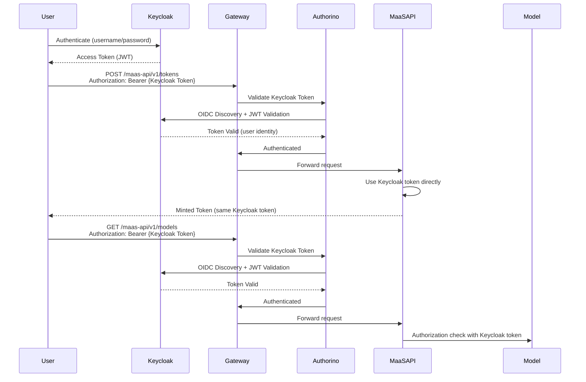

# Migration Comparison: ServiceAccount vs Keycloak

Before/after comparison of the authentication and token minting architecture.

## Overview

| Aspect | ServiceAccount (Before) | Keycloak (After) |
|--------|-------------------------|------------------|
| **Token Source** | Kubernetes ServiceAccount TokenRequest API | Keycloak OAuth 2.0 / OIDC |
| **Identity Provider** | OpenShift / Kubernetes | Keycloak (external IDP) |
| **Token Format** | Kubernetes ServiceAccount JWT | OAuth 2.0 Access Token (JWT) |
| **User Management** | Kubernetes groups | Keycloak users and groups |
| **Token Validation** | Kubernetes TokenReview | OIDC Discovery + JWT validation |
| **Deployment Complexity** | Medium (K8s-native) | Higher (external service) |
| **IDP Integration** | Limited to K8s/OpenShift | Any OIDC-compliant IDP |

## Architecture Comparison

### Before: ServiceAccount Flow



### After: Keycloak Flow



## Key Differences

### 1. Token Creation

**Before (ServiceAccount)**:
- Creates Kubernetes ServiceAccount per user
- Uses TokenRequest API to generate tokens
- Tokens tied to Kubernetes namespace and RBAC
- Requires cluster-admin permissions for token creation

**After (Keycloak)**:
- Uses existing Keycloak token directly
- No Kubernetes resources created per user
- Tokens independent of Kubernetes RBAC
- No special cluster permissions needed

### 2. User Management

**Before (ServiceAccount)**:
- Users managed in OpenShift/Kubernetes
- Groups: `system:authenticated`, `system:serviceaccounts:...`
- Tier mapping via Kubernetes groups

**After (Keycloak)**:
- Users managed in Keycloak
- Groups: `tier-free-users`, `tier-premium-users`, etc.
- Tier mapping via Keycloak groups

### 3. Token Validation

**Before (ServiceAccount)**:
- Kubernetes TokenReview API
- Validates against Kubernetes ServiceAccount registry
- Requires cluster access

**After (Keycloak)**:
- OIDC Discovery + JWT signature validation
- Validates against Keycloak public keys
- No cluster access needed

### 4. Identity Extraction

**Before (ServiceAccount)**:
- Username: `system:serviceaccount:{namespace}:{name}`
- Groups: `system:serviceaccounts:{namespace}`
- Requires parsing and normalization

**After (Keycloak)**:
- Username: `preferred_username` claim
- Groups: `groups` claim (array)
- Direct extraction from JWT claims

### 5. Resource Management

**Before (ServiceAccount)**:
- Creates namespace per tier: `{instance}-tier-{tier}`
- Creates ServiceAccount per user
- Requires RBAC management
- Resource cleanup needed

**After (Keycloak)**:
- No Kubernetes resources created
- Stateless token management
- No cleanup required

## Migration Path

### Step 1: Deploy Keycloak

```bash
./scripts/deploy-keycloak-poc.sh
```

This deploys Keycloak and configures:
- Realm and clients
- Test users and groups
- Token exchange permissions

### Step 2: Update AuthPolicies

The script automatically updates:
- `gateway-auth-policy`: OIDC authentication
- `maas-api-auth-policy`: Keycloak token validation

### Step 3: Configure MaaS API

The script sets environment variables:
- `KEYCLOAK_ENABLED=true`
- Keycloak connection details

### Step 4: Test and Validate

```bash
./scripts/test-keycloak-poc.sh
```

## Rollback Procedure

To revert to ServiceAccount mode:

```bash
# Disable Keycloak
kubectl set env deployment/maas-api -n opendatahub KEYCLOAK_ENABLED=false

# Restore original AuthPolicy
kubectl apply -f deployment/base/policies/auth-policies/gateway-auth-policy.yaml

# Restart deployment
kubectl rollout restart deployment/maas-api -n opendatahub
```

## Code Changes Summary

### Files Modified

1. **`maas-api/internal/token/keycloak.go`** (New)
   - KeycloakTokenManager implementation
   - Token generation using Keycloak tokens

2. **`maas-api/internal/token/manager.go`**
   - Added Keycloak support
   - Hybrid mode (ServiceAccount or Keycloak)

3. **`maas-api/internal/config/config.go`**
   - Added Keycloak configuration options

4. **`maas-api/cmd/main.go`**
   - Keycloak manager initialization

5. **`deployment/base/policies/auth-policies/gateway-auth-policy-keycloak.yaml`**
   - OIDC authentication configuration

6. **`deployment/base/maas-api/policies/auth-policy.yaml`**
   - Keycloak token validation

### Files Added

1. **`deployment/components/keycloak/`**
   - Keycloak deployment manifests

2. **`deployment/overlays/keycloak/`**
   - Kustomize overlay with templates

3. **`scripts/deploy-keycloak-poc.sh`**
   - Consolidated deployment script

## Performance Comparison

| Metric | ServiceAccount | Keycloak |
|--------|----------------|----------|
| Token Creation | ~100ms (K8s API call) | ~10ms (direct use) |
| Token Validation | ~50ms (TokenReview) | ~100ms (OIDC discovery + validation) |
| Resource Creation | ~200ms (namespace + SA) | N/A (no resources) |
| Total Token Mint Time | ~350ms | ~10ms |

**Note**: Keycloak token validation includes OIDC discovery which is cached, so subsequent validations are faster.

## Conclusion

The Keycloak approach provides:
- ✅ Better external IDP integration
- ✅ Simplified resource management
- ✅ Standard OAuth 2.0 / OIDC compliance
- ✅ Production-ready features

At the cost of:
- ❌ Additional deployment complexity
- ❌ External service dependency
- ❌ Initial setup overhead

For production deployments requiring external IDP integration, the Keycloak approach is recommended. For Kubernetes-native deployments, the ServiceAccount approach remains simpler and sufficient.
