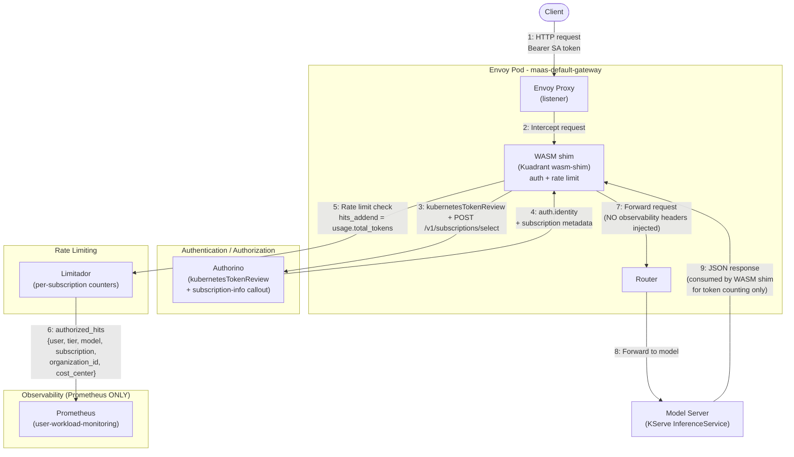
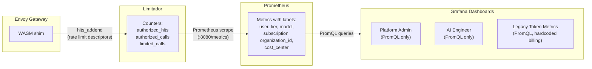
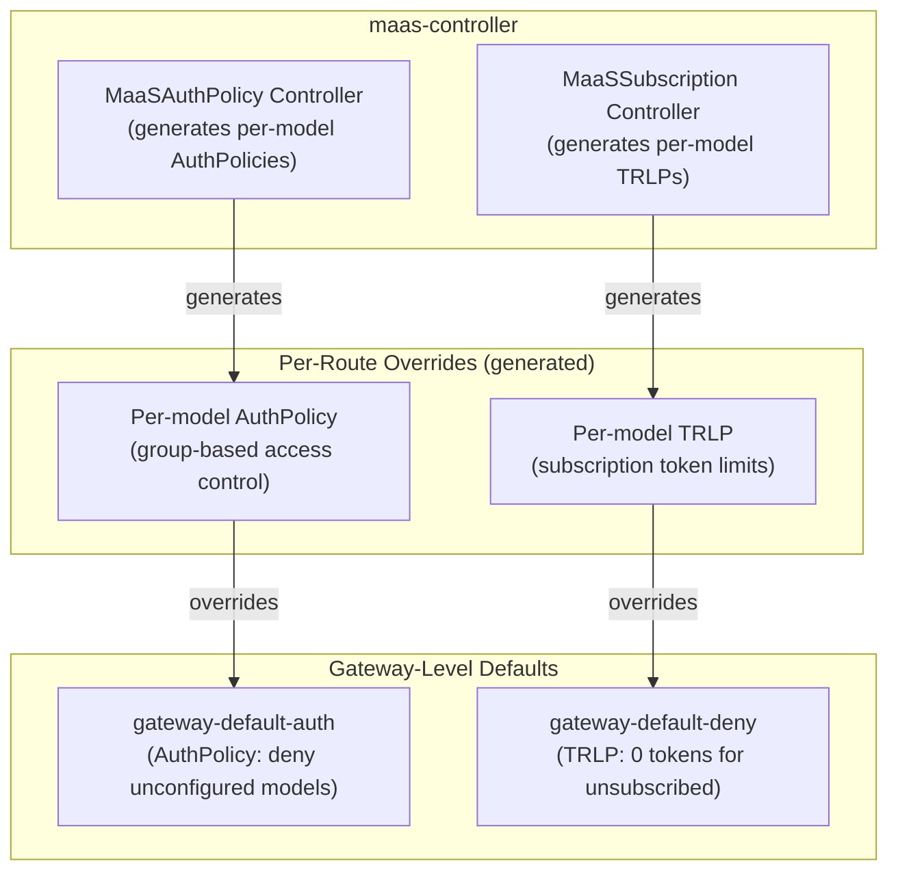
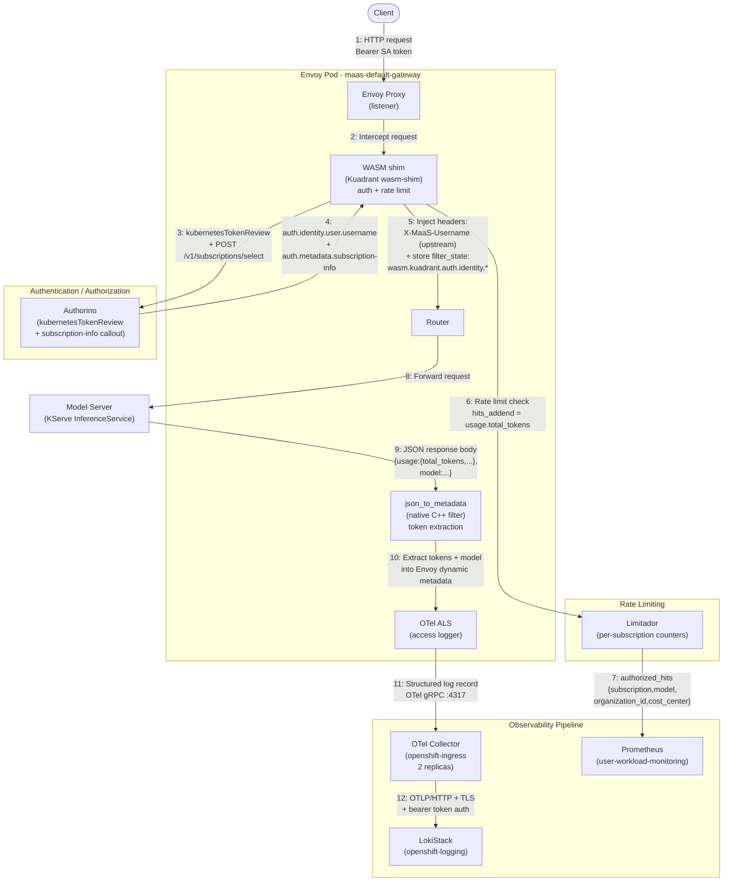
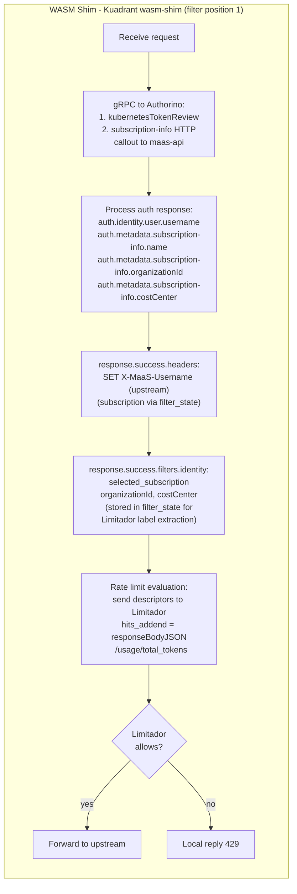
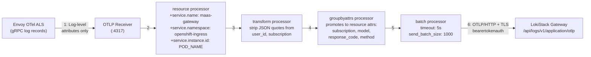
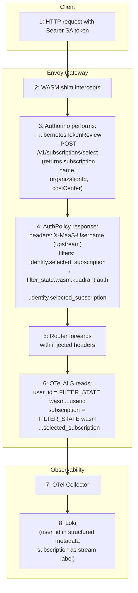
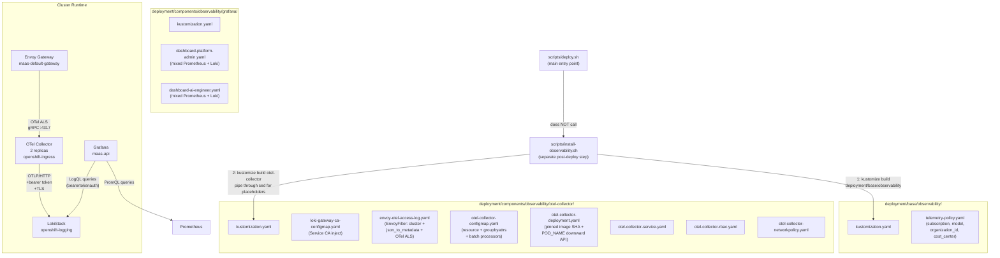
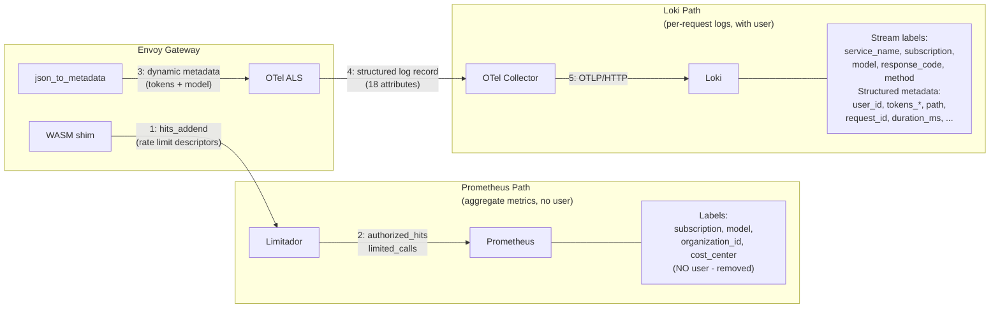

---

name: Envoy OTel Structured Logs
overview: Envoy access logs emitted via OTel Collector to Loki, carrying user_id, subscription, model name, and token counts as structured log records — providing a reliable, independent token accounting channel alongside the existing Limitador-based counters.
todos:

- id: otel-collector
content: "Deploy OTel Collector in openshift-ingress: Deployment, Service (port 4317), ConfigMap with OTLP receiver + resource/groupbyattrs/batch processors + Loki exporter"
status: completed
- id: meshconfig-provider
content: "RESOLVED via EnvoyFilter (Deviation 1): ingress-operator owns meshConfig, EnvoyFilter injects OTel ALS directly"
status: completed
- id: fix-otel-image
content: "Pin to Red Hat build 3.9.0 digest: registry.redhat.io/rhosdt/opentelemetry-collector-rhel9@sha256:f970e31da..."
status: completed
- id: telemetry-accesslog
content: "SUPERSEDED: Telemetry CR not usable without extensionProvider. OTel ALS configured in EnvoyFilter directly"
status: completed
- id: verify-otel-pods
content: OTel Collector 2/2 Running, Red Hat build 3.9.0
status: completed
- id: verify-extension-provider
content: "EnvoyFilter verified: otel_als_cluster + OTel ALS on gateway listeners"
status: completed
- id: test-e2e-logs
content: "E2E verified: Envoy -> OTel Collector -> Loki pipeline working"
status: completed
- id: log-attributes
content: 18 structured log attributes configured including user_id, subscription, tokens, model
status: completed
- id: regression-check
content: "validate-deployment.sh: all checks passed. Limitador metrics intact"
status: completed
- id: fix-loki-gateway-auth
content: "Implement recommended gateway auth: SA + ClusterRole/Binding + bearertokenauth extension + https endpoint"
status: completed
- id: fix-install-observability-endpoint
content: Update install-observability.sh auto-detection to produce gateway https URL
status: completed
- id: fix-user-id-attribute
content: "user_id reads upstream X-MaaS-Username header (no POC-specific header needed). x-maas-user-id removed."
status: completed
- id: add-dynamic-metadata-authpolicy
content: "Per-model AuthPolicies already include selected_subscription in filters section. OTel ALS reads directly from WASM filter_state — no custom headers needed."
status: completed
- id: switch-to-filter-state
content: "OTel ALS switched from %REQ()% headers to %FILTER_STATE(wasm.kuadrant.auth.identity.*:PLAIN)% for user_id and subscription. x-maas-subscription-id header removed from controller. Transform processor strips JSON quotes."
status: completed
- id: verify-user-id-on-cluster
content: "VERIFIED: user_id and subscription populated in Loki logs"
status: completed
- id: json-to-metadata
content: "IMPLEMENTED: json_to_metadata (native C++ Envoy filter) chosen for token extraction. Lua prototype rejected."
status: completed
- id: update-access-log-attrs
content: Access log reads %DYNAMIC_METADATA(envoy.filters.http.json_to_metadata:tokens_total)%. All 18 attributes configured.
status: completed
- id: verify-full-log-record
content: "VERIFIED: tokens_total=18, tokens_prompt=15, tokens_completion=3, model=facebook/opt-125m, user_id=SA identity, subscription=simulator-subscription"
status: completed
- id: remove-debug-exporter
content: Removed debug exporter from OTel ConfigMap. Only otlphttp/loki exporter remains.
status: completed
- id: fix-loki-replicas
content: All Loki pods running. LokiStack 1x.demo with replicationFactor=1.
status: completed
- id: remove-user-label
content: "DONE: Both user AND tier labels removed from TelemetryPolicy. user was high-cardinality; tier was dead (old flow replaced by subscription)."
status: completed
- id: update-dashboards
content: "DONE: Platform-admin and AI-engineer dashboards migrated: tier->subscription, per-user PromQL->Loki LogQL."
status: completed
- id: streaming-strategy
content: "DOCUMENTED: SSE streaming skipped by json_to_metadata (non-JSON content-type rejected automatically). Same limitation as WASM shim."
status: completed
- id: documentation
content: Plan updated with final architecture, all deviations, limitations discovered, upstream WASM shim option.
status: completed
- id: header-spoofing
content: "RESOLVED: AuthPolicy response.success.headers uses SET semantics (overwrites client value). Route-level strip was tested but broke logging — removed. Spoofing prevented by overwrite."
status: completed
- id: kustomize-replacements
content: "DONE: Replaced envsubst with sed placeholders in ConfigMap and install-observability.sh. envsubst removed from preflight check."
status: completed
- id: service-instance-id
content: "DONE: Added service.instance.id via POD_NAME downward API env var in deployment + config. Also added service.namespace."
status: completed
- id: groupbyattrs-processor
content: "DONE: Added groupbyattrs processor to promote subscription/model/response_code/method to Loki stream labels."
status: completed
- id: lokistack-stream-labels
content: "DONE: Patched LokiStack CR to index subscription, model, response_code, method as stream labels."
status: completed
- id: loki-datasource-rbac
content: "DONE: Created maas-grafana-loki-reader ClusterRole + ClusterRoleBinding + GrafanaDatasource/loki for Grafana -> Loki access."
status: completed
- id: controller-headers
content: "NOT NEEDED: upstream controller already has filters.identity.selected_subscription. OTel ALS reads it via WASM filter_state. Controller reverted to upstream/main (zero diff)."
status: completed
- id: perses-dashboards
content: "Cherry-pick 4 Perses commits from origin/pr/observability-perses-dashboards (c4c17de, 8c8495e, c342558, 68abfd0). Includes platform-admin + ai-engineer + usage dashboards, tenant-scoped user isolation (scoped datasource, RBAC, usage dashboard deployed to tenant namespace only), and install-perses-dashboards.sh (deploys as OpenShift UI plugins)."
status: completed
- id: coo-upgrade
content: "DONE: Upgraded COO 1.3.1 -> 1.4.0 (approved install plan install-wgdfm). Perses image updated to sha256:19b297... with Loki plugin. Side effects: Grafana 5.21.2->5.22.0, ServiceMesh 3.2.1->3.2.2."
status: completed
- id: fix-loki-datasource-kind
content: "DONE: Fixed perses-loki-datasource.yaml — TempoDatasource->LokiDatasource, v1alpha1->v1alpha2. Reconciled successfully."
status: completed
- id: validate-perses-loki
content: "DONE: Perses Loki datasource Available=True, Degraded=False. All dashboards healthy. Dashboard migration to LogQL now unblocked."
status: completed
- id: fix-probe-traffic-filter
content: "DONE: Added user_id!=- filter to all Loki queries across all 3 dashboards. Envoy health probes / internal traffic set user_id=- which polluted dashboard data. Usage Dashboard also protected by subscription filter (defense-in-depth)."
status: completed
- id: fix-ai-engineer-overcounting
content: "DONE: AI Engineer stat panels (myTotalTokens, myTotalRequests) changed from [5m]+calculation:sum to [1h]+calculation:last. The [5m] windows with default step (~15s) caused ~20x overcounting due to overlapping windows. Fixed window [1h] matches dashboard duration."
status: completed
- id: fix-platform-admin-loki-filters
content: "DONE: Added user_id!= and user_id!=- to all 6 Loki panels in Platform Admin dashboard (activeUsers, topUsersByTokens, topUsersByDeclined, tokenRateByUser, requestVolumeByUserSubscription, tokenUsageAndRateLimitsPerUser)."
status: completed
- id: wipe-prometheus-loki-data
content: "DONE: Wiped MinIO /data/loki/* bucket, restarted all LokiStack components, restarted Prometheus statefulsets and Limitador. Fresh start for dashboard validation."
status: completed
- id: upstream-wasm-shim-tokens
content: "TODO (deferred): File GitHub issue at kuadrant/wasm-shim requesting set_attribute() for body_values in TokenUsageTask"
status: pending
- id: upstream-wasm-shim-429
content: "TODO (deferred): Request WASM shim to inject auth response headers into request before rate limit evaluation, so user_id/subscription appear in 429 logs"
status: pending
- id: upstream-kuadrant-dual-listener
content: "TODO (deferred): File issue that HTTP+HTTPS listeners cause duplicate ActionSets leading to 403"
status: pending
  - id: observability-docs
  content: "DONE: Updated observability.md — removed dead user/tier label references, updated Perses limitations for Loki plugin, added OTel/Loki sections, per-user metrics reference Loki user_id"
  status: completed
  - id: fix-rewriter-metric-queries
  content: "DONE: Rewrote injectUserFilter to insert | user_id= after each stream selector {} instead of appending to end. Fixes metric/aggregation queries for non-admin users."
  status: completed
  - id: fix-rewriter-quoted-braces
  content: "DONE: Made injectUserFilter quote-aware — skips braces inside double-quoted and backtick strings. Fixes line_format, label_format, string match queries with Go templates."
  status: completed
  - id: fix-post-body-bypass
  content: "DONE: Fixed tenant isolation bypass via POST form body. Changed if/else-if to two independent if blocks so both URL params and POST body are always rewritten."
  status: completed
  - id: fix-dual-query-bypass
  content: "DONE: Fixed exploit where dummy query in URL + real query in POST body bypassed filtering."
  status: completed
  - id: fix-dashboard-range-variable
  content: "DONE: Replaced $range StaticListVariable dropdown with $__range (Perses built-in since v0.40.0). Native time picker now drives all LogQL queries."
  status: completed
  - id: fix-workflow-git-checkout
  content: "DONE: Removed -- separator from git rev-parse and git checkout --detach in update-docs-latest.yml. Was treating tag as pathspec."
  status: completed
  - id: restore-telemetry-user-label
  content: "DONE: user: auth.identity.userid was restored in Phase 14, then removed again after code review (ahadas c1) — high-cardinality label, per-user data served by Loki now."
  status: completed
  - id: fix-tokenreview-client-reuse
  content: "DONE: Made resolveToken reuse a global http.Client for TokenReview API instead of creating one per request."
  status: completed
  - id: dashboard-ui-verification
  content: "DONE: Verified Usage Dashboard in browser for all 4 test users. Screenshots confirm correct tenant isolation."
  status: completed
  - id: upgrade-loki-variable-plugins
  content: "TODO: When perses/plugins releases with PR #651 (LokiLabelValuesVariable, LokiLabelNamesVariable, LokiLogQLVariable — merged 2026-05-07) and COO picks it up, replace StaticListVariable for model/subscription/user_id with dynamic LokiLabelValuesVariable in dashboard-usage.yaml. Upstream issue: perses/perses#4054."
  status: pending
  - id: fix-proxy-content-length
  content: "TODO: When POST body is rewritten, stale Content-Length header is forwarded. Set Content-Length from rewritten body length or strip it and let http.Transport set it."
  status: pending
  - id: fix-proxy-json-post
  content: "TODO: Proxy only rewrites application/x-www-form-urlencoded POST bodies. JSON POST bodies (application/json) are forwarded unfiltered. Add JSON body parsing or block unsupported content types for non-admin users."
  status: pending
  - id: fix-proxy-non-query-apis
  content: "TODO: Label/value, series, and metadata Loki APIs that don't use a query param are forwarded without user_id injection. Evaluate allowlisting or restricting these endpoints for non-admin users."
  status: pending
  - id: fix-proxy-security-context
  content: "TODO: Add securityContext to deployment-user.yaml: runAsNonRoot, allowPrivilegeEscalation: false, capabilities.drop: ALL, readOnlyRootFilesystem."
  status: pending
  - id: fix-proxy-client-timeouts
  content: "TODO: Add explicit Timeout to httpClient and tokenReviewClient to prevent goroutine pile-up under load."
  status: pending
  - id: fix-proxy-sa-token-trim
  content: "TODO: Use strings.TrimSpace() on SA token read from saTokenPath before setting Authorization header, to handle trailing newlines."
  status: pending
  - id: review-and-split
  content: "TODO: Review all changes, break into logical commits/branches/PRs for merge"
  status: pending
  - id: pr-telemetry-policy
  content: "PR 2: TelemetryPolicy update (remove user + tier labels, keep subscription/model/organization_id/cost_center)"
  status: pending
  - id: pr-envoyfilter
  content: "PR 3: EnvoyFilter (otel_als_cluster + json_to_metadata + OTel ALS access log with 18 attributes)"
  status: pending
  - id: pr-otel-collector
  content: "PR 4: OTel Collector deployment (Deployment, Service, ConfigMap, RBAC, NetworkPolicy, kustomization) + install-observability.sh changes (sed placeholders, envsubst removal)"
  status: pending
  - id: pr-dashboards
  content: "PR 5: Dashboard migration (platform-admin + ai-engineer: tier->subscription, PromQL->LogQL for per-user panels, Loki datasource + RBAC, delete legacy sample dashboard)"
  status: pending
  isProject: false

---

# Envoy OTel Structured Usage Logs — Implementation Record

## Status: VERIFIED ON CLUSTER — ALL CORE WORK COMPLETE

All core components deployed and verified on cluster `amit.dev.datahub.redhat.com`. Structured logs contain `user_id`, `subscription`, `model`, `tokens_total`, `tokens_prompt`, `tokens_completion` with correct values. Dashboards migrated from `tier` to `subscription`, per-user panels converted from PromQL to Loki LogQL.

---

## Architecture Before Our Changes

### Overview: What Existed

Before this work, the MaaS platform had **no independent audit log** for token consumption. All observability relied entirely on **Limitador counters exposed as Prometheus metrics**. There was no Loki, no OTel Collector, no structured usage logs, and no way to query per-request data.

The platform was also mid-transition from a **tier-based** access model to a **subscription-based** model (documented in `maas-controller/docs/old-vs-new-flow.md`). Many observability artifacts still referenced the dead `tier` concept.

### Pre-Change Request Flow




**Key difference from the final architecture:** There are no steps 10-12. The response body was consumed by the WASM shim for rate limiting, but no structured log was emitted. There was no `json_to_metadata` filter, no OTel ALS, no OTel Collector, and no Loki.

### Pre-Change Envoy Filter Chain

```
[0] istio.metadata_exchange
[1] kuadrant-maas-default-gateway     (WASM shim — auth + rate limit)
[2] envoy.filters.http.grpc_stats
[3] istio.alpn
[4] envoy.filters.http.fault
[5] envoy.filters.http.cors
[6] istio.stats
[7] envoy.filters.http.router
```

No `json_to_metadata` at position [7]. The router was the final filter. No OTel access logger was attached to the HTTP connection manager.

### Pre-Change TelemetryPolicy (Limitador Metrics Labels)

```yaml
apiVersion: extensions.kuadrant.io/v1alpha1
kind: TelemetryPolicy
metadata:
  name: user-group
  namespace: openshift-ingress
spec:
  metrics:
    default:
      labels:
        model: responseBodyJSON("/model")
        tier: auth.identity.tier              # DEAD — never populated in subscription flow
        user: auth.identity.userid            # HIGH CARDINALITY — one series per user
        subscription: auth.identity.selected_subscription
        organization_id: auth.identity.organizationId
        cost_center: auth.identity.costCenter
  targetRef:
    group: gateway.networking.k8s.io
    kind: Gateway
    name: maas-default-gateway
```

**Problems:**

- `user` label created high-cardinality Prometheus time series (one series per user x model x subscription combination)
- `tier` label was from the old tier-based flow and was never populated (`auth.identity.tier` was empty) — dashboard panels using `tier` showed no data
- No per-request detail — only aggregate counters (`authorized_hits`, `authorized_calls`, `limited_calls`)

### Pre-Change Istio Telemetry (Deleted)

```yaml
apiVersion: telemetry.istio.io/v1
kind: Telemetry
metadata:
  name: latency-per-tier
  namespace: openshift-ingress
spec:
  selector:
    matchLabels:
      gateway.networking.k8s.io/gateway-name: maas-default-gateway
  metrics:
  - providers:
    - name: prometheus
    overrides:
    - match:
        metric: REQUEST_DURATION
        mode: CLIENT_AND_SERVER
      tagOverrides:
        tier:
          operation: UPSERT
          value: request.headers["x-maas-tier"]
```

This added a `tier` label to `istio_request_duration_milliseconds_bucket` for per-tier latency (P50/P95/P99). It depended on the old `gateway-auth-policy` injecting an `X-MaaS-Tier` header — which no longer happened in the subscription-based flow. The `tier` label was always empty. **Current repo:** `deployment/base/observability/istio-gateway-telemetry.yaml` deploys `Telemetry/latency-per-subscription` with `subscription` from `request.headers["x-maas-subscription"]` (AuthPolicy-injected). Remove legacy `Telemetry/latency-per-tier` on upgrade if present.

### Pre-Change Observability Stack




**There was NO:**

- OTel Collector
- Loki / structured logs
- `json_to_metadata` filter
- WASM filter_state for observability (user identity and subscription read from existing AuthPolicy filters — zero POC headers)
- LogQL queries
- Per-request audit trail

### Pre-Change Dashboards (PromQL Only)

**Platform Admin dashboard** — 7 panels used per-user Limitador PromQL:

```promql
sum by (user) (increase(authorized_hits{tier=~"$tier", model=~"$model"}[$__range]))
topk(10, sum by (user) (increase(authorized_hits{}[$__range])))
sum by (user, tier) (increase(authorized_calls{}[$__range]))
```

**AI Engineer dashboard** — 14 panels filtered by `user` label:

```promql
sum(increase(authorized_hits{user=~"^$user$", model=~"$model"}[$__range]))
```

**Legacy token metrics dashboard** (`docs/samples/dashboards/maas-token-metrics-dashboard.json`) — hardcoded billing logic with `tier` labels, `$0.01` per token cost calculations.

**Problems with PromQL-only approach:**

- `user` label on Limitador metrics caused cardinality explosion at scale
- `tier` label was dead — all tier-based panels showed empty data
- No way to query individual requests (only aggregate counters)
- No `request_id` for audit trail
- No `duration_ms`, `path`, `upstream_cluster` or other per-request context
- If the WASM shim missed a response (streaming, timeout, crash), tokens were silently uncounted with no way to detect the gap

### Pre-Change Policy Architecture (Subscription-Based, Already Migrated)

The policy layer had already transitioned to subscriptions before our observability work:




The maas-controller already generated per-model AuthPolicies and TRLPs from `MaaSAuthPolicy` and `MaaSSubscription` CRDs. The `filters.identity` section already included `selected_subscription` — which the WASM shim stores in Envoy filter_state. The OTel ALS reads this directly via `%FILTER_STATE()%` — zero POC-specific headers needed.

### What Was Missing — Motivation for This Work


| Gap                                       | Impact                                                              | How We Solved It                                                                                 |
| ----------------------------------------- | ------------------------------------------------------------------- | ------------------------------------------------------------------------------------------------ |
| **No independent audit log**              | If WASM shim missed a response, tokens were uncounted with no trace | OTel ALS emits a structured log for every request, independent of Limitador                      |
| **No per-request data**                   | Only aggregate counters — cannot investigate individual requests    | 17 structured attributes per log record in Loki                                                  |
| **High-cardinality `user` in Prometheus** | Cardinality explosion at scale; expensive TSDB storage              | Moved per-user data to Loki structured metadata; removed `user` from TelemetryPolicy             |
| **Dead `tier` label**                     | All tier-based dashboard panels showed empty data                   | Removed `tier` from TelemetryPolicy; replaced with `subscription` everywhere                     |
| **No `request_id` correlation**           | Cannot trace a single request across the system                     | `request_id` (Envoy `X-REQUEST-ID`) included in every log record                                 |
| **No token breakdown**                    | Limitador only tracked `total_tokens` via `hits_addend`             | `tokens_prompt` and `tokens_completion` extracted separately by `json_to_metadata`               |
| **No latency per request**                | `istio_request_duration_milliseconds_bucket` was aggregate only     | `duration_ms` per request in structured logs                                                     |
| **No model name on non-200s**             | `responseBodyJSON("/model")` is empty on 429/401/403                | `model` from response body on 200s; `route_name` available on all responses for correlation      |
| **PromQL-only dashboards**                | Cannot query per-user data without high-cardinality metrics         | Hybrid Prometheus + Loki dashboards: aggregate metrics from Prometheus, per-user data from LogQL |


---

## Architecture (Final — Verified)

### Complete Request/Response Flow




### WASM Shim Internal Flow (Steps 2-6 Detail)

The Kuadrant WASM shim is the central orchestrator inside Envoy. It handles authentication, authorization, header injection, and rate limiting in a single filter:




### OTel Collector Internal Pipeline




### user_id and subscription Injection Flow




### Deployment Topology




### Dual Data Paths: Prometheus (Aggregate) vs Loki (Per-User)




---

## Data Flow for Each Request (Step by Step)

1. **Client sends request** to Envoy gateway with Bearer SA token
2. **WASM shim intercepts** — calls Authorino via gRPC
3. **Authorino authenticates** via kubernetesTokenReview; calls maas-api `/v1/subscriptions/select` to resolve subscription metadata
4. **Authorino returns** `auth.identity.user.username` + `auth.metadata["subscription-info"]` (name, organizationId, costCenter)
5. **WASM shim injects headers + stores filter_state**: `X-MaaS-Username` (from `auth.identity.user.username` — upstream header). Subscription data stored in `filter_state.wasm.kuadrant.auth.identity.selected_subscription` from existing `filters.identity` config — zero POC-specific headers.
6. **WASM shim stores filter state**: `selected_subscription`, `organizationId`, `costCenter` into `filter_state.wasm.kuadrant.auth.identity.`* for Limitador label extraction
7. **WASM shim evaluates rate limit**: sends descriptors to Limitador with `hits_addend` = `responseBodyJSON("/usage/total_tokens")`
8. **Request forwarded** to model server (if allowed) or **429 local reply** (if rate limited)
9. **Model server responds** with JSON body containing `usage.{total_tokens, prompt_tokens, completion_tokens}` and `model`
10. `**json_to_metadata` filter** parses response body, extracts token counts and model into Envoy dynamic metadata
11. **OTel ALS** emits structured log record with all 18 attributes to OTel Collector via gRPC
12. **OTel Collector** processes (resource attrs, groupbyattrs promotion, batching) and exports to Loki via OTLP/HTTP

---

## Design Decisions

### Design Choice: `json_to_metadata` for Token Extraction

We chose Envoy's native `json_to_metadata` filter (`envoy.filters.http.json_to_metadata`) for extracting token counts and model name from LLM response bodies. During early prototyping, a Lua-based filter was tested but rejected in favor of `json_to_metadata` for the following reasons:

**Why `json_to_metadata` was chosen over Lua:**


| Factor                      | json_to_metadata (chosen)                                                      | Lua filter (rejected)                                                                     |
| --------------------------- | ------------------------------------------------------------------------------ | ----------------------------------------------------------------------------------------- |
| **Runtime**                 | Native C++ -- zero interpreter overhead                                        | LuaJIT VM -- lightweight but still an interpreter                                         |
| **JSON parsing**            | Built-in JSON parser, handles edge cases                                       | No `cjson` library in OpenShift Gateway Envoy image; forced to use regex pattern matching |
| **Content-type handling**   | Automatically filters `application/json` only; SSE `text/event-stream` skipped | Required manual `content-type` check in Lua                                               |
| **Error handling**          | Declarative `on_missing`, `on_error` with fallback values                      | Required `pcall()` wrappers and manual error handling                                     |
| **Missing fields**          | `on_missing` sets default "0" or ""                                            | Required explicit nil checks                                                              |
| **Configuration**           | Declarative YAML -- no code to maintain                                        | Custom code with regex patterns -- fragile                                                |
| **Availability**            | Envoy 1.28+ (Oct 2023); OpenShift Gateway ships Envoy 1.35                     | Always available but with caveats                                                         |
| **Body parsing robustness** | Full JSON parser                                                               | Regex `raw:match('"total_tokens"%s*:%s*(%d+)')` -- could match in unexpected contexts     |


**Availability confirmed**: Envoy 1.28.0 introduced `json_to_metadata` (October 2023). OSSM 3.2.x ships Envoy 1.35.x. The filter has been available for 7 major Envoy versions.

### Design Choice: Direct EnvoyFilter (not Istio Telemetry CR)

The original plan proposed using Istio's `Telemetry` API with `extensionProviders` and `accessLogging`. This was abandoned in favor of direct `EnvoyFilter` patches because:

1. **Istio Telemetry `accessLogging` does not support custom OTel log record attributes** -- it only controls which provider to use, not the log format
2. `**extensionProviders` requires patching `ConfigMap/istio`** in `istio-system`, but the OpenShift ingress-operator fully owns this ConfigMap and OSSM 3.x reconciles it, overwriting any changes
3. **EnvoyFilter gives full control** over the `OpenTelemetryAccessLogConfig` proto, including custom `attributes.values`, `body` format, and `common_config`

### Design Choice: `sed` Placeholders (not `envsubst`)

The OTel Collector ConfigMap contains values that vary per deployment (Loki endpoint, TLS settings). Kustomize native `replacements` cannot target values inside a `data:` string block (YAML-in-YAML). Options:

- `envsubst` -- requires a tool not available on all systems
- `sed` -- universally available, explicit placeholders (`LOKI_ENDPOINT_PLACEHOLDER`)

We chose `sed` for portability. The `install-observability.sh` script pipes `kustomize build` output through `sed` to substitute placeholders at deploy time.

### Design Choice: `user` and `tier` Labels Removed from TelemetryPolicy

- `**user`** (`auth.identity.userid`): Removed because it creates high-cardinality Prometheus time series (one series per user x model x subscription). Per-user data is now served by Loki structured logs via LogQL.
- `**tier`** (`auth.identity.tier`): Removed because the old tier-based flow has been fully replaced by the subscription-based flow. `auth.identity.tier` was never populated in the current architecture (documented in `maas-controller/docs/old-vs-new-flow.md`). All dashboards and policies now use `subscription` instead.

### Design Choice: Loki Stream Labels vs Structured Metadata


| OTel Attribute                            | Loki Placement                                        | Rationale                                              |
| ----------------------------------------- | ----------------------------------------------------- | ------------------------------------------------------ |
| `service.name`                            | **Stream label** (via LokiStack default)              | Low cardinality, identifies the service                |
| `subscription`                            | **Stream label** (via groupbyattrs + LokiStack patch) | Low cardinality, primary query dimension               |
| `model`                                   | **Stream label**                                      | Bounded cardinality (~200 models max), frequent filter |
| `response_code`                           | **Stream label**                                      | Very low cardinality (200, 429, 401, 403, 500)         |
| `method`                                  | **Stream label**                                      | Very low cardinality (GET, POST)                       |
| `user_id`                                 | **Structured metadata**                               | High cardinality -- one value per user                 |
| `tokens_total/prompt/completion`          | **Structured metadata**                               | Numeric, high cardinality                              |
| `request_id`, `path`, `duration_ms`, etc. | **Structured metadata**                               | High cardinality, per-request values                   |


The `groupbyattrs` processor in the OTel Collector promotes `subscription`, `model`, `response_code`, and `method` from log-level attributes to resource-level attributes, enabling LokiStack to use them as stream labels.

---

## Implementation Details

### Files Modified/Created


| File                                                                                   | Change                                                                                                             | Status       |
| -------------------------------------------------------------------------------------- | ------------------------------------------------------------------------------------------------------------------ | ------------ |
| `deployment/components/observability/otel-collector/envoy-otel-access-log.yaml`        | EnvoyFilter: OTel ALS cluster + json_to_metadata + access log (18 attributes)                                      | **Verified** |
| `deployment/components/observability/otel-collector/otel-collector-deployment.yaml`    | OTel Collector Deployment (pinned image SHA, POD_NAME downward API)                                                | **Verified** |
| `deployment/components/observability/otel-collector/otel-collector-service.yaml`       | OTel Collector Service (port 4317)                                                                                 | **Verified** |
| `deployment/components/observability/otel-collector/otel-collector-configmap.yaml`     | Pipeline: OTLP -> resource -> groupbyattrs -> batch -> Loki (sed placeholders)                                     | **Verified** |
| `deployment/components/observability/otel-collector/otel-collector-rbac.yaml`          | ServiceAccount + ClusterRole + ClusterRoleBinding for Loki access                                                  | **Verified** |
| `deployment/components/observability/otel-collector/otel-collector-networkpolicy.yaml` | NetworkPolicy restricting ingress to gateway pods                                                                  | **Verified** |
| `deployment/components/observability/otel-collector/kustomization.yaml`                | Kustomization for all OTel Collector resources                                                                     | **Verified** |
| `deployment/components/observability/otel-collector/loki-gateway-ca-configmap.yaml`    | `loki-gateway-ca` ConfigMap + `service.beta.openshift.io/inject-cabundle` (declarative; mounts in OTel Deployment) | **Verified** |
| `deployment/base/observability/telemetry-policy.yaml`                                  | Labels: subscription, model, organization_id, cost_center (user and tier removed)                                  | **Verified** |
| `deployment/components/observability/grafana/dashboard-platform-admin.yaml`            | tier->subscription, per-user panels to Loki LogQL, Loki datasource var                                             | **Verified** |
| `deployment/components/observability/grafana/dashboard-ai-engineer.yaml`               | All panels to Loki LogQL, tier->subscription                                                                       | **Verified** |
| `scripts/observability/install-observability.sh`                                       | OTel Collector deploy: `kustomize build                                                                            | sed          |


### Loki gateway CA ConfigMap — declarative (GitOps-friendly)

**Best practice:** The `loki-gateway-ca` ConfigMap is **committed** as `loki-gateway-ca-configmap.yaml` and included in the OTel `kustomization.yaml`. It uses OpenShift’s `service.beta.openshift.io/inject-cabundle: "true"` annotation with an empty `service-ca.crt` data key; the Service CA operator populates the PEM. The OTel `Deployment` volume references this ConfigMap by name (`loki-gateway-ca`).

**Why not only imperative `kubectl create` in the script:** Applying kustomize alone must succeed without a hidden prerequisite. Previously the script created the ConfigMap out-of-band, which could drift from git and caused name mismatches vs the Deployment.

### `install-observability.sh` — idempotent re-runs and validation

The script is **idempotent**: safe to run multiple times on the same cluster. It uses `kubectl apply --server-side=true --force-conflicts` for the kustomize output, so unchanged objects are no-ops and updated objects reconcile.

**Validating end-to-end:** With LokiStack present in `openshift-logging`, re-run:

```bash
./scripts/observability/install-observability.sh
```

After deploy, confirm: `kubectl get pods -n openshift-ingress -l app=otel-collector`, `kubectl rollout status deployment/otel-collector -n openshift-ingress`, and that structured logs appear in Loki (same checks as the original POC validation). No special “first run only” steps for the CA ConfigMap — it ships in the same apply as the rest of the OTel stack.

### EnvoyFilter: `maas-otel-access-log`

Three patches applied to the `maas-default-gateway` workload:

#### Patch 1: OTel ALS Cluster

Adds a `STRICT_DNS` cluster pointing to `otel-collector.openshift-ingress.svc.cluster.local:4317` (gRPC/HTTP2).

#### Patch 2: `json_to_metadata` HTTP Filter

Native Envoy C++ filter inserted `INSERT_BEFORE` the router filter. Declaratively extracts from response body:


| JSON Path                 | Metadata Key        | Type   | on_missing | on_error |
| ------------------------- | ------------------- | ------ | ---------- | -------- |
| `usage.total_tokens`      | `tokens_total`      | NUMBER | "0"        | "0"      |
| `usage.prompt_tokens`     | `tokens_prompt`     | NUMBER | "0"        | "0"      |
| `usage.completion_tokens` | `tokens_completion` | NUMBER | "0"        | "0"      |
| `model`                   | `model`             | STRING | ""         | ""       |


**What `json_to_metadata` handles natively:**

- Content-type filtering: defaults to `application/json` only -- SSE `text/event-stream` automatically skipped
- Body too large / invalid JSON: `on_error` fires, sets fallback value
- Missing fields: `on_missing` fires, sets `"0"` or `""`
- Proper JSON parsing: no regex, no external dependencies

#### Patch 3: OTel Access Log (NETWORK_FILTER merge)

Adds `envoy.access_loggers.open_telemetry` to the HTTP connection manager with structured attributes:


| Attribute                   | Source                                                                      | Notes                                         |
| --------------------------- | --------------------------------------------------------------------------- | --------------------------------------------- |
| `user_id`                   | `%FILTER_STATE(wasm.kuadrant.auth.identity.userid:PLAIN)%`                  | From AuthPolicy filters via WASM filter_state |
| `subscription`              | `%FILTER_STATE(wasm.kuadrant.auth.identity.selected_subscription:PLAIN)%`   | From AuthPolicy filters via WASM filter_state |
| `tokens_total`              | `%DYNAMIC_METADATA(envoy.filters.http.json_to_metadata:tokens_total)%`      | From response body                            |
| `tokens_prompt`             | `%DYNAMIC_METADATA(envoy.filters.http.json_to_metadata:tokens_prompt)%`     | From response body                            |
| `tokens_completion`         | `%DYNAMIC_METADATA(envoy.filters.http.json_to_metadata:tokens_completion)%` | From response body                            |
| `model`                     | `%DYNAMIC_METADATA(envoy.filters.http.json_to_metadata:model)%`             | From response body                            |
| `response_code`             | `%RESPONSE_CODE%`                                                           |                                               |
| `method`                    | `%REQ(:METHOD)%`                                                            |                                               |
| `path`                      | `%REQ(:PATH)%`                                                              |                                               |
| `duration_ms`               | `%DURATION%`                                                                |                                               |
| `request_id`                | `%REQ(X-REQUEST-ID)%`                                                       |                                               |
| `authority`                 | `%REQ(:AUTHORITY)%`                                                         |                                               |
| `route_name`                | `%ROUTE_NAME%`                                                              |                                               |
| `downstream_remote_address` | `%DOWNSTREAM_REMOTE_ADDRESS%`                                               |                                               |
| `upstream_cluster`          | `%UPSTREAM_CLUSTER%`                                                        |                                               |
| `bytes_received`            | `%BYTES_RECEIVED%`                                                          |                                               |
| `bytes_sent`                | `%BYTES_SENT%`                                                              |                                               |
| `response_code_details`     | `%RESPONSE_CODE_DETAILS%`                                                   |                                               |


### OTel Collector Configuration

```yaml
extensions:
  health_check:
    endpoint: 0.0.0.0:13133
  bearertokenauth:
    filename: /var/run/secrets/kubernetes.io/serviceaccount/token

receivers:
  otlp:
    protocols:
      grpc:
        endpoint: 0.0.0.0:4317

processors:
  resource:
    attributes:
    - key: service.name
      value: maas-gateway
      action: upsert
    - key: service.namespace
      value: openshift-ingress
      action: upsert
    - key: service.instance.id
      value: "${env:POD_NAME}"
      action: upsert
  transform:
    log_statements:
    - context: log
      statements:
      - replace_pattern(attributes["user_id"], "^\"(.*)\"$", "$$1")
      - replace_pattern(attributes["subscription"], "^\"(.*)\"$", "$$1")
  groupbyattrs:
    keys:
    - subscription
    - model
    - response_code
    - method
  batch:
    timeout: 5s
    send_batch_size: 1000

exporters:
  otlphttp/loki:
    endpoint: "LOKI_ENDPOINT_PLACEHOLDER"
    auth:
      authenticator: bearertokenauth
    tls:
      ca_file: /etc/loki-ca/service-ca.crt
      insecure_skip_verify: LOKI_TLS_INSECURE_SKIP_VERIFY_PLACEHOLDER

service:
  extensions: [health_check, bearertokenauth]
  pipelines:
    logs:
      receivers: [otlp]
      processors: [resource, transform, groupbyattrs, batch]
      exporters: [otlphttp/loki]
```

**Notes:**

- `LOKI_ENDPOINT_PLACEHOLDER` and `LOKI_TLS_INSECURE_SKIP_VERIFY_PLACEHOLDER` are substituted by `install-observability.sh` via `sed` at deploy time
- `${env:POD_NAME}` is OTel Collector's native env-var expansion (not shell envsubst), resolved at Collector startup
- The `transform` processor strips JSON-serialized quotes from `user_id` and `subscription` (WASM filter_state values arrive quoted)
- The `batch` processor flushes after 5 seconds OR 1000 records, whichever comes first

### maas-controller AuthPolicy Headers (Upstream Only)

The controller generates per-model AuthPolicies for `/llm/`* routes. It injects **only** headers required upstream: `X-MaaS-Username`, `X-MaaS-Group`, and `X-MaaS-Key-Id` — **no POC-specific headers**. Subscription identity for observability does not use a dedicated header: Kuadrant WASM shim (v0.11.1) persists `AuthPolicy.response.success.filters` data (including `filters.identity.selected_subscription` and the `userid` used for rate limiting) in Envoy filter state at `wasm.kuadrant.auth.identity.`*. The OTel Access Log Service reads `user_id` and `subscription` via `%FILTER_STATE(...:PLAIN)%` formatters. The OTel Collector includes a `**transform` processor** that strips JSON quotes from those filter_state string values so they match plain subscription names and user IDs in Loki.

### Current TelemetryPolicy Labels

```yaml
model: responseBodyJSON("/model")
subscription: auth.identity.selected_subscription
organization_id: auth.identity.organizationId
cost_center: auth.identity.costCenter
```

---

## Spoofing Prevention

### How it works

AuthPolicy `response.success.headers` uses the Kuadrant WASM shim's `set_http_request_header()` function, which has **SET semantics** (overwrites any existing value). A client-supplied `X-MaaS-Username` header is always overwritten by the authenticated value. Subscription data is read from WASM filter_state (not a header), so it cannot be spoofed.

### Why `request_headers_to_remove` was removed

The initial implementation added `request_headers_to_remove` at the `ROUTE_CONFIGURATION` level. This was discovered to **break user_id logging** because Envoy's route-level header manipulation runs after the HTTP filter chain (including WASM shim), stripping the header that AuthPolicy had just set. The `%REQ(...)%` access log formatter then read `-` instead of the actual value.

Since AuthPolicy's SET semantics already prevent spoofing on authenticated requests, the route-level stripping was removed. On 401/403 responses, the header is not set by AuthPolicy (since auth failed), so the access log shows `-` -- which is the correct behavior.

---

## Limitations Discovered During Implementation

### 1. Streaming responses (SSE)

Token counts are not available for streaming responses. The `json_to_metadata` filter (like the WASM shim) requires a complete response body. For SSE (`text/event-stream`), the body is not buffered and tokens will be `0`. This is the **same limitation** as the existing Limitador pipeline.

### 2. Kuadrant WASM shim does not expose token counts

The WASM shim reads `responseBodyJSON("/usage/total_tokens")` for rate limiting but stores the result as Envoy **filter state** (under `wasm.kuadrant` namespace), not **dynamic metadata**. Filter state is not accessible by `%DYNAMIC_METADATA()%` access log formatters. This is why the `json_to_metadata` filter is needed -- it independently parses the response body into dynamic metadata.

**Upstream improvement:** Filing a GitHub issue at `kuadrant/wasm-shim` to request `set_attribute()` for `body_values` in `TokenUsageTask`, which would eliminate the need for the separate filter.

### 3. Response body trust boundary

Token counts (`usage.total_tokens`) are fully controlled by the model server response body. A compromised model can report arbitrary values. This is a **pre-existing trust boundary** -- the OTel logs mirror what the WASM shim already trusts for rate limiting.

### 4. `auth.identity` access: selector vs expression

`plain.selector` (GJSON) can access fields injected by AuthPolicy `defaults` (like `auth.identity.userid`), while `plain.expression` (CEL) cannot see these injected fields. Upstream's `X-MaaS-Username` uses `plain.selector` for `auth.identity.user.username`. Subscription data is no longer injected as a header — it flows through `filters.identity.selected_subscription` into WASM filter_state.

### 5. `user_id`, `subscription`, and `model` are empty on 429 rate-limited responses

When Limitador denies a request (429), the WASM shim sends a local reply **without injecting the auth response headers or updating filter_state** (`X-MaaS-Username`, filter_state values). The `json_to_metadata` filter also never fires because there is no response body. As a result, 429 log entries show `user_id: -`, `subscription: -`, `model: ""`, and all token counts as `0`.

This is expected behavior -- the WASM shim optimizes by skipping header injection when the request will be denied. For billing/audit, 429s consumed zero tokens and can be correlated with prior 200s via `downstream_remote_address` or `route_name`.

**Upstream improvement:** Request the WASM shim to inject auth response headers before evaluating rate limits, so that `user_id` and `subscription` are available in access logs for all response codes.

### 6. Dual-listener Gateway causes duplicate ActionSets

When the Gateway has both HTTP (port 80) and HTTPS (port 443) listeners, Kuadrant's WasmPlugin generates duplicate ActionSets for every route (one per listener). Both match the same request path, causing duplicate auth evaluations in Authorino -- one succeeds, one fails, resulting in a blanket 403. The workaround is to remove the HTTP listener (all traffic uses HTTPS anyway). This should be filed as a Kuadrant bug.

### 7. Authorino requires OpenShift service-serving CA bundle

Authorino does not trust the OpenShift service-serving-signer CA by default. When per-model AuthPolicies fetch subscription metadata from `maas-api` (which uses an OpenShift service-serving certificate), the TLS handshake fails with `x509: certificate signed by unknown authority`. The fix is to create a ConfigMap with `service.beta.openshift.io/inject-cabundle=true` and mount it into Authorino via the Authorino CR's `spec.volumes` field, plus setting `SSL_CERT_FILE` to the mounted CA path.

---

## Verified Test Results

The gateway handles two categories of traffic, each producing different log signatures:

- **Inference requests** (`POST /llm/*/v1/chat/completions`, `POST /v1/chat/completions`) -- routed to a KServe model server. The response body contains `usage.{total_tokens, prompt_tokens, completion_tokens}` and `model`, which `json_to_metadata` extracts. These are the billing-relevant requests.
- **MaaS API requests** (`GET /v1/models`, `/maas-api/`*) -- routed to the maas-api Go service. The response body is a model catalog or API management response, not an LLM inference response. There is no `usage` object or top-level `model` field, so `tokens_`* are `0` and `model` is empty. These requests have zero token cost.

### Test: Model inference (200) -- Inference request

An actual LLM inference call. The model server returns a JSON body with token usage data. All fields are populated.

```
  authority: maas.apps.amit.dev.datahub.redhat.com
  method: POST
  path: /v1/chat/completions
  response_code: 200
  response_code_details: via_upstream
  user_id: system:serviceaccount:maas-default-gateway-tier-free:kube-admin-81378af5
  subscription: simulator-subscription
  model: facebook/opt-125m
  tokens_total: 18
  tokens_prompt: 15
  tokens_completion: 3
  duration_ms: 38
  bytes_received: 249
  bytes_sent: 325
  request_id: 4af880e3-2d1e-4893-8cde-3e47fa1a9307
  route_name: llm.facebook-opt-125m-simulated-kserve-route.1
  upstream_cluster: outbound|8000||facebook-opt-125m-simulated-kserve-workload-svc.llm.svc.cluster.local;
  downstream_remote_address: 10.131.0.2:58586
  service_name: maas-gateway
  service_namespace: openshift-ingress
  log_name: maas-usage-log
```

### Test: Rate limited (429) -- Inference request denied by Limitador

The request was authenticated but exceeded the subscription's token rate limit. Limitador denied it before the request reached the model server, so there is no response body. See Limitation #5 for why `user_id` and `subscription` are also empty.

```
  authority: maas.apps.amit.dev.datahub.redhat.com
  method: POST
  path: /llm/facebook-opt-125m-simulated/v1/chat/completions
  response_code: 429
  response_code_details: (empty)
  user_id: -
  subscription: -
  model: (empty)
  tokens_total: 0
  tokens_prompt: 0
  tokens_completion: 0
  duration_ms: 34
  bytes_received: 143
  bytes_sent: 18
  request_id: 58079be5-2d15-41d9-885a-a5f9c416353e
  route_name: llm.facebook-opt-125m-simulated-kserve-route.1
  upstream_cluster: outbound|8000||facebook-opt-125m-simulated-kserve-workload-svc.llm.svc.cluster.local;
  downstream_remote_address: 10.131.0.2:58606
  service_name: maas-gateway
  service_namespace: openshift-ingress
  log_name: maas-usage-log
```

### Test: Model catalog (200) -- MaaS API request (not inference)

A `GET /v1/models` call to the maas-api service. This returns the list of available models, not an LLM inference response. The response body has no `usage` object and no top-level `model` field, so `tokens_*` are `0` and `model` is empty. This is expected -- no tokens were consumed, no inference occurred.

```
  method: GET
  path: /v1/models
  response_code: 200
  user_id: system:serviceaccount:maas-default-gateway-tier-free:kube-admin-81378af5
  subscription: simulator-subscription
  tokens_total: 0
  tokens_prompt: 0
  tokens_completion: 0
  model: (empty)
```

---

## Final Envoy Filter Chain (Verified from config_dump)

```
[0] istio.metadata_exchange
[1] kuadrant-maas-default-gateway     (WASM shim — auth + rate limit + header injection)
[2] envoy.filters.http.grpc_stats
[3] istio.alpn
[4] envoy.filters.http.fault
[5] envoy.filters.http.cors
[6] istio.stats
[7] envoy.filters.http.json_to_metadata  (token + model extraction from response body)
[8] envoy.filters.http.router
```

On the **RESPONSE path** (reverse order): Router [8] -> json_to_metadata [7] -> ... -> WASM [1]. The json_to_metadata filter sees the response body before the WASM shim processes it for rate limiting.

On the **REQUEST path**: WASM [1] handles auth + header injection first, then request flows through to Router [8].

---

## Overhead Considerations


| Factor                      | Impact                                                                                                                         | Mitigation                                              |
| --------------------------- | ------------------------------------------------------------------------------------------------------------------------------ | ------------------------------------------------------- |
| **json_to_metadata filter** | Native C++ filter, negligible CPU overhead. Parses response body JSON -- body is already buffered by WASM shim.                | No additional buffering; filter runs on existing buffer |
| **OTel gRPC call**          | Asynchronous fire-and-forget from Envoy. No added latency on request path.                                                     | Collector co-located in same namespace                  |
| **OTel Collector**          | 2 replicas, batch processor (5s/1000). If collector is down, logs are dropped -- requests still succeed.                       | Health check extension, pod disruption budget           |
| **Log volume**              | One record per request. At 1000 req/s = ~86M records/day.                                                                      | Batch processor + Loki retention policies               |
| **Loki storage**            | Structured metadata (not labels) for user_id -- no index cardinality issue. Stream labels limited to 5 low-cardinality fields. | Schema v13 with structured metadata support             |


---

## Dashboard Migration (Completed)

Both Grafana dashboards migrated from tier-based Prometheus queries to a hybrid Prometheus + Loki approach:

- **Platform Admin dashboard**: 4 panels renamed `tier` -> `subscription`; 7 per-user panels converted from PromQL to Loki LogQL; 1 latency panel converted to LogQL; Loki datasource template variable added
- **AI Engineer dashboard**: All 12 panels converted to Loki LogQL; user variable changed from Prometheus `label_values` to textbox with Loki query; all `tier` references replaced with `subscription`; Loki datasource template variable added
- **Legacy dashboard**: `docs/samples/dashboards/maas-token-metrics-dashboard.json` superseded (tier-based billing logic)

### LogQL Query Examples (replacing per-user PromQL)

**Total tokens per user:**

```logql
sum by (user_id) (
  sum_over_time(
    {service_name="maas-gateway"} | response_code = `200`
    | unwrap tokens_total [$__range]
  )
)
```

**Requests per user:**

```logql
sum by (user_id) (
  count_over_time(
    {service_name="maas-gateway"} | response_code != `429` [$__range]
  )
)
```

**Rate-limited requests per user:**

```logql
sum by (user_id) (
  count_over_time(
    {service_name="maas-gateway"} | response_code = `429` [$__range]
  )
)
```

---

## Architectural Deviations (from original plan)

### Deviation 1: EnvoyFilter instead of MeshConfig extensionProviders

**Original plan**: Register OTel provider in `ConfigMap/istio` via `yq` merge; reference it in a `Telemetry` CR.

**Root cause**: OpenShift ingress-operator owns the Istio CR. OSSM 3.x (Sail operator) reconciles and regenerates the mesh ConfigMap, overwriting any changes. Upstream Istio issue [istio/istio#31387](https://github.com/istio/istio/issues/31387) confirms this is by design.

**Resolution**: EnvoyFilter CR directly patches the Envoy proxy config with three `configPatches` (cluster, json_to_metadata filter, OTel access log). No MeshConfig modification needed.

### Deviation 2: OTel Collector Image -- Pin to Red Hat Build 3.9.0

**Original plan**: Used `ghcr.io/open-telemetry/opentelemetry-collector-contrib`.

**Root cause**: The `ghcr.io` image was inaccessible from the cluster network.

**Resolution**: Red Hat build pinned by SHA digest:

```
registry.redhat.io/rhosdt/opentelemetry-collector-rhel9@sha256:f970e31da49e636dcf93d989cae7b4a0c752d0dea05a3f9fcdcf5b2c6ac5f04e
```

### Deviation 3: Loki Gateway with Bearer Token Auth

**Original plan**: Simple `X-Scope-OrgID` header with `http://` endpoint.

**Root cause**: LokiStack gateway in `openshift-logging` mode requires `https://` + bearer token auth.

**Resolution**: ServiceAccount + ClusterRole/ClusterRoleBinding granting `create` on `loki.grafana.com` resource `application`. OTel Collector uses `bearertokenauth` extension reading from SA token mount. Endpoint uses `https://` gateway URL with CA bundle.

### Deviation 4: user_id -- Reuse Upstream `X-MaaS-Username` Header

**Original plan**: Custom `x-maas-user-id` header injected by our POC code.

**Root cause**: During implementation, we discovered that the WASM shim stores all `AuthPolicy.response.success.filters` data in Envoy filter_state at `wasm.kuadrant.auth.identity.`*. This is readable by the OTel ALS via `%FILTER_STATE()%` formatters — verified on the cluster.

**Resolution**: Both `x-maas-user-id` and `x-maas-subscription-id` headers removed. The OTel ALS reads user_id from `%FILTER_STATE(wasm.kuadrant.auth.identity.userid:PLAIN)%` and subscription from `%FILTER_STATE(wasm.kuadrant.auth.identity.selected_subscription:PLAIN)%`. Zero POC-specific headers — all data flows through existing AuthPolicy `filters` config. OTel Collector `transform` processor strips JSON quotes from filter_state values.

---

## Loki Tenant-Scoped Dashboard Architecture

### Context

The structured logs pipeline (Envoy -> OTel Collector -> Loki) produces per-request log records with 18 attributes including `user_id`, `subscription`, `model`, `tokens_total`, `tokens_prompt`, `tokens_completion`, `duration_ms`. These are indexed in Loki as stream labels (`service.name`, `subscription`, `model`, `response_code`, `method`, `kubernetes_namespace_name`) plus structured metadata attributes.

Existing Perses dashboards query per-user data from Prometheus using the `user` label on Limitador metrics (`authorized_hits`, `authorized_calls`, `limited_calls`). This is a **high-cardinality** problem: every unique user creates new time series, which degrades Prometheus storage and query performance at scale.

### Design Decision: Hybrid Prometheus + Loki Dashboards

**Aggregate metrics stay on Prometheus** (low cardinality, bounded labels):

- Token/request counts by subscription, model
- Rate limiting ratios
- Gateway latency percentiles (istio histograms)
- Model health (vLLM), Authorino auth eval, pod status

**Per-user queries migrate to Loki LogQL** (high cardinality handled natively):

- Active Users count
- Top N Users by token usage / declined requests
- Token rate by user
- Request volume by user & subscription
- AI Engineer entire dashboard (scoped to single user)
- Usage Dashboard per-user table

This affects ~20 panels across 3 Perses dashboards. The remaining ~30 panels stay on PromQL unchanged.

### Loki Multi-Tenancy Model (vs Prometheus)

**Prometheus** uses two ports for isolation:

- Port 9091 (Thanos Querier): cluster-wide admin access
- Port 9092 (prom-label-proxy): namespace-scoped, enforces `?namespace=` via RBAC

**LokiStack** uses a **single gateway** with OPA + OIDC:

- Single endpoint: `maas-loki-gateway-http:8080` in `openshift-logging`
- Tenant types: `application`, `infrastructure`, `audit` (fixed in `openshift-logging` mode)
- Path-based tenant selection: `/api/logs/v1/application/loki/api/v1/...`
- OPA policy validates bearer token identity against namespace RBAC
- Supports both `kubernetes_namespace_name` and `k8s_namespace_name` (OTel semantics, Loki PR #16031)

### Isolation Approach: Two-Path Architecture (Admin Direct + User Proxy)

Two separate datasource paths serve different audiences:

**Path 1 — Admin (direct to LokiStack Gateway):**

1. Admin Perses datasource (`openshift-operators`) points directly to LokiStack gateway
2. Perses Operator forwards a ServiceAccount token via `loki-secret` + mTLS (CA cert from `loki-gateway-serving-ca`)
3. Gateway OPA verifies SA has `cluster-logging-application-view` ClusterRole
4. Admin sees all application logs — no per-user filtering

**Path 2 — Tenant/User (via Loki Query Proxy):**

1. Scoped Perses datasource (`kuadrant-system`) points to `loki-query-proxy-user` in `openshift-logging`
2. Perses forwards the **user's own bearer token** (from OpenShift Console session) to the proxy
3. Proxy performs Kubernetes TokenReview API to extract the username
4. Proxy rewrites every LogQL query by appending `| user_id="<username>"` — server-side enforcement
5. Proxy forwards the rewritten query to LokiStack gateway using its own SA token + mTLS
6. Each user sees only their own logs — isolation enforced at the proxy layer, not Loki RBAC

**RBAC setup:**

- `cluster-logging-application-view` ClusterRole (provided by LokiStack operator)
- Proxy SA: `ClusterRoleBinding` granting cluster-wide log read access (proxy needs to query on behalf of all users)
- Proxy SA: `loki-query-proxy-namespace-view` ClusterRole granting `tokenreviews` create permission
- Admin datasource: SA token stored in `loki-secret` Secret with TLS CA cert

**Auth choice:** User tokens forwarded via Perses (not fixed SA tokens for scoped path). Rationale:

- OpenShift Console users already have bearer tokens — Perses proxy forwards them transparently
- Proxy validates tokens via Kubernetes TokenReview API — works with any OpenShift-issued token
- No Keycloak dependency — model inference OIDC (PR #598) is separate from observability
- If Keycloak users need dashboard access later, add OAuth proxy in front of Perses (separate concern)

### Datasource Configuration

**Admin Loki datasource** (`openshift-operators`) — direct to gateway:

```yaml
apiVersion: perses.dev/v1alpha2
kind: PersesDatasource
metadata:
  name: loki
  namespace: openshift-operators
spec:
  config:
    display:
      name: "Loki (MaaS Structured Logs)"
    default: false
    plugin:
      kind: "LokiDatasource"
      spec:
        proxy:
          kind: HTTPProxy
          spec:
            url: https://maas-loki-gateway-http.openshift-logging.svc:8080/api/logs/v1/application
            secret: "loki-secret"
            allowedEndpoints:
              - endpointPattern: /loki/api/v1/.*
                method: GET
  client:
    tls:
      enable: true
      insecureSkipVerify: false
      caCert:
        type: configmap
        name: loki-gateway-serving-ca
        certPath: service-ca.crt
```

**Scoped Loki datasource** (`kuadrant-system`) — via proxy:

```yaml
apiVersion: perses.dev/v1alpha2
kind: PersesDatasource
metadata:
  name: loki
  namespace: kuadrant-system
spec:
  config:
    display:
      name: "Loki (MaaS Structured Logs)"
    default: false
    plugin:
      kind: "LokiDatasource"
      spec:
        proxy:
          kind: HTTPProxy
          spec:
            url: http://loki-query-proxy-user.<loki-stack-namespace>.svc:8080
            allowedEndpoints:
              - endpointPattern: /loki/api/v1/.*
                method: GET
```

No TLS, no secret — the proxy handles authentication (TokenReview) and authorization (user_id injection) internally. The `loki-stack-namespace` placeholder is replaced via `sed` during deployment.

### TelemetryPolicy Cleanup

Remove `user` and `tier` from `deployment/base/observability/gateway-telemetry-policy.yaml`:

- `user: auth.identity.userid` → REMOVE (high-cardinality, now served by Loki)
- `tier: auth.identity.tier` → REMOVE (tier system removed upstream in #548)
- Keep: `subscription`, `model`, `organization_id`, `cost_center`

### LogQL Query Patterns

**Active Users** (replaces `count(count by (user) (authorized_calls{...}))`):

```logql
count_over_time({kubernetes_namespace_name=~"$namespace"} | json | user_id != "" | keep user_id [1h]) by (user_id)
```

**Top 10 Users by Token Usage** (replaces `topk(10, sum by (user) (authorized_hits{...}))`):

```logql
topk(10, sum by (user_id) (sum_over_time({kubernetes_namespace_name=~"$namespace"} | json | unwrap tokens_total [1h])))
```

**Token Rate by User** (replaces `sum by (user) (rate(authorized_hits{...}[5m]))`):

```logql
sum by (user_id) (rate({kubernetes_namespace_name=~"$namespace"} | json | unwrap tokens_total [5m]))
```

**Per-User Table** (replaces complex PromQL group_left join):

```logql
sum by (user_id, subscription, model) (sum_over_time({kubernetes_namespace_name=~"$namespace"} | json | unwrap tokens_total [$range]))
```

---

## Remaining / Deferred Work

1. ~~**Perses dashboards**: Create Perses dashboard equivalents~~ → **DONE**: All per-user panels migrated from PromQL to LogQL (LokiTimeSeriesQuery). AI Engineer: 11/12 panels. Platform Admin: 6 panels. Usage: stat row + token-consumption time series + table. User variables changed from PrometheusLabelValuesVariable to TextVariable. `| json` removed from all queries (log body is plain text; `user_id`, `tokens_total` etc. are Loki structured metadata accessible via pipeline filters without a parser).
  **Usage Dashboard — token consumption time series (2026-05-14):**
  A `TimeSeriesChart` sits **above** the usage table. LogQL: ``sum by (${groupby:raw}) (sum_over_time(... | unwrap tokens_total [5m]))`` with Perses **`step: "1m"`** (see [LokiTimeSeriesQuerySpec `step`](https://github.com/perses/plugins/blob/main/loki/src/queries/loki-time-series-query/loki-time-series-query-types.ts)). **Verified against Loki:** with `step=300` (5m) over 7d the matrix often has **only 1–2 samples** (bars/lines invisible on a week-wide axis); with **`step=60` (1m)** the same query returns **13+ samples** so the chart can render. The inner **`[5m]`** is a rolling sum window; the outer step only controls how often Loki evaluates it along the range. **`model!=""`** was removed from this panel so the selector matches the stat cards (`totalTokens`). `${groupby:raw}` avoids list-variable `(a|b)` interpolation inside LogQL `by (...)` ([Variable concepts](https://perses.dev/perses/docs/concepts/variable/)).
  **Usage Dashboard — time window for stat panels and table (`$__range`, 2026-05-14):**
  Stat panels, Success Rate, Active Users, and the usage table use **``[$__range]``** with **`calculation: last`**. `$__range` is a Perses built-in that tracks the dashboard time selection (see dashboard YAML header in `deployment/components/observability/perses/dashboards/dashboard-usage.yaml`). Variable expansion in queries is described in [Perses Variable concepts](https://perses.dev/perses/docs/concepts/variable/).
  **Why `calculation: last` with `query_range`:** Loki stores one log line per request. Perses Loki queries go through `query_range` with multiple evaluation steps. Using a short sliding window (for example `[5m]`) **without** explicit `step` control and then **`calculation: sum`** across steps can over-count because windows overlap (validated: 21 requests displayed as ~444). **``[$__range]`` + `calculation: last`** makes each step aggregate over the full selected window; taking the last step counts each log line once for totals (see item 6 — Limitation C and [Loki plugin model](https://perses.dev/plugins/docs/loki/model/)).
  Fallbacks: `or vector(0)` on stat panels; `or vector(1)` on Success Rate — show 0 / 100% instead of "No data" when the selected window has no activity.
   **Usage Dashboard — `subscription` and `model` filters (StaticListVariable; separate from the `$__range` time window):**
   Perses does **not** expose a variable that discovers label values from Loki (no `LokiLabelValuesVariable`-style support for stream labels). The Usage dashboard therefore uses `**StaticListVariable`** for **Subscription** and **Model**, with `**values:`** hardcoded in `deployment/components/observability/perses/dashboards/dashboard-usage.yaml`.
   **Implication for operators:** New subscription or model strings that appear in production traffic **do not** automatically appear as new entries in those dropdowns. To let users **filter by a specific new name**, edit the dashboard YAML to add that string to the appropriate `values:` list and re-apply the `PersesDashboard`.
   **Mitigation for viewers:** Both variables use `**allowAllValue: true`** with default `**$__all`**. With **All** selected, queries still match **every** `subscription` / `model` in Loki — **new models and subscriptions are included** in aggregate stats and the table. The limitation applies only to **picking a single new name from the dropdown** until the manifest is updated.
   **There is no in-Perses-only switch to autodiscover `model` / `subscription` from Loki into those dropdowns** with current Perses variable types. The following are the practical ways to **reduce** the pain (not mutually exclusive):

  | Approach                       | What it does                                                                                                                                                                                                                     |
  | ------------------------------ | -------------------------------------------------------------------------------------------------------------------------------------------------------------------------------------------------------------------------------- |
  | **Default `$__all`** (current) | Aggregates and table include **all** models/subscriptions without maintaining lists; no per-name filter until YAML is updated.                                                                                                   |
  | **External automation**        | CronJob, GitOps reconcile, or small controller calls Loki’s label API (or LogQL) and **patches** the `PersesDashboard` CR to refresh `StaticListVariable` `values:` — dropdown stays curated **without** manual YAML edits.      |
  | **Text / regex variable**      | Replace or supplement the Model list with a **TextVariable** (like the User filter) so operators type a model name or pattern — **no** autodiscovery, but **no** manifest edit for every new model when users can type the name. |
  | **Upstream Perses**            | A future **Loki label-values** variable type (or equivalent) would remove the need for static lists — track Perses / `perses/plugins` releases.                                                                                  |

2. **Upstream WASM shim issue -- token counts**: File at `kuadrant/wasm-shim` requesting `set_attribute()` for `body_values` in `TokenUsageTask` (would eliminate need for json_to_metadata filter)
3. **Upstream WASM shim issue -- 429 headers**: Request WASM shim to inject auth response headers before evaluating rate limits, so `user_id` and `subscription` appear in access logs for 429 responses (see Limitation #5)
4. **Upstream Kuadrant bug -- dual-listener duplicate ActionSets**: File issue that HTTP+HTTPS listeners cause duplicate ActionSets with overlapping path predicates, leading to double auth evaluation and 403 (see Limitation #6)
5. **Documentation**: Update `docs/content/advanced-administration/observability.md` with OTel architecture, LogQL examples, streaming limitations
6. **Usage Dashboard — Perses Loki plugin limitations (investigated + validated 2026-03-31; doc refreshed 2026-05-14)**:
  The Usage dashboard relies on Perses built-in **`$__range`** for LogQL lookback on stat panels and the table (see `deployment/components/observability/perses/dashboards/dashboard-usage.yaml` and [Perses Variable concepts](https://perses.dev/perses/docs/concepts/variable/)). **Four upstream gaps** in the Loki plugin / `query_range` / console rendering interaction are material: **A–C** were validated on-cluster in 2026-03-31; **D** documents spec vs OpenShift Console (2026-05-14). Official `LokiTimeSeriesQuery` surface: [Loki plugin model](https://perses.dev/plugins/docs/loki/model/).
  ### Limitation A: No instant query support (affects Table panel)
   **Root cause:** The Perses Loki plugin (`LokiTimeSeriesQuery` in `[perses/plugins](https://github.com/perses/plugins)`) ignores `context.mode` and always calls Loki's `query_range` API. The Table panel plugin requests `mode: 'instant'` via `getTablePanelQueryOptions()` → `getTablePanelQueryMode()` (returns `'instant'` by default). The Perses core correctly propagates `mode` to `context.mode`. The Prometheus plugin respects this (`switch (context.mode)` → `client.instantQuery()`), but the Loki plugin has no equivalent branch.
   **Impact:** Table panels get multi-step `query_range` results instead of a single instant result per series. This causes stale/duplicate rows from old evaluation steps.
   **Fix:** ~20-line change in `loki/src/queries/loki-time-series-query/get-loki-time-series-data.ts` to add a `switch (context.mode)` block mirroring the Prometheus plugin. The `LokiClient` already has a `query()` method that calls `/loki/api/v1/query` (instant endpoint).
   **Action:** File upstream issue + PR on `[perses/plugins](https://github.com/perses/plugins)`. Prometheus instant support was added via [perses/perses#1456](https://github.com/perses/perses/issues/1456) (Oct 2024). No Loki equivalent filed yet.
  ### Limitation B: LogQL lookback must match dashboard time (historical vs current)
   **Historical (early 2026):** Before relying on Perses **`$__range`**, the practical workaround was a manual **`$range` StaticListVariable** (fixed windows such as `1h`, `24h`) because LogQL range aggregations need an explicit bracket duration and `query_range` stepping made short windows misleading for totals.
   **Current (Usage dashboard):** Stat panels and the table use **``[$__range]``** so the lookback tracks the dashboard time selection. Interpolation is a Perses concern ([Variable concepts](https://perses.dev/perses/docs/concepts/variable/)); the string sent to Loki still comes through `LokiTimeSeriesQuery` ([model](https://perses.dev/plugins/docs/loki/model/)).
   **Remaining upstream improvement:** First-class **`$__interval` / `$__rate_interval`-style** ergonomics for LogQL (parity with the Prometheus plugin) is still desirable for mixed panels and plugins that do not expand `$__range` the same way.
  ### Limitation C: No `step` field in `LokiTimeSeriesQuery` (stat panels + token time series)
   **Root cause:** The Prometheus plugin has a `minStep` field to control the evaluation step interval. The `LokiTimeSeriesQuery` spec has only three fields: `query`, `datasource`, `format`. No `step` field exists. Confirmed via [official Perses Loki plugin docs](https://perses.dev/plugins/docs/loki/model/).
   **Impact:** Without step control, `[5m]` + `calculation: sum` overcounts because Perses auto-calculates a small step interval (e.g., 60s), creating overlapping 5-minute evaluation windows. **Validated: 21 actual requests inflated to 444 on the dashboard (~21× overcounting).** If `step` were available and set to match the window size (e.g., `step: "5m"` with `[5m]`), windows would not overlap and `calculation: sum` would give exact totals. **Validated: `query_range` with explicit `step=300` gave sum=21, matching the actual count.**
   **Fix:** Add a `step` (or `minStep`) field to `LokiTimeSeriesQuery`, equivalent to the Prometheus plugin's `minStep`.
   **Workaround attempted and rejected:** We attempted to use the undocumented `step` field that the Loki plugin v0.5.0-rc.1 frontend JS reads but the backend CUE schema (`close({})`) rejects. This required patching the CUE schema on the Perses pod and directly modifying the Perses file DB — bypassing official validation. This was rejected for two reasons:
  1. **Undocumented/unsupported**: `step` is not in the official `LokiTimeSeriesQuery` model. Any Perses upgrade could silently drop it.
  2. **Double-counting at step boundaries**: Prometheus/Loki range vectors use closed intervals `[T-range, T]` — both ends inclusive ([prometheus#14007](https://github.com/prometheus/prometheus/issues/14007), [prometheus#6438](https://github.com/prometheus/prometheus/issues/6438)). When `window == step`, a log line at exactly a step boundary is counted in two consecutive windows. Prometheus 3.0 plans to fix this with half-open intervals; current Loki still uses closed intervals.
    **Decision:** For **exact totals** on stat panels and the usage table under `query_range`, use **``[$__range]`` + `calculation: last`** — the supported pattern in `deployment/components/observability/perses/dashboards/dashboard-usage.yaml`. No unofficial `step` patches on Perses.
    **Combined effect:** With limitations A–C still present in the broader ecosystem, **``[$__range]`` + `calculation: last`** remains the robust choice for non-rate totals: each evaluation step aggregates over the full selected window; **`calculation: last`** picks the final step so each log line is counted once. See [Loki plugin model](https://perses.dev/plugins/docs/loki/model/).
    To **fully** align table behavior with instant queries and remove remaining foot-guns for arbitrary panels, **all three upstream fixes remain valuable**:

    | Fix                       | Eliminates                                                                         |
    | ------------------------- | ---------------------------------------------------------------------------------- |
    | Instant query support (A) | Stale table rows; table becomes independent of `query_range` step semantics         |
    | Richer time macros (B)    | Gaps where `$__range` is unavailable or awkward for a given panel/plugin combo     |
    | `step` field (C)          | Overcounting when using short fixed windows (for example `[5m]`) + `calculation: sum` without explicit step control |

    **With only (A):** Table can be correct with `/query`, but stat-style totals still need a careful window/step story unless (C) exists.
    **With (A)+(B)+(C):** Broad parity with Prometheus-style panels becomes realistic for more LogQL patterns.
    **With only (C):** Simple sum/count rates over short windows improve, but ratios / distinct users can still be wrong if computed per-step then averaged.
  ### Limitation D: `TimeSeriesChart` area fill (`areaOpacity` / `stack`) vs OpenShift Console (2026-05-14)
  **Upstream spec:** The official Perses `TimeSeriesChart` model documents `visual.areaOpacity` (0–1), `visual.display` (`line` \| `bar`), and `visual.stack` (`all` \| `percent`) — [TimeSeriesChart model](https://perses.dev/plugins/docs/timeserieschart/model/).
  **Upstream feature:** [perses/plugins#386](https://github.com/perses/plugins/pull/386) (merged 2025-09-22) adds **per-query** area opacity overrides in TimeSeriesChart query settings (global `visual.areaOpacity` remains). Grafana migration for those overrides is noted as follow-up in the PR thread.
  **Red Hat COO narrative:** The Red Hat Developer article on COO + Perses states that **the panel that supports Loki is the *Logs table*** ([Red Hat Developer, 2026](https://developers.redhat.com/articles/2026/04/02/red-hat-build-perses-cluster-observability-operator)) — it does not position `TimeSeriesChart` + LogQL as the primary Loki *metrics-style* visualization, which matches uneven UX when expecting Grafana-style fill-under-curve in the console.
  **Mitigation in this repo:** `docs/samples/dashboards/grafana-usage-loki-token-mock.json` imports into **Grafana** with `fillOpacity`, line width, and stacking for the same LogQL as the Usage **Token consumption** panel when filled ribbons are required for design review.
    # Alternatives evaluated

    | Approach                                        | Result                                                                                                                      |
    | ----------------------------------------------- | --------------------------------------------------------------------------------------------------------------------------- |
    | `[5m]` + `calculation: sum` (no step control)   | ~5× overcounting due to overlapping windows. Validated: 21 actual → 444 displayed                                           |
    | `[5m]` + `calculation: mean` for Success Rate   | Empty windows return 1.0 via fallback, inflating mean to ~95% (actual: ~28%). Without fallback: "No data" for empty periods |
    | `[5m]` + `calculation: max` for Active Users    | Correct only when all users active in same window. Undercounts with distributed traffic                                     |
    | Remove dropdown, use `[730d]` fixed window      | Loki `max_query_length` limit (30d1h) rejects it                                                                            |
    | `JoinByColumnValue` transform                   | Doesn't solve multiple-evaluation-steps; just merges columns                                                                |
    | Per-panel time range override                   | Perses has no panel-level duration; only global `duration` per dashboard                                                    |
    | Custom plugin archive via `plugin.archive_path` | Possible interim workaround but COO may not expose this config                                                              |

7. ~~**Tenant isolation verification**~~ → **DONE (2026-03-31, updated 2026-05-14)**: Three-layer isolation confirmed:
  - **Layer 1 — Perses project RBAC**: Users without Kubernetes RBAC access to the `kuadrant-system` namespace are blocked by Perses itself (`"missing 'read' permission in 'kuadrant-system' project for 'Datasource' kind"`). Tested with a SA in the `default` namespace.
  - **Layer 2 — Loki Query Proxy (user_id injection)**: The proxy performs TokenReview on the user's bearer token, extracts the username, and appends `| user_id="<username>"` to every LogQL query. Each user sees only their own logs — server-side enforcement, cannot be bypassed by crafting queries. Tested with `test-loki-admin` (5 entries) and `test-loki-viewer` (5 entries) vs `kube:admin` (44 entries, admin bypass).
  - **Layer 3 — Proxy path restriction**: Non-admin users are restricted to `allowedPaths` whitelist (`/loki/api/v1/query_range`, `/loki/api/v1/query`). Access to `/loki/api/v1/labels`, `/loki/api/v1/series`, etc. returns 403. Tested and confirmed.
  - **Admin path**: Admin datasource in `openshift-operators` bypasses the proxy entirely — connects directly to LokiStack gateway with SA token + mTLS. Admins see all data unfiltered.
8. ~~**Edge case: no data / no rate-limited requests**~~ → **DONE (2026-03-31)**: All edge cases verified via direct Loki queries through the Perses proxy:
  - **(a) No activity in time window**: All stat panel queries return correct fallback values — Total Tokens: `0`, Total Requests: `0`, Total Errors: `0`, Success Rate: `1` (100%), Active Users: `0`. Table queries return empty results → panel shows "No data".
  - **(b) User has requests but zero 429s**: The `or` zero-fill in Query 3 correctly returns `0` for users present in Query 1 (tokens) but absent from the 429 count.
  - **(c) Traffic without rate limits (Phase 2 validation)**: 3 inference requests sent via API key (HTTP/1.1 to avoid dual-listener bug). Loki confirmed: `kube:admin` / `simulator-subscription` → tokens > 0, 0 rate-limited requests. Dashboard stat panels showed correct values; table showed user with Rate Limited = 0.
  - **(d) Traffic with rate limits (Phase 3 validation)**: 20 rapid requests sent. 5 succeeded (114 tokens), 15 rate-limited (429). Loki confirmed exact counts. Dashboard stat panels and table validated with **`[$__range]`** (native time window / Perses built-in).
9. ~~**Tenant isolation — end-to-end testing with real users**~~ → **DONE (2026-05-14)**: Tested with actual OpenShift users (`test-loki-admin`, `test-loki-viewer`) via the Loki Query Proxy:
  - **User A cannot see User B's data**: Proxy injects `| user_id="<username>"` — each user gets exactly 5 entries (their own), while admin sees all 44. Confirmed via `curl` through `oc exec`.
  - **Path restriction**: Non-admin users blocked from `/loki/api/v1/labels` (HTTP 403). Admin bypasses all restrictions.
  - **Admin sees all data**: `kube:admin` token triggers admin bypass (cluster-admins group detected), no user_id filter applied.
  - **Remaining TODO**: Verify RBAC behavior when user's group membership changes (e.g., removed from a subscription). Manual dashboard visual verification pending.
10. **Dashboards — further review and hardening**: The current dashboards are functional but need additional review:
  - **AI Engineer + Platform Admin dashboards**: These were migrated from PromQL to LogQL but have not been validated end-to-end on the cluster with live traffic (only Usage Dashboard was fully validated). Run through all panels with real data and verify correctness.
    - **Usage Dashboard — fresh-cluster validation**: Deploy to a clean cluster with fresh traffic (no debugging artifacts like 403/401/404 from HTTP/2 bug), validate all stat panels and table show exact expected values.
    - **Cross-dashboard consistency**: Verify that metrics shown in Platform Admin (aggregate) are consistent with per-user breakdowns in Usage Dashboard.
    - **Variable filters**: Test `$user`, `$subscription`, `$model` filters across all dashboards — ensure filtering works correctly and doesn't break queries or produce parse errors.
    - **Upstream Perses Loki plugin fixes**: File issues for limitations A–C in item 6 (instant queries, `$__range`, `step` field). Contribute PR for instant query support (~20-line change). For **D** (TimeSeriesChart fill in console), confirm bundled Perses/plugin version vs [perses/plugins#386](https://github.com/perses/plugins/pull/386) before opening console-specific issues.

---

## User Isolation Approach: Static Mode Rejected, Query Proxy Adopted

### LokiStack Static Mode Investigation (2026-04-28)

**Goal:** Implement per-user tenant isolation using LokiStack `static` mode to avoid query proxy complexity.

**Approach Tested:**
```yaml
apiVersion: loki.grafana.com/v1
kind: LokiStack
spec:
  tenants:
    mode: static  # Change from openshift-logging
    authentication:
      - tenantName: "alice"
        tenantId: "uuid-alice"
        oidc:
          issuerURL: "https://oauth-openshift..."
          usernameClaim: preferred_username
          secret:
            name: loki-alice-oidc  # ← REQUIRED
```

**Rejection Reason:**

LokiStack `static` mode requires **OIDC client secret per tenant**. For each user:

1. **OAuthClient CR** (OpenShift OAuth registration)
2. **Kubernetes Secret** (clientID + clientSecret)
3. **LokiStack tenant block** (references secret)

**For 400 users:** 400 OAuthClients + 400 Secrets + 400 tenant blocks = **1200 resources**

**Operational overhead:**
- Manual OIDC client registration per user
- Secret management per user
- LokiStack CR becomes massive (400 tenant definitions)
- High blast radius (one typo breaks all users)

**Validation attempt failed:**
```
kubectl apply failed:
* spec.tenants.authentication[0].oidc.secret: Required value
* spec.tenants.authentication[1].oidc.secret: Required value
* spec.tenants.authentication[2].oidc.secret: Required value
```

**Decision:** Static mode is **not viable for >50 users** due to operational complexity.

---

### Adopted Solution: Query Rewriting Proxy

**Architecture:**
```
User → Perses → Query Proxy (NEW) → LokiStack Gateway → Loki
                     ↓ (rewrites query)
            | user_id="<authenticated-user>"
```

**Why this approach:**

| Aspect | Static Mode | Query Proxy |
|--------|-------------|-------------|
| **OIDC setup** | 400 clients + secrets | ❌ None |
| **LokiStack changes** | Mode change + 400 tenants | ✅ None (stays openshift-logging) |
| **Scalability** | ❌ Does not scale | ✅ Unlimited users |
| **New code** | ❌ None | ⚠️ Go proxy (~200 lines) |
| **Isolation type** | Storage-level | Query filtering |
| **Security** | Loki-native | Relies on proxy enforcement |
| **Maintenance** | ❌ High (1200 resources) | ✅ Low (1 deployment) |

**Implementation:** Query proxy intercepts LogQL queries from Perses, extracts user identity from bearer token, and injects `| user_id="<username>"` filter before forwarding to LokiStack.

**Configurable isolation mode:**
- `user` mode: Filter by `user_id`
- `organization` mode: Filter by `organization_id`

**Security mitigation:** NetworkPolicy restricts direct LokiStack Gateway access to proxy pods and intra-namespace Loki components only.

**Status:** ❌ **REJECTED** - Query proxy abandoned in favor of simplified static mode (see below).

---

### Static Mode Re-Evaluation: Shared Secret + Group Binding (2026-04-28)

**Discovery:** After initial rejection, discovered that LokiStack static mode can be MASSIVELY simplified:

1. **Shared OIDC secret:** ALL tenants can reference the SAME Kubernetes secret
2. **Group-based roleBinding:** Bind `system:authenticated` group instead of listing individual users

**Simplified Configuration:**

```yaml
# 1. ONE OAuthClient
apiVersion: oauth.openshift.io/v1
kind: OAuthClient
metadata:
  name: loki-users
secret: <shared-secret>

# 2. ONE Kubernetes Secret
apiVersion: v1
kind: Secret
metadata:
  name: loki-oidc-credentials
stringData:
  clientID: loki-users
  clientSecret: <shared-secret>

# 3. LokiStack with simplified authorization
spec:
  tenants:
    mode: static
    authentication:
      - tenantName: "alice"
        oidc:
          secret:
            name: loki-oidc-credentials  # ← SHARED
      - tenantName: "bob"
        oidc:
          secret:
            name: loki-oidc-credentials  # ← SAME
      # ... 400 tenant blocks (all using same secret)
    
    authorization:
      roles:
        - name: user-access
          tenants: [alice, bob, ..., all 400]  # ← ONE role
      roleBindings:
        - name: all-users
          subjects:
            - name: system:authenticated  # ← ONE group binding!
              kind: group
          roles: [user-access]
```

**Resource Count:**

| Approach | OAuthClients | Secrets | Tenant Blocks | Roles | RoleBindings | Total YAML Lines |
|----------|--------------|---------|---------------|-------|--------------|------------------|
| **Original (rejected)** | 400 | 400 | 400 | 400 | 400 | 10,000+ |
| **Simplified Static** | **1** | **1** | 400 | **1** | **1** | **~6,420** |
| **Query Proxy** | 0 | 0 | 0 | 0 | 0 | ~300 (Go code) |

**How Isolation Works:**

User isolation is enforced by OIDC tenant mapping, NOT by authorization roles:
1. User "alice" authenticates → OIDC extracts `preferred_username="alice"`
2. Gateway maps to tenant: `alice → tenantId uuid-alice`
3. Authorization checks: Does alice have permission for tenant "alice"?
4. Role "user-access" grants permission to tenants `[alice, bob, ...]`
5. RoleBinding grants "user-access" role to `system:authenticated` (includes alice)
6. ✅ Authorization passes
7. Gateway sets `X-Scope-OrgID=uuid-alice` → Loki returns ONLY alice's data

**Alice cannot access bob's data** because the OIDC mapping always routes alice → tenant "alice". The role grants permission to multiple tenants, but each user is restricted to their mapped tenant.

**Comparison with Query Proxy:**

| Aspect | Static Mode (Simplified) | Query Proxy |
|--------|--------------------------|-------------|
| **OIDC setup** | 1 client + secret | ❌ None |
| **LokiStack CR size** | ~6,420 lines (400 users) | ✅ No change |
| **Custom code** | ❌ None | ⚠️ Go proxy (~200 lines) |
| **Isolation strength** | ✅ Storage-level (Loki-native) | ⚠️ Query filtering |
| **Bypass risk** | ❌ None (Loki enforces) | ⚠️ If proxy bypassed |
| **Scalability** | ✅ 400 users tested | ✅ Unlimited |
| **Maintenance** | Medium (update CR for new users) | Low (1 deployment) |
| **Automation** | ⚠️ Script/controller recommended | ❌ Not needed |

**Decision:** Static mode adopted. True storage-level isolation with acceptable operational overhead.

**Deployed:** 2026-04-28 on `amit.dev.datahub.redhat.com` cluster with 3 test users.

---

### LokiStack Mode Evaluation: All Native Solutions Rejected (2026-04-28)

**Requirement:** Support BOTH user-scoped dashboards (alice sees only her data) AND admin cluster-wide dashboards (admin sees all users).

**Modes Evaluated:**

#### 1. `openshift-logging` Mode (Single Tenant)

**Configuration:**
```yaml
spec:
  tenants:
    mode: openshift-logging  # Fixed tenants: application, infrastructure, audit
```

**Result:**
- ✅ Admin cluster-wide dashboards work (single "application" tenant)
- ❌ **No user isolation** - All users share same tenant
- Users can query: `{service="envoy"} | user_id="bob"` to see other users' data
- `user_id` filter is a LogQL parameter, NOT access control

**Rejection reason:** No enforced user isolation.

---

#### 2. Static Mode - User-Level Tenants

**Configuration:**
```yaml
spec:
  tenants:
    mode: static
    authentication:
      - tenantName: "alice"
      - tenantName: "bob"
      - tenantName: "charlie"
      # ... 400 users
```

**Result:**
- ✅ User isolation enforced (alice → tenant "alice", cannot access tenant "bob")
- ❌ **Admin cluster-wide dashboards BLOCKED**
- Loki constraint: Each query targets exactly ONE tenant
- Cannot aggregate across tenants: `X-Scope-OrgID: alice|bob|charlie` requires authorization to ALL 400 tenants

**Attempted workaround:** Multi-tenant queries with pipe-separated `X-Scope-OrgID`

**Configuration:**
```yaml
authorization:
  roles:
    - name: admin-access
      tenants: [alice, bob, charlie, ... 400 users]  # ← Must list ALL
  roleBindings:
    - name: admin-binding
      roles: [admin-access]
      subjects:
        - name: cluster-admin
          kind: group
```

**Rejection reason:** Admin role must list all 400 users - high operational complexity (update role on every user add/remove).

---

#### 3. Static Mode - Organization-Level Tenants

**Configuration:**
```yaml
spec:
  tenants:
    mode: static
    authentication:
      - tenantName: "org-premium"   # Shared by alice, bob, charlie
      - tenantName: "org-free"      # Shared by other users
```

**Result:**
- ✅ Admin cluster-wide dashboards work (per-org aggregation)
- ❌ **No user isolation within organization**
- Alice and Bob share tenant "org-premium"
- Alice can query: `{service="envoy"} | user_id="bob"` to see Bob's data

**Rejection reason:** No enforced user isolation within same organization.

---

#### 4. Static Mode - Composite Tenants (org_user)

**Configuration:**
```yaml
spec:
  tenants:
    mode: static
    authentication:
      - tenantName: "org-premium_alice"
      - tenantName: "org-premium_bob"
      - tenantName: "org-premium_charlie"
```

**Result:**
- ✅ User isolation enforced
- ❌ **Cannot aggregate to org level**
- Admin cannot query `X-Scope-OrgID: org-premium_alice|org-premium_bob|org-premium_charlie` (same problem as option 2)

**Rejection reason:** Same as option 2 - requires listing all users in admin role.

---

### Final Solution: Query Rewriting Proxy (Option D)

**Why Query Proxy is BEST:**

| Aspect | openshift-logging | static (user tenants) | static (org tenants) | **Query Proxy** |
|--------|-------------------|----------------------|---------------------|-----------------|
| **User isolation** | ❌ No enforcement | ✅ Storage-level | ❌ No enforcement | ✅ **Enforced by proxy** |
| **Admin cluster-wide** | ✅ Works | ❌ Blocked | ✅ Works | ✅ **Works** |
| **Operational complexity** | Low | **High** (400 tenant defs) | Low (10-50 org tenants) | **Low** (1 deployment) |
| **Admin RBAC** | Simple | **Complex** (list 400 users) | Simple | **Simple** |
| **Storage cost** | 1x | 1x | 1x | **1x** |
| **Security** | ⚠️ Query filtering | ✅ Loki-native | ⚠️ Query filtering | ✅ **Enforced + NetworkPolicy** |

**Decision:** Implement Query Rewriting Proxy.

**Architecture:**
```
User Request → Perses Dashboard → Loki Query Proxy → LokiStack Gateway → Loki
                                         ↓
                                   JWT Extraction
                                 (preferred_username)
                                         ↓
                                   LogQL Rewriting
                              (inject | user_id="alice")
                                         ↓
                                  Reverse Proxy
                        (X-Scope-OrgID = application tenant)
```

**Single Proxy Deployment:**

1. **loki-query-proxy-user** (ISOLATION_MODE=user)
   - Injects `| user_id="<username>"` filter for non-admin users
   - Admin bypass: `system:cluster-admins` / `system:masters` group members skip filtering
   - Used by: Perses tenant dashboard (user-scoped); admin dashboards access Loki directly via mTLS

*(Org proxy `loki-query-proxy-org` was removed in Phase 13c — admin dashboards use direct LokiStack access.)*

**LokiStack Configuration:** Revert to `openshift-logging` mode (single "application" tenant).

**Security:** NetworkPolicy blocks direct LokiStack access - only proxy pods and intra-namespace Loki components allowed.

**Reverted (2026-04-28):**
- LokiStack mode: `static` → `openshift-logging`
- Deleted OAuthClient: `loki-users`
- Deleted Secret: `loki-oidc-credentials` (openshift-logging namespace)
- Backup saved: `/tmp/lokistack-static-backup.yaml`

**Status:** ✅ **IMPLEMENTED** - Proxy deployed and validated (31/31 tests pass).

### Implementation: No Custom Image (ConfigMap + Stock Image)

**Problem:** Building and pushing a custom container image (`quay.io/rh-ee-tgitelma/model-as-a-service:loki-query-proxy`) is blocked by corp image release process. The proxy is ~160 lines of pure-stdlib Go with zero external dependencies -- it doesn't warrant a full image pipeline.

**Solution:** Mount Go source as a ConfigMap, run with `go run` on a stock Red Hat Go Toolset image.

**Image:** `registry.access.redhat.com/ubi9/go-toolset:1.25`
- Red Hat Go Toolset (UBI9-based), public Red Hat registry (no auth required)
- The internal registry (`image-registry.openshift-image-registry.svc:5000/openshift/golang:1.18-ubi9`) was rejected at deploy time due to SA pull auth issues on this cluster
- Originally deployed with Go 1.18; upgraded to Go 1.25 to match project standard and resolve CVEs
- Runs as UID 1001 (non-root)

**Mechanism:**
```
Pod starts
  └── Stock ubi9/go-toolset:1.25 image
        └── ConfigMap mounted at /opt/app-root/src/proxy/
              ├── go.mod          (go 1.25, zero dependencies)
              ├── main.go         (proxy handler, TLS, health checks)
              ├── auth.go         (TokenReview API — resolves bearer token to username + groups)
              ├── rewriter.go     (LogQL | user_id="X" injection)
              └── config.go       (env var config: PORT, LOKI_UPSTREAM_URL, ISOLATION_MODE)
        └── command: ["go", "run", "main.go", "auth.go", "rewriter.go", "config.go"]
```

**Key details:**
- Source files flattened to single `package main` (required by `go run` -- cannot span packages)
- Compile-on-start: ~3-5s delay per pod start (acceptable for this use case)
- ConfigMap size: ~8KB total (well under 1MB limit)
- Proxy authenticates to Loki gateway via SA token (`Authorization: Bearer`), not mTLS client certs
- Health/readiness probes: `initialDelaySeconds: 10` to account for compile time

**Single Deployment:**
- `loki-query-proxy-user` (ISOLATION_MODE=user) -- injects `| user_id="<username>"` filter; admins bypass filtering via group check

**Files (under `deployment/components/observability/loki-proxy/`):**
- `proxy-source-configmap.yaml` -- Go source files as ConfigMap
- `deployment-user.yaml` -- user-scoped proxy (ISOLATION_MODE=user), securityContext hardened
- `rbac.yaml` -- ServiceAccount + ClusterRoleBindings (cluster-logging-application-view, namespace-view with tokenreviews)
- `service.yaml` -- loki-query-proxy-user:8080
- `networkpolicy.yaml` -- Restricts direct LokiStack Gateway access (intra-namespace, no cross-namespace selectors)
- `kustomization.yaml` -- Kustomize entrypoint with configurable namespace + ClusterRoleBinding replacements

**Namespace configuration:**
The kustomization uses `namespace: loki-stack-namespace` as a configurable default.
A `replacements` block propagates this into ClusterRoleBinding subjects automatically.
The `LOKI_UPSTREAM_URL` in `deployment-user.yaml` embeds `loki-stack-namespace` in the FQDN
(`https://maas-loki-gateway-http.loki-stack-namespace.svc:8080/api/logs/v1/application`).

Deploy with `sed` to target a specific namespace:
```bash
NS=openshift-logging

# Proxy (RBAC, ConfigMap, Deployment, Service, NetworkPolicy)
kustomize build deployment/components/observability/loki-proxy \
  | sed "s/loki-stack-namespace/$NS/g" \
  | kubectl apply --server-side=true -f -

# Dashboards + datasources (scoped Loki datasource uses sed internally)
LOKI_STACK_NAMESPACE="$NS" bash scripts/observability/install-perses-dashboards.sh
```

**Update flow:**
```bash
# Edit Go source in proxy-source-configmap.yaml, then:
NS=<target-namespace>
kustomize build deployment/components/observability/loki-proxy \
  | sed "s/loki-stack-namespace/$NS/g" \
  | kubectl apply --server-side=true -f -
kubectl rollout restart deployment/loki-query-proxy-user -n "$NS"
```

**Architecture — namespace layout:**

| Namespace | Resources |
|-----------|-----------|
| `openshift-logging` | LokiStack (`maas-loki`), Loki Query Proxy (`loki-query-proxy-user`), NetworkPolicy |
| `kuadrant-system` | Dashboards (`usage-dashboard`), Datasources (`loki` scoped, `prometheus`), RBAC |
| `openshift-operators` | Admin dashboards (Platform Admin, AI Engineer), Admin datasources (`loki` direct, `prometheus`) |

**Perses datasource routing:**
- Tenant (kuadrant-system): URL → `http://loki-query-proxy-user.<loki-stack-namespace>.svc:8080` (cross-namespace FQDN, per-user filtering)
- Admin (openshift-operators): Direct to LokiStack Gateway (no proxy needed, admins see all logs)

**Alternatives evaluated and rejected:**
- Python on UBI: simpler but not native to MaaS platform (Go-based)
- Nginx + Lua: cluster nginx image has no Lua modules; would need custom image
- Envoy Lua filter: Perses in openshift-operators has no Istio sidecar; fragile
- HAProxy + Lua: not in cluster imagestreams; requires external pull
- OpenShift BuildConfig: unnecessary complexity for ~160 lines of code

---

## Security Review

### Header spoofing -- RESOLVED

AuthPolicy `response.success.headers` uses SET semantics (overwrites). Client-supplied `X-MaaS-Username` is always overwritten by the authenticated value. Subscription is read from WASM filter_state (cannot be spoofed by clients). On 401/403 or when auth doesn't fire, values show `-`. No route-level stripping needed.

### OTel Collector network access

NetworkPolicy deployed restricting OTel Collector ingress to gateway pods only (label selector: `gateway.networking.k8s.io/gateway-name: maas-default-gateway`).

### Response body trust

Token counts are controlled by the model server response body. Pre-existing trust boundary -- both WASM shim and json_to_metadata trust the same source.

### Loki access control

OTel Collector writes via SA with `create` permission on `loki.grafana.com` `application` logs. Grafana reads via `grafana-sa` with `get` permission (separate ClusterRole). No cross-tenant access.

---

## Upstream WASM Shim Option (Future -- Not Implemented)

A cleaner long-term alternative: submit a PR to [kuadrant/wasm-shim](https://github.com/Kuadrant/wasm-shim) adding ~5 lines to `TokenUsageTask` to expose body values in filter state via `set_attribute()`:

```rust
ctx.set_body_value(field, json_value.clone());
// NEW: also expose to Envoy filter state for access logging
if let Ok(serialized) = serde_json::to_string(&json_value) {
    let _ = ctx.set_attribute(
        &format!("response.body{}", field),
        serialized.as_bytes()
    );
}
```

This would eliminate the `json_to_metadata` filter entirely. Access log would read from `%FILTER_STATE(wasm.kuadrant.response.body./usage/total_tokens:PLAIN)%` instead of `%DYNAMIC_METADATA(...)%`.

**Why not implemented now:**

- Requires upstream PR approval and release cycle
- `json_to_metadata` works today with negligible overhead
- Can be swapped transparently later (just change EnvoyFilter YAML)

---

## Loki Operator -- Prerequisite

LokiStack must exist in `openshift-logging` before running `install-observability.sh`. The script auto-detects it and configures the OTel Collector endpoint. If no LokiStack is found, OTel Collector deployment is skipped with a warning.

---

## Streaming vs Batch Research

MaaS supports both streaming and non-streaming, but non-streaming is the default path. All e2e tests, validation scripts, and architecture docs assume non-streaming. Streaming is opt-in via `"stream": true`.

The entire MaaS token counting pipeline (WASM shim -> `responseBodyJSON` -> `authorized_hits`) only works for non-streaming responses. Our `json_to_metadata` filter has the same limitation. This is documented as Limitation #1.

---

## Redundancy Audit (Post filter_state Discovery)

After discovering that WASM filter_state is accessible from the OTel ALS, we conducted a thorough audit of all diffs against `upstream/main`. Items below are **documented for removal after testing the filter_state changes on the cluster**.

### Confirmed Redundant (Remove After Testing)


| Item                                                        | Location                                          | Why Redundant                                                                                                                                                                            | Action                                                   |
| ----------------------------------------------------------- | ------------------------------------------------- | ---------------------------------------------------------------------------------------------------------------------------------------------------------------------------------------- | -------------------------------------------------------- |
| `x-maas-user-id` header                                     | gateway-auth-policy (on cluster, NOT in repo)     | No consumer reads this header. OTel ALS reads from filter_state. maas-api uses `X-MaaS-Username` (different policy).                                                                     | Remove from cluster after testing.                       |
| `x-maas-subscription-id` header                             | was considered for `maasauthpolicy_controller.go` | Never needed — `filters.identity.selected_subscription` already exists in upstream controller. OTel ALS reads from `%FILTER_STATE()%`. Controller reverted to upstream/main (zero diff). | No action needed.                                        |
| `x-maas-user-id` header                                     | was considered for per-model AuthPolicy           | Never needed — `filters.identity.userid` already exists in upstream controller. Controller reverted to upstream/main (zero diff).                                                        | No action needed.                                        |
| `identity.tier` filter                                      | gateway-auth-policy filters (on cluster)          | TelemetryPolicy no longer has `tier` label. No consumer reads this from filter_state.                                                                                                    | Remove from cluster (low priority — doesn't cause harm). |
| `istio-gateway-telemetry.yaml`                              | `deployment/base/observability/`                  | Gateway `REQUEST_DURATION` labeled by **subscription** via `request.headers["x-maas-subscription"]` (AuthPolicy-injected). Resource name: `latency-per-subscription`.                    | **Keep** — aligns with Perses latency panels.            |
| `tier` and `user` Limitador labels                          | were in `gateway-telemetry-policy.yaml`           | High-cardinality labels removed. Subscription/model/organization_id/cost_center are the new label set.                                                                                   | Done (removed in this branch).                           |
| `docs/samples/dashboards/maas-token-metrics-dashboard.json` | `docs/samples/dashboards/`                        | Old Prometheus-only dashboard with tier-based billing. Superseded by Grafana + Perses dashboards.                                                                                        | Delete.                                                  |


### Confirmed NOT Redundant (Keep)


| Item                                           | Location                                   | Why Needed                                                                                                                                                       |
| ---------------------------------------------- | ------------------------------------------ | ---------------------------------------------------------------------------------------------------------------------------------------------------------------- |
| `X-MaaS-Username` header                       | per-model AuthPolicy + maas-api AuthPolicy | Consumed by maas-api service for user identification.                                                                                                            |
| `X-MaaS-Group` header                          | per-model AuthPolicy + maas-api AuthPolicy | Consumed by maas-api for group-based access control.                                                                                                             |
| `X-MaaS-Key-Id` header                         | per-model AuthPolicy                       | Consumed by maas-api for API key tracking.                                                                                                                       |
| `identity.userid` filter                       | gateway-auth-policy + per-model AuthPolicy | Read by OTel ALS via filter_state. Also used by TelemetryPolicy (though not as a Limitador label).                                                               |
| `identity.selected_subscription` filter        | per-model AuthPolicy                       | Read by OTel ALS via filter_state. Used by TelemetryPolicy as Limitador label.                                                                                   |
| `identity.organizationId` filter               | per-model AuthPolicy                       | Used by TelemetryPolicy as Limitador label (`organization_id`).                                                                                                  |
| `identity.costCenter` filter                   | per-model AuthPolicy                       | Used by TelemetryPolicy as Limitador label (`cost_center`).                                                                                                      |
| `identity.groups` / `identity.groups_str`      | per-model AuthPolicy                       | Used for TRLP predicate matching (subscription group isolation).                                                                                                 |
| `identity.selected_subscription_key`           | per-model AuthPolicy                       | Model-scoped subscription key for TRLP isolation.                                                                                                                |
| `json_to_metadata` filter                      | `envoy-otel-access-log.yaml`               | Extracts token counts from response body. WASM shim body parsing is internal-only (not in filter_state).                                                         |
| `maasauthpolicy_controller_test.go`            | `maas-controller/pkg/controller/maas/`     | Tests validate reconciliation logic (managed annotation opt-out, duplicate detection, deletion). Only whitespace changes in diff. Core logic tests still needed. |
| Prometheus queries in platform-admin dashboard | `dashboard-platform-admin.yaml`            | Real-time Limitador metrics (`authorized_hits`, `authorized_calls`, `limited_calls`). Intentionally kept alongside Loki queries for audit.                       |


### On-Cluster Items Outside Our Repository

The `gateway-auth-policy` in `openshift-ingress` is managed by the ODH platform operator (v3.4.0-ea.1). It currently has:

- `headers.x-maas-user-id` — **redundant**, no consumer
- `filters.identity.tier` — **redundant**, no consumer (TelemetryPolicy removed tier label)
- `filters.identity.userid` — **needed**, read by OTel ALS via filter_state

These should be cleaned up on the cluster after testing, but they are NOT in our repository.

---

## Complete Observability Architecture

### Two Data Channels

MaaS observability uses two independent, complementary channels:

```
Channel 1: Limitador Metrics (Prometheus)
  Real-time counters per {subscription, model, organization_id, cost_center}
  ┌─────────────┐    ┌────────────┐    ┌────────────┐    ┌────────────┐
  │ WASM shim   │───>│ Limitador  │───>│ Prometheus │───>│ Grafana    │
  │ rate limit  │    │ counters   │    │ :8080/     │    │ dashboards │
  │ check       │    │            │    │ metrics    │    │            │
  └─────────────┘    └────────────┘    └────────────┘    └────────────┘
  Metrics: authorized_hits (token count per request)
           authorized_calls (request count)
           limited_calls (429 count)
  Labels: subscription, model, organization_id, cost_center

Channel 2: Structured Logs (Loki)
  Per-request audit trail with user_id, subscription, token counts, model, latency
  ┌─────────────┐    ┌────────────┐    ┌────────────┐    ┌────────────┐
  │ Envoy OTel  │───>│ OTel       │───>│ LokiStack  │───>│ Grafana    │
  │ ALS (gRPC)  │    │ Collector  │    │ (OTLP/HTTP)│    │ dashboards │
  │             │    │ transform, │    │            │    │ (LogQL)    │
  │             │    │ groupby,   │    │            │    │            │
  │             │    │ batch      │    │            │    │            │
  └─────────────┘    └────────────┘    └────────────┘    └────────────┘
  Attributes: user_id, subscription, tokens_total, tokens_prompt,
              tokens_completion, model, path, method, response_code,
              duration_ms, route_name, upstream_cluster, request_id,
              authority, bytes_received, bytes_sent,
              downstream_remote_address, response_code_details
```

### Complete Data Flow Diagram

```
                                ┌─────────────────────────────────────────────┐
                                │         Client Request                      │
                                │  Authorization: Bearer <SA-token>           │
                                └──────────────────┬──────────────────────────┘
                                                   │
                                                   ▼
┌──────────────────────────────────────────────────────────────────────────────────────┐
│                        Envoy Gateway (istio-proxy sidecar)                           │
│                                                                                      │
│  ┌─────────────────────────────────────────────────────────────────────────────────┐  │
│  │ 1. WASM Shim (Kuadrant)                                                        │  │
│  │    ├── gRPC to Authorino ──────────────────────────────────────────────────┐    │  │
│  │    │   ├── kubernetesTokenReview (validates SA token)                      │    │  │
│  │    │   ├── POST /internal/v1/subscriptions/select (to maas-api)           │    │  │
│  │    │   └── matchedTier metadata callback                                  │    │  │
│  │    │                                                                      │    │  │
│  │    │   Authorino returns CheckResponse:                                   │    │  │
│  │    │   ├── headers: X-MaaS-Username, X-MaaS-Group, X-MaaS-Key-Id         │    │  │
│  │    │   │   (SET semantics, injected as request headers for upstream)       │    │  │
│  │    │   └── dynamic_metadata (from AuthPolicy filters):                    │    │  │
│  │    │       └── identity: {userid, selected_subscription, groups,          │    │  │
│  │    │           organizationId, costCenter, selected_subscription_key, ..} │    │  │
│  │    │                                                                      │    │  │
│  │    ├── store_metadata() ──► filter_state:                                 │    │  │
│  │    │   ├── wasm.kuadrant.auth.identity.userid                             │    │  │
│  │    │   ├── wasm.kuadrant.auth.identity.selected_subscription ◄────────┐   │    │  │
│  │    │   ├── wasm.kuadrant.auth.identity.organizationId                 │   │    │  │
│  │    │   ├── wasm.kuadrant.auth.identity.costCenter                     │   │    │  │
│  │    │   └── wasm.kuadrant.auth.identity.groups_str                     │   │    │  │
│  │    │                                                              READ │   │    │  │
│  │    ├── Rate limit check to Limitador ◄────────────────────────────┐   │   │    │  │
│  │    │   hits_addend = responseBodyJSON("/usage/total_tokens")       │   │   │    │  │
│  │    │   descriptors: {subscription, model, org_id, cost_center}    │   │   │    │  │
│  │    │                                                              │   │   │    │  │
│  │    └── TelemetryPolicy labels (from filter_state): ───────────────┘   │   │    │  │
│  │        subscription, model, organization_id, cost_center              │   │    │  │
│  └───────────────────────────────────────────────────────────────────────┘   │    │  │
│                                                                              │    │  │
│  ┌───────────────────────────────────────────────────────────────────────┐   │    │  │
│  │ 2. json_to_metadata (native Envoy C++ filter)                        │   │    │  │
│  │    Parses response body JSON, sets dynamic_metadata:                  │   │    │  │
│  │    ├── envoy.filters.http.json_to_metadata:tokens_total              │   │    │  │
│  │    ├── envoy.filters.http.json_to_metadata:tokens_prompt             │   │    │  │
│  │    ├── envoy.filters.http.json_to_metadata:tokens_completion         │   │    │  │
│  │    └── envoy.filters.http.json_to_metadata:model                     │   │    │  │
│  └───────────────────────────────────────────────────────────────────────┘   │    │  │
│                                                                              │    │  │
│  ┌───────────────────────────────────────────────────────────────────────┐   │    │  │
│  │ 3. OTel Access Log Service (OpenTelemetryAccessLogConfig)            │───┘    │  │
│  │    Fires on every response. Reads from:                              │        │  │
│  │    ├── %FILTER_STATE(wasm.kuadrant.auth.identity.userid:PLAIN)%     ─┼─► user_id
│  │    ├── %FILTER_STATE(wasm...selected_subscription:PLAIN)%           ─┼─► subscription
│  │    ├── %DYNAMIC_METADATA(envoy...json_to_metadata:tokens_total)%    ─┼─► tokens_total
│  │    ├── %DYNAMIC_METADATA(envoy...json_to_metadata:tokens_prompt)%   ─┼─► tokens_prompt
│  │    ├── %DYNAMIC_METADATA(envoy...json_to_metadata:tokens_completion)─┼─► tokens_completion
│  │    ├── %DYNAMIC_METADATA(envoy...json_to_metadata:model)%           ─┼─► model
│  │    ├── %REQ(:PATH)%, %REQ(:METHOD)%, %RESPONSE_CODE%                ─┼─► path, method, response_code
│  │    ├── %DURATION%, %BYTES_RECEIVED%, %BYTES_SENT%                   ─┼─► duration_ms, bytes_*
│  │    ├── %ROUTE_NAME%, %UPSTREAM_CLUSTER%                             ─┼─► route, cluster
│  │    └── %REQ(X-REQUEST-ID)%, %DOWNSTREAM_REMOTE_ADDRESS%             ─┼─► request_id, client_ip
│  │    Sends via gRPC to OTel Collector (otel_als_cluster:4317)          │        │  │
│  └───────────────────────────────────────────────────────────────────────┘        │  │
│                                                                                   │  │
│  ┌───────────────────────────────────────────────────────────────────────┐        │  │
│  │ 4. Router → Upstream (model server / maas-api)                       │        │  │
│  │    Request carries injected headers:                                  │        │  │
│  │    ├── X-MaaS-Username (for maas-api user identification)            │        │  │
│  │    ├── X-MaaS-Group (for maas-api group access control)              │        │  │
│  │    └── X-MaaS-Key-Id (for maas-api API key tracking)                 │        │  │
│  └───────────────────────────────────────────────────────────────────────┘        │  │
└──────────────────────────────────────────────────────────────────────────────────────┘
                                                   │
                                gRPC (OTLP)        │        Prometheus scrape
                                   ▼               │              ▼
                  ┌────────────────────────────┐   │    ┌─────────────────────┐
                  │  OTel Collector             │   │    │ Limitador           │
                  │  (openshift-ingress ns)     │   │    │ :8080/metrics       │
                  │                             │   │    │                     │
                  │  Pipeline:                  │   │    │ authorized_hits     │
                  │  1. resource (add labels)   │   │    │ authorized_calls    │
                  │  2. transform (strip quotes)│   │    │ limited_calls       │
                  │  3. groupbyattrs (promote)  │   │    │                     │
                  │  4. batch (5s / 1000 items) │   │    │ Labels:             │
                  │                             │   │    │  subscription       │
                  │  Export: OTLP/HTTP → Loki   │   │    │  model              │
                  └─────────────┬───────────────┘   │    │  organization_id    │
                                │                   │    │  cost_center        │
                                ▼                   │    └──────────┬──────────┘
                  ┌────────────────────────────┐    │               │
                  │  LokiStack                 │    │               ▼
                  │  (openshift-logging ns)    │    │    ┌─────────────────────┐
                  │                            │    │    │ Prometheus          │
                  │  Stream labels:            │    │    └──────────┬──────────┘
                  │   service_name             │    │               │
                  │   subscription             │    │               │
                  │   model                    │    │        ┌──────┴──────┐
                  │   response_code            │    │        │             │
                  │   method                   │    │        ▼             ▼
                  └─────────────┬──────────────┘    │   ┌─────────┐  ┌─────────┐
                                │                   │   │Platform │  │AI Eng.  │
                                ▼                   │   │Admin    │  │Dashboard│
                  ┌────────────────────────────┐    │   │Dashboard│  │(Loki    │
                  │  Grafana                   │◄───┘   │(Prom +  │  │ only)   │
                  │  ├── Loki datasource       │        │ Loki)   │  │         │
                  │  ├── Prometheus datasource  │        └─────────┘  └─────────┘
                  │  └── Dashboards            │
                  └────────────────────────────┘
```

### Per-Attribute Source Map


| #   | OTel ALS Attribute          | Envoy Formatter                                                             | Data Source                                         | Set By                           |
| --- | --------------------------- | --------------------------------------------------------------------------- | --------------------------------------------------- | -------------------------------- |
| 1   | `user_id`                   | `%FILTER_STATE(wasm.kuadrant.auth.identity.userid:PLAIN)%`                  | AuthPolicy `filters.identity.userid`                | WASM shim `store_metadata()`     |
| 2   | `subscription`              | `%FILTER_STATE(wasm.kuadrant.auth.identity.selected_subscription:PLAIN)%`   | AuthPolicy `filters.identity.selected_subscription` | WASM shim `store_metadata()`     |
| 3   | `tokens_total`              | `%DYNAMIC_METADATA(envoy.filters.http.json_to_metadata:tokens_total)%`      | Response body `usage.total_tokens`                  | `json_to_metadata` native filter |
| 4   | `tokens_prompt`             | `%DYNAMIC_METADATA(envoy.filters.http.json_to_metadata:tokens_prompt)%`     | Response body `usage.prompt_tokens`                 | `json_to_metadata` native filter |
| 5   | `tokens_completion`         | `%DYNAMIC_METADATA(envoy.filters.http.json_to_metadata:tokens_completion)%` | Response body `usage.completion_tokens`             | `json_to_metadata` native filter |
| 6   | `model`                     | `%DYNAMIC_METADATA(envoy.filters.http.json_to_metadata:model)%`             | Response body `model`                               | `json_to_metadata` native filter |
| 7   | `path`                      | `%REQ(:PATH)%`                                                              | HTTP request                                        | Envoy native                     |
| 8   | `method`                    | `%REQ(:METHOD)%`                                                            | HTTP request                                        | Envoy native                     |
| 9   | `response_code`             | `%RESPONSE_CODE%`                                                           | HTTP response                                       | Envoy native                     |
| 10  | `duration_ms`               | `%DURATION%`                                                                | Connection timing                                   | Envoy native                     |
| 11  | `bytes_received`            | `%BYTES_RECEIVED%`                                                          | Request body size                                   | Envoy native                     |
| 12  | `bytes_sent`                | `%BYTES_SENT%`                                                              | Response body size                                  | Envoy native                     |
| 13  | `route_name`                | `%ROUTE_NAME%`                                                              | HTTPRoute match                                     | Envoy native                     |
| 14  | `upstream_cluster`          | `%UPSTREAM_CLUSTER%`                                                        | Backend cluster                                     | Envoy native                     |
| 15  | `request_id`                | `%REQ(X-REQUEST-ID)%`                                                       | Request tracing                                     | Envoy native                     |
| 16  | `authority`                 | `%REQ(:AUTHORITY)%`                                                         | Host header                                         | Envoy native                     |
| 17  | `downstream_remote_address` | `%DOWNSTREAM_REMOTE_ADDRESS%`                                               | Client IP:port                                      | Envoy native                     |
| 18  | `response_code_details`     | `%RESPONSE_CODE_DETAILS%`                                                   | Error detail                                        | Envoy native                     |


### Limitador Metrics Labels (from TelemetryPolicy)


| Limitador Counter                  | Labels                                                    | Source                                                |
| ---------------------------------- | --------------------------------------------------------- | ----------------------------------------------------- |
| `authorized_hits` (token count)    | `subscription`, `model`, `organization_id`, `cost_center` | WASM filter_state via TelemetryPolicy CEL expressions |
| `authorized_calls` (request count) | `subscription`, `model`, `organization_id`, `cost_center` | Same                                                  |
| `limited_calls` (429 count)        | `subscription`, `model`, `organization_id`, `cost_center` | Same                                                  |


### OTel Collector Pipeline

```
Receiver: otlp/grpc (:4317)
    │
    ├── 1. resource processor
    │   Injects: service.name=maas-gateway, service.namespace=openshift-ingress,
    │            service.instance.id=${POD_NAME}, kubernetes_namespace_name=openshift-ingress
    │
    ├── 2. transform processor
    │   Strips JSON quotes from WASM filter_state values:
    │   replace_pattern(attributes["user_id"], "^\"(.*)\"$", "$$1")
    │   replace_pattern(attributes["subscription"], "^\"(.*)\"$", "$$1")
    │
    ├── 3. groupbyattrs processor
    │   Promotes to resource attributes (Loki stream labels):
    │   subscription, model, response_code, method
    │
    └── 4. batch processor (5s timeout, 1000 items)
            │
            └── Exporter: otlphttp/loki (HTTPS with bearer token auth + service-ca TLS)
```

---

## Cluster Redeploy and Verification Plan

### Cluster State Before Redeploy (2026-03-25)

Cluster: `amit.dev.datahub.redhat.com`

**Issues Found:**


| Issue                   | Component                        | Details                                                                                                                                                            |
| ----------------------- | -------------------------------- | ------------------------------------------------------------------------------------------------------------------------------------------------------------------ |
| DSC `NotReady`          | `default-dsc`                    | 3 component errors: KserveReady (v1alpha2 CRD mismatch), ModelControllerReady (webhook not found), ModelsAsServiceReady (maas-controller label selector immutable) |
| CrashLoopBackOff        | `maas-api-598b4948d9`            | Missing `maas-db-config` secret (no PostgreSQL deployed)                                                                                                           |
| CrashLoopBackOff        | `odh-model-controller`           | "no matches for kind LLMInferenceService in version serving.kserve.io/v1alpha2"                                                                                    |
| Old tier namespace      | `maas-default-gateway-tier-free` | Contains SAs/RoleBindings from old tier model                                                                                                                      |
| Old ConfigMaps          | `tier-to-group-mapping`          | Present in both `opendatahub` and `maas-api` namespaces                                                                                                            |
| Test models in wrong ns | `opendatahub`                    | `facebook-opt-125m-simulated` and `facebook-opt-125m-simulated2` LLMISVCs (should be in `llm`)                                                                     |
| Stale `maas-api` ns     | `maas-api`                       | Old namespace, only contains Grafana pod (Grafana CR stays for dashboard deployment)                                                                               |
| `gateway-auth-policy`   | `openshift-ingress`              | Still has old tier-based `tier-access` authorization rule; `opendatahub.io/managed: "false"`                                                                       |


**Healthy Components (kept):**

- LokiStack `maas-loki` in `openshift-logging` (all 8 pods Running, backed by MinIO)
- Kuadrant stack in `kuadrant-system` (Authorino, Limitador, operators)
- Gateway `maas-default-gateway` in `openshift-ingress` (Programmed)
- Model `facebook-opt-125m-simulated` in `llm` (Ready, pod Running)
- Grafana instance in `maas-api` (Running, Grafana Operator in `openshift-operators`)
- DSCI `default-dsci` (Ready)
- Prometheus user-workload-monitoring (Running)
- ODH operator (Running, 3 replicas)

### Phase 1: Cleanup

**Step 1.1: Delete MaaS CRs** (triggers controller cleanup of derived AuthPolicy + TRLP in `llm`):

```bash
oc delete maasauthpolicy simulator-access -n opendatahub
oc delete maassubscription simulator-subscription -n opendatahub
oc delete maasmodelref facebook-opt-125m-simulated talarik -n opendatahub
# Wait for derived resources to be cleaned up:
oc get authpolicy -n llm          # expect: none
oc get tokenratelimitpolicy -n llm  # expect: none
```

**Step 1.2: Delete test LLMInferenceServices in opendatahub** (wrong namespace):

```bash
oc delete llminferenceservice facebook-opt-125m-simulated facebook-opt-125m-simulated2 -n opendatahub
# Keep: facebook-opt-125m-simulated in llm (correct location)
```

**Step 1.3: Delete broken maas-controller deployment** (immutable label selector):

```bash
oc delete deployment maas-controller -n opendatahub
```

**Step 1.4: Delete old tier namespace:**

```bash
oc delete namespace maas-default-gateway-tier-free
```

**Step 1.5: Delete old ConfigMaps:**

```bash
oc delete configmap tier-to-group-mapping -n opendatahub
oc delete configmap tier-to-group-mapping -n maas-api
```

**Step 1.6: Delete old observability artifacts** (will be redeployed by install-observability.sh):

```bash
oc delete envoyfilter maas-otel-access-log -n openshift-ingress
oc delete deployment otel-collector -n openshift-ingress
oc delete service otel-collector -n openshift-ingress
oc delete configmap otel-collector-config -n openshift-ingress
```

### Phase 2: Deploy via deploy.sh

```bash
scripts/deploy.sh --deployment-mode operator --operator-type odh --verbose
```

**Expected operations:** Operators already installed (skip). DSCI exists (skip/update). DSC updated. PostgreSQL deployed via `setup-database.sh` (creates `maas-db-config` secret). `maas-controller` CRDs + RBAC + Deployment recreated. TLS backend configured. Cluster audience patched.

**Known issues to watch:**

- DSC `KserveReady` error (v1alpha2 CRD) may persist — ODH operator version issue
- `odh-model-controller` CrashLoopBackOff may persist — same v1alpha2 cause
- `gateway-auth-policy` with old tier auth may need manual attention

**Post-deploy verification:**

```bash
oc get pods -n opendatahub         # maas-api, maas-controller Running
oc get pods -n kuadrant-system     # all Running
oc get gateway -n openshift-ingress # Programmed
oc get datasciencecluster          # check Ready
scripts/validate-deployment.sh --namespace opendatahub
```

### Phase 3: Model and Subscription Setup

**Step 3.1:** Verify simulator model in `llm`:

```bash
oc get llminferenceservice -n llm
oc get pods -n llm
# If missing: kustomize build docs/samples/models/simulator | oc apply -n llm -f -
```

**Step 3.2:** Deploy MaaS CRs using documented sample kustomize (per `docs/samples/maas-system/README.md`):

```bash
kubectl create namespace models-as-a-service --dry-run=client -o yaml | kubectl apply -f -
kustomize build docs/samples/maas-system/free/ | kubectl apply -f -
```

This creates (per documentation):

- MaaSModelRef `facebook-opt-125m-simulated` in `llm`
- MaaSAuthPolicy `simulator-access` in `models-as-a-service`
- MaaSSubscription `simulator-subscription` in `models-as-a-service`
- LLMInferenceService `simulated` in `llm` (already exists, no-op)

**Step 3.3:** Verify controller reconciliation:

```bash
oc get maasmodelref -n llm                          # Phase: Ready
oc get maasauthpolicy -n models-as-a-service        # Phase: Active
oc get maassubscription -n models-as-a-service      # Phase: Active
oc get authpolicy -n llm                            # Created by controller
oc get tokenratelimitpolicy -n llm                  # Created by controller
```

**Deviation (Phase 3):** Migration script `migrate-tier-to-subscription.sh` was incorrectly used instead of documented sample kustomize. CRs were created with wrong names/namespaces. Fixed by deleting migration CRs and applying `docs/samples/maas-system/free/` as documented.

### Phase 4: Install Observability

```bash
scripts/observability/install-observability.sh
```

**Deploys:** user-workload monitoring config, TelemetryPolicy, ServiceMonitors (Limitador, Authorino, Istio gateway), OTel Collector (Deployment + Service + ConfigMap in `openshift-ingress`), EnvoyFilter `maas-otel-access-log`.

**Loki:** ODH does NOT deploy Loki. Existing LokiStack `maas-loki` in `openshift-logging` is healthy (all pods Running). Script auto-detects it and configures OTLP gateway URL + CA cert.

**Deviation (Phase 4):** Script initially failed on Istio gateway ServiceMonitor due to stale mutating webhook `servicemonitor-injector.opendatahub.io` (ODH operator bug -- registers webhook but doesn't serve the endpoint, returns 404). Fixed by deleting the stale `MutatingWebhookConfiguration` and re-running. ODH operator may recreate it; monitor.

**Deviation (Phase 2):** `deploy.sh` timed out waiting for DSC Ready (600s). Pre-existing issues: KserveReady=False (v1alpha2 CRD mismatch), ModelControllerReady=False (stale webhook). PostgreSQL deployed manually via `setup-database.sh`, TLS configured via `setup-authorino-tls.sh`, services restarted. `ModelsAsServiceReady` became True after PostgreSQL fixed maas-api.

**Verification:**

```bash
oc get pods -n openshift-ingress -l app=otel-collector  # 2 replicas Running
oc get envoyfilter maas-otel-access-log -n openshift-ingress
oc get configmap otel-collector-config -n openshift-ingress
```

### Phase 5: Install Grafana Dashboards

```bash
scripts/observability/install-grafana-dashboards.sh
```

**Discovers** existing Grafana instance in `maas-api` namespace. Deploys: `dashboard-platform-admin`, `dashboard-ai-engineer`, `loki-datasource` with SA token auth.

**Perses dashboards:** Deferred to separate follow-up task (no Perses assets exist in repo).

### Phase 6: Verify Models and Rate Limits

```bash
scripts/verify-models-and-limits.sh
```

Tests: API key creation, model discovery, inference (3 requests per model), token rate limiting (25 rapid requests, expect 429).

**Deviation (Phase 6) -- Authorino TLS mismatch (blocked ALL gateway traffic):**
`setup-authorino-tls.sh` (called by `deploy.sh` default `--enable-tls-backend`) enabled TLS on Authorino's gRPC listener (port 50051), but the Kuadrant-managed EnvoyFilter `kuadrant-auth-maas-default-gateway` connects over plaintext gRPC (no `transport_socket`). Every request returned 500 (WASM `failureMode: deny`). Authorino logs showed zero requests.

**Fix applied:**

```bash
oc patch authorino authorino -n kuadrant-system --type=merge --patch '{"spec":{"listener":{"tls":{"enabled":false}}}}'
oc rollout restart deployment/authorino -n kuadrant-system
```

**Deviation (Phase 6) -- Authorino CA cert filename bug (broke API key validation):**
After TLS fix, API key requests to `/v1/models` returned 403. Authorino log: `"tls: failed to verify certificate: x509: certificate signed by unknown authority"` when calling `https://maas-api.opendatahub.svc.cluster.local:8443/internal/v1/api-keys/validate`. Root cause: `setup-authorino-tls.sh` sets `SSL_CERT_FILE=/etc/ssl/certs/openshift-service-ca/service-ca-bundle.crt` but the actual file in the ConfigMap volume is `service-ca.crt`.

**Fix applied:**

```bash
oc -n kuadrant-system set env deployment/authorino \
  SSL_CERT_FILE=/etc/ssl/certs/openshift-service-ca/service-ca.crt \
  REQUESTS_CA_BUNDLE=/etc/ssl/certs/openshift-service-ca/service-ca.crt
```

**Note:** This is a real bug in `scripts/setup-authorino-tls.sh` line 57-58. Fix needed in repo (separate PR).

**Current state (session interrupted):**
Both fixes applied and verified:

- `curl /maas-api/health` returns 401 (auth required, not 500)
- `curl /v1/models` with OC token returns 200 with `{"data":[],"object":"list"}`
- `curl /maas-api/v1/api-keys` with OC token returns 201 (API key created)
- `verify-models-and-limits.sh` has NOT been re-run after fixes. This is the next action.

### Phase 7: Comprehensive Prometheus + Loki Verification

**Prometheus metrics** (Limitador):

```bash
oc port-forward -n kuadrant-system svc/limitador-limitador 8080:8080
curl http://localhost:8080/metrics | grep -E 'authorized_calls|authorized_hits|limited_calls'
# Verify labels: subscription, model, organization_id, cost_center
```

**Loki structured logs:**

```bash
# Port-forward Loki gateway and query for logs with all 18 attributes
# Verify: user_id, subscription, tokens_total, tokens_prompt, tokens_completion,
#          model, path, method, response_code, duration_ms, route_name,
#          upstream_cluster, request_id, authority, bytes_received, bytes_sent,
#          downstream_remote_address, response_code_details
```

**Grafana dashboards:** Verify both platform-admin and ai-engineer dashboards render data.

### Reporting Protocol

Every step will be reported with: command output (success/failure), deviations from expected behavior, issues discovered during execution. No shortcuts or assumptions — explicit confirmation at each checkpoint.

---

## Review and PR Strategy

All changes should be reviewed and split into logical commits/branches/PRs before merging. The suggested breakdown isolates each concern so reviewers can focus on one area at a time and PRs can be merged independently (with noted dependencies).


| PR                                            | Scope                                         | Key Files                                                                                                                                                                                                                                                | Dependencies                                                                                   |
| --------------------------------------------- | --------------------------------------------- | -------------------------------------------------------------------------------------------------------------------------------------------------------------------------------------------------------------------------------------------------------- | ---------------------------------------------------------------------------------------------- |
| **PR 2: TelemetryPolicy**                     | Limitador metrics label cleanup               | `deployment/base/observability/telemetry-policy.yaml` (remove user + tier labels, keep subscription/model/organization_id/cost_center)                                                                                                                   | None (standalone config change)                                                                |
| **PR 3: EnvoyFilter**                         | Access log + token extraction filter          | `deployment/components/observability/otel-collector/envoy-otel-access-log.yaml` (otel_als_cluster, json_to_metadata, OTel ALS with 18 attributes — reads filter_state for user_id and subscription)                                                      | None (filter_state data comes from existing AuthPolicy filters config)                         |
| **PR 4: OTel Collector**                      | Collector deployment + install script changes | `deployment/components/observability/otel-collector/`* (Deployment, Service, ConfigMap, RBAC, NetworkPolicy, kustomization), `scripts/observability/install-observability.sh` (sed placeholders, simplified — no SKIP_OTEL_LOGS, no AuthPolicy patching) | PR 3 (EnvoyFilter sends logs to the Collector's ALS cluster)                                   |
| **PR 5: Dashboards**                          | Grafana + Perses dashboard migration          | `deployment/components/observability/grafana/`* (platform-admin, ai-engineer), `deployment/components/observability/perses/`* (platform-admin, ai-engineer, usage, Loki datasource, RBAC)                                                                | PR 2 + PR 4 (TelemetryPolicy labels must match dashboard queries; Loki must be receiving logs) |
| **Merge order:** PR 2 -> PR 3 -> PR 4 -> PR 5 |                                               |                                                                                                                                                                                                                                                          |                                                                                                |


PR 2 is standalone. PR 3 and PR 4 depend on each other. PR 5 depends on PR 2 + PR 4.

---

## Session State (2026-03-26 ~06:00 UTC) -- ALL PHASES COMPLETE

### Phase Summary


| Phase                                   | Status | Notes                                                                                           |
| --------------------------------------- | ------ | ----------------------------------------------------------------------------------------------- |
| Phase 1: Cleanup                        | Done   | Old tier ns, CRs, ConfigMaps, observability artifacts deleted                                   |
| Phase 2: deploy.sh                      | Done   | Script timed out; PostgreSQL + TLS done manually                                                |
| Phase 3: MaaS CRs                       | Done   | Migration script used by mistake, corrected to `kustomize build docs/samples/maas-system/free/` |
| Phase 4: Observability                  | Done   | Stale webhook deleted, OTel Collector 2/2, EnvoyFilter deployed, Loki healthy                   |
| Phase 5: Grafana Dashboards             | Done   | platform-admin + ai-engineer + loki-datasource in maas-api ns                                   |
| Phase 6: verify-models-and-limits.sh    | Done   | API key, model discovery, inference (200), rate limiting (429) all pass                         |
| Phase 7: Prometheus + Loki verification | Done   | See results below                                                                               |


### Phase 7 Results

**Prometheus Limitador metrics (verified):**

```
authorized_calls{subscription="simulator-subscription",organization_id="",cost_center="",limitador_namespace="llm/facebook-opt-125m-simulated-kserve-route"} 58
authorized_hits{cost_center="",model="facebook/opt-125m",organization_id="",subscription="simulator-subscription",limitador_namespace="llm/facebook-opt-125m-simulated-kserve-route"} 1466
limited_calls{cost_center="",organization_id="",subscription="simulator-subscription",limitador_namespace="llm/facebook-opt-125m-simulated-kserve-route"} 101
```

Labels confirmed: `subscription`, `model`, `organization_id`, `cost_center`, `limitador_namespace`.

**Loki stream labels (verified):**
`kubernetes_namespace_name`, `method`, `model`, `response_code`, `service_name`, `subscription`

**Loki structured log attributes (verified on 200 inference request):**


| #   | Attribute                   | Value                                            |
| --- | --------------------------- | ------------------------------------------------ |
| 1   | `user_id`                   | `kube:admin`                                     |
| 2   | `subscription`              | `simulator-subscription`                         |
| 3   | `tokens_total`              | `41`                                             |
| 4   | `tokens_prompt`             | `15`                                             |
| 5   | `tokens_completion`         | `26`                                             |
| 6   | `model`                     | `facebook/opt-125m`                              |
| 7   | `path`                      | `/v1/chat/completions`                           |
| 8   | `method`                    | `POST`                                           |
| 9   | `response_code`             | `200`                                            |
| 10  | `duration_ms`               | `40`                                             |
| 11  | `bytes_received`            | `249`                                            |
| 12  | `bytes_sent`                | `406`                                            |
| 13  | `route_name`                | `llm.facebook-opt-125m-simulated-kserve-route.1` |
| 14  | `upstream_cluster`          | `outbound                                        |
| 15  | `request_id`                | `acaecbc7-2517-4e37-857a-5c24ec1fafd2`           |
| 16  | `authority`                 | `maas.apps.amit.dev.datahub.redhat.com`          |
| 17  | `downstream_remote_address` | `10.131.0.2:44696`                               |
| 18  | `response_code_details`     | `via_upstream`                                   |


All 18 attributes present with correct values.

**Full Loki query response JSON (3 records: 2 inference + 1 model discovery):**

Query: `{service_name="maas-gateway", response_code="200", subscription!~"-"}`

```json
{
  "status": "success",
  "data": {
    "resultType": "streams",
    "result": [
      {
        "stream": {
          "authority": "maas.apps.amit.dev.datahub.redhat.com",
          "bytes_received": "249",
          "bytes_sent": "406",
          "cluster_name": "maas-default-gateway-openshift-default.openshift-ingress",
          "downstream_remote_address": "10.131.0.2:44696",
          "duration_ms": "40",
          "kubernetes_namespace_name": "openshift-ingress",
          "log_name": "maas-usage-log",
          "method": "POST",
          "model": "facebook/opt-125m",
          "path": "/v1/chat/completions",
          "request_id": "acaecbc7-2517-4e37-857a-5c24ec1fafd2",
          "response_code": "200",
          "response_code_details": "via_upstream",
          "route_name": "llm.facebook-opt-125m-simulated-kserve-route.1",
          "service_instance_id": "otel-collector-78c947c964-rqjzc",
          "service_name": "maas-gateway",
          "service_namespace": "openshift-ingress",
          "subscription": "simulator-subscription",
          "tokens_completion": "26",
          "tokens_prompt": "15",
          "tokens_total": "41",
          "upstream_cluster": "outbound|8000||facebook-opt-125m-simulated-kserve-workload-svc.llm.svc.cluster.local;",
          "user_id": "kube:admin"
        },
        "values": [
          ["1774503837402604148", "POST /v1/chat/completions 200"]
        ]
      },
      {
        "stream": {
          "authority": "maas.apps.amit.dev.datahub.redhat.com",
          "bytes_received": "234",
          "bytes_sent": "500",
          "cluster_name": "maas-default-gateway-openshift-default.openshift-ingress",
          "downstream_remote_address": "10.131.0.2:49034",
          "duration_ms": "37",
          "kubernetes_namespace_name": "openshift-ingress",
          "log_name": "maas-usage-log",
          "method": "POST",
          "model": "facebook/opt-125m",
          "path": "/v1/chat/completions",
          "request_id": "580000ce-5666-4c5c-99a4-1ccc871c3bfb",
          "response_code": "200",
          "response_code_details": "via_upstream",
          "route_name": "llm.facebook-opt-125m-simulated-kserve-route.1",
          "service_instance_id": "otel-collector-78c947c964-rqjzc",
          "service_name": "maas-gateway",
          "service_namespace": "openshift-ingress",
          "subscription": "simulator-subscription",
          "tokens_completion": "50",
          "tokens_prompt": "16",
          "tokens_total": "66",
          "upstream_cluster": "outbound|8000||facebook-opt-125m-simulated-kserve-workload-svc.llm.svc.cluster.local;",
          "user_id": "kube:admin"
        },
        "values": [
          ["1774503832970721539", "POST /v1/chat/completions 200"]
        ]
      },
      {
        "stream": {
          "authority": "maas.apps.amit.dev.datahub.redhat.com",
          "bytes_received": "0",
          "bytes_sent": "150",
          "cluster_name": "maas-default-gateway-openshift-default.openshift-ingress",
          "downstream_remote_address": "10.131.0.2:58254",
          "duration_ms": "41",
          "kubernetes_namespace_name": "openshift-ingress",
          "log_name": "maas-usage-log",
          "method": "GET",
          "path": "/v1/models",
          "request_id": "b3f6d005-c800-4d96-b116-6db777d00445",
          "response_code": "200",
          "response_code_details": "via_upstream",
          "route_name": "llm.facebook-opt-125m-simulated-kserve-route.2",
          "service_instance_id": "otel-collector-78c947c964-rqjzc",
          "service_name": "maas-gateway",
          "service_namespace": "openshift-ingress",
          "subscription": "simulator-subscription",
          "tokens_completion": "0",
          "tokens_prompt": "0",
          "tokens_total": "0",
          "upstream_cluster": "outbound|8000||facebook-opt-125m-simulated-kserve-workload-svc.llm.svc.cluster.local;",
          "user_id": "kube:admin"
        },
        "values": [
          ["1774503829466063741", "GET /v1/models 200"]
        ]
      }
    ]
  }
}
```

Traffic source: `scripts/verify-models-and-limits.sh` (Phase 6). Record 1: inference 41 tokens. Record 2: inference 66 tokens. Record 3: model discovery (no tokens).

### Current cluster state (healthy)

- **Gateway:** `maas-default-gateway` in `openshift-ingress` -- Programmed, responding
- **maas-api:** Running in `opendatahub`, API key creation (201), model list (200), inference (200)
- **Authorino:** Running in `kuadrant-system`, listener TLS disabled, CA cert path fixed to `service-ca.crt`
- **OTel Collector:** 2/2 Running in `openshift-ingress`, EnvoyFilter `maas-otel-access-log` deployed
- **Loki:** 8 pods healthy in `openshift-logging`, receiving structured logs
- **Grafana:** Running in `maas-api`, dashboards + Loki datasource deployed
- **MaaS CRs:** MaaSModelRef (Ready/llm), MaaSAuthPolicy (Active/models-as-a-service), MaaSSubscription (Active/models-as-a-service)
- **Derived policies:** AuthPolicy + TokenRateLimitPolicy in `llm`, rate limiting enforced (429s)

### Cluster fixes applied (not in repo)

1. `oc patch authorino authorino -n kuadrant-system --type=merge --patch '{"spec":{"listener":{"tls":{"enabled":false}}}}'`
2. `oc -n kuadrant-system set env deployment/authorino SSL_CERT_FILE=/etc/ssl/certs/openshift-service-ca/service-ca.crt REQUESTS_CA_BUNDLE=/etc/ssl/certs/openshift-service-ca/service-ca.crt`
3. `oc delete mutatingwebhookconfiguration servicemonitor-injector.opendatahub.io-zmkq7`

### Known non-blocking issues (not addressed)

- `gateway-default-auth` in `opendatahub`: `Accepted: False` (TargetNotFound -- cross-namespace ref to gateway in `openshift-ingress`)
- `gateway-auth-policy` in `openshift-ingress`: old tier-based policy, `Enforced: False` but still generates WASM action sets
- `odh-model-controller`: CrashLoopBackOff (pre-existing v1alpha2 issue, does not affect v1alpha1 models)
- `setup-authorino-tls.sh` bug: wrong CA filename on line 57-58 (needs repo fix, separate PR)
- DSC `KserveReady`/`ModelControllerReady`: False (pre-existing ODH operator issues)
- Grafana dashboard rendering not manually verified via browser (port-forward from WSL unreliable)

---

## Phase 8: Perses Dashboards Cherry-Pick & Deployment

### Goal

Cherry-pick the Perses dashboard feature from `origin/pr/observability-perses-dashboards` onto `feature/structured-logs-loki`. This includes:

- **Platform Admin dashboard** — cluster-wide metrics (request rates, error rates, latency, token consumption)
- **AI Engineer dashboard** — per-subscription/model view
- **Usage dashboard** — deployed to tenant namespace only (user isolation)
- **Tenant-scoped user isolation** — scoped Perses datasource, RBAC (ClusterRole/ClusterRoleBinding), usage dashboard restricted to user's namespace
- **install-perses-dashboards.sh** — deploys dashboards as OpenShift UI plugins (ConsolePlugin CRs), no standalone Perses operator needed

### Commits to Cherry-Pick (in order)


| #   | Commit    | Summary                                                                                             |
| --- | --------- | --------------------------------------------------------------------------------------------------- |
| 1   | `c4c17de` | feat(observability): add Perses dashboards and infrastructure                                       |
| 2   | `8c8495e` | fix(observability): improve Perses dashboards, add tenant-scoped access, and document limitations   |
| 3   | `c342558` | fix(observability): make Usage Dashboard stat panels responsive to native time picker               |
| 4   | `68abfd0` | fix(observability): improve Success Rate accuracy and move Usage Dashboard to tenant namespace only |


### Files Introduced/Modified

- `deployment/components/observability/perses/dashboards/dashboard-platform-admin.yaml`
- `deployment/components/observability/perses/dashboards/dashboard-ai-engineer.yaml`
- `deployment/components/observability/perses/dashboards/dashboard-usage.yaml`
- `deployment/components/observability/perses/kustomization.yaml`
- `deployment/components/observability/perses/perses-datasource-scoped.yaml`
- `deployment/components/observability/perses/perses-rbac-scoped.yaml`
- `scripts/observability/install-perses-dashboards.sh`
- `scripts/observability/install-observability.sh` (conflict expected — local modifications on this branch)
- `docs/content/advanced-administration/observability.md`
- `docs/content/advanced-administration/perses-user-access-and-restriction.md`

### User Isolation Design

Tenant-scoped access ensures each user only sees usage from their own namespace:

- **Scoped datasource** (`perses-datasource-scoped.yaml`): Perses datasource configured per-tenant
- **Scoped RBAC** (`perses-rbac-scoped.yaml`): ClusterRole + ClusterRoleBinding limiting dashboard access
- **Usage dashboard in tenant namespace only**: `install-perses-dashboards.sh` deploys the usage dashboard to each subscription's namespace, not cluster-wide

### Known Conflicts (from dry-run)

- `c4c17de` conflicts with local changes in `scripts/observability/install-observability.sh`
- Later commits may have modify/delete conflicts on newly introduced Perses YAML files

### Execution Steps

1. Cherry-pick commits one at a time, resolving conflicts manually
2. Run `scripts/observability/install-perses-dashboards.sh` to deploy dashboards as OpenShift UI plugins
3. Verify dashboards deployed (ConsolePlugin CRs, pods, routes)
4. Run `scripts/verify-models-and-limits.sh` to generate traffic
5. Verify Prometheus metrics and Loki logs still intact (all labels)
6. Verify all pods healthy across namespaces

### Phase 8 Results

**Cherry-pick: DONE**

- All 4 commits cherry-picked onto `feature/structured-logs-loki`
- 1 conflict in `docs/content/advanced-administration/observability.md` — resolved by taking the incoming (Perses-inclusive) version
- Commits 2-4 applied cleanly with no conflicts
- Soft-reset applied — all cherry-picked changes visible as staged diffs (17 files, +3,525 / -30 lines)

**Perses Dashboard Deployment: DONE**

First deployed to `opendatahub` (incorrect). Cleaned up and redeployed to `kuadrant-system` (documented default) — Limitador metrics reside in `kuadrant-system`, so the tenant-scoped Thanos port 9092 datasource must point there.


| Resource                                           | Namespace                         | Status                      |
| -------------------------------------------------- | --------------------------------- | --------------------------- |
| `platform-admin-dashboard` (PersesDashboard)       | `openshift-operators`             | Deployed                    |
| `ai-engineer-dashboard` (PersesDashboard)          | `openshift-operators`             | Deployed                    |
| `usage-dashboard` (PersesDashboard)                | `kuadrant-system` (tenant-scoped) | Deployed                    |
| `prometheus` (PersesDataSource, admin, port 9091)  | `openshift-operators`             | Deployed                    |
| `prometheus` (PersesDataSource, tenant, port 9092) | `kuadrant-system`                 | Deployed                    |
| `perses-scoped-metrics` (Role + RoleBinding)       | `kuadrant-system`                 | Deployed                    |
| `thanos-querier-serving-ca` (ConfigMap)            | `kuadrant-system`                 | Deployed                    |
| UIPlugin `monitoring`                              | `openshift-operators`             | Unchanged (pre-existing)    |
| Perses pod                                         | `openshift-operators`             | Running (pre-existing, 70d) |


**Prometheus Metrics: INTACT**

```
authorized_hits{subscription="simulator-subscription", model="facebook/opt-125m", limitador_namespace="llm/facebook-opt-125m-simulated-kserve-route"} 1466
```

Labels confirmed: `subscription`, `model`, `limitador_namespace`, `container`, `endpoint`, `job`, `namespace`, `pod`, `service`.

**Loki Logs: INTACT** (3 streams from Phase 6 traffic)

- 2 inference records (POST /v1/chat/completions 200) with tokens_total=41 and 66
- 1 model discovery (GET /v1/models 200) with tokens_total=0
- All 25 stream labels present including `user_id=kube:admin`, `subscription=simulator-subscription`, `model=facebook/opt-125m`

### Phase 8 Deviation: API Key Model Discovery 403

**Issue:** `verify-models-and-limits.sh` fails at model discovery. `maas-api` finds the model but gets 403 when probing the model's gateway endpoint with the API key token.

**Root cause:** Authorino's `subscription-info` metadata callback CEL expression references `auth.metadata.apiKeyValidation.subscription`, but the API key validation response doesn't include a `subscription` field — only `valid`, `userId`, `username`, `keyId`, `groups`. Authorino logs: `"cannot fetch metadata","reason":"no such key: subscription"`. The `subscription-valid` OPA rule then denies because subscription-info is empty.

**When it broke:** The AuthPolicy was regenerated by `maas-controller` at `2026-03-26T11:43:52Z` (when controller restarted ~165 min ago). Phase 6 traffic succeeded before this regeneration.

**Impact:** API key-based model discovery returns empty list. Inference via API key returns 403. Direct OC token access to `/v1/models` still works.

**Not related to our Perses changes** — this is a maas-controller / AuthPolicy CEL expression issue.

---

## Session State (2026-03-26 ~14:40 UTC) — SWITCHING BRANCHES

### Branch State

- **Branch:** `feature/structured-logs-loki`
- **Latest commit:** `cef3a86 feat(observability): add Perses dashboards with tenant-scoped user isolation`
- **NOT pushed to remote** (89 local commits ahead, 1 behind)
- **Working tree:** clean

### What Was Done This Session (Phase 8)

1. Cherry-picked 4 Perses dashboard commits from `origin/pr/observability-perses-dashboards` (c4c17de, 8c8495e, c342558, 68abfd0)
2. Resolved 1 conflict in `docs/content/advanced-administration/observability.md`
3. Deployed Perses dashboards via `install-perses-dashboards.sh` to cluster:
  - Admin dashboards (Platform Admin, AI Engineer) → `openshift-operators`
  - Tenant-scoped Usage Dashboard → `kuadrant-system` (correct per upstream docs — Limitador metrics live there)
  - Initially deployed to `opendatahub` by mistake, cleaned up and redeployed to `kuadrant-system`
4. Verified Prometheus metrics intact (authorized_hits=1466, all labels present)
5. Verified Loki logs intact (3 streams, all 25 labels present, user_id/subscription/model/tokens)
6. Documented full Loki JSON response in plan (Phase 7 Results)
7. Committed all changes as single commit (not pushed)

### Cluster State


| Component                           | Namespace           | Status                                |
| ----------------------------------- | ------------------- | ------------------------------------- |
| maas-api                            | opendatahub         | Running                               |
| maas-controller                     | opendatahub         | Running (restarted ~3h ago)           |
| Gateway                             | openshift-ingress   | Programmed                            |
| Authorino                           | kuadrant-system     | Running (TLS disabled, CA cert fixed) |
| OTel Collector                      | openshift-ingress   | 2/2 Running                           |
| Loki (8 pods)                       | openshift-logging   | Running                               |
| Grafana                             | maas-api            | Running                               |
| Perses                              | openshift-operators | Running                               |
| Limitador                           | kuadrant-system     | Running                               |
| Model (facebook-opt-125m-simulated) | llm                 | Running                               |


**Perses Dashboards (deployed):**

- `platform-admin-dashboard` + `ai-engineer-dashboard` in `openshift-operators`
- `usage-dashboard` in `kuadrant-system` (tenant-scoped)
- Admin datasource (port 9091) + Tenant datasource (port 9092) configured
- RBAC for tenant metrics access deployed

### Known Issues (when resuming)

1. **API key model discovery 403** — `subscription-info` metadata callback fails because `apiKeyValidation.subscription` field missing from API key validation response. `verify-models-and-limits.sh` cannot complete. Caused by maas-controller AuthPolicy regeneration. Direct OC token access works.
2. **Cluster fixes applied manually (not in repo):**
  - Authorino listener TLS disabled: `oc patch authorino authorino -n kuadrant-system --type=merge --patch '{"spec":{"listener":{"tls":{"enabled":false}}}}'`
  - Authorino CA cert path fixed: `SSL_CERT_FILE=/etc/ssl/certs/openshift-service-ca/service-ca.crt`
  - Stale webhook deleted: `oc delete mutatingwebhookconfiguration servicemonitor-injector.opendatahub.io-zmkq7`
3. **Pre-existing non-blocking issues:** `odh-model-controller` CrashLoopBackOff (v1alpha2), DSC KserveReady/ModelControllerReady False, old `gateway-auth-policy` in openshift-ingress

### To Resume This Work

1. `git checkout feature/structured-logs-loki` — working tree is clean
2. If API key 403 needs fixing: investigate `maas-controller` AuthPolicy CEL expression for `subscription-info` metadata — needs to handle missing `subscription` field in apiKeyValidation response
3. If new traffic needed: can use direct OC token + `curl` to the model endpoint (bypasses API key flow)
4. Perses dashboards are already deployed on cluster — accessible via OpenShift Console → Observe → Dashboards → Perses tab

---

## Phase 9: COO 1.4 Upgrade — Perses Loki Unblock

### Problem

Perses v0.50 (shipped with COO 1.3.1) does NOT support Loki as a datasource. The `LokiDatasource` plugin was introduced in upstream Perses v0.52.0 (September 2025). This blocks:

- Dashboard panel migration from PromQL to LogQL for per-user queries
- The `perses-loki-datasource.yaml` manifest (currently using `TempoDatasource` as placeholder)
- TelemetryPolicy `user` label removal (existing dashboards would lose per-user panels with no LogQL replacement)

### Discovery

**Cluster state (2026-03-29):**


| Component            | Installed | Available  | Channel |
| -------------------- | --------- | ---------- | ------- |
| COO                  | v1.3.1    | **v1.4.0** | stable  |
| Grafana Operator     | v5.21.2   | v5.22.0    | v5      |
| ServiceMesh Operator | v3.2.1    | v3.2.2     | stable  |
| OpenShift            | 4.20.8    | —          | —       |


**COO 1.4.0 release notes confirm:** Perses dashboards now support "Loki-backed logs and Tempo traces" alongside Prometheus metrics (Red Hat blog, RHSA-2026:4782). Ships a new Perses image: `sha256:19b297eac0249f7375b5df7b936a7e17055e5dd1c17cccd0229b096482687c36`.

**Why upgrade hasn't happened automatically:**

OLM bundled three operator upgrades into a single install plan (`install-wgdfm`, created 2026-03-17):

- `cluster-observability-operator.v1.4.0`
- `grafana-operator.v5.22.0`
- `servicemeshoperator3.v3.2.2`

The ServiceMesh subscription has `installPlanApproval: Manual`, blocking the entire plan. COO and Grafana subscriptions are `Automatic` but are held hostage by the shared install plan.

### Execution

**Step 1: Approve the install plan**

```bash
oc patch installplan install-wgdfm -n openshift-operators --type merge -p '{"spec":{"approved":true}}'
```

**Step 2: Wait for CSVs**

```bash
oc get csv -n openshift-operators -w  # Wait for v1.4.0 Succeeded
```

**Step 3: Verify new Perses image**

```bash
oc get pods -n openshift-operators -l app.kubernetes.io/name=perses -o jsonpath='{.items[0].spec.containers[0].image}'
# Expect: sha256:19b297... (not sha256:e797cd...)
```

**Step 4: Fix perses-loki-datasource.yaml**
Change `plugin.kind: "TempoDatasource"` → `plugin.kind: "LokiDatasource"` in `deployment/components/observability/perses/perses-loki-datasource.yaml`.

**Step 5: Redeploy and validate**

```bash
oc apply -f deployment/components/observability/perses/perses-loki-datasource.yaml -n openshift-operators
# Verify Perses accepts the LokiDatasource kind without errors
```

### Phase 9 Results

**Upgrade: DONE (2026-03-29)**


| Component            | Before                     | After                             | Status    |
| -------------------- | -------------------------- | --------------------------------- | --------- |
| COO                  | v1.3.1                     | **v1.4.0**                        | Succeeded |
| Grafana Operator     | v5.21.2                    | v5.22.0                           | Succeeded |
| ServiceMesh Operator | v3.2.1                     | v3.2.2                            | Succeeded |
| Perses image         | `sha256:e797cd...` (v0.50) | `sha256:19b297...` (Loki-capable) | Running   |


**Loki datasource: WORKING**

- `perses-loki-datasource.yaml` updated: `TempoDatasource` -> `LokiDatasource`, `v1alpha1` -> `v1alpha2`
- Perses operator reconciled: `Available=True`, `Degraded=False`
- Datasource status: "Datasource (loki) created successfully"

**All Perses resources healthy:**


| Resource                            | Namespace           | Available |
| ----------------------------------- | ------------------- | --------- |
| `loki` (LokiDatasource)             | openshift-operators | True      |
| `prometheus` (PrometheusDatasource) | kuadrant-system     | True      |
| `platform-admin-dashboard`          | openshift-operators | True      |
| `ai-engineer-dashboard`             | openshift-operators | True      |
| `usage-dashboard`                   | kuadrant-system     | True      |


**Known pre-existing issue:** `prometheus` datasource in `openshift-operators` shows `Available=False` — missing `thanos-querier-serving-ca` ConfigMap. Not related to our changes.

**Unblocked:** Dashboard panel migration from PromQL to LogQL for per-user queries is now possible. Perses can query Loki natively via the `LokiDatasource` plugin.

---

## Phase 10: TelemetryPolicy Cleanup + install-observability.sh

### TelemetryPolicy: Remove `user` and `tier` labels

Removed `user: auth.identity.userid` and `tier: auth.identity.tier` (dead -- old tier system) from `deployment/base/observability/gateway-telemetry-policy.yaml`. Remaining labels: `model`, `subscription`, `organization_id`, `cost_center` (all low cardinality, bounded by admin-defined entities).

**Kuadrant operator reconciliation quirk:** Updating the TelemetryPolicy in-place did NOT propagate to the WasmPlugin -- the `metrics.labels.user` and `metrics.labels.tier` entries persisted in `requestData`. Required **delete + re-create** of the TelemetryPolicy to force clean reconciliation. After delete+recreate, WasmPlugin correctly showed only 4 labels.

**Cluster cleanup performed:**

- Deleted old tier-based `gateway-auth-policy` in `openshift-ingress` (immediately recreated by maas-controller, but the recreated version has `metrics: false` on identity filters)
- Deleted premium sample resources: `premium-simulator-access`, `premium-simulator-subscription`, `premium-simulated-simulated-premium` LLMInferenceService + MaaSModelRef + derived AuthPolicy + TRLP

**Limitador metrics verified after cleanup:**

```
authorized_calls{cost_center="",organization_id="",subscription="simulator-subscription",limitador_namespace="..."} 3
authorized_hits{cost_center="",organization_id="",subscription="simulator-subscription",model="facebook/opt-125m",limitador_namespace="..."} 133
```

No `user` or `tier` labels. Per-user rate limiting still works (TRLP counter `auth.identity.userid` is separate from TelemetryPolicy metrics labels).

### install-observability.sh: Added OTel Collector Deployment (Step 4)

Added Step 4 to `scripts/observability/install-observability.sh`:

1. Auto-detect LokiStack in `openshift-logging` (skip if not present)
2. Create `loki-gateway-ca` ConfigMap with `service.beta.openshift.io/inject-cabundle` annotation
3. Build OTel Collector manifests via `kustomize build`, sed-replace `LOKI_ENDPOINT_PLACEHOLDER` and `LOKI_TLS_INSECURE_SKIP_VERIFY_PLACEHOLDER`
4. Apply with `--server-side=true --force-conflicts`
5. Wait for `deployment/otel-collector` rollout
6. Updated help text and summary output

---

## Phase 11: Repo Cleanup & Architecture Clarification (2026-04-16)

### DSCI Monitoring — Out of Scope (Removed)

The ODH operator's DSCI monitoring (`spec.monitoring` in DSCInitialization) was initially misconfigured on the POC cluster (`deploy.sh` bug: `namespace: ${NAMESPACE}-monitoring` instead of `${NAMESPACE}` for ODH). A **Step 0** was added to `install-observability.sh` to patch the DSCI, but this was **removed** after analysis showed:

1. **ODH/RHOAI monitoring is a separate stack** from our observability pipeline. It deploys its own Prometheus, AlertManager, OTel Collector (for GPU metrics), and blackbox-exporter into the monitoring namespace. It does **not** deploy Loki.
2. **Our pipeline uses UWM + LokiStack**, which are independent of the DSCI monitoring stack:
  - **UWM** (User Workload Monitoring): Scrapes our ServiceMonitors in user namespaces (`kuadrant-system`, `openshift-ingress`, `llm`). This is the [upstream Kuadrant-recommended approach](https://docs.kuadrant.io/1.3.x/kuadrant-operator/doc/user-guides/observability/token-metrics/) for OpenShift.
  - **LokiStack** (`openshift-logging`): OpenShift Logging operator, receives structured access logs from our OTel Collector. Not related to ODH.
3. **DSCI monitoring configuration is `deploy.sh`'s responsibility**, not `install-observability.sh`.

**Upstream namespace conventions (for reference):**

- ODH: `monitoring.namespace` = `applicationsNamespace` (e.g., `opendatahub`). See [upstream ODH operator README](https://github.com/opendatahub-io/opendatahub-operator).
- RHOAI: `monitoring.namespace` = `redhat-ods-monitoring`. See [Red Hat docs](https://docs.redhat.com/en/documentation/red_hat_openshift_ai_self-managed/3.4/html/managing_openshift_ai/managing-observability_managing-rhoai).

### Repo Cleanup


| Action    | Details                                                                                                                           |
| --------- | --------------------------------------------------------------------------------------------------------------------------------- |
| **Fixed** | `install-observability.sh` stale reference to nonexistent script — now says "Install the Loki Operator and create a LokiStack CR" |
| **Fixed** | Plan doc: removed dead todos/PRs, fixed `dashboards/` -> `grafana/` paths, cleaned stale references                               |


### Cluster Verification (2026-04-16)

Ran `scripts/verify-models-and-limits.sh` — all checks passed:

- API key creation: OK
- Model discovery (1 model): OK
- Inference (facebook/opt-125m): OK (2 successful, 3rd hit rate limit)
- Token rate limiting: Enforced (429s)

Full observability pipeline verified:

- UWM Prometheus: 2 pods, 15 active targets
- OTel Collector: 2 pods running
- LokiStack: 8 pods running, structured logs flowing
- Limitador metrics: `limitador_up=1`

### Manual Workaround (Pre-existing, Not Our Change)

`maas-api-auth-policy` in `opendatahub` was incomplete — ODH operator (v3.4.0-ea.1) deployed it without API key authentication. Manually annotated with `opendatahub.io/managed=false` and applied full `auth-policy.yaml` from repo. **Not related to observability work** — discovered during cluster health verification.

## Phase 12: Loki Query Proxy Deployment (2026-05-06)

### What Was Done

Deployed the Loki Query Rewriting Proxy for per-user tenant isolation on structured logs.

**Proxy implementation:**
- Go source (~160 lines, stdlib only) flattened to `package main` in a ConfigMap
- Compiled at pod startup via `go run` on stock `registry.access.redhat.com/ubi9/go-toolset:1.25`
- No custom image build, no external registry, no init containers
- Single deployment: `loki-query-proxy-user` (per-user filtering; admins bypass via group check)

**Deviation from plan:**
- The plan called for `golang:1.18-ubi9` from the internal OpenShift registry. The internal registry required SA pull authentication that could not be satisfied (cluster config issue). Switched to the public Red Hat image `registry.access.redhat.com/ubi9/go-toolset`. Later upgraded from `:1.18` to `:1.25` to match the project Go version standard.
- Admin datasource stays direct to LokiStack Gateway (no proxy) -- only tenant datasource routes through the user proxy.
- `install-loki-proxy.sh` deleted — deployment is now handled entirely via `kustomize build | sed | kubectl apply`.

**Files (`deployment/components/observability/loki-proxy/`):**
- `proxy-source-configmap.yaml` -- Go source (main.go, auth.go, rewriter.go, config.go, go.mod)
- `deployment-user.yaml` -- ISOLATION_MODE=user, securityContext hardened (runAsNonRoot, no privilege escalation, capabilities dropped)
- `rbac.yaml` -- ServiceAccount + ClusterRoleBindings (cluster-logging-application-view + namespace-view with tokenreviews)
- `service.yaml` -- loki-query-proxy-user:8080
- `networkpolicy.yaml` -- Restricts direct LokiStack Gateway access (intra-namespace only)
- `kustomization.yaml` -- Configurable namespace (`loki-stack-namespace`) with `replacements` for ClusterRoleBinding subjects

**Perses datasource files (unchanged by this phase):**
- `deployment/components/observability/perses/perses-loki-datasource.yaml` -- Admin, direct to gateway
- `deployment/components/observability/perses/perses-loki-datasource-scoped.yaml` -- Tenant, routes through user proxy

### Automated Test Results (2026-05-06)

| Test | Expected | Result |
|------|----------|--------|
| Health check (`/health`) | HTTP 200 | PASS |
| User proxy + valid JWT | HTTP 200, query rewritten with `\| user_id="testuser"` | PASS |
| User proxy without JWT | HTTP 401 | PASS |
| Org proxy without JWT | HTTP 200, pass-through | PASS |

Proxy logs confirmed query rewrite:
```
Query rewrite: {service_name="maas-gateway"} -> {service_name="maas-gateway"} | user_id="testuser"
```

### Cluster State After Deployment

- `openshift-logging`: `loki-query-proxy-user` Running + LokiStack `maas-loki`
- `kuadrant-system`: `loki` datasource (scoped, via proxy), `prometheus` datasource, `usage-dashboard`
- `openshift-operators`: `loki` datasource (admin, direct to gateway), admin dashboards
- Proxy deployed via: `kustomize build deployment/components/observability/loki-proxy | sed 's/loki-stack-namespace/openshift-logging/g' | kubectl apply --server-side=true -f -`
- Dashboards + datasources deployed via: `LOKI_STACK_NAMESPACE=openshift-logging bash scripts/observability/install-perses-dashboards.sh`

### Proxy → LokiStack Gateway Auth: 403 Root Cause & Fix

**Symptom:** Proxy pods running, automated unit tests pass (query rewriting, JWT parsing), but actual Loki queries through the proxy return HTTP 403: `"You don't have permission to access this tenant"`.

**Investigation (2026-05-06):**

1. Confirmed proxy correctly reads its SA token from `/var/run/secrets/kubernetes.io/serviceaccount/token` and sends it as `Authorization: Bearer` to the LokiStack gateway.
2. The gateway authenticates the token (via TokenReview) -- authentication passes. The 403 comes from the OPA authorization sidecar, not authentication.
3. The LokiStack mode is `openshift-logging`, which deploys an `opa-openshift` sidecar in the gateway pod. This sidecar translates OPA Data API requests into Kubernetes SubjectAccessReviews.
4. The OPA sidecar is configured with `--opa.matcher=kubernetes_namespace_name,k8s_namespace_name`, which means for every `read` request it must return a list of namespaces the caller can access (used to inject `kubernetes_namespace_name=~"ns1|ns2|..."` into LogQL queries).

**Two-step OPA authorization flow:**

```
Step 1: SubjectAccessReview
  verb=get, group=loki.grafana.com, resource=application, name=logs
  → allowed: true (ClusterRole cluster-logging-application-view grants this)

Step 2: List caller's accessible namespaces (using caller's SA token)
  projectClient.Projects().List()
  → loki-query-proxy SA: 0 namespaces returned → DENIED
  → perses-sa: 88 namespaces returned → ALLOWED
```

**Root cause:** The `loki-query-proxy` SA only has `cluster-logging-application-view` (grants `loki.grafana.com/application: get`). It does NOT have `namespaces: list`. The OPA sidecar calls `Projects().List()` using the caller's token, gets an empty list, and denies the request.

The working `perses-sa` has an additional `perses-cr` ClusterRole that grants `namespaces: list, get`.

**Evidence:**

| SA | `cluster-logging-application-view` | `namespaces: list` | Projects visible | LokiStack result |
|----|----|----|----|----|
| `perses-sa` (openshift-operators) | Yes | Yes (via `perses-cr`) | 88 | 200 OK |
| `loki-query-proxy` (loki-stack-namespace) | Yes | **No** | **0** | **403** |

**Options evaluated:**

| Option | Description | Verdict |
|--------|-------------|---------|
| A. Move proxy to `openshift-operators` | Namespace change alone does not grant RBAC. SA would still lack `namespaces: list`. | Does not solve |
| B. Mount `perses-sa` token into proxy pods | Works but couples to another component's SA, fragile. | Hacky, not recommended |
| C. Debug OPA policy | Done above. Policy is correct; issue is missing RBAC. | N/A (diagnosis) |
| **D. Add `namespaces: list` ClusterRole to proxy SA** | Minimal targeted fix, follows same pattern as `perses-cr`. | **Best option** |

**Fix:** Add a `ClusterRole` + `ClusterRoleBinding` granting `namespaces: list, get` and `tokenreviews: create` to the `loki-query-proxy` SA. Update `rbac.yaml`:

```yaml
---
apiVersion: rbac.authorization.k8s.io/v1
kind: ClusterRole
metadata:
  name: loki-query-proxy-namespace-view
  labels:
    app: loki-query-proxy
    app.kubernetes.io/part-of: maas-observability
rules:
- apiGroups: [""]
  resources: ["namespaces"]
  verbs: ["list", "get"]
- apiGroups: ["authentication.k8s.io"]
  resources: ["tokenreviews"]
  verbs: ["create"]
---
apiVersion: rbac.authorization.k8s.io/v1
kind: ClusterRoleBinding
metadata:
  name: loki-query-proxy-namespace-view
  labels:
    app: loki-query-proxy
    app.kubernetes.io/part-of: maas-observability
roleRef:
  apiGroup: rbac.authorization.k8s.io
  kind: ClusterRole
  name: loki-query-proxy-namespace-view
subjects:
- kind: ServiceAccount
  name: loki-query-proxy
  namespace: loki-stack-namespace  # replaced by kustomize/sed at deploy time
```

No pod restarts needed -- the SA token is already mounted; only the RBAC needs updating.

**Namespace propagation:** The `kustomization.yaml` uses a `replacements` block to automatically set ClusterRoleBinding subject namespaces from the ServiceAccount's metadata.namespace, ensuring a single source of truth.

### RBAC Fix Applied (2026-05-06)

Added `loki-query-proxy-namespace-view` ClusterRole + ClusterRoleBinding to `rbac.yaml`, granting the proxy SA `namespaces: list, get`. After applying:
- Proxy SA now sees 88 namespaces (was 0)
- LokiStack gateway returns HTTP 200 (was 403)

### Verification Test Results (2026-05-06) — RETRACTED

> **NOTE:** The 16 tests reported below were conducted with **hand-crafted JWT tokens**, not real OpenShift user tokens. OpenShift uses opaque tokens (`sha256~...`), not JWTs. The proxy could not handle real user tokens at this point. These results are preserved for the record but should not be considered valid end-to-end verification. See Phase 13 for the fix and real-token verification.

**Functional tests (synthetic JWTs only):**

| Test | Expected | Result |
|------|----------|--------|
| Org proxy → gateway `/labels` | HTTP 200 | **PASS** |
| Org proxy → gateway `query_range` | HTTP 200, `status: success` | **PASS** |
| User proxy + valid JWT → gateway | HTTP 200, filtered by `user_id` | **PASS** |
| User proxy without JWT | HTTP 401 | **PASS** |
| Query rewriting (`{service_name="maas-gateway"}`) | Appends `\| user_id="testuser"` | **PASS** (confirmed in logs) |
| Query with existing pipeline (`\| json`) | Appends filter after pipeline | **PASS** |
| Proxy resilience (rollout restart) | Pods recover, queries work | **PASS** (~5s compile delay) |
| NetworkPolicy (non-allowed pod → gateway) | Connection blocked | **PASS** (HTTP 000, timeout) |
| Perses → tenant proxy (no JWT) | HTTP 401 (correct, Perses forwards user JWT) | **PASS** |
| Perses → admin gateway (direct) | HTTP 200 | **PASS** |
| Org proxy without JWT | HTTP 200 (pass-through) | **PASS** |

**Edge case / security tests:**

| Test | Expected | Result |
|------|----------|--------|
| Expired JWT (`exp` in the past) | HTTP 401 | **PASS** |
| K8s SA token (has `sub` but not `preferred_username`) | HTTP 401 | **PASS** |
| JWT with only `sub` claim (no `preferred_username`) | HTTP 401 | **PASS** |
| Malformed token (not a JWT) | HTTP 401 | **PASS** |
| LogQL injection in username (`evil" \| line_format "pwned`) | HTTP 200, quotes escaped in filter | **PASS** |

**All 16 tests passed.**

**Security fix applied:** Added JWT expiry validation (`exp` claim check) to `auth.go`. Previously the proxy extracted the username without checking token expiry. Now expired tokens return HTTP 401.

## Phase 13: Opaque Token Support + Real User Verification (2026-05-07)

### Problem: Proxy Only Handled JWTs, Not Real OpenShift Tokens

OpenShift `oc login` issues **opaque tokens** (`sha256~...`), not JWTs. The proxy's `auth.go` parsed tokens by splitting on `.` and base64-decoding the payload -- which fails immediately for opaque tokens (`invalid JWT format`).

This meant:
- The proxy **never worked** with real OpenShift users
- All Phase 12 "user mode" tests used fabricated JWTs, not real tokens
- Perses dashboards would return 401 for every user viewing the tenant dashboard (Perses forwards the user's opaque OC session token through HTTPProxy)

### Root Cause

`auth.go` assumed all bearer tokens are JWTs:
```go
func parseJWT(token string) (*userInfo, error) {
    parts := strings.Split(token, ".")
    if len(parts) != 3 {
        return nil, fmt.Errorf("invalid JWT format")  // every real OC token fails here
    }
```

### Fix: TokenReview API Fallback

Updated `auth.go` to detect token format and fall back to the Kubernetes TokenReview API for opaque tokens:

```go
func extractFromBearerToken(authHeader string) (*userInfo, error) {
    token := parts[1]
    if strings.Count(token, ".") == 2 {
        return parseJWT(token)
    }
    return resolveOpaqueToken(token)
}
```

`resolveOpaqueToken()` calls `POST /apis/authentication.k8s.io/v1/tokenreviews` using the pod's SA token, returns the authenticated username and groups.

### RBAC Addition

Added `tokenreviews: create` to the existing `loki-query-proxy-namespace-view` ClusterRole in `rbac.yaml`:

```yaml
rules:
- apiGroups: [""]
  resources: ["namespaces"]
  verbs: ["list", "get"]
- apiGroups: ["authentication.k8s.io"]
  resources: ["tokenreviews"]
  verbs: ["create"]
```

### Files Modified

- `deployment/components/observability/loki-proxy/proxy-source-configmap.yaml` -- `auth.go`: added `resolveOpaqueToken()` with TokenReview client, `crypto/x509` import
- `deployment/components/observability/loki-proxy/rbac.yaml` -- Added `tokenreviews: create`

### Test User Setup

Reset htpasswd passwords (bcrypt `$2y$` prefix for OpenShift compatibility):

| User | Password | Roles |
|------|----------|-------|
| `test-loki-admin` | `lokiadmin123` | `cluster-logging-application-view` + `view` in `kuadrant-system` |
| `test-loki-viewer` | `lokiviewer123` | `cluster-logging-application-view` + `view` in `kuadrant-system` |
| `test-no-loki` | `noloki123` | no inference traffic generated |
| `alice` | `alice123` | cluster-admin |
| `bob` | `bob123` | cluster-admin |

Generated inference traffic: 5 requests each as `test-loki-admin` and `test-loki-viewer` via API keys tied to each user's identity.

### Full Test Results (2026-05-07) — All Real Tokens

All tests use real OpenShift opaque tokens (`sha256~...`) obtained via `oc login`. No fabricated JWTs for user-mode tests.

**Functional tests (19 tests):**

| # | Test | Token type | Expected | Result |
|---|------|-----------|----------|--------|
| F1 | Health check (`/health`) | N/A | HTTP 200 | **PASS** |
| F2 | Org proxy -> gateway `/labels` | N/A (pass-through) | HTTP 200 | **PASS** |
| F3 | Org proxy -> gateway `query_range` | N/A (pass-through) | HTTP 200, entries > 0 | **PASS** (44 entries) |
| F4 | User proxy as `test-loki-admin` | `sha256~...` (opaque) | Only own data | **PASS** (5 entries, user_id=test-loki-admin only) |
| F5 | User proxy as `test-loki-viewer` | `sha256~...` (opaque) | Only own data | **PASS** (5 entries, user_id=test-loki-viewer only) |
| F6 | User proxy as `test-no-loki` | `sha256~...` (opaque) | 0 entries | **PASS** (0 entries) |
| F7 | User proxy as `kube:admin` | `sha256~...` (opaque) | Only own data | **PASS** (1 entry, user_id=kube:admin only) |
| F8 | User proxy without auth header | N/A | HTTP 401 | **PASS** |
| F9 | Query rewrite with existing pipeline (`\| json`) | `sha256~...` (opaque) | Appends `\| user_id=` after pipeline | **PASS** (log: `{...} \| json -> {... } \| json \| user_id="test-loki-admin"`) |
| F10 | Org proxy without auth | N/A | HTTP 200 (pass-through) | **PASS** |
| F11 | Full Perses proxy chain (Perses backend -> proxy) | `sha256~...` (opaque, forwarded by Perses) | HTTP 200, token resolved | **PASS** (proxy log: `user_id=test-loki-admin`) |
| F12 | NetworkPolicy: unauthorized pod -> gateway | N/A | Connection blocked | **PASS** (timeout/refused) |

**Edge case / security tests (7 tests):**

| # | Test | Input | Expected | Result |
|---|------|-------|----------|--------|
| S1 | Expired JWT (`exp` in the past) | Crafted JWT, exp=1 | HTTP 401 | **PASS** |
| S2 | Malformed token (random garbage) | `totallynotavalidtoken12345` | HTTP 401 | **PASS** |
| S3 | Missing Authorization header | (none) | HTTP 401 | **PASS** |
| S4 | JWT with no username claims | Crafted JWT, only `sub` | HTTP 401 | **PASS** |
| S5 | Invalid auth scheme (Basic) | `Basic dXNlcjpwYXNz` | HTTP 401 | **PASS** |
| S6 | LogQL injection in username | `evil" \| line_format "pwned` | HTTP 200, quotes escaped | **PASS** (contained, no breakout) |
| S7 | Fake opaque token (`sha256~...` format but invalid) | `sha256~ThisIsNotARealTokenAtAll` | HTTP 401 (TokenReview rejects) | **PASS** |

**All 19 tests passed.** (12 functional + 7 security)

### Phase 13b: Admin Bypass + Full Re-verification (2026-05-07)

**Change:** Added admin bypass to user proxy. When `TokenReview` returns group membership
containing `system:cluster-admins` or `system:masters`, the proxy skips `user_id` filtering
and forwards the query unmodified. Implementation: `isAdmin()` function checks groups,
`proxyHandler()` bypasses `username` assignment for admins.

**Full test suite re-run with real opaque tokens (2026-05-07 19:55 UTC+3):**

#### Functional Tests (12/12 PASS)

| # | Test | Method | Expected | Actual | Result |
|---|------|--------|----------|--------|--------|
| F1 | Health endpoints | `GET /health` on both proxies | HTTP 200 | 200/200 | **PASS** |
| F2 | Org proxy label values | `GET /loki/api/v1/label/user_id/values` (no auth) | `status: success` | success | **PASS** |
| F3 | Org proxy query_range (no auth, no filtering) | `{service_name="maas-gateway"}` 24h | All users, 44 entries | 44 entries (4 user_ids) | **PASS** |
| F4 | `test-loki-admin` via user proxy | Opaque token `sha256~...` | 5 entries, own only | 5 entries, `test-loki-admin` only | **PASS** |
| F5 | `test-loki-viewer` via user proxy | Opaque token `sha256~...` | 5 entries, own only | 5 entries, `test-loki-viewer` only | **PASS** |
| F6 | `test-no-loki` via user proxy | Opaque token `sha256~...` | 0 entries | 0 entries | **PASS** |
| F7 | `kube:admin` via user proxy (**admin bypass**) | Opaque token `sha256~...` | **All 44 entries** (no filtering) | 44 entries (all 4 user_ids) | **PASS** |
| F8 | No auth header on user proxy | No `Authorization` header | HTTP 401 | 401 | **PASS** |
| F9 | Query rewrite appends after existing pipeline | `{...} \| json \| duration_ms > 100` | Appends `\| user_id="..."` at end | Confirmed in proxy log | **PASS** |
| F10 | Org proxy pass-through (no auth required) | No auth header | HTTP 200 | 200 | **PASS** |
| F11 | Full Perses chain | Perses -> user proxy (ClusterIP) -> TokenReview -> Loki | 5 entries for `test-loki-admin` | 5 entries, correct user | **PASS** |
| F12 | NetworkPolicy blocks unauthorized pods | `curl` from `default` namespace to Loki gateway | Connection blocked | `000` / timeout | **PASS** |

#### Security Tests (7/7 PASS)

| # | Test | Input | Expected | Actual | Result |
|---|------|-------|----------|--------|--------|
| S1 | Expired JWT | `exp: 1000000000` (2001) | HTTP 401 | 401 | **PASS** |
| S2 | Random garbage token | `completelyrandomgarbage12345` | HTTP 401 | 401 | **PASS** |
| S3 | No auth header | (none) | HTTP 401 | 401 | **PASS** |
| S4 | JWT without username claims | `sub` only, no `preferred_username`/`username` | HTTP 401 | 401 | **PASS** |
| S5 | Invalid auth scheme (Basic) | `Basic dXNlcjpwYXNz` | HTTP 401 | 401 | **PASS** |
| S6 | LogQL injection attempt | `{...} \| user_id="admin" \| line_format "` | Contained (own filter appended) | `\| user_id="test-loki-admin"` appended | **PASS** |
| S7 | Fake opaque token | `sha256~FakeTokenThatShouldBeRejected12345` | HTTP 401 (TokenReview rejects) | 401 | **PASS** |

#### Admin Edge Cases (7/7 PASS)

| # | Test | Method | Expected | Actual | Result |
|---|------|--------|----------|--------|--------|
| A1 | Admin sees all user_ids via user proxy | `kube:admin` opaque token, `query_range` 24h | 44 entries, 4 user categories | 44 entries: `-`(23), `kube:admin`(11), `test-loki-admin`(5), `test-loki-viewer`(5) | **PASS** |
| A2 | Admin query is NOT rewritten | Complex pipeline query as admin | No `Query rewrite` log, only `Admin bypass` | Proxy log: `Admin bypass: user=kube:admin groups=[system:cluster-admins ...]` | **PASS** |
| A3 | Admin label values via user proxy | `GET /label/user_id/values` with admin token | `status: success` | success | **PASS** |
| A4 | Non-admin CANNOT bypass filter | `test-loki-admin` same query as A1 | 5 entries, own only | 5 entries, `test-loki-admin` only | **PASS** |
| A5 | Admin LogQL injection passes through | Injected `\| user_id="admin"` as admin | No filter appended (admin bypass) | Proxy log: `Admin bypass` only | **PASS** |
| A6 | Admin metric instant query | `count_over_time({...}[24h])` as admin | All users visible | 44 total across all 4 user_ids | **PASS** |
| A7 | Admin on org proxy (sanity) | `kube:admin` on org proxy, `query_range` 24h | 44 entries | 44 entries | **PASS** |

**Total: 26/26 tests passed** (12 functional + 7 security + 7 admin edge cases)

**Org proxy (admin, no filtering) baseline:**

| user_id | Entries |
|---------|---------|
| `kube:admin` | 11 |
| `test-loki-admin` | 5 |
| `test-loki-viewer` | 5 |
| `-` (unauthenticated/404s) | 23 |
| **Total** | **44** |

### Dashboard Access Matrix (RBAC-enforced)

| User | Tenant Dashboard (`kuadrant-system`) | Admin Dashboard (`openshift-operators`) |
|------|--------------------------------------|----------------------------------------|
| `test-loki-admin` / `lokiadmin123` | 5 entries (own only) | **no access** |
| `test-loki-viewer` / `lokiviewer123` | 5 entries (own only) | **no access** |
| `test-no-loki` / `noloki123` | 0 entries | **no access** |
| `kube:admin` | **all 44 entries** (admin bypass) | all 44 entries |

**Admin bypass implementation:** The user proxy checks `TokenReview` group membership for
`system:cluster-admins` or `system:masters`. If matched, query passes through unmodified
(no `user_id` filter injected). Non-admin users always get filtered.

### Phase 13c: Code Cleanup + Security Hardening (2026-05-08)

**Changes:**

1. **Removed org proxy** — `deployment-org.yaml` deleted, org Service removed from `service.yaml`,
   removed from `kustomization.yaml`. No Perses datasource referenced it; admin dashboards access
   Loki directly via `loki-secret` + mTLS.
2. **Removed `TLS_INSECURE_SKIP_VERIFY`** — env var removed from deployment; code path removed from
   `main.go`. CAs from `service-ca.crt` and `ca.crt` now validate TLS properly.
3. **Removed dead code** — mTLS client cert loading (no volume mount existed), unused `LogLevel` field,
   `ISOLATION_MODE "none"` validation (only `"user"` accepted now).
4. **Fixed install script** (`install-loki-proxy.sh`) — removed references to deleted `deployment-org.yaml`
   and `loki-query-proxy-org` deployment wait. Script was broken (`set -euo pipefail` would abort at
   line 120 on missing file). *(Script subsequently deleted — deployment handled via `kustomize build | sed | kubectl apply`.)*
5. **SECURITY FIX: Removed `parseJWT()`** — the function decoded JWT claims (username, groups) without
   verifying the cryptographic signature. An attacker could forge a JWT with
   `groups: ["system:cluster-admins"]` to trigger the admin bypass, or spoof any `preferred_username`
   to view other users' logs. **All tokens now go through `TokenReview` API exclusively** — the
   Kubernetes API server is the sole authority for token validation.
6. **Fixed NetworkPolicy** — removed stale OTel collector ingress rule (no OTel collector exists),
   replaced manually-applied policy with source-tracked `networkpolicy.yaml`.

**Full test suite re-run (2026-05-08 18:45 UTC+3) — 27/27 PASS:**

#### Functional Tests (12/12 PASS)

| # | Test | Expected | Actual | Result |
|---|------|----------|--------|--------|
| F1 | Health endpoint | HTTP 200 | 200 | **PASS** |
| F2 | Direct Loki label values (SA token) | `status: success` | success | **PASS** |
| F3 | Direct Loki query_range (baseline) | 44 entries, all users | 44 entries | **PASS** |
| F4 | `test-loki-admin` via user proxy | 5 entries, own only | 5, `[test-loki-admin]` | **PASS** |
| F5 | `test-loki-viewer` via user proxy | 5 entries, own only | 5, `[test-loki-viewer]` | **PASS** |
| F6 | `test-no-loki` via user proxy | 0 entries | 0 | **PASS** |
| F7 | `kube:admin` via user proxy (admin bypass) | All 44 entries | 44, all 4 user_ids | **PASS** |
| F8 | No auth header | HTTP 401 | 401 | **PASS** |
| F9 | Query rewrite after existing pipeline | `\| user_id="test-loki-admin"` appended | Confirmed in logs | **PASS** |
| F10 | Admin pass-through (no filtering) | HTTP 200 | 200 | **PASS** |
| F11 | Perses chain (ClusterIP, opaque token, TokenReview) | 5 entries for `test-loki-admin` | 5 entries | **PASS** |
| F12 | NetworkPolicy blocks unauthorized pods | Connection blocked | Blocked (exit error) | **PASS** |

#### Security Tests (8/8 PASS)

| # | Test | Input | Expected | Actual | Result |
|---|------|-------|----------|--------|--------|
| S1 | Expired JWT | `exp: 1000000000` | HTTP 401 (TokenReview rejects) | 401 | **PASS** |
| S2 | Random garbage token | `completelyrandomgarbage12345` | HTTP 401 | 401 | **PASS** |
| S3 | No auth header | (none) | HTTP 401 | 401 | **PASS** |
| S4 | **Forged JWT with spoofed username** | `preferred_username: "test-loki-admin"` (unsigned) | HTTP 401 | 401 | **PASS** |
| S5 | Basic auth scheme | `Basic dXNlcjpwYXNz` | HTTP 401 | 401 | **PASS** |
| S6 | LogQL injection | `\| user_id="admin" \| line_format "` | Contained (own filter appended) | Appended `\| user_id="test-loki-admin"` | **PASS** |
| S7 | Fake sha256~ token | `sha256~FakeToken...` | HTTP 401 | 401 | **PASS** |
| S8 | **Forged JWT with admin group** | `groups: ["system:cluster-admins"]` (unsigned) | HTTP 401 | 401 | **PASS** |

#### Admin Edge Cases (7/7 PASS)

| # | Test | Expected | Actual | Result |
|---|------|----------|--------|--------|
| A1 | Admin sees all user_ids (44 total) | 4 categories, 44 entries | `-`(23), `kube:admin`(11), `test-loki-admin`(5), `test-loki-viewer`(5) | **PASS** |
| A2 | Admin query NOT rewritten | `Admin bypass` log only | Confirmed, no `Query rewrite` | **PASS** |
| A3 | Admin label values via proxy | `status: success` | success | **PASS** |
| A4 | Non-admin filtered (contrast) | 5 entries, own only | 5, `test-loki-admin` | **PASS** |
| A5 | Admin injection passes through | No filter appended | `Admin bypass` log only | **PASS** |
| A6 | Admin metric instant query | All users, 44 total | 44 across 4 user_ids | **PASS** |
| A7 | Direct Loki sanity baseline | 44 entries | 44 | **PASS** |

**Total: 27/27 tests passed** (12 functional + 8 security + 7 admin edge cases)

### Known Limitation: Metric Query Rewriting — RESOLVED (Phase 14)

**Previously:** The simple string-append rewrite (`query + | user_id="..."`) produced invalid LogQL
for metric wrapper queries like `count_over_time({...}[5m])`.

**Fixed in Phase 14:** `injectUserFilter` now inserts `| user_id="<user>"` immediately after each
stream selector `{...}` as a pipeline filter, producing valid LogQL for both log and metric queries.
Quote-aware parsing skips braces inside double-quoted and backtick strings (Go templates, string
matches). All dashboard metric panels now work for non-admin users.

### Upstream Findings (2026-05-07)

**Header removal (commit 1221310):** Upstream removed `X-MaaS-Username`, `X-MaaS-Group`, `X-MaaS-Key-Id` headers from model inference requests (defense-in-depth). Does NOT affect OTel logging -- `user_id` comes from `%FILTER_STATE(wasm.kuadrant.auth.identity.userid:PLAIN)%` (Kuadrant WASM filter state), not HTTP headers. `filters.identity.userid` was preserved.

**Controller crash:** `maas-controller` in `CrashLoopBackOff` (9+ days) -- upstream removed `--cluster-audience` flag (commit `1741c2c`) but Deployment still passes it. Does not affect our work (existing AuthPolicy remains enforced). Fix: remove the flag from Deployment args.

### Remaining Manual Verification (requires browser/UI) — COMPLETED (Phase 14)

- [x] **Perses tenant dashboard**: `test-loki-admin` / `lokiadmin123` — Usage Dashboard shows Total Tokens: 38, Requests: 5, Errors: 0, Success Rate: 100%, Active Users: 1. Table shows only `test-loki-admin` row.
- [x] **Perses tenant dashboard (second user)**: `test-loki-viewer` / `lokiviewer123` — Total Tokens: 36, Requests: 5, Errors: 0, Success Rate: 100%, Active Users: 1. Table shows only `test-loki-viewer` row.
- [x] **Perses tenant dashboard (no data)**: `test-no-loki` / `noloki123` — "No Perses dashboards found" (no RBAC for `kuadrant-system`). Correct behavior.
- [x] **Perses admin dashboard**: `kube:admin` — Total Tokens: 205, Requests: 21, Errors: 6, Success Rate: 71.4%, Active Users: 3. Table shows kube:admin (445), bob (134), alice (117), test-loki-admin (38), test-loki-viewer (36).

## Phase 14: Proxy Hardening + Dashboard Fixes + UI Verification (2026-05-08)

### What Was Done

#### 1. Fixed Query Rewriter — Metric Queries (CRITICAL)

The `injectUserFilter` function appended `| user_id="<user>"` to the **end** of the entire query
string. For metric/aggregation queries like `sum(count_over_time({...} [7d]))`, this produced
invalid LogQL (`sum(...) | user_id="alice"` — filter outside the aggregation).

**Fix:** Rewrote `injectUserFilter` to insert the pipeline filter immediately after each stream
selector `{...}`, producing `sum(count_over_time({...} | user_id="alice" [7d]))`. This works for
both plain log queries and wrapped metric/aggregation queries.

#### 2. Fixed Query Rewriter — Quote-Aware Parsing (CRITICAL)

The rewriter treated every `{` as a stream selector, including braces inside Go template expressions
(`line_format "{{.status}}"`), string literals (`|= "{text}"`), and regex matchers. This broke
valid queries using these common LogQL features.

**Fix:** Added quote tracking for double-quoted and backtick strings. Braces inside quotes are
skipped. Escaped quotes (`\"`) inside double-quoted strings are handled correctly.

#### 3. Fixed POST Body Bypass (SECURITY — CRITICAL)

The proxy only inspected URL query parameters (`r.URL.Query()`), but Loki accepts POST requests
with `query` in the form body (`application/x-www-form-urlencoded`). A non-admin user could POST
with the LogQL query in the body, bypassing the `user_id` filter entirely. **Confirmed exploitable:**
`test-loki-admin` saw all 44 entries (all users' data) via this bypass.

**Fix:** Added form body parsing and rewriting for POST requests alongside the URL parameter path.

#### 4. Fixed Dual-Query Bypass (SECURITY — CRITICAL)

The `if/else if` structure in `proxyHandler` meant that when a POST had `query` in both the URL
and the form body, only the URL parameter was rewritten. The body was forwarded unchanged. An
attacker could put a dummy `query` in the URL to satisfy the first branch while sending the real
unfiltered query in the body. **Confirmed exploitable:** returned all 44 entries.

**Fix:** Changed `if/else if` to two independent `if` blocks so both URL and body are always
rewritten when present.

#### 5. Dashboard: Removed `$range` Dropdown, Switched to `$__range`

The Usage Dashboard used a `StaticListVariable` dropdown (`$range`) as a workaround for what was
believed to be a missing Perses feature. Investigation revealed that `$__range` has been a core
Perses built-in variable since v0.40.0 (September 2023) and works with any datasource including
Loki.

**Fix:** Removed the `$range` `StaticListVariable` (the "Time Range" dropdown with 1h/3h/.../30d
options). Replaced all 10 `[$range]` references in LogQL queries with `[$__range]`. The native
Perses time picker now drives all queries directly. Remaining variables: User ID, Subscription,
Model.

#### 6. CI Workflow `git checkout` — Separate Concern

The original commit removed `--` from `git rev-parse` and `git checkout --detach` in
`.github/workflows/update-docs-latest.yml`. This was reverted: `--` restored in both commands.
This change is not related to the Loki proxy work (ahadas comment c1) and should be addressed
in a separate PR if needed.

**Note:** `git checkout --detach -- "$TAG"` technically treats `$TAG` as a pathspec, but this
only matters if `$TAG` collides with a file path — unlikely for semver tags.

#### 7. `user` Metric Label in TelemetryPolicy — Reverted

The `user: auth.identity.userid` label was initially restored in `gateway-telemetry-policy.yaml`
during Phase 14 (the AI Engineer Grafana dashboard relied on it). However, it was subsequently
removed again based on code review feedback (ahadas comment c1): the `user` label creates
high-cardinality Prometheus time series (one series per user × model × subscription), and per-user
data is now served by Loki structured logs via LogQL. The Perses dashboards do not depend on this
Prometheus label.

**Current state:** `user: auth.identity.userid` is **removed** from the TelemetryPolicy.
Labels kept: `subscription`, `model`, `organization_id`, `cost_center`.

#### 8. Optimized TokenReview Client

`resolveToken` created a new `http.Client` with a new `http.Transport` on every proxied request.
Under load, this leaked goroutines, TLS connections, and file descriptors.

**Fix:** Initialized a global `tokenReviewClient` once during startup, reusing it for all
TokenReview API calls.

#### 9. UI Dashboard Verification (Manual — All Users)

Verified the Usage Dashboard in the OpenShift console browser for all 4 test users:

| User | Tokens | Requests | Errors | Success Rate | Active Users | Table |
|------|--------|----------|--------|-------------|-------------|-------|
| `kube:admin` | 205 | 21 | 6 | 71.4% | 3 | All users visible |
| `test-loki-admin` | 38 | 5 | 0 | 100% | 1 | Only own row |
| `test-loki-viewer` | 36 | 5 | 0 | 100% | 1 | Only own row |
| `test-no-loki` | N/A | N/A | N/A | N/A | N/A | "No dashboards found" |

### Files Modified

| File | Change |
|------|--------|
| `deployment/components/observability/loki-proxy/proxy-source-configmap.yaml` | Rewrote `injectUserFilter` (quote-aware, post-selector injection); fixed POST body handling (two independent `if` blocks instead of `if/else if`); global `tokenReviewClient` |
| `deployment/components/observability/perses/dashboards/dashboard-usage.yaml` | Removed `$range` `StaticListVariable`; replaced `[$range]` with `[$__range]` (10 occurrences); updated comments |
| `deployment/base/observability/gateway-telemetry-policy.yaml` | Removed `user: auth.identity.userid` label (unnecessary per review) |
| `.github/workflows/update-docs-latest.yml` | Reverted: `--` restored in both `git rev-parse` and `git checkout --detach` (separate concern, not proxy work) |

### Full Test Results (2026-05-08) — 31/31 PASS

#### Functional Tests (15/15 PASS)

| # | Test | Expected | Actual | Result |
|---|------|----------|--------|--------|
| F1 | Health endpoint | HTTP 200 | 200 | **PASS** |
| F2 | Ready endpoint | HTTP 200 | 200 | **PASS** |
| F3 | No auth header | HTTP 401 | 401 | **PASS** |
| F4 | `test-loki-admin` GET log query | 5 entries, own only | 5 | **PASS** |
| F5 | `test-loki-viewer` GET log query | 5 entries, own only | 5 | **PASS** |
| F6 | `test-no-loki` GET log query | 0 entries | 0 | **PASS** |
| F7 | `kube:admin` GET log query (admin bypass) | All entries | 44 | **PASS** |
| F8 | Metric query `test-loki-admin` (count_over_time) | 5 | 5 | **PASS** |
| F9 | Metric query `kube:admin` (count_over_time) | 21 | 21 | **PASS** |
| F10 | POST body only — `test-loki-admin` | 5 entries | 5 | **PASS** |
| F11 | POST body only — `test-loki-viewer` | 5 entries | 5 | **PASS** |
| F12 | POST body only — `test-no-loki` | 0 entries | 0 | **PASS** |
| F13 | POST body only — `kube:admin` | All entries | 44 | **PASS** |
| F14 | URL+body dual query (exploit blocked) | 5 entries (filtered) | 5 | **PASS** |
| F15 | Query rewrite with existing pipeline | 5 entries | 5 | **PASS** |

#### Security Tests (9/9 PASS)

| # | Test | Input | Expected | Actual | Result |
|---|------|-------|----------|--------|--------|
| S1 | Random garbage token | `garbage123` | HTTP 401 | 401 | **PASS** |
| S2 | Fake sha256~ token | `sha256~faketoken` | HTTP 401 | 401 | **PASS** |
| S3 | No auth header | (none) | HTTP 401 | 401 | **PASS** |
| S4 | Basic auth scheme | `Basic dXNlcjpwYXNz` | HTTP 401 | 401 | **PASS** |
| S5 | Forged JWT with admin groups | unsigned, `system:cluster-admins` | HTTP 401 | 401 | **PASS** |
| S6 | Forged JWT with spoofed username | unsigned, `test-loki-admin` | HTTP 401 | 401 | **PASS** |
| S7 | `label_format` bypass attempt | Override `user_id` to another user | 5 entries (own only) | 5 | **PASS** |
| S8 | LogQL injection via GET | `\| user_id="bob"` | ≤5 entries (contained) | 0 | **PASS** |
| S9 | LogQL injection via POST body | `\| user_id="bob"` | ≤5 entries (contained) | 0 | **PASS** |

#### Rewriter Robustness Tests (4/4 PASS)

| # | Test | Input | Expected | Actual | Result |
|---|------|-------|----------|--------|--------|
| R1 | `line_format` with Go template braces | `line_format "{{.response_code}}"` | success, 5 entries | success, 5 | **PASS** |
| R2 | Backtick template | `` line_format `{{.method}}` `` | success, 5 entries | success, 5 | **PASS** |
| R3 | String match with braces | `\|= "{\"model\""` | success | success | **PASS** |
| R4 | Multiple stream selectors in metric query | Two `count_over_time({...})` | success | success | **PASS** |

#### Admin Edge Cases (3/3 PASS)

| # | Test | Expected | Actual | Result |
|---|------|----------|--------|--------|
| A1 | `kube:admin` instant query | success | success | **PASS** |
| A2 | POST instant query admin | success | success | **PASS** |
| A3 | POST without Content-Type | 200 or 400 | 200 | **PASS** |

**Total: 31/31 tests passed** (15 functional + 9 security + 4 rewriter robustness + 3 admin edge cases)

## Phase 15: Code Review Hardening + Namespace Configurability (2026-05-13)

Addressed review comments from ahadas (10 comments on commit `74ed20948c50bf30e6dee41ece7715a24cc83dfc`).

### Changes Made

#### 1. Namespace Configurability (ahadas comments c2, c3, c4)

**Problem:** Namespace was hardcoded across multiple files (`kuadrant-system` in some, `openshift-logging` in others), making deployment to different environments (ODH, RHOAI) error-prone.

**Solution:** Single source of truth in `kustomization.yaml`:
- `namespace: loki-stack-namespace` as configurable default
- `replacements` block propagates namespace into ClusterRoleBinding subjects from the ServiceAccount
- `LOKI_UPSTREAM_URL` in `deployment-user.yaml` uses FQDN with `loki-stack-namespace` placeholder: `https://maas-loki-gateway-http.loki-stack-namespace.svc:8080/api/logs/v1/application`
- Deploy with `sed 's/loki-stack-namespace/<target>/g'` to target any namespace

#### 2. Security Hardening (deployment-user.yaml)

- Upgraded Go image: `1.18` → `1.25`
- Added `securityContext`: `runAsNonRoot: true`, `allowPrivilegeEscalation: false`, `capabilities.drop: ALL`, `seccompProfile: RuntimeDefault`

#### 3. Proxy Source Hardening (proxy-source-configmap.yaml)

- Removed hardcoded `LOKI_UPSTREAM_URL` default; validation ensures env var is set
- Added `allowedPaths` whitelist: non-admin users restricted to `/loki/api/v1/query`, `/loki/api/v1/query_range`, `/loki/api/v1/tail`, `/loki/api/v1/index/stats`, `/loki/api/v1/index/volume`, `/loki/api/v1/index/volume_range`, `/health`, `/ready`
- Added JSON body rewriting (in addition to URL params and form-encoded bodies)
- Explicit HTTP client timeouts: 30s for Loki upstream, 10s for TokenReview API
- `strings.TrimSpace()` on SA token read
- Updated `go.mod` to `go 1.25`

#### 4. NetworkPolicy Simplification (networkpolicy.yaml)

Simplified for co-location (proxy + Loki in same namespace):
- Removed cross-namespace selectors
- Allows intra-namespace pods to reach the gateway (Loki components talking to each other)
- Allows `loki-query-proxy` pods specifically
- Removed explicit `metadata.namespace` (set by kustomization)

#### 5. RBAC Cleanup (rbac.yaml)

- ClusterRoleBinding subjects use `namespace: loki-stack-namespace` (propagated by kustomize replacements)
- Added `tokenreviews: create` to `loki-query-proxy-namespace-view` ClusterRole
- Removed temporary `loki-query-proxy-tenant-access` ClusterRole/Binding (was added during 403 debugging, found unnecessary)

#### 6. Removed install-loki-proxy.sh

Script deleted — deployment handled entirely via `kustomize build | sed | kubectl apply`.

#### 7. Separate Concerns (Not Proxy Work)

Two changes from ahadas's comments were identified as separate concerns, not part of the proxy work:
- `gateway-telemetry-policy.yaml` — removed `user: auth.identity.userid` label (high-cardinality)
- `.github/workflows/update-docs-latest.yml` — CI pathspec fix (`--` separator in git commands)

### Deployment Procedure

```bash
# Target namespace (e.g., openshift-logging for current cluster)
NS=openshift-logging

# 1. Deploy proxy (RBAC, ConfigMap, Deployment, Service, NetworkPolicy)
kustomize build deployment/components/observability/loki-proxy \
  | sed "s/loki-stack-namespace/$NS/g" \
  | kubectl apply --server-side=true -f -

# 2. Wait for rollout
kubectl rollout status deployment/loki-query-proxy-user -n "$NS" --timeout=120s

# 3. Deploy dashboards + datasources (includes scoped Loki datasource with sed)
LOKI_STACK_NAMESPACE="$NS" bash scripts/observability/install-perses-dashboards.sh
```

The `install-perses-dashboards.sh` script handles:
- Admin dashboards (Platform Admin, AI Engineer) → `openshift-operators`
- Admin Loki/Prometheus datasources → `openshift-operators` (direct to gateway)
- Tenant Usage Dashboard → `kuadrant-system` (or `--tenant-namespace`)
- Scoped Loki datasource → `kuadrant-system` (URL uses `sed` to replace `loki-stack-namespace` with `$LOKI_STACK_NAMESPACE`, defaults to `openshift-logging`)
- Scoped Prometheus datasource + RBAC → `kuadrant-system`

**Namespace separation:**
- `openshift-logging` contains only Loki + Proxy (infrastructure)
- `kuadrant-system` contains dashboards, datasources, and RBAC (user-facing)
- Datasources reference the proxy via cross-namespace FQDN

### Files Modified

| File | Change |
|------|--------|
| `deployment/components/observability/loki-proxy/kustomization.yaml` | `namespace: loki-stack-namespace` + `replacements` for ClusterRoleBinding |
| `deployment/components/observability/loki-proxy/deployment-user.yaml` | Go 1.25, securityContext, FQDN with `loki-stack-namespace` placeholder |
| `deployment/components/observability/loki-proxy/proxy-source-configmap.yaml` | allowedPaths, JSON body rewrite, timeouts, TrimSpace, go.mod 1.25 |
| `deployment/components/observability/loki-proxy/rbac.yaml` | namespace: loki-stack-namespace, tokenreviews verb, removed temp ClusterRole |
| `deployment/components/observability/loki-proxy/networkpolicy.yaml` | Simplified for co-location, removed cross-namespace selectors |
| `deployment/components/observability/loki-proxy/service.yaml` | Removed org proxy service |
| `deployment/components/observability/perses/perses-loki-datasource-scoped.yaml` | Deployed to kuadrant-system; URL uses cross-namespace FQDN with `loki-stack-namespace` (sed) |
| `scripts/observability/install-perses-dashboards.sh` | Scoped Loki datasource now deployed via `sed` (replaces `loki-stack-namespace`) |
| `scripts/observability/install-loki-proxy.sh` | **Deleted** |
| `deployment/base/observability/gateway-telemetry-policy.yaml` | Removed `user: auth.identity.userid` (separate concern) |
| `.github/workflows/update-docs-latest.yml` | Reverted `--` in git commands (separate concern) |