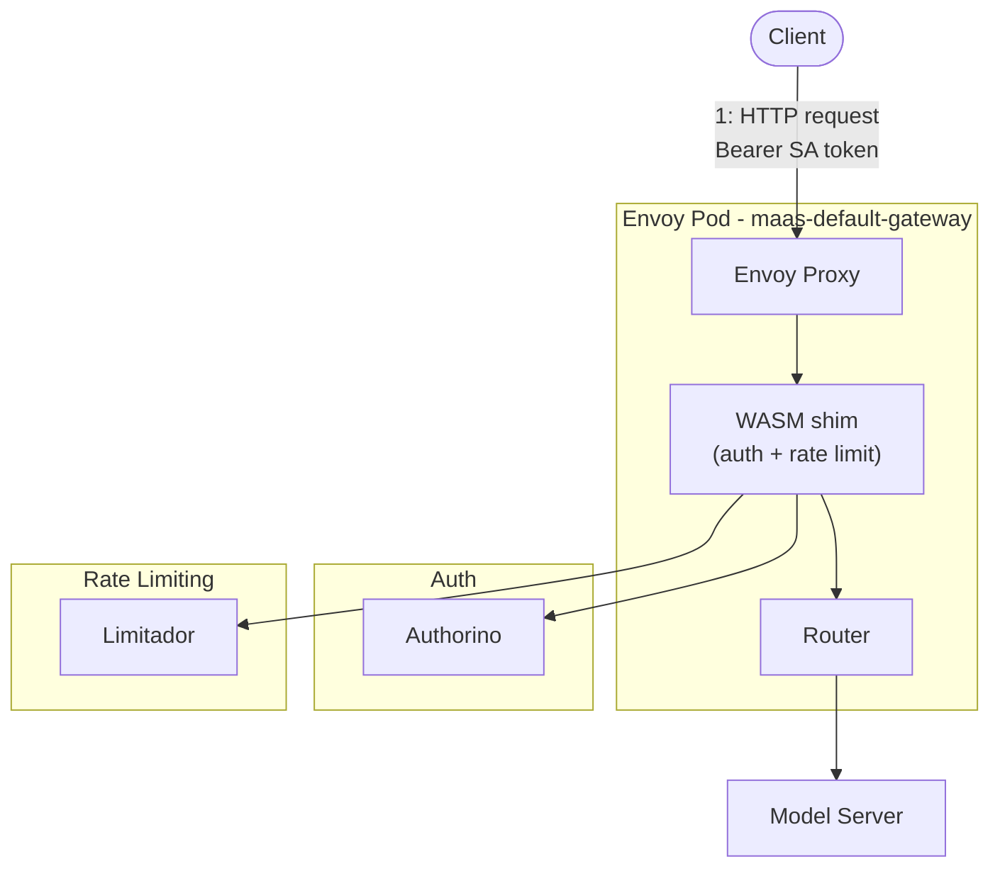
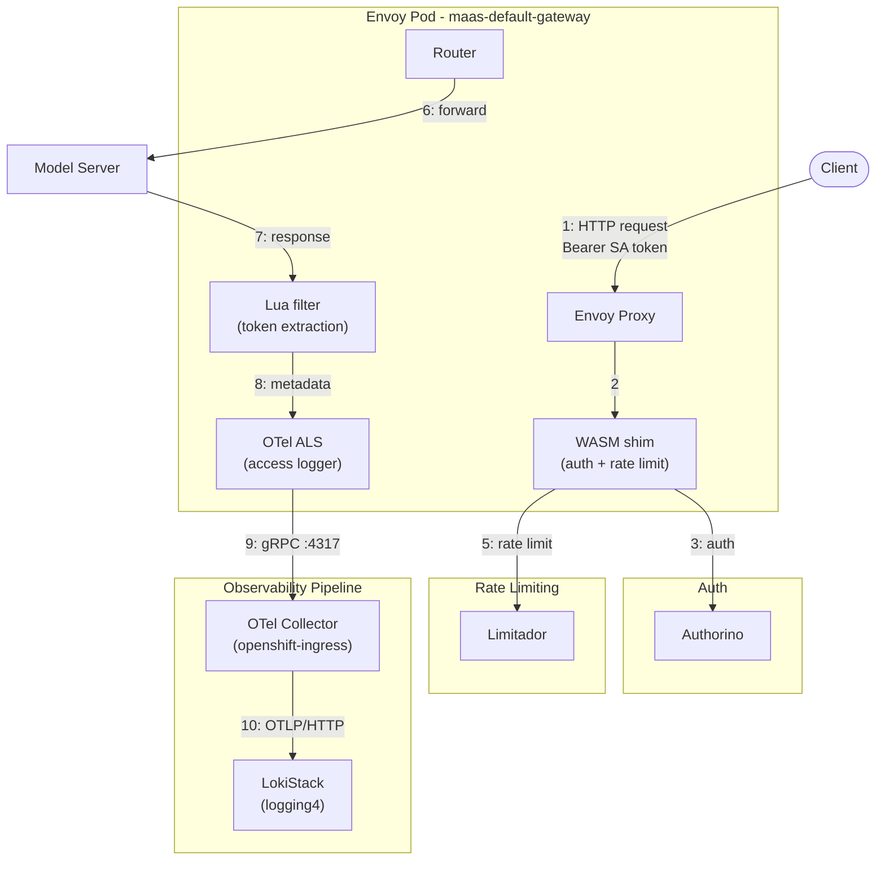
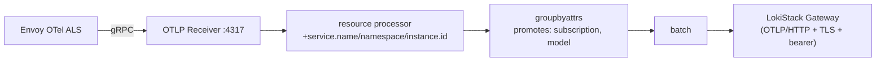
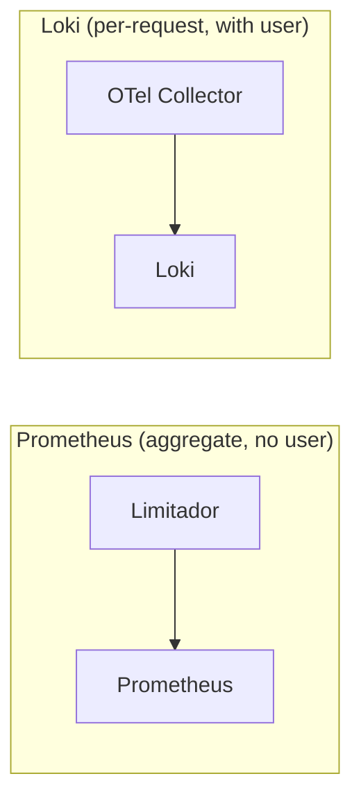

---

name: Envoy OTel Structured Logs
overview: Envoy access logs emitted via OTel Collector to Loki, carrying user_id, subscription, model name, and token counts as structured log records — providing a reliable, independent token accounting channel alongside the existing Limitador-based counters.
todos:

- id: upstream-wasm-shim-tokens
  content: "TODO (deferred): File GitHub issue at kuadrant/wasm-shim requesting set_attribute() for body_values in TokenUsageTask"
  status: pending
- id: upstream-wasm-shim-429
  content: "TODO (deferred): Request WASM shim to inject auth response headers into request before rate limit evaluation, so user_id/subscription appear in 429 logs"
  status: pending
- id: upstream-kuadrant-dual-listener
  content: "TODO (deferred): File issue that HTTP+HTTPS listeners cause duplicate ActionSets leading to 403"
  status: pending
- id: upgrade-loki-variable-plugins
  content: "TODO: When perses/plugins releases with PR #651 (LokiLabelValuesVariable, LokiLabelNamesVariable, LokiLogQLVariable — merged 2026-05-07) and COO picks it up, replace StaticListVariable for model/subscription/user_id with dynamic LokiLabelValuesVariable in dashboard-usage.yaml. Upstream issue: perses/perses#4054."
  status: pending
- id: fix-proxy-non-query-apis
  content: "TODO: Label/value, series, and metadata Loki APIs that don't use a query param are forwarded without user_id injection. Evaluate allowlisting or restricting these endpoints for non-admin users."
  status: pending
- id: review-and-split
  content: "TODO: Review all changes, break into logical commits/branches/PRs for merge"
  status: pending
- id: pr-envoyfilter
  content: "PR 3: EnvoyFilter (otel_als_cluster + json_to_metadata + OTel ALS access log with 18 attributes)"
  status: pending
- id: pr-otel-collector
  content: "PR 4: OTel Collector deployment (Deployment, Service, ConfigMap, RBAC, NetworkPolicy, kustomization) + install-observability.sh changes (sed placeholders, envsubst removal)"
  status: pending
- id: pr-dashboards
  content: "PR 5: Dashboard migration (Perses usage dashboards with Loki LogQL, loki-query-proxy for user isolation)"
  status: pending
isProject: false

---

# Envoy OTel Structured Usage Logs — Implementation Record

## Status: COMPLETE — Deployed and Verified (Phase 16, 2026-06-04)

All core components deployed and verified on cluster `amit.dev.datahub.redhat.com`. Pipeline: Envoy → OTel Collector → Loki. Structured logs contain `user_id`, `subscription`, `model`, `tokens_total`, `tokens_prompt`, `tokens_completion`. Two Perses dashboards: admin (direct Loki) and user-scoped (via loki-query-proxy). Code review cleanup applied.

---

## Architecture Before Our Changes

Before this work, the MaaS platform had **no independent audit log** for token consumption. All observability relied on **Limitador counters exposed as Prometheus metrics**. No Loki, no OTel Collector, no structured usage logs.

### Pre-Change Request Flow



No OTel ALS, no `json_to_metadata`, no OTel Collector, no Loki. Response body consumed by WASM shim for rate limiting only.

### What Was Missing

| Gap | How We Solved It |
| --- | --- |
| No independent audit log | OTel ALS emits a structured log for every request |
| No per-request data | 18 structured attributes per log record in Loki |
| High-cardinality `user` in Prometheus | Per-user data moved to Loki structured metadata |
| Dead `tier` label | Replaced with `subscription` everywhere |
| No token breakdown | `tokens_prompt` and `tokens_completion` extracted by `json_to_metadata` |

---

## Architecture (Final — Verified)

### Complete Request/Response Flow



### OTel Collector Pipeline



### Dual Data Paths



- **Prometheus**: `authorized_hits`, `authorized_calls`, `limited_calls` with labels `subscription`, `model`, `organization_id`, `cost_center`
- **Loki**: 18 attributes per request including `user_id`, `tokens_total`, `duration_ms`, `request_id`

### Data Flow (Step by Step)

1. **Client sends request** with Bearer SA token
2. **WASM shim** calls Authorino (kubernetesTokenReview + subscription-info callout)
3. **Authorino returns** `auth.identity.user.username` + subscription metadata
4. **WASM shim** injects `X-MaaS-Username` (upstream) + stores filter_state (`userid`, `selected_subscription`)
5. **WASM shim** evaluates rate limit (Limitador, `hits_addend = responseBodyJSON("/usage/total_tokens")`)
6. **Request forwarded** (or 429 local reply if rate limited)
7. **Model server responds** with JSON body containing `usage.{total_tokens, prompt_tokens, completion_tokens}`
8. **Lua filter** extracts tokens + model into dynamic metadata
9. **OTel ALS** emits structured log (18 attributes) to OTel Collector via gRPC
10. **OTel Collector** processes and exports to Loki via OTLP/HTTP

### Perses Dashboard Architecture

Two dashboards in `opendatahub` namespace:
- **`usage-admin-dashboard`** — admin view, all users, uses `loki` datasource (direct to LokiStack)
- **`usage-user-scoped-dashboard`** — per-user view, uses `scoped-loki` datasource (through loki-query-proxy)

Two datasources in `opendatahub` namespace:
- **`loki`** — direct to LokiStack gateway (SA token auth + kubernetesAuth + TLS)
- **`scoped-loki`** — routes through loki-query-proxy (kubernetesAuth only, no TLS/secret)

**loki-query-proxy** deployed to `opendatahub` namespace — Go service that intercepts Loki queries and injects `user_id="<caller>"` filter based on TokenReview of the caller's Kubernetes token.

### Deployment Topology

| Namespace | Resources |
|-----------|-----------|
| `opendatahub` | Perses dashboards (usage-admin, usage-user-scoped), datasources (loki, scoped-loki), loki-query-proxy |
| `openshift-ingress` | OTel Collector (2 replicas), EnvoyFilter `maas-otel-access-log` |
| `logging4` | LokiStack |

### maas-controller AuthPolicy Headers

The controller generates per-model AuthPolicies injecting only upstream-consumed headers (`X-MaaS-Username`, `X-MaaS-Group`, `X-MaaS-Key-Id`). No POC-specific headers needed for observability — the WASM shim persists `filters.identity` data (including `selected_subscription` and `userid`) in filter_state at `wasm.kuadrant.auth.identity.*`. The OTel ALS reads these via `%FILTER_STATE(...:PLAIN)%`.

---

## Design Decisions

### Lua Filter for Token Extraction

Lua filter chosen for token extraction. The repo also contains a `json_to_metadata` version (`envoy-otel-access-log.yaml`) which was the original design, but Lua was deployed on the live cluster because `json_to_metadata` is not available in all Envoy builds shipped with OSSM/Istio on the target clusters. The Lua filter also handles header-to-metadata extraction (`X-MaaS-Username` → `user_id`) in the request phase, which `json_to_metadata` cannot do.

### Direct EnvoyFilter (not Istio Telemetry CR)

Istio `Telemetry` API abandoned because:
1. `accessLogging` does not support custom OTel log record attributes
2. `extensionProviders` requires patching `ConfigMap/istio` — owned by ingress-operator, reconciled by OSSM 3.x
3. EnvoyFilter gives full control over `OpenTelemetryAccessLogConfig` proto

### `sed` Placeholders (not `envsubst`)

Kustomize `replacements` cannot target YAML-in-YAML. `sed` chosen for portability — explicit placeholders (`LOKI_ENDPOINT_PLACEHOLDER`) substituted at deploy time.

### `user` and `tier` Labels Removed from TelemetryPolicy

- **`user`**: High-cardinality Prometheus series. Per-user data now in Loki.
- **`tier`**: Dead — old tier flow replaced by subscription-based flow.

**Note**: TelemetryPolicy was reverted to `main` in Phase 16 (Jamie confirmed labels should stay for now). Removal deferred.

### Loki Stream Labels vs Structured Metadata

| Field | Loki Placement | Rationale |
| --- | --- | --- |
| `service_name`, `subscription`, `model` | **Stream label** | Low/bounded cardinality, primary filters |
| `kubernetes_namespace_name`, `log_type` | **Stream label** (OpenShift default) | Low cardinality |
| `response_code`, `method` | **Structured metadata** | Despite `groupbyattrs` config, NOT promoted on cluster (verified 2026-05-19) |
| `user_id`, `tokens_*`, `request_id`, etc. | **Structured metadata** | High cardinality |

> **Important**: `response_code` and `method` are structured metadata — dashboard queries must use pipeline filters (`| response_code=~"2.."`) not stream selectors.

---

## Known Issue: Perses Datasource Prefix Name Collision

The OpenShift monitoring-console-plugin's `OcpDatasourceApi.getDatasource()` uses prefix matching on datasource names:

1. Plugin calls `fetchDatasourceList()` with `selector.name` as a prefix filter
2. The Perses LIST API (`GET /api/v1/projects/{project}/datasources?name={prefix}`) returns all datasources whose name **starts with** the given prefix
3. Plugin takes `list[0]` blindly

**Impact**: If the scoped datasource is named `loki-scoped` (starts with `loki`), both `loki` and `loki-scoped` match prefix `loki`. The plugin picks whichever comes first — causing ALL dashboard queries (even admin) to route through the scoped proxy.

**Solution**: Name the scoped datasource `scoped-loki` so it doesn't prefix-match `loki`.

**Source**: `OcpDatasourceApi` in `web/src/components/dashboards/perses/datasource-api.ts` of the monitoring-plugin repo.

**Files**:
- `deployment/components/observability/perses/perses-loki-datasource.yaml` (name: `loki`)
- `deployment/components/observability/perses/perses-loki-datasource-scoped.yaml` (name: `scoped-loki`)

Both datasources require `kubernetesAuth: true` (COO Perses server has kubernetesAuth enabled at server level).

---

## Implementation Details

### Files Modified/Created

| File | Change |
| --- | --- |
| `deployment/components/observability/otel-collector/envoy-otel-access-log.yaml` | EnvoyFilter: OTel ALS cluster + json_to_metadata + access log (18 attributes) |
| `deployment/components/observability/otel-collector/otel-collector-deployment.yaml` | OTel Collector Deployment (pinned Red Hat image SHA, POD_NAME downward API) |
| `deployment/components/observability/otel-collector/otel-collector-service.yaml` | Service (port 4317) |
| `deployment/components/observability/otel-collector/otel-collector-configmap.yaml` | Pipeline: OTLP → resource → groupbyattrs → batch → Loki (sed placeholders) |
| `deployment/components/observability/otel-collector/otel-collector-rbac.yaml` | SA + ClusterRole + ClusterRoleBinding for Loki write access |
| `deployment/components/observability/otel-collector/otel-collector-networkpolicy.yaml` | NetworkPolicy restricting ingress to gateway pods |
| `deployment/components/observability/otel-collector/loki-gateway-ca-configmap.yaml` | Service CA inject for TLS to Loki gateway |
| `deployment/components/observability/otel-collector/kustomization.yaml` | Kustomization for all OTel resources |
| `deployment/components/observability/loki-proxy/` | Loki query proxy (Go source ConfigMap, deployment, RBAC, service, networkpolicy) |
| `deployment/components/observability/perses/` | Perses dashboards (usage-admin, usage-user-scoped), datasources, kustomization |
| `deployment/base/observability/telemetry-policy.yaml` | TelemetryPolicy (subscription, model, organization_id, cost_center) |
| `scripts/observability/install-observability.sh` | OTel Collector deploy: kustomize build + sed substitution |

### EnvoyFilter: `maas-tenant-observability-envoy-filter2`

Three patches applied to `maas-default-gateway`:

**Patch 1 — OTel ALS Cluster**: STRICT_DNS cluster to `user-usage-collector.opendatahub.svc.cluster.local:4317`.

**Patch 2 — Lua HTTP Filter (token extraction)**: The repo contains a `json_to_metadata` version (`envoy-otel-access-log.yaml`), but the live cluster uses a **Lua filter** instead. The Lua approach was chosen because `json_to_metadata` is not available in all Envoy builds shipped with OSSM/Istio on the target clusters. The Lua filter extracts the same fields from the response body:

| JSON Path | Metadata Key | on_missing |
| --- | --- | --- |
| `usage.total_tokens` | `tokens_total` | "0" |
| `usage.prompt_tokens` | `tokens_prompt` | "0" |
| `usage.completion_tokens` | `tokens_completion` | "0" |
| `model` | `model` | "" |

The Lua filter also extracts `user_id`, `groups`, and `key_id` from request headers (`X-MaaS-Username`, `X-MaaS-Group`, `X-MaaS-Key-Id`) into dynamic metadata during the request phase, then removes those headers before forwarding upstream.

**Patch 3 — OTel Access Log**: 18 structured attributes:

| Attribute | Source |
| --- | --- |
| `user_id` | `%FILTER_STATE(wasm.kuadrant.auth.identity.userid:PLAIN)%` |
| `subscription` | `%FILTER_STATE(wasm.kuadrant.auth.identity.selected_subscription:PLAIN)%` |
| `tokens_total` | `%DYNAMIC_METADATA(envoy.filters.http.json_to_metadata:tokens_total)%` |
| `tokens_prompt` | `%DYNAMIC_METADATA(envoy.filters.http.json_to_metadata:tokens_prompt)%` |
| `tokens_completion` | `%DYNAMIC_METADATA(envoy.filters.http.json_to_metadata:tokens_completion)%` |
| `model` | `%DYNAMIC_METADATA(envoy.filters.http.json_to_metadata:model)%` |
| `response_code` | `%RESPONSE_CODE%` |
| `method` | `%REQ(:METHOD)%` |
| `path` | `%REQ(:PATH)%` |
| `duration_ms` | `%DURATION%` |
| `request_id` | `%REQ(X-REQUEST-ID)%` |
| `authority` | `%REQ(:AUTHORITY)%` |
| `route_name` | `%ROUTE_NAME%` |
| `upstream_cluster` | `%UPSTREAM_CLUSTER%` |
| `bytes_received` | `%BYTES_RECEIVED%` |
| `bytes_sent` | `%BYTES_SENT%` |
| `downstream_remote_address` | `%DOWNSTREAM_REMOTE_ADDRESS%` |
| `response_code_details` | `%RESPONSE_CODE_DETAILS%` |

### OTel Collector Configuration (live: `user-usage`)

```yaml
receivers:
  otlp:
    protocols:
      grpc:
        endpoint: 0.0.0.0:4317

processors:
  resource:
    attributes:
    - { action: upsert, key: log_type, value: application }
    - { action: insert, key: service_name, value: maas-gateway }
    - { action: upsert, key: kubernetes_namespace_name, value: opendatahub }
  batch: {}
  groupbyattrs:
    keys: [subscription, model, response_code, method]

exporters:
  debug:
    verbosity: detailed
  otlphttp/loki:
    endpoint: https://lokistack-sample-gateway-http.logging4.svc.cluster.local:8080/api/logs/v1/application/otlp
    auth:
      authenticator: bearertokenauth
    tls:
      ca_file: /var/run/secrets/kubernetes.io/serviceaccount/service-ca.crt
      insecure_skip_verify: true

service:
  extensions: [bearertokenauth]
  pipelines:
    logs:
      receivers: [otlp]
      processors: [resource, batch, groupbyattrs]
      exporters: [otlphttp/loki, debug]
```

- `groupbyattrs` promotes `subscription`, `model` to resource attributes → Loki stream labels
- `response_code`, `method` also in `groupbyattrs` but NOT promoted to stream labels on this cluster (remain structured metadata)
- `debug` exporter enabled for troubleshooting (verbosity: detailed)
- The repo version (`envoy-otel-access-log.yaml`) uses `sed` placeholders; the live version above is the `OpenTelemetryCollector` CR managed by the OTel Operator

### Final Envoy Filter Chain

```
[0] istio.metadata_exchange
[1] kuadrant-maas-default-gateway     (WASM shim — auth + rate limit)
[2] envoy.filters.http.grpc_stats
[3] istio.alpn
[4] envoy.filters.http.fault
[5] envoy.filters.http.cors
[6] istio.stats
[7] envoy.filters.http.lua            (token + model extraction, header→metadata)
[8] envoy.filters.http.router
```

---

## Limitations Discovered

### 1. Streaming responses (SSE)

The Lua filter requires a complete response body. For SSE (`text/event-stream`), tokens are `0`. Same limitation as WASM shim pipeline.

### 2. WASM shim does not expose token counts

WASM shim stores `responseBodyJSON("/usage/total_tokens")` as **filter state**, not **dynamic metadata**. Filter state is not accessible by `%DYNAMIC_METADATA()%`. This is why the Lua filter independently parses the response body.

### 3. Response body trust boundary

Token counts are fully controlled by model server response. Pre-existing trust boundary — OTel logs mirror what WASM shim already trusts for rate limiting.

### 4. 429 responses never reach OTel access logger

When Limitador denies (429), it sends a local reply. The gRPC-based `envoy.access_loggers.open_telemetry` does **not fire** for locally-generated responses — zero 429 entries appear in Loki. The Envoy default file-based access log captures them (confirmed via `kubectl logs`), but the OTel ALS does not.

**Status**: Reported. Envoy team investigating fix to ensure OTel ALS fires for local replies. Once fixed, 429 logs will carry `response_code: 429`, `response_type: rate_limit`, but `user_id`, `subscription`, `model`, and `tokens_*` will be empty/zero (no upstream response body to parse).

### 5. Dual-listener Gateway causes duplicate ActionSets

HTTP+HTTPS listeners → Kuadrant generates duplicate ActionSets → double auth evaluation → 403. Workaround: remove HTTP listener. Upstream bug to file.

### 6. Perses Loki plugin limitations

- **No instant query**: Plugin always calls `query_range` (table panels get multi-step results)
- **No `step` field**: Cannot control evaluation step; `[5m]` + `sum` overcounts ~20×
- **Workaround**: Use `[$__range]` + `calculation: last` for exact totals
- **StaticListVariable**: No `LokiLabelValuesVariable` yet — model/subscription dropdowns are hardcoded in YAML. New values appear in aggregates via `$__all` but not in dropdown until YAML updated.

### 7. `response_code` is structured metadata (not stream label)

Despite `groupbyattrs` config listing it, `response_code` is NOT a stream label on this cluster. Queries must use pipeline filters (`| response_code=~"2.."`), not stream selectors.

---

## Loki Query Proxy

### Architecture

```
Admin: Dashboard → loki datasource → LokiStack Gateway (direct, SA token)
User:  Dashboard → scoped-loki datasource → loki-query-proxy → LokiStack Gateway
                                                    ↓
                                             TokenReview API
                                             (extract username + groups)
                                                    ↓
                                             LogQL rewrite:
                                             inject | user_id="<caller>"
```

### Design: Why Query Proxy (not LokiStack static mode)

| Aspect | Query Proxy (chosen) | Static Mode (rejected) |
| --- | --- | --- |
| User isolation | Enforced by proxy | Storage-level (Loki-native) |
| Admin cluster-wide | Works (admin bypass) | Blocked (can't aggregate tenants) |
| Operational cost | Low (1 deployment) | High (400 tenant defs + OIDC secrets) |
| LokiStack changes | None | Mode change + per-user tenant blocks |
| Scalability | Unlimited users | CR becomes massive |

Static mode was evaluated and rejected: requires OIDC client per tenant, cannot aggregate across tenants for admin views, and operational overhead scales linearly with users.

### Implementation

Go source (~160 lines, stdlib only) mounted as ConfigMap, run with `go run` on stock `ubi9/go-toolset:1.25`.

**Files** (`deployment/components/observability/loki-proxy/`):
- `proxy-source-configmap.yaml` — Go source (main.go, auth.go, rewriter.go, config.go, go.mod)
- `deployment-user.yaml` — ISOLATION_MODE=user, securityContext hardened
- `rbac.yaml` — SA + ClusterRoleBindings (cluster-logging-application-view, namespace-view + tokenreviews)
- `service.yaml` — loki-query-proxy-user:8080
- `networkpolicy.yaml` — restricts direct LokiStack access
- `kustomization.yaml` — namespace + replacements for ClusterRoleBinding

**Key behaviors**:
- All tokens resolved via Kubernetes TokenReview API (no JWT parsing — prevents forged token attacks)
- Admin bypass: `system:cluster-admins` / `system:masters` group members skip user_id filtering
- Query rewriting: inserts `| user_id="<username>"` after each stream selector `{...}` (quote-aware, handles Go templates and backtick strings)
- GET only — non-GET returns 405
- `allowedPaths` whitelist for non-admin users
- Health/readiness probes with 120s/90s initial delay (Go compile time)

### Security

- **No JWT parsing** — all tokens go through TokenReview API exclusively (prevents forged JWT bypass)
- **Quote-aware rewriter** — braces inside double-quoted and backtick strings skipped
- **POST removed** — only GET accepted (eliminates body bypass vectors)
- **NetworkPolicy** — blocks direct LokiStack access from unauthorized pods
- **Hardened container** — runAsNonRoot, no privilege escalation, capabilities dropped, seccomp RuntimeDefault

### Test Results Summary

31/31 tests pass (Phase 14 final):
- 15 functional (health, GET/POST filtering, admin bypass, metric queries)
- 9 security (forged JWT, fake opaque token, LogQL injection, dual-query bypass)
- 4 rewriter robustness (Go templates, backticks, multiple stream selectors)
- 3 admin edge cases (instant queries, pass-through)

---

## Spoofing Prevention

AuthPolicy `response.success.headers` uses SET semantics — client-supplied `X-MaaS-Username` always overwritten by authenticated value. Subscription read from WASM filter_state (cannot be spoofed). No route-level stripping needed (it was tested and broke logging).

---

## Verified Test Results

### Inference request (200)

```
user_id: system:serviceaccount:maas-default-gateway-tier-free:kube-admin-81378af5
subscription: simulator-subscription
model: facebook/opt-125m
tokens_total: 18, tokens_prompt: 15, tokens_completion: 3
response_code: 200, duration_ms: 38
```

### Model catalog (200, non-inference)

```
user_id: ..., subscription: simulator-subscription
tokens_total: 0, model: (empty)
response_code: 200, method: GET, path: /v1/models
```

---

## Architectural Deviations

### Deviation 1: EnvoyFilter instead of MeshConfig extensionProviders

OpenShift ingress-operator owns `ConfigMap/istio`. OSSM 3.x reconciles and overwrites changes. EnvoyFilter patches Envoy directly.

### Deviation 2: Red Hat OTel Collector Image

`ghcr.io/open-telemetry/opentelemetry-collector-contrib` inaccessible from cluster. Pinned to:
```
registry.redhat.io/rhosdt/opentelemetry-collector-rhel9@sha256:f970e31da...
```

### Deviation 3: Loki Gateway Bearer Token Auth

LokiStack gateway requires `https://` + bearer token (not simple `X-Scope-OrgID` + `http://`). SA + ClusterRole granting `create` on `loki.grafana.com/application` + `bearertokenauth` extension.

### Deviation 4: user_id from request headers (via Lua)

The Lua filter extracts `user_id` from the `X-MaaS-Username` header (injected by AuthPolicy) and stores it in dynamic metadata. The OTel ALS reads via `%DYNAMIC_METADATA()%`. `subscription` is read from `%REQ(X-MaaS-Subscription)%` directly. The repo version (`envoy-otel-access-log.yaml`) uses `%FILTER_STATE()%` to read from WASM shim filter_state instead.

---

## Overhead Considerations

| Factor | Impact | Mitigation |
| --- | --- | --- |
| Lua token extraction | LuaJIT, negligible. Body already buffered by WASM. | No additional buffering |
| OTel gRPC call | Async fire-and-forget. No added request latency. | Collector in same namespace |
| OTel Collector | 2 replicas, batch 5s/1000. If down, logs dropped — requests succeed. | Health check, PDB |
| Log volume | 1 record/request. ~86M records/day at 1000 req/s. | Batch + Loki retention |
| Loki cardinality | Only 5 stream labels. High-cardinality fields as structured metadata. | Schema v13 |

---

## LogQL Query Patterns

**Total tokens per user:**
```logql
sum by (user_id) (sum_over_time({service_name="maas-gateway"} | response_code=`200` | unwrap tokens_total [$__range]))
```

**Requests per user:**
```logql
sum by (user_id) (count_over_time({service_name="maas-gateway"} | response_code != `429` [$__range]))
```

**Rate-limited requests:**
```logql
sum by (user_id) (count_over_time({service_name="maas-gateway"} | response_code=`429` [$__range]))
```

All stat panels use `[$__range]` + `calculation: last` to avoid overcounting from overlapping windows. Token-sum queries omit `response_code` filter (non-2xx responses have `tokens_total=0` from check-then-report pattern).

### Dashboard Variables

- **Subscription, Model**: `StaticListVariable` with `allowAllValue: true`, default `$__all`. New values appear in aggregates but not in dropdown until YAML updated.
- **User ID**: `TextVariable` (user types a name or pattern).
- **View by** (admin chart): `StaticListVariable` with values `model` | `subscription`, drives the time series chart grouping. Table always uses hardcoded `sum by (model, subscription)`.

### `$__range` Pattern

Stat panels and table use `[$__range]` (Perses built-in since v0.40.0) so lookback tracks the dashboard time picker. `calculation: last` picks the final evaluation step — each log line counted once. Fallbacks: `or vector(0)` on stats, `or vector(1)` on Success Rate.

---

## Deployment Procedure (Current)

```bash
# 1. Deploy OTel Collector + EnvoyFilter (auto-detects LokiStack, configures endpoint)
scripts/observability/install-observability.sh

# 2. Deploy loki-query-proxy (Go compiles on first start, ~60-90s)
kubectl apply -k deployment/components/observability/loki-proxy/
kubectl rollout status deployment/loki-query-proxy-user -n opendatahub --timeout=180s

# 3. Deploy Perses dashboards + datasources
kubectl apply -k deployment/components/observability/perses/
```

The proxy deploys to `opendatahub` (same namespace as dashboards and datasources). For RHOAI, override `namespace:` in kustomization.yaml.

**`install-observability.sh` behavior**:
- Auto-detects LokiStack in `logging4` namespace
- Creates `loki-gateway-ca` ConfigMap with `service.beta.openshift.io/inject-cabundle` annotation
- Builds OTel manifests via `kustomize build`, substitutes `LOKI_ENDPOINT_PLACEHOLDER` and `LOKI_TLS_INSECURE_SKIP_VERIFY_PLACEHOLDER` via `sed`
- Applies with `--server-side=true --force-conflicts` (idempotent re-runs)
- If no LokiStack found, OTel Collector deployment is skipped with warning

**Loki gateway CA ConfigMap**: Committed declaratively in `loki-gateway-ca-configmap.yaml` with `service.beta.openshift.io/inject-cabundle: "true"`. Service CA operator populates the PEM at runtime. OTel Deployment volume mounts it by name.

---

## Review and PR Strategy

| PR | Scope | Dependencies |
| --- | --- | --- |
| PR 3: EnvoyFilter | OTel ALS cluster + json_to_metadata + access log (18 attrs) | None |
| PR 4: OTel Collector | Deployment, Service, ConfigMap, RBAC, NetworkPolicy + install-observability.sh | PR 3 |
| PR 5: Dashboards + Proxy | Perses usage dashboards, loki-query-proxy, datasources | PR 4 |

Merge order: PR 3 → PR 4 → PR 5.

---

## Remaining / Deferred Work

1. **Fix 429 OTel access logging**: Envoy OTel ALS does not fire for local replies (rate-limited 429s). Reported — pending Envoy-side fix. Will validate E2E once fixed.
2. **Upstream WASM shim — token counts**: `set_attribute()` for `body_values` in `TokenUsageTask` would eliminate Lua/json_to_metadata token extraction (~5-line PR to `kuadrant/wasm-shim`). Not blocking — Lua works today with negligible overhead, can be swapped transparently.
3. **Upstream WASM shim — 429 headers**: Request injection of auth headers before rate limit evaluation
4. **Upstream Kuadrant — dual-listener**: File bug for HTTP+HTTPS duplicate ActionSets
5. **Perses Loki variable plugins**: Replace StaticListVariable with LokiLabelValuesVariable when perses/plugins PR #651 ships in COO (upstream issue: perses/perses#4054)
6. **Proxy non-query APIs**: Label/value and series endpoints forwarded without user_id injection — evaluate restricting

---

## Headers and Filters Reference

| Item | Status | Notes |
| --- | --- | --- |
| `X-MaaS-Username` header | **Keep** | Consumed by maas-api for user identification |
| `x-maas-user-id` header | **Removed** | No consumer — OTel ALS reads filter_state/dynamic metadata |
| `x-maas-subscription-id` header | **Removed** | Never needed — `filters.identity.selected_subscription` exists |
| `identity.userid` filter | **Keep** | Read by Lua filter via `X-MaaS-Username` header |
| `identity.selected_subscription` filter | **Keep** | Read by OTel ALS + TelemetryPolicy |
| Prometheus Limitador metrics | **Keep** | Real-time aggregate metrics (separate from Loki per-request logs) |

---

## Security Review

- **Header spoofing**: AuthPolicy SET semantics prevent spoofing. Filter_state not spoofable.
- **OTel Collector**: NetworkPolicy restricts ingress to gateway pods only.
- **Response body trust**: Pre-existing boundary — both WASM shim and json_to_metadata trust same source.
- **Loki access**: Write via SA with `create` on `loki.grafana.com/application`. Read via separate SA.
- **Proxy**: All tokens validated via TokenReview API. No JWT parsing. Forged tokens rejected.
