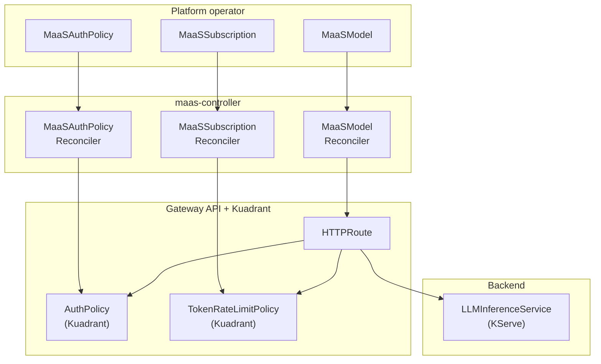
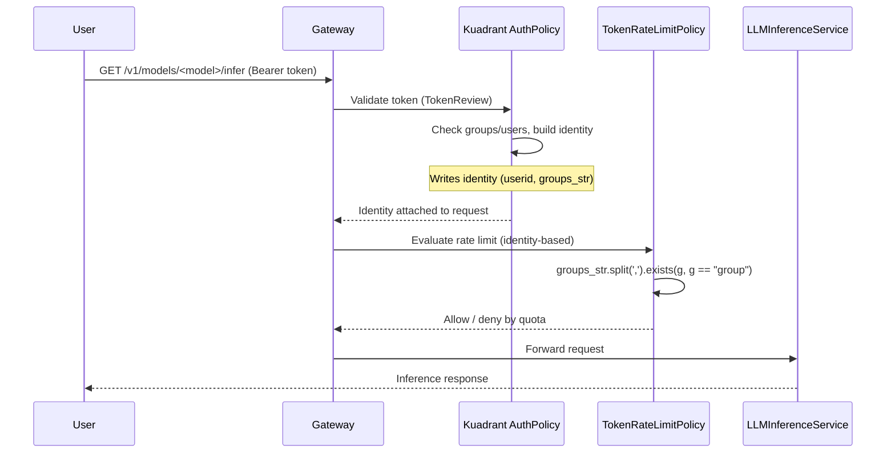
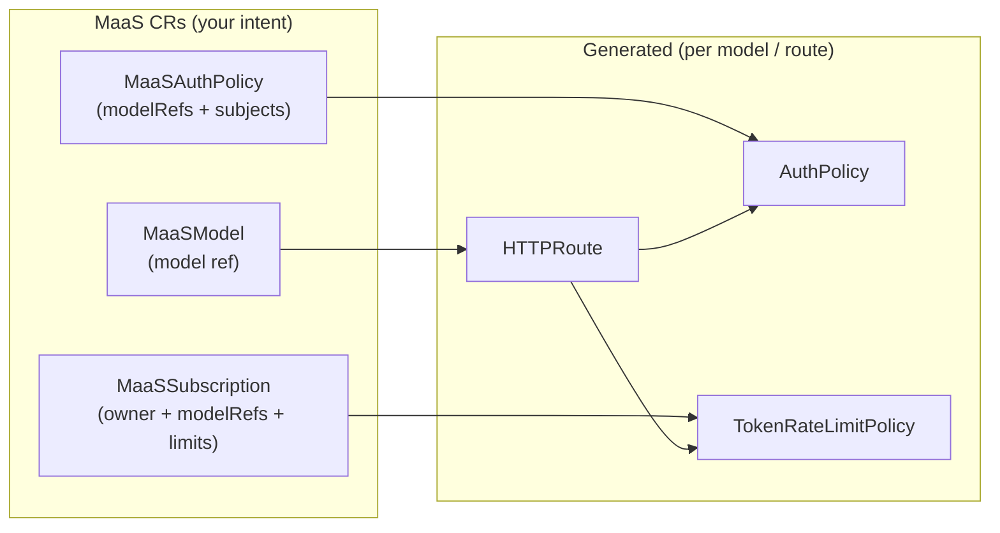
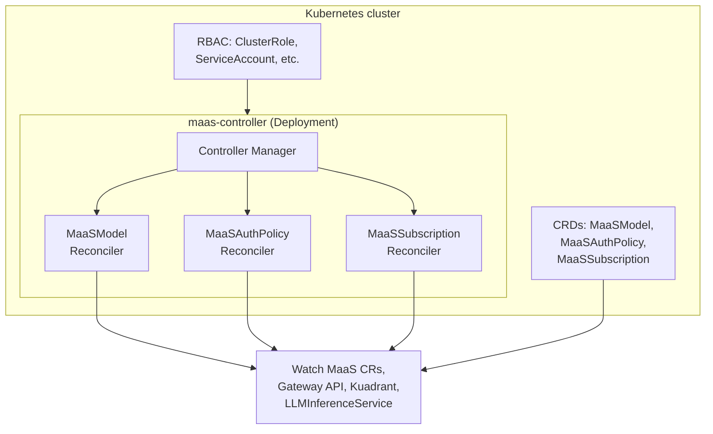
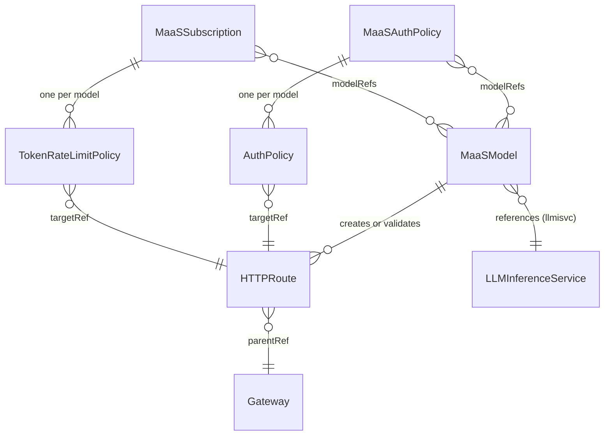
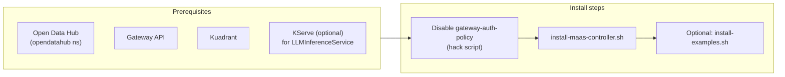

# MaaS Controller — What It Is and How It Works

This document describes the **MaaS Controller**: what was built, how it fits into the Models-as-a-Service (MaaS) stack, and how the pieces work together. It is intended for presentations, onboarding, and technical deep-dives.

---

## 1. What Is the MaaS Controller?

The **MaaS Controller** is a Kubernetes controller that provides a **subscription-style control plane** for Models-as-a-Service. It lets platform operators define:

- **Which models** are exposed through MaaS (via **MaaSModel**).
- **Who can access** those models (via **MaaSAuthPolicy**).
- **Per-user/per-group token rate limits** for those models (via **MaaSSubscription**).

The controller does not run inference. It **reconciles** your high-level MaaS CRs into the underlying Gateway API and Kuadrant resources (HTTPRoutes, AuthPolicies, TokenRateLimitPolicies) that enforce routing, authentication, and rate limiting at the gateway.

---

## 2. High-Level Architecture



**Summary:** You declare intent with MaaS CRs; the controller turns that into Gateway/Kuadrant resources that attach to the same HTTPRoute and backend (e.g. KServe LLMInferenceService).

The **MaaS API** GET /v1/models endpoint uses MaaSModel CRs as its primary source: it lists them in the API namespace, then **validates access** by probing each model’s `/v1/models` endpoint with the client’s **Authorization header** (passed through as-is). Only models that return 2xx or 405 are included. So the catalogue returned to the client is the set of MaaSModel objects the controller reconciles, filtered to those the client can actually access. No token exchange is performed; the header is forwarded as-is. (Once minting is in place, this may be revisited.)

---

## 3. Request Flow (End-to-End)



- **AuthPolicy** authenticates (e.g. OpenShift token via Kubernetes TokenReview), authorizes (allowed groups/users), and **writes identity** (e.g. `userid`, `groups`, `groups_str`).
- **TokenRateLimitPolicy** uses that identity (in particular the comma-separated `groups_str`) to decide which subscription and limits apply.

---

## 4. The “String Trick” (AuthPolicy → TokenRateLimitPolicy)

Kuadrant’s TokenRateLimitPolicy CEL predicates do not always support array fields the same way as the AuthPolicy response. To pass **allowed groups** from AuthPolicy to TokenRateLimitPolicy in a reliable way, the controller uses a **comma-separated string**:

1. **AuthPolicy (controller-generated)**  
   - In the success response identity, the controller adds a property **`groups_str`** with a CEL expression that takes the filtered groups and **joins them with a comma**, e.g.  
     `auth.identity.user.groups.filter(g, g == "free-user").join(",")`  
   - So the identity object has both `groups` (array) and **`groups_str`** (string, e.g. `"free-user"` or `"free-user,premium-user"`).

2. **TokenRateLimitPolicy (controller-generated)**  
   - For each subscription owner group, the controller generates a CEL predicate that **splits** `groups_str` and checks membership, e.g.  
     `auth.identity.groups_str.split(",").exists(g, g == "free-user")`.

So: **AuthPolicy** turns the allowed-groups array into a **comma-separated string**; **TokenRateLimitPolicy** turns that string back into a logical list and uses it for rate-limit matching. That’s the “string trick.”

---

## 5. What the Controller Creates (Runtime View)



| Your resource   | Controller creates / uses                                      |
|-----------------|-----------------------------------------------------------------|
| **MaaSModel**   | **HTTPRoute** (or validates KServe-created route for llmisvc)  |
| **MaaSAuthPolicy** | One **AuthPolicy** per referenced model; targets that model’s HTTPRoute |
| **MaaSSubscription** | One **TokenRateLimitPolicy** per referenced model; targets that model’s HTTPRoute |

All generated resources are labeled `app.kubernetes.io/managed-by: maas-controller`.

---

## 6. Component Diagram (Controller Internals)



- Single binary: **manager** runs three reconcilers.
- Registers **Kubernetes core**, **Gateway API**, **KServe (v1alpha1)**, and **MaaS (v1alpha1)** schemes; uses **unstructured** for Kuadrant resources.
- Reads/writes MaaS CRs, HTTPRoutes, Gateways, AuthPolicies, TokenRateLimitPolicies, and LLMInferenceServices (read-only for model metadata/routes).

---

## 7. Data Model (Simplified)



- **MaaSModel**: `spec.modelRef` = llmisvc or ExternalModel (name, namespace).
- **MaaSAuthPolicy**: `spec.modelRefs` (list of model names), `spec.subjects` (groups, users).
- **MaaSSubscription**: `spec.owner` (groups, users), `spec.modelRefs` (model name + token rate limits per model).

---

## 8. Deployment and Prerequisites



- **Namespace**: Controller and default MaaS CRs live in **opendatahub** (configurable).
- **Gateway-auth-policy**: The shared `gateway-auth-policy` in `openshift-ingress` is disabled (annotate + point at non-existent gateway) so MaaSAuthPolicy can manage auth per HTTPRoute.
- **Install**: `./scripts/install-maas-controller.sh` applies CRDs, RBAC, and the controller Deployment. Optionally run `./scripts/install-examples.sh` for sample MaaSModel, MaaSAuthPolicy, and MaaSSubscription.

---

## 9. Authentication (Current Behavior)

For **GET /v1/models**, the API forwards the client’s **Authorization** header as-is to each model endpoint (no token exchange). For inference, until MaaS API token minting is in place, use the **OpenShift token**:

```bash
export TOKEN=$(oc whoami -t)
curl -H "Authorization: Bearer $TOKEN" "https://<gateway-host>/v1/models/<model-name>/infer" -d '...'
```

The Kuadrant AuthPolicy validates this token via **Kubernetes TokenReview** and derives user/groups for authorization and for the identity passed to TokenRateLimitPolicy (including `groups_str`).

---

## 10. Summary

| Topic | Summary |
|-------|---------|
| **What** | MaaS Controller = control plane that reconciles MaaSModel, MaaSAuthPolicy, and MaaSSubscription into Gateway API and Kuadrant resources. |
| **Where** | Single controller in `maas-controller`; CRs and generated resources can live in opendatahub or other namespaces. |
| **How** | Three reconcilers watch MaaS CRs (and related resources); each creates/updates HTTPRoutes, AuthPolicies, or TokenRateLimitPolicies. |
| **Identity bridge** | AuthPolicy exposes allowed groups as a comma-separated `groups_str`; TokenRateLimitPolicy uses `groups_str.split(",").exists(...)` for subscription matching (the “string trick”). |
| **Deploy** | Disable shared gateway-auth-policy, then run install-maas-controller.sh; optionally install examples. |

This overview should be enough to explain what was created and how it works in talks or written docs. For slide-by-slide presentation ideas, see **SLIDE_IDEAS.md** in this directory.
